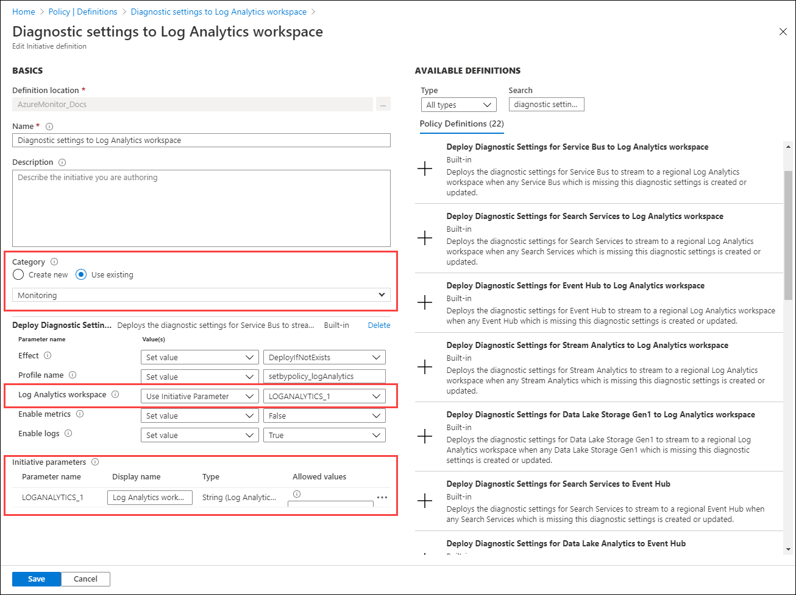
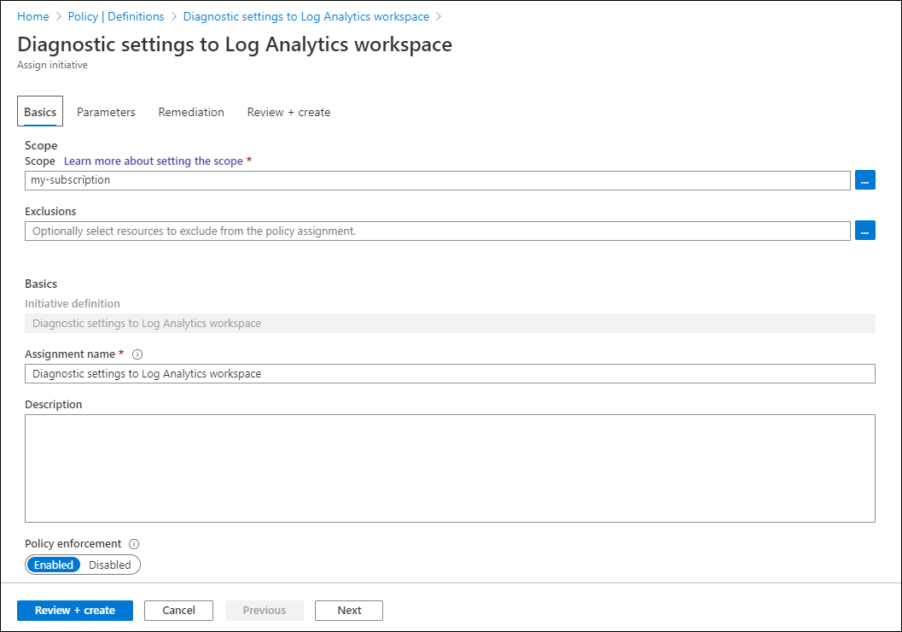

# Deploy Azure Monitor at scale using Azure Policy
While some Azure Monitor features are configured once or a limited number of times, others must be repeated for each resource that you want to monitor. This article describes methods for using Azure Policy to implement Azure Monitor at scale to ensure that monitoring is consistently and accurately configured for all your Azure resources.

For example, you need to create a diagnostic setting for all your existing Azure resources and for each new resource that you create. You also need to have an agent installed and configured each time you create a virtual machine. You could use methods such as PowerShell or CLI to perform these actions since these methods are available for all features of Azure Monitor. Using Azure Policy, you can have logic in place that will automatically perform the appropriate configuration each time you create or modify a resource.


## Azure Policy
This section provides a brief introduction to [Azure Policy](../../governance/policy/overview.md) which allows you to assess and enforce organizational standards across your entire Azure subscription or management group with minimal effort. Refer to the [Azure Policy documentation](../../governance/policy/overview.md) for complete details.

With Azure Policy you can specify configuration requirements for any resources that are created and either identify resources that are out of compliance, block the resources from being created, or add the required configuration. It works by intercepting calls to create a new resource or to modify an existing resource. It can respond with such effects as denying the request if it doesn't match match with the properties expected in a policy definition, flagging it for noncompliance, or deploy a related resource. You can remediate existing resources with a **deployIfNotExists** or **modify** policy definition.

Azure Policy consists of the objects in the following table. See [Azure Policy objects](../../governance/policy/overview.md#azure-policy-objects) for a more detailed explanation of each.

| Item | Description |
|:---|:---|
| Policy definition | Describes resource compliance conditions and the effect to take if a condition is met. This may be all resources of a particular type or only resources that match certain properties. The effect may be to simply flag the resource for compliance or to deploy a related resource. Policy definitions are written using JSON as described in [Azure Policy definition structure](../../governance/policy/concepts/definition-structure.md). Effects are described in [Understand Azure Policy effects](../../governance/policy/concepts/effects.md).
| Policy initiative | A group of policy definitions that should be applied together. For example, you might have one policy definition to send resource logs to a Log Analytics workspace and another to send resource logs to event hubs. Create an initiative that includes both policy definitions, and apply the initiative to resources instead of the individual policy definitions. Initiatives are written using JSON as described in [Azure Policy initiative structure](../../governance/policy/concepts/initiative-definition-structure.md). |
| Assignment | A policy definition or initiative doesn't take effect until it's assigned to a scope. For example, assign a policy to a resource group to apply it to all resources created in that resource, or apply it to a subscription to apply it to all resources in that subscription.  For more details, see [Azure Policy assignment structure](../../governance/policy/concepts/assignment-structure.md). |

## Built-in policy definitions for Azure Monitor
Azure Policy includes several prebuilt definitions related to Azure Monitor. You can assign these policy definitions to your existing subscription or use them as a basis to create your own custom definitions. For a complete list of the built-in politics in the **Monitoring** category, see [Azure Policy built-in policy definitions for Azure Monitor](../policy-samples.md).

To view the built-in policy definitions related to monitoring, perform the following:

1. Go to **Azure Policy** in the Azure portal.
2. Select **Definitions**.
3. For **Type**, select *Built-in* and for **Category**, select *Monitoring*.

  


## Diagnostic settings
[Diagnostic settings](../platform/diagnostic-settings.md) collect resource logs and metrics from Azure resources to multiple locations, typically to a Log Analytics workspace which allows you to analyze the data with [log queries](../log-query/log-query-overview.md) and [log alerts](alerts-log.md). Use Policy to automatically create a diagnostic setting each time you create a resource.

Each Azure resource type has a unique set of categories that need to be listed in the diagnostic setting. Because of this, each resource type requires a separate policy definition. Some resource types have built-in policy definitions that you can assign without modification. For other resource types, you need to create a custom definition.

### Built-in policy definitions for Azure Monitor
There are two built-in policy definitions for each resource type, one to send to Log Analytics workspace and another to Event Hub. If you only need one location, then assign that policy for the resource type. If you need both, then assign both policy definitions for the resource.

For example, the following image shows the built-in diagnostic setting policy definitions for Data Lake Analytics.

  

### Custom policy definitions
For resource types that don't have a built-in policy, you need to create a custom policy definition. You could do this manually in the Azure portal by copying an existing built-in policy and then modifying for your resource type. It's more efficient though to create the policy programatically using a script in the PowerShell Gallery.

The script [Create-AzDiagPolicy](https://www.powershellgallery.com/packages/Create-AzDiagPolicy) creates policy files for a particular resource type that you can install using PowerShell or CLI. Use the following procedure to create a custom policy definition for diagnostic settings.


1. Ensure that you have [Azure PowerShell](https://docs.microsoft.com/powershell/azure/install-az-ps) installed.
2. Install the script with the following command:
  
    ```azurepowershell
    Install-Script -Name Create-AzDiagPolicy
    ```

3. Run the script using the parameters to specify where to send the logs. You will be prompted to specify a subscription and resource type. For example, to create a policy definition that sends to Log Analytics workspace and Event Hub, use the following command.

   ```azurepowershell
   Create-AzDiagPolicy.ps1 -ExportLA -ExportEH -ExportDir ".\PolicyFiles"  
   ```

4. Alternatively, you can specify a subscription and resource type in the command. For example, to create a policy definition that sends to Log Analytics workspace and Event Hub for Azure SQL Server databases, use the following command.

   ```azurepowershell
   Create-AzDiagPolicy.ps1 -SubscriptionID xxxxxxxx-xxxx-xxxx-xxxx-xxxxxxxxxxxx -ResourceType Microsoft.Sql/servers/databases  -ExportLA -ExportEH -ExportDir ".\PolicyFiles"  
   ```

5. The script creates separate folders for each policy definition, each containing three files named azurepolicy,json, azurepolicy.rules.json, azurepolicy.parameters.json. If you want to create the policy manually in the Azure portal, you can copy and paste the contents of azurepolicy.json since it includes the entire policy definition. Use the other two files with PowerShell or CLI to create the policy definition from a command line.

    The following examples show how to install the policy definition from both PowerShell and CLI. Each includes metadata to specify a category of **Monitoring** to group the new policy definition with the built-in policy definitions.

      ```azurepowershell
      New-AzPolicyDefinition -name "Deploy Diagnostic Settings for SQL Server database to Log Analytics workspace" -policy .\Apply-Diag-Settings-LA-Microsoft.Sql-servers-databases\azurepolicy.rules.json -parameter .\Apply-Diag-Settings-LA-Microsoft.Sql-servers-databases\azurepolicy.parameters.json -mode All -Metadata '{"category":"Monitoring"}'
      ```

      ```azurecli
      az policy definition create --name 'deploy-diag-setting-sql-database--workspace' --display-name 'Deploy Diagnostic Settings for SQL Server database to Log Analytics workspace'  --rules 'Apply-Diag-Settings-LA-Microsoft.Sql-servers-databases\azurepolicy.rules.json' --params 'Apply-Diag-Settings-LA-Microsoft.Sql-servers-databases\azurepolicy.parameters.json' --subscription 'AzureMonitor_Docs' --mode All
      ```

### Initiative
Rather than create an assignment for each policy definition, a common strategy is to create an initiative that includes the policy definitions to create diagnostic settings for each Azure service. Create an assignment between the initiative and a management group, subscription, or resource group depending on how you manage your environment. This strategy offers the following benefits:

- Create a single assignment for the initiative instead of multiple assignments for each resource type. Use the same initiative for multiple monitoring groups, subscriptions, or resource groups.
- Modify the initiative when you need to add a new resource type or destination. For example, your initial requirements might be to send data only to a Log Analytics workspace, but later you want to add Event Hub. Modify the initiative rather than creating new assignments.

See [Create and assign an initiative definition](../../governance/policy/tutorials/create-and-manage.md#create-and-assign-an-initiative-definition) for details on creating an initiative. Consider the following recommendations:

- Set the **Category** to **Monitoring** to group it with related built-in and custom policy definitions.
- Instead of specifying the details for the Log Analytics workspace and the Event Hub for policy definition included in the initiative, use a common initiative parameter. This allows you to easily specify a common value for all policy definitions and change that value if necessary.



### Assignment 
Assign the initiative to an Azure management group, subscription, or resource group depending on the scope of your resources to monitor. A [management group](../../governance/management-groups/overview.md) is particularly useful for scoping policy especially if your organization has multiple subscriptions.



By using initiative parameters, you can specify the workspace or any other details once for all of the policy definitions in the initiative. 


### Remediation
The initiative will apply to each virtual machine as it's created. A [remediation task](../../governance/policy/how-to/remediate-resources.md) deploys the policy definitions in the initiative to existing resources, so this allows you to create diagnostic settings for any resources that were already created. When you create the assignment using the Azure portal, you have the option of creating a remediation task at the same time. See [Remediate non-compliant resources with Azure Policy](../../governance/policy/how-to/remediate-resources.md) for details on the remediation.


## Azure Monitor for VMs
[Azure Monitor for VMs](../insights/vminsights-overview.md) is the primary tool in Azure Monitor for monitoring virtual machines. Enabling Azure Monitor for VMs installs both the Log Analytics agent and the Dependency agent. Rather than performing these tasks manually, use Azure Policy to ensure have each virtual machine configured as you create it.

Azure Monitor for VMs includes two built-in initiatives called **Enable Azure Monitor for VMs** and **Enable Azure Monitor for Virtual Machine Scale Sets**. These initiatives include a set of policy definitions required to install the Log Analytics agent and the Dependency agent required for enabling Azure Monitor for VMs. 

Instead of creating assignments for these initiatives using the Azure Policy interface, Azure Monitor for VMs includes a feature that allows you to inspect the number of virtual machines in each scope to determine whether the initiative has been applied. You can then configure the workspace and create any required assignments using that interface.

For details of this process, see [Enable Azure Monitor for VMs by using Azure Policy](../insights/vminsights-enable-at-scale-policy.md).


## Next steps

- Read more about [Azure Policy](../../governance/policy/overview.md).
- Read more about [diagnostic settings](diagnostic-settings.md).
