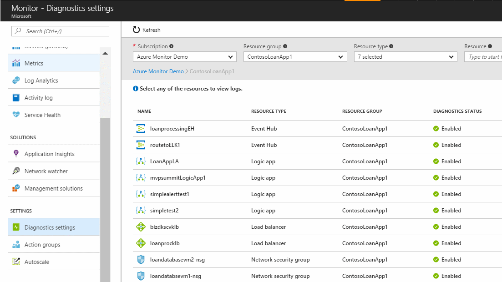
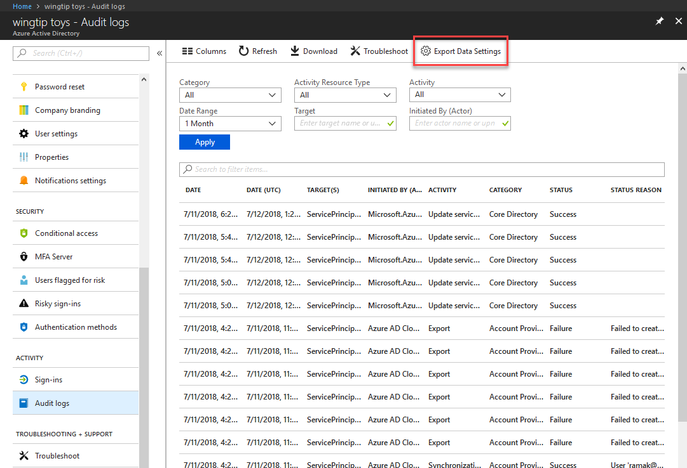

# Collect and export diagnostic logs your Azure resources
Diagnostic logs from Azure resources can be forwarded to the following locations:

- Log Analytics workspace to analyze the data with other sources.
- Azure storage to archive the data.
- Event Hub to send the data to other locations.

Collection of diagnostic logs can be enabled [as part of creating a resource in a Resource Manager template](diagnostic-logs-stream-template.md) or after a resource is created from that resource's page in the portal. You can also enable collection at any point using Azure PowerShell or CLI commands, or using the Azure Monitor REST API.

> [!TIP]
> These instructions may not apply directly to every resource. See the schema links at the bottom of this page to understand special steps that may apply to certain resource types.

## Manage resource diagnostic settings in the portal
Diagnostic settings are configured for each resource. You can either view and manage settings from **Diagnostic settings** in the menu in the Azure portal for each resource or for all resources from **Diagnostic settings** in the **Monitor** menu. Here you can view and filter all resources that support diagnostic settings to see if they have diagnostics enabled. Click ona  any resource to view its specific settings.




### Enable collection of diagnostic logs in the portal

You can enable collection of resource diagnostic logs in the Azure portal after a resource has been created either by going to a specific resource or by navigating to Azure Monitor. To enable this via Azure Monitor:

1. In the [Azure portal](https://portal.azure.com), navigate to Azure Monitor and click on **Diagnostic Settings**

    

2. Optionally filter the list by resource group or resource type, then click on the resource for which you would like to set a diagnostic setting.

3. If no settings exist on the resource you have selected, you are prompted to create a setting. Click **Turn on diagnostics**.

   

   If there are existing settings on the resource, you will see a list of settings already configured on this resource. Click **Add diagnostic setting**.

   

3. Give your setting a name, check the boxes for each destination to which you would like to send data, and configure which resource is used for each destination. Optionally, set a number of days to retain these logs by using the **Retention (days)** sliders (only applicable to the storage account destination). A retention of zero days stores the logs indefinitely.

   

4. Click **Save**.

After a few moments, the new setting appears in your list of settings for this resource, and diagnostic logs are sent to the specified destinations as soon as new event data is generated.

Tenant diagnostic settings can only be configured in the portal blade for the tenant service - these settings do not appear in the Azure Monitor diagnostic settings blade. For example, Azure Active Directory audit logs are configured by clicking on the **Data Export Settings** in the Audit Logs blade.



### Enable collection of resource diagnostic logs via PowerShell

[!INCLUDE [updated-for-az](../../../includes/updated-for-az.md)]

To enable collection of resource diagnostic logs via Azure PowerShell, use the following commands:

To enable storage of diagnostic logs in a storage account, use this command:

```powershell
Set-AzDiagnosticSetting -ResourceId [your resource id] -StorageAccountId [your storage account id] -Enabled $true
```

The storage account ID is the resource ID for the storage account to which you want to send the logs.

To enable streaming of diagnostic logs to an event hub, use this command:

```powershell
Set-AzDiagnosticSetting -ResourceId [your resource id] -ServiceBusRuleId [your Service Bus rule id] -Enabled $true
```

The service bus rule ID is a string with this format: `{Service Bus resource ID}/authorizationrules/{key name}`.

To enable sending of diagnostic logs to a Log Analytics workspace, use this command:

```powershell
Set-AzDiagnosticSetting -ResourceId [your resource id] -WorkspaceId [resource id of the log analytics workspace] -Enabled $true
```

You can obtain the resource ID of your Log Analytics workspace using the following command:

```powershell
(Get-AzOperationalInsightsWorkspace).ResourceId
```

You can combine these parameters to enable multiple output options.

You cannot currently configure tenant diagnostic settings using Azure PowerShell.

### Enable collection of resource diagnostic logs via the Azure CLI

To enable collection of resource diagnostic logs via the Azure CLI, you use the [az monitor diagnostic-settings create](/cli/azure/monitor/diagnostic-settings#az-monitor-diagnostic-settings-create) command.

To enable storage of diagnostic logs in a Storage Account:

```azurecli
az monitor diagnostic-settings create --name <diagnostic name> \
    --storage-account <name or ID of storage account> \
    --resource <target resource object ID> \
    --resource-group <storage account resource group> \
    --logs '[
    {
        "category": <category name>,
        "enabled": true,
        "retentionPolicy": {
            "days": <# days to retain>,
            "enabled": true
        }
    }]'
```

The `--resource-group` argument is only required if `--storage-account` is not an object ID.

To enable streaming of diagnostic logs to an event hub:

```azurecli
az monitor diagnostic-settings create --name <diagnostic name> \
    --event-hub <event hub name> \
    --event-hub-rule <event hub rule ID> \
    --resource <target resource object ID> \
    --logs '[
    {
        "category": <category name>,
        "enabled": true
    }
    ]'
```

The rule ID is a string with this format: `{Service Bus resource ID}/authorizationrules/{key name}`.

To enable sending of diagnostic logs to a Log Analytics workspace:

```azurecli
az monitor diagnostic-settings create --name <diagnostic name> \
    --workspace <log analytics name or object ID> \
    --resource <target resource object ID> \
    --resource-group <log analytics workspace resource group> \
    --logs '[
    {
        "category": <category name>,
        "enabled": true
    }
    ]'
```

The `--resource-group` argument is only required if `--workspace` is not an object ID

With any command, you can add additional categories to the diagnostic log by adding dictionaries to the JSON array passed as the `--logs` parameter. You can combine the `--storage-account`, `--event-hub`, and `--workspace` parameters to enable multiple output options.

You cannot currently configure tenant diagnostic settings using the CLI.

### Enable collection of resource diagnostic logs via REST API

To change diagnostic settings using the Azure Monitor REST API, see [this document](https://docs.microsoft.com/rest/api/monitor/).

You cannot currently configure tenant diagnostic settings using the Azure Monitor REST API.


## Supported services, categories, and schemas for diagnostic logs

[See this article](../../azure-monitor/platform/diagnostic-logs-schema.md) for a complete list of supported services and the log categories and schemas used by those services.

## Next steps

* [Stream resource diagnostic logs to **Event Hubs**](diagnostic-logs-stream-event-hubs.md)
* [Change resource diagnostic settings using the Azure Monitor REST API](https://docs.microsoft.com/rest/api/monitor/)
* [Analyze logs from Azure storage with Azure Monitor](collect-azure-metrics-logs.md)
