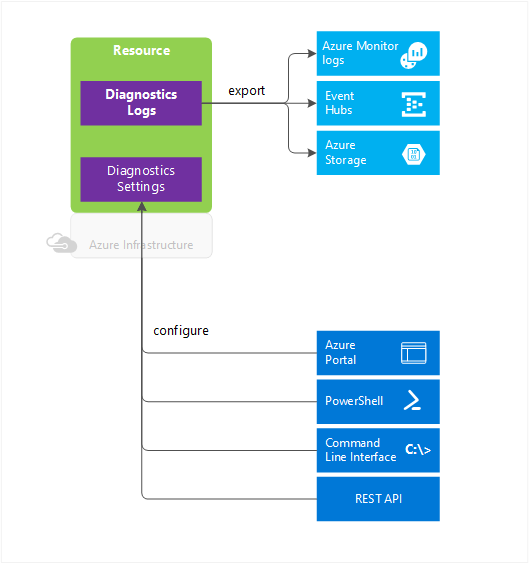

# Overview of Azure Diagnostic Logs

**Diagnostic logs** provide rich, frequent data about the operation of an Azure resource. Azure Monitor makes available two types of diagnostic logs:

* **Tenant logs** - these logs come from tenant-level services that exist outside of an Azure subscription, such as Azure Active Directory logs.
* **Resource logs** - these logs come from Azure services that deploy resources within an Azure subscription, such as Network Security Groups or Storage Accounts.

    

The content of these logs varies by the Azure service and resource type. For example, Network Security Group rule counters and Key Vault audits are two types of diagnostic logs.

These logs differ from the [Activity log](activity-logs-overview.md). The Activity log provides insight into the operations that were performed on resources in your subscription using Resource Manager, for example, creating a virtual machine or deleting a logic app. The Activity log is a subscription-level log. Resource-level diagnostic logs provide insight into operations that were performed within that resource itself, for example, getting a secret from a Key Vault.

These logs also differ from guest OS-level diagnostic logs. Guest OS diagnostic logs are those collected by an agent running inside of a virtual machine or other supported resource type. Resource-level diagnostic logs require no agent and capture resource-specific data from the Azure platform itself, while guest OS-level diagnostic logs capture data from the operating system and applications running on a virtual machine.

Not all services support the diagnostic logs described here. [This article contains a section listing which services support diagnostic logs](./../../azure-monitor/platform/diagnostic-logs-schema.md).

## What you can do with diagnostic logs
Here are some of the things you can do with diagnostic logs:

* Save them to a [**Storage Account**](../../azure-monitor/platform/archive-diagnostic-logs.md) for auditing or manual inspection. You can specify the retention time (in days) using **resource diagnostic settings**.
* [Stream them to **Event Hubs**](diagnostic-logs-stream-event-hubs.md) for ingestion by a third-party service or custom analytics solution such as Power BI.
* Analyze them with [Azure Monitor](../../azure-monitor/platform/collect-azure-metrics-logs.md), where the data is written immediately to Azure Monitor with no need to first write the data to storage.  

[!INCLUDE [azure-monitor-log-analytics-rebrand](../../../includes/azure-monitor-log-analytics-rebrand.md)]

You can use a storage account or Event Hubs namespace that is not in the same subscription as the one emitting logs. The user who configures the setting must have the appropriate RBAC access to both subscriptions.

> [!NOTE]
>  You cannot currently archive network flow logs to a storage account that is behind a secured virtual network.

## Diagnostic settings

Resource diagnostic logs are configured using resource diagnostic settings. Tenant diagnostic logs are configured using a tenant diagnostic setting. **Diagnostic settings** for a service control:

* Where diagnostic logs and metrics are sent (Storage Account, Event Hubs, and/or Azure Monitor).
* Which log categories are sent and whether metric data is also sent.
* How long each log category should be retained in a storage account.
    - A retention of zero days means logs are kept forever. Otherwise, the value can be any number of days between 1 and 365.
    - If retention policies are set but storing logs in a Storage Account is disabled (for example, if only Event Hubs or Log Analytics options are selected), the retention policies have no effect.
    - Retention policies are applied per-day, so at the end of a day (UTC), logs from the day that is now beyond the retention policy are deleted. For example, if you had a retention policy of one day, at the beginning of the day today the logs from the day before yesterday would be deleted. The delete process begins at midnight UTC, but note that it can take up to 24 hours for the logs to be deleted from your storage account.

These settings are configured from the diagnostic settings in the portal, with Azure PowerShell and CLI commands, or using the [Azure Monitor REST API](https://docs.microsoft.com/rest/api/monitor/).

> [!NOTE]
> Sending multi-dimensional metrics via diagnostic settings is not currently supported. Metrics with dimensions are exported as flattened single dimensional metrics, aggregated across dimension values.
>
> *For example*: The 'Incoming Messages' metric on an Event Hub can be explored and charted on a per queue level. However, when exported via diagnostic settings the metric will be represented as all incoming messages across all queues in the Event Hub.
>
>

## Supported services, categories, and schemas for diagnostic logs

[See this article](../../azure-monitor/platform/diagnostic-logs-schema.md) for a complete list of supported services and the log categories and schemas used by those services.

## Next steps

* [Stream resource diagnostic logs to **Event Hubs**](diagnostic-logs-stream-event-hubs.md)
* [Change resource diagnostic settings using the Azure Monitor REST API](https://docs.microsoft.com/rest/api/monitor/)
* [Analyze logs from Azure storage with Azure Monitor](collect-azure-metrics-logs.md)
