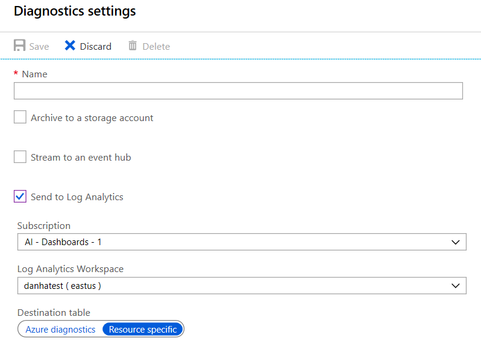

# Stream Azure Diagnostic Logs to Log Analytics workspace in Azure Monitor

**[Azure diagnostic logs](diagnostic-logs-overview.md)** can be streamed in near real time to a Log Analytics workspace in Azure Monitor using the portal, PowerShell cmdlets, or Azure CLI.

## What you can do with diagnostics logs in a Log Analytics workspace

Azure Monitor provides a flexible log query and analytics tool that enables you to gain insight into the raw log data generated from Azure resources. Some capabilities include:

* **Log query** - Write advanced queries over your log data, correlate logs from various sources, and generate charts that can be pinned to your Azure dashboard.
* **Alerting** - Detect when one or more events match a particular query and become notified with an email or webhook call using Azure Monitor alerts.
* **Advanced analytics** - Apply machine learning and pattern matching algorithms to identify possible issues revealed by your logs.

## Enable streaming of diagnostic logs to Log Analytics workspace

You can enable streaming of diagnostic logs programmatically, via the portal, or using the [Azure Monitor REST APIs](https://docs.microsoft.com/rest/api/monitor/diagnosticsettings). Either way, you create a diagnostic setting in which you specify a Log Analytics workspace and the log categories and metrics you want to send in to that workspace. A diagnostic **log category** is a type of log that a resource may provide.

The Log Analytics workspace does not have to be in the same subscription as the resource emitting logs as long as the user who configures the setting has appropriate RBAC access to both subscriptions.

> [!NOTE]
> Sending multi-dimensional metrics via diagnostic settings is not currently supported. Metrics with dimensions are exported as flattened single dimensional metrics, aggregated across dimension values.
>
> *For example*: The 'Incoming Messages' metric on an Event Hub can be explored and charted on a per queue level. However, when exported via diagnostic settings the metric will be represented as all incoming messages across all queues in the Event Hub.
>
>

## Stream diagnostic logs using the portal
1. In the portal, navigate to Azure Monitor and click on **Diagnostic settings** in the **Settings** menu.


2. Optionally filter the list by resource group or resource type, then click on the resource for which you would like to set a diagnostic setting.

3. If no settings exist on the resource you have selected, you are prompted to create a setting. Click "Turn on diagnostics."

   

   If there are existing settings on the resource, you will see a list of settings already configured on this resource. Click "Add diagnostic setting."

   

3. Give your setting a name and check the box for **Send to Log Analytics**, then select a Log Analytics workspace.

   

4. Click **Save**.

After a few moments, the new setting appears in your list of settings for this resource, and diagnostic logs are streamed to that workspace as soon as new event data is generated. There may be up to 15 minutes between when an event is emitted and when it appears in Log Analytics.

### Via PowerShell Cmdlets

[!INCLUDE [updated-for-az](../../../includes/updated-for-az.md)]

To enable streaming via the [Azure PowerShell Cmdlets](../../azure-monitor/platform/powershell-quickstart-samples.md), you can use the `Set-AzDiagnosticSetting` cmdlet with these parameters:

```powershell
Set-AzDiagnosticSetting -ResourceId [your resource ID] -WorkspaceID [resource ID of the Log Analytics workspace] -Categories [list of log categories] -Enabled $true
```

Note that the workspaceID property takes the full Azure resource ID of the workspace, not the workspace ID/key shown in the Log Analytics portal.

### Via Azure CLI

To enable streaming via the [Azure CLI](../../azure-monitor/platform/cli-samples.md), you can use the [az monitor diagnostic-settings create](/cli/azure/monitor/diagnostic-settings#az-monitor-diagnostic-settings-create) command.

```azurecli
az monitor diagnostic-settings create --name <diagnostic name> \
    --workspace <log analytics name or object ID> \
    --resource <target resource object ID> \
    --resource-group <log analytics workspace resource group> \
    --logs '[
    {
        "category": <category name>,
        "enabled": true
    }
    ]'
```

You can add additional categories to the diagnostic log by adding dictionaries to the JSON array passed as the `--logs` parameter.

The `--resource-group` argument is only required if `--workspace` is not an object ID.

## How do I query the data from a Log Analytics workspace?

In the Logs blade in the Azure Monitor portal, you can query diagnostic logs as part of the Log Management solution under the AzureDiagnostics table. There are also [several monitoring solutions for Azure resources](../../azure-monitor/insights/solutions.md) you can install to get immediate insight into the log data you are sending into Azure Monitor.

### Examples

```Kusto
// Resources that collect diagnostic logs into this Log Analytics workspace, using Diagnostic Settings
AzureDiagnostics
| distinct _ResourceId
```
```Kusto
// Resource providers collecting diagnostic logs into this Log Analytics worksapce, with log volume per category
AzureDiagnostics
| summarize count() by ResourceProvider, Category
```
```Kusto
// Resource types collecting diagnostic logs into this Log Analytics workspace, with number of resources onboarded
AzureDiagnostics
| summarize ResourcesOnboarded=dcount(_ResourceId) by ResourceType
```
```Kusto
// Operations logged by specific resource provider, in this example - KeyVault
AzureDiagnostics
| where ResourceProvider == "MICROSOFT.KEYVAULT"
| distinct OperationName
```

## Azure Diagnostics vs Resource-Specific  
Once a Log Analytics destination is enabled in an Azure Diagnostics configuration, there are two distinct ways that data will show up in your workspace:  
- **Azure Diagnostics** - This is the legacy method used today by the majority of Azure services. In this mode, all the data from any Diagnostic Setting pointed to a given workspace will end up in the _AzureDiagnostics_ table. 
<br><br>Because many resources send data to the same table (_AzureDiagnostics_), the schema of this table is the super-set of the schemas of all the different data types being collected. For example, if you have created Diagnostic Settings for the collection of the following data types, all being sent to the same workspace:
    - Audit logs of Resource 1 (having a schema consisting of columns A, B, and C)  
    - Error logs of Resource 2 (having a schema consisting of columns D, E, and F)  
    - Data flow logs of Resource 3 (having a schema consisting of columns G, H, and I)  

    The AzureDiagnostics table will look as follows, with some sample data:  

    | ResourceProvider | Category | A | B | C | D | E | F | G | H | I |
    | -- | -- | -- | -- | -- | -- | -- | -- | -- | -- | -- |
    | Microsoft.Resource1 | AuditLogs | x1 | y1 | z1 |
    | Microsoft.Resource2 | ErrorLogs | | | | q1 | w1 | e1 |
    | Microsoft.Resource3 | DataFlowLogs | | | | | | | j1 | k1 | l1|
    | Microsoft.Resource2 | ErrorLogs | | | | q2 | w2 | e2 |
    | Microsoft.Resource3 | DataFlowLogs | | | | | | | j3 | k3 | l3|
    | Microsoft.Resource1 | AuditLogs | x5 | y5 | z5 |
    | ... |

- **Resource-Specific** - In this mode, individual tables in the selected workspace are created per each category selected in the Diagnostic Settings configuration. This newer method makes it much easier to find exactly you want to find through explicit separation of concerns: a table for every category. Additionally, it provides benefits in its support for dynamic types. You can already see this mode for select Azure resource types, for example [Azure Active Directory](https://docs.microsoft.com/azure/active-directory/reports-monitoring/howto-analyze-activity-logs-log-analytics) or [Intune](https://docs.microsoft.com/intune/review-logs-using-azure-monitor) logs. Ultimately, we expect every data type to migrate to the Resource-Specific mode. 

    In the example above, this would result in three tables being created: 
    - Table _AuditLogs_ as follows:

        | ResourceProvider | Category | A | B | C |
        | -- | -- | -- | -- | -- |
        | Microsoft.Resource1 | AuditLogs | x1 | y1 | z1 |
        | Microsoft.Resource1 | AuditLogs | x5 | y5 | z5 |
        | ... |

    - Table _ErrorLogs_ as follows:  

        | ResourceProvider | Category | D | E | F |
        | -- | -- | -- | -- | -- | 
        | Microsoft.Resource2 | ErrorLogs | q1 | w1 | e1 |
        | Microsoft.Resource2 | ErrorLogs | q2 | w2 | e2 |
        | ... |

    - Table _DataFlowLogs_ as follows:  

        | ResourceProvider | Category | G | H | I |
        | -- | -- | -- | -- | -- | 
        | Microsoft.Resource3 | DataFlowLogs | j1 | k1 | l1|
        | Microsoft.Resource3 | DataFlowLogs | j3 | k3 | l3|
        | ... |

    Other benefits of using the Resource-Specific mode include improved performance across both ingestion latency and query times, better discoverability of schemas and their structure, the ability to grant RBAC rights on a specific table, and more.

### Selecting Azure Diagnostic vs Resource-Specific mode
For most Azure resources, you will not have a choice whether to use the Azure Diagnostic or Resource-Specific mode; the data will automatically flow through the method that the resource has selected to use. Please see the documentation provided by the resource you've enabled to send data to Log Analytics for details on which mode is being employed. 

As stated in the previous section, it is ultimately the goal of Azure Monitor to have all services in Azure use the Resource-Specific mode. To facilitate this transition and ensure that no data is lost as part of it, some Azure services when onboarding to Log Analytics will provide you with a selection of mode:  
   

We **strongly** recommend that, to avoid potentially difficult migrations down the road, any newly created Diagnostic Settings use the Resource Centric mode.  

For existing Diagnostic Settings, once enabled by a particular Azure Resource, you will be able to retroactively switch from the Azure Diagnostic to the Resource-Specific mode. Your previously-ingested data will continue to be available in the _AzureDiagnostics_ table until it ages out as configured in your retention setting on the workspace, but any new data will be sent to the dedicated table. This means that for any queries that have to span both the old data and new (until the old data fully ages out), a [union](https://docs.microsoft.com/azure/kusto/query/unionoperator) operator in your queries will be required to combine the two data sets.

Please look for news about new Azure services supporting logs in the Resource-Specific mode on the [Azure Updates](https://azure.microsoft.com/updates/) blog!

### Known limitation: column limit in AzureDiagnostics
There is an explicit limit of any given Azure Log table not having more than 500 columns. Once reached, any rows containing data with any column outside of the first 500 will be dropped at ingestion-time. The AzureDiagnostics table is in particular susceptible to be impacted this limit. This typically happens either because a large variety of data sources are sent to the same workspace, or several verbose data sources being sent to the same workspace. 

#### Azure Data Factory  
Azure Data Factory, because of a very detailed set of logs, is a resource that is known to be particularly impacted by this limit. In particular, for any Diagnostic Settings configured before the Resource-Specific mode was enabled or explicitly choosing to use the Resource-Specific mode for reverse-compatibility reasons:  
- *User parameters defined against any activity in your pipeline*: there will be a new column created for every uniquely-named user parameter against any activity. 
- *Activity inputs and outputs*: these vary activity-to-activity and generate a large number of columns because of their verbose nature. 
 
As with the broader workaround proposals below, it is recommended to migrate your logs to use the Resource-Specific mode as soon as possible. If you are unable to do so immediately, an interim alternative is to isolate ADF logs into their own workspace to minimize the chance of these logs impacting other log types being collected in your workspaces. 
 
#### Workarounds
Short term, until all Azure services are enabled in the Resource-Specific mode, for any services not yet supporting the Resource-Specific mode, it is recommended to separate verbose data types published by these services into separate workspaces to reduce the possibility of hitting the limit.  
 
Longer term, Azure Diagnostics will be moving towards all Azure services supporting the Resource-Specific mode. We recommend the move to this mode as soon as possible to reduce the potential of being impacted by this 500 column limitation.  


## Next steps

* [Read more about Azure Diagnostic Logs](diagnostic-logs-overview.md)

