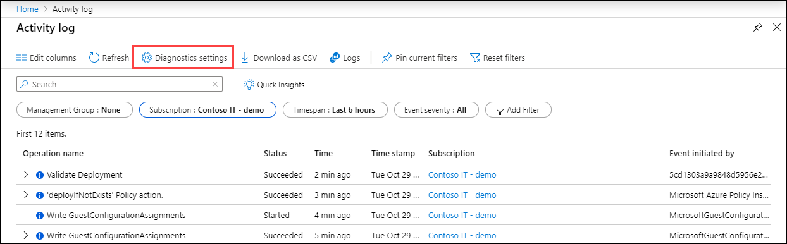
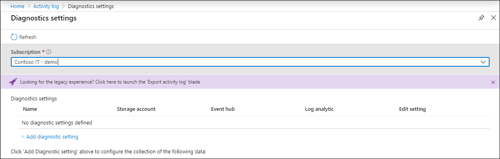

# Collect Azure Activity log with legacy settings
The [Azure Activity log](platform-logs-overview.md) is a [platform log](platform-logs-overview.md) that provides insight into subscription-level events that have occurred in Azure. Until recently, you created a log profile to send Activity log entries to [an event hub or storage account](activity-log-export.md) and used a connector to collect them into a [Log Analytics workspace](activity-log-collect.md). This article describes the difference between the methods, how to work with existing legacy settings, and how to clear legacy settings in preparation for diagnostic settings.

## Differences between methods

### Advantages
Using diagnostic settings has the following advantages over the current methods:

- Consistent method for collecting all platform logs.
- Collect Activity log across multiple subscriptions and tenants.
- Filter collection to only collect logs for particular categories.
- Collect all Activity log categories. Some categories are not collected using legacy method.
- Faster latency for log ingestion. The previous method has about 15 minutes latency while diagnostic settings adds only about 1 minute.

### Considerations
Consider the following details of Activity log collection using diagnostic settings before enabling this feature.

- The retention setting for collecting the Activity log to Azure storage has been removed meaning that data will be stored indefinitely until you remove it.
- Currently, you can only create a subscription level diagnostic setting using the Azure portal. To use other methods such as PowerShell or CLI, you can create a Resource Manager template.

### Differences in data
Diagnostic settings collect the same data as the previous methods used to collect the Activity log with the following current differences:

The following properties have been removed:

- ActivityStatus
- ActivitySubstatus
- OperationName
- ResourceProvider

The following properties have been added:

- Authorization_d
- Claims_d
- Properties_d

## Work with legacy settings
Legacy settings for collecting the Activity log will continue to work if you don't choose to replace with a diagnostic setting. Use the following method to manage the log profile for a subscription.

1. From the **Azure Monitor** menu in the Azure portal, select **Activity log**.
3. Click **Diagnostic settings**.

   

4. Click the purple banner for the legacy experience.

    

See the following articles for details on using the legacy collection methods.

- [Collect and analyze Azure activity logs in Log Analytics workspace in Azure Monitor](activity-log-collect.md)
- [Collect Azure Activity logs into Azure Monitor across Azure Active Directory tenants](activity-log-collect-tenants.md)
- [Export Azure Activity log to storage or Azure Event Hubs](activity-log-export.md)

## Disable existing settings
You should disable existing collection of the Activity before enabling it using diagnostic settings. Having both enabled may result in duplicate data.

### Disable collection into Log Analytics workspace

1. Open the **Log Analytics workspaces** menu in the Azure portal and select the workspace to collect the Activity Log.
2. In the **Workspace Data Sources** section of the workspace's menu, select **Azure Activity log**.
3. Click the subscription you want to disconnect.
4. Click **Disconnect** and then **Yes** when asked to confirm your choice.

### Disable log profile

1. Use the procedure described in [Work with legacy settings](#work-with-legacy-settings) to open legacy settings.
2. Disable any current collection to storage or event hubs.

## Activity Log monitoring solution
The Azure Log Analytics monitoring solution includes multiple log queries and views for analyzing the Activity Log records in your Log Analytics workspace. This solution uses log data collected in a Log Analytics workspace and will continue to work without any changes if you collect the Activity log using diagnostic settings. See [Activity Logs Analytics monitoring solution](activity-log-collect.md#activity-logs-analytics-monitoring-solution) for details on this solution.

## Next steps

* [Learn more about the Activity Log](../../azure-resource-manager/management/view-activity-logs.md)
* [Learn more about diagnostic settings](diagnostic-settings.md)
