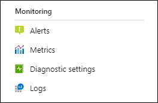
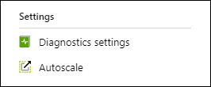
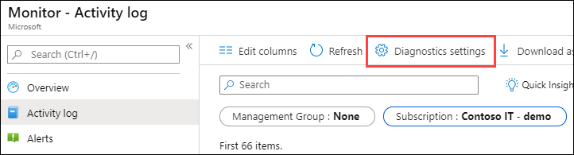
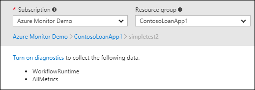
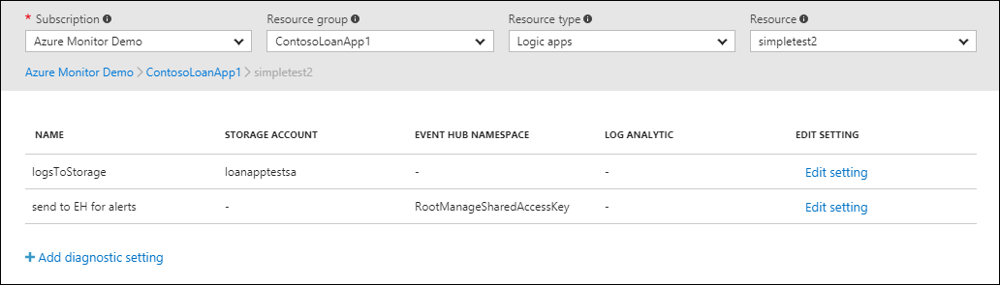
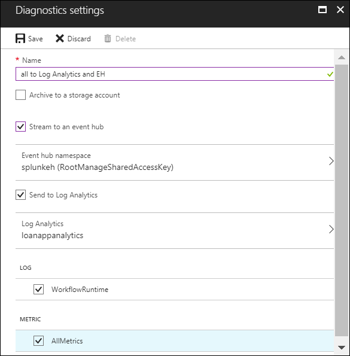

# Create diagnostic setting to collect platform logs and metrics in Azure
[Platform logs](platform-logs-overview.md) in Azure, including Azure Activity log and resource logs, provide detailed diagnostic and auditing information for Azure resources and the Azure platform they depend on. This article provides details on creating and configuring diagnostic settings to send platform logs to different destinations.

> [!IMPORTANT]
> Before you create a diagnostic setting to collect the Activity log, you should first disable any legacy configuration. See [Collect Azure Activity log with legacy settings](diagnostic-settings-legacy.md) for details.

Each Azure resource requires its own diagnostic setting, which defines the following:

- Categories of logs and metric data sent to the destinations defined in the setting. The available categories will vary for different resource types.
- One or more destinations to send the logs. Current destinations include Log Analytics workspace, Event Hubs, and Azure Storage.
 
A single diagnostic setting can define no more than one of each of the destinations. If you want to send data to more than one of a particular destination type (for example, two different Log Analytics workspaces), then create multiple settings. Each resource can have up to 5 diagnostic settings.


> [!NOTE]
> [Platform metrics](metrics-supported.md) are collected automatically to [Azure Monitor Metrics](data-platform-metrics.md). Diagnostic settings can be used to collect metrics for certain Azure services into Azure Monitor Logs for analysis with other monitoring data using [log queries](../log-query/log-query-overview.md).

## Destinations 
Platform logs can be sent to the destinations in the following table. The configuration for each destination is performed using the same process for creating diagnostic settings described in this article. Follow each link in the following table for details on sending data to that destination.

| Destination | Description |
|:---|:---|
| [Log Analytics workspace](resource-logs-collect-workspace.md) | Collecting logs into a Log Analytics workspace allows you to analyze them with other monitoring data collected by Azure Monitor using powerful log queries and also to leverage other Azure Monitor features such as alerts and visualizations. |
| [Event hubs](resource-logs-stream-event-hubs.md) | Sending logs to Event Hubs allows you to stream data to external systems such as third-party SIEMs and other log analytics solutions. |
| [Azure storage account](resource-logs-collect-storage.md) | Archiving logs to an Azure storage account is useful for audit, static analysis, or backup. |

## Create diagnostic settings in Azure portal
You can configure diagnostic settings in the Azure portal either from the Azure Monitor menu or from the menu for the resource.

1. Where you configure diagnostic settings in the Azure portal depends on the resource.

   - For a single resource, click **Diagnostic settings** under **Monitor** in the resource's menu.

        

    - For one or more resources, click **Diagnostic settings** under **Settings** in the Azure Monitor menu and then click on the resource.
    
        

    - For the Activity log, click **Activity log** in the **Azure Monitor** menu and then **Diagnostic settings**. Make sure you disable any legacy configuration for the Activity log. See [Disable existing settings](/azure/azure-monitor/platform/activity-log-collect#collecting-activity-log) for details.

        

2. If no settings exist on the resource you have selected, you are prompted to create a setting. Click **Add diagnostic setting**.

   

   If there are existing settings on the resource, you will see a list of settings already configured. Either click **Add diagnostic setting** to add a new setting or **Edit setting** to edit an existing one. Each setting can have no more than one of each of the destination types.

   

3. Give your setting a name if it doesn't already have one.
4. Check the box for each destination to send the logs. Click **Configure** to specify their settings as described in the following table.

    | Setting | Description |
    |:---|:---|
    | Log Analytics workspace | Name of workspace. |
    | Storage account | Name of storage account. |
    | Event hub namespace | The namespace where the event hub is created (if this is your first time streaming logs) or streamed to (if there are already resources that are streaming that log category to this namespace).
    | Event hub name | Optionally specify an event hub name to send all data in the setting. If you don't specify a name, an event hub is created for each log category. If you are sending multiple categories, you may want to specify a name to limit the number of event hubs created. See [Azure Event Hubs quotas and limits](../../event-hubs/event-hubs-quotas.md) for details. |
    | Event hub policy name | Defines the permissions that the streaming mechanism has. |

    

5. Check the box for each of the categories of data to send to the specified destinations. The list of categories will vary for each Azure service.

   > [!NOTE]
   > Sending multi-dimensional metrics via diagnostic settings is not currently supported. Metrics with dimensions are exported as flattened single dimensional metrics, aggregated across dimension values.
   >
   > *For example*: The 'Incoming Messages' metric on an Event Hub can be explored and charted on a per queue level. However, when exported via diagnostic settings the metric will be represented as all incoming messages across all queues in the Event Hub.

6. Click **Save**.

After a few moments, the new setting appears in your list of settings for this resource, and logs are streamed to the specified destinations as new event data is generated. Note that there may be up to fifteen minutes between when an event is emitted and when it [appears in a Log Analytics workspace](data-ingestion-time.md).


## Create diagnostic settings using PowerShell
Use the [Set-AzDiagnosticSetting](https://docs.microsoft.com/powershell/module/az.monitor/set-azdiagnosticsetting) cmdlet to create a diagnostic setting with [Azure PowerShell](powershell-quickstart-samples.md). See the documentation for this cmdlet for descriptions of its parameters.

> [!IMPORTANT]
> You cannot use this method for the Azure Activity log. Instead, use [Create diagnostic setting in Azure Monitor using a Resource Manager template](diagnostic-settings-template.md) to create a Resource Manager template and deploy it with PowerShell.

Following is an example PowerShell cmdlet to create a diagnostic setting using all three destinations.


```powershell
Set-AzDiagnosticSetting -Name KeyVault-Diagnostics -ResourceId /subscriptions/xxxxxxxx-xxxx-xxxx-xxxx-xxxxxxxxxxxx/resourceGroups/myresourcegroup/providers/Microsoft.KeyVault/vaults/mykeyvault -Category AuditEvent -MetricCategory AllMetrics -Enabled $true -StorageAccountId /subscriptions/xxxxxxxx-xxxx-xxxx-xxxx-xxxxxxxxxxxx/resourceGroups/myresourcegroup/providers/Microsoft.Storage/storageAccounts/mystorageaccount -WorkspaceId /subscriptions/xxxxxxxx-xxxx-xxxx-xxxx-xxxxxxxxxxxx/resourcegroups/oi-default-east-us/providers/microsoft.operationalinsights/workspaces/myworkspace  -EventHubAuthorizationRuleId /subscriptions/xxxxxxxx-xxxx-xxxx-xxxx-xxxxxxxxxxxx/resourceGroups/myresourcegroup/providers/Microsoft.EventHub/namespaces/myeventhub/authorizationrules/RootManageSharedAccessKey
```


## Create diagnostic settings using Azure CLI
Use the [az monitor diagnostic-settings create](https://docs.microsoft.com/cli/azure/monitor/diagnostic-settings?view=azure-cli-latest#az-monitor-diagnostic-settings-create) command to create a diagnostic setting with [Azure CLI](https://docs.microsoft.com/cli/azure/monitor?view=azure-cli-latest). See the documentation for this command for descriptions of its parameters.

> [!IMPORTANT]
> You cannot use this method for the Azure Activity log. Instead, use [Create diagnostic setting in Azure Monitor using a Resource Manager template](diagnostic-settings-template.md) to create a Resource Manager template and deploy it with CLI.

Following is an example CLI command to create a diagnostic setting using all three destinations.


```azurecli
az monitor diagnostic-settings create  \
--name KeyVault-Diagnostics \
--resource /subscriptions/xxxxxxxx-xxxx-xxxx-xxxx-xxxxxxxxxxxx/resourceGroups/myresourcegroup/providers/Microsoft.KeyVault/vaults/mykeyvault \
--logs    '[{"category": "AuditEvent","enabled": true}]' \
--metrics '[{"category": "AllMetrics","enabled": true}]' \
--storage-account /subscriptions/xxxxxxxx-xxxx-xxxx-xxxx-xxxxxxxxxxxx/resourceGroups/myresourcegroup/providers/Microsoft.Storage/storageAccounts/mystorageaccount \
--workspace /subscriptions/xxxxxxxx-xxxx-xxxx-xxxx-xxxxxxxxxxxx/resourcegroups/oi-default-east-us/providers/microsoft.operationalinsights/workspaces/myworkspace \
--event-hub-rule /subscriptions/xxxxxxxx-xxxx-xxxx-xxxx-xxxxxxxxxxxx/resourceGroups/myresourcegroup/providers/Microsoft.EventHub/namespaces/myeventhub/authorizationrules/RootManageSharedAccessKey
```

### Configure diagnostic settings using REST API
See [Diagnostic Settings](https://docs.microsoft.com/rest/api/monitor/diagnosticsettings) to create or update diagnostic settings using the [Azure Monitor REST API](https://docs.microsoft.com/rest/api/monitor/).


### Configure diagnostic settings using Resource Manager template
See [Create diagnostic setting in Azure Monitor using a Resource Manager template](diagnostic-settings-template.md) to create or update diagnostic settings with a Resource Manager template.

## Next steps

* [Read more about Azure platform Logs](platform-logs-overview.md)
