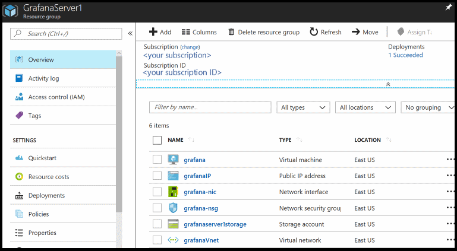
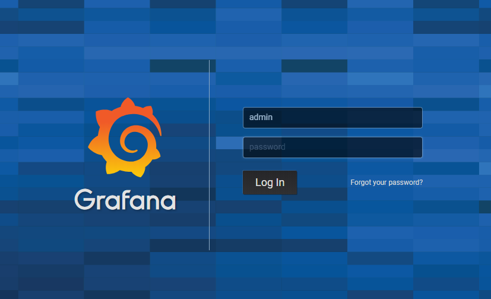
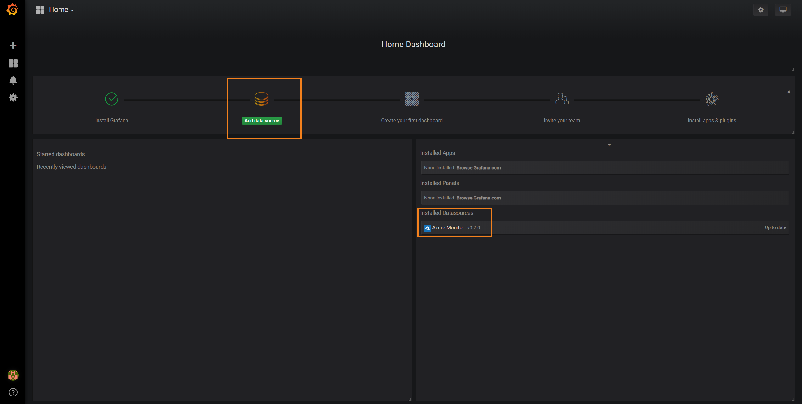
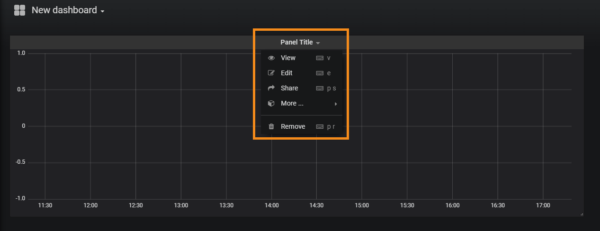
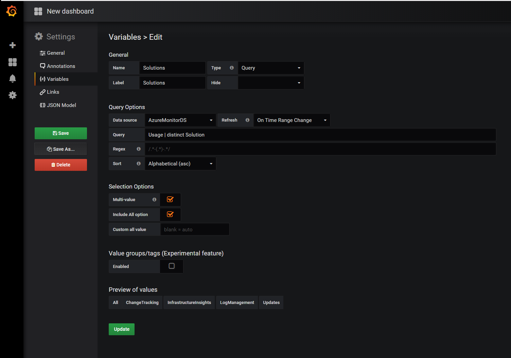
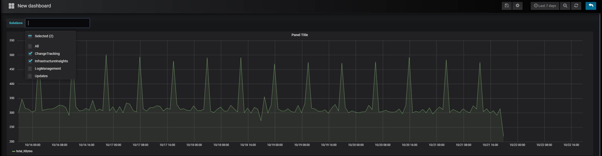
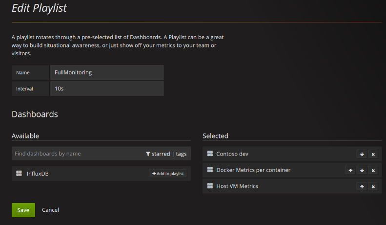

# Monitor your Azure services in Grafana
You can now monitor Azure services and applications from [Grafana](https://grafana.com/) using the [Azure Monitor data source plugin](https://grafana.com/plugins/grafana-azure-monitor-datasource). The plugin gathers application performance data collected by Azure Monitor, including various logs and metrics. You can then display this data on your Grafana dashboard.

The plugin is currently in preview.

Use the following steps to set up a Grafana server and build dashboards for metrics and logs from Azure Monitor.

## Set up a Grafana server

### Set up Grafana locally
To set up a local Grafana server, [download and install Grafana in your local environment](https://grafana.com/grafana/download). To use the plugin's Azure Monitor integration, install Grafana version 5.3 or higher.

### Set up Grafana on Azure through the Azure Marketplace
1. Go to Azure Marketplace and pick Grafana by Grafana Labs.

2. Fill in the names and details. Create a new resource group. Keep track of the values you choose for the VM username, VM password, and Grafana server admin password.  

3. Choose VM size and a storage account.

4. Configure the network configuration settings.

5. View the summary and select **Create** after accepting the terms of use.

6. After the deployment completes, select **Go to Resource Group**. You see a list of newly created resources.

    

    If you select the network security group (*grafana-nsg* in this case), you can see that port 3000 is used to access Grafana server.

7. Get the public IP address of your Grafana server - go back to the list of resources and select **Public IP address**.

## Sign in to Grafana

1. Using the IP address of your server, open the Login page at *http://\<IP address\>:3000* or the *\<DNSName>\:3000* in your browser. While 3000 is the default port, note you might have selected a different port during setup. You should see a login page for the Grafana server you built.

    

2. Sign in with the user name *admin* and the Grafana server admin password you created earlier. If you're using a local setup, the default password would be *admin*, and you'd be requested to change it on your first login.

## Configure data source plugin

Once successfully logged in, you should see that the Azure Monitor data source plugin is already included.



1. Select **Add data source** to add and configure the Azure Monitor data source.

2. Pick a name for the data source and select **Azure Monitor** as the type from the dropdown.

3. Create a service principal - Grafana uses an Azure Active Directory service principal to connect to Azure Monitor APIs and collect data. You must create, or use an existing service principal, to manage access to your Azure resources.
    * See [these instructions](../../azure-resource-manager/resource-group-create-service-principal-portal.md) to create a service principal. Copy and save your tenant ID (Directory ID), client ID (Application ID) and client secret (Application key value).
    * See [Assign application to role](https://docs.microsoft.com/azure/azure-resource-manager/resource-group-create-service-principal-portal) to assign the Reader role to the Azure Active Directory application on the subscription, resource group or resource you want to monitor. 
    The Log Analytics API requires the [Log Analytics Reader role](https://docs.microsoft.com/azure/role-based-access-control/built-in-roles#log-analytics-reader), which includes the Reader role's permissions and adds to it.

4. Provide the connection details to the APIs you'd like to use. You can connect to all or to some of them. 
    * If you connect to both metrics and logs in Azure Monitor, you can reuse the same credentials by selecting **Same details as Azure Monitor API**.
    * When configuring the plugin, you can indicate which Azure Cloud you would like the plugin to monitor (Public, Azure US Government, Azure Germany, or Azure China).
    * If you use Application Insights, you can also include your Application Insights API and application ID to collect Application Insights based metrics. For more information, see [Getting your API key and Application ID](https://dev.applicationinsights.io/documentation/Authorization/API-key-and-App-ID).

        > [!NOTE]
        > Some data source fields are named differently than their correlated Azure settings:
        > * Tenant ID is the Azure Directory ID
        > * Client ID is the Azure Active Directory Application ID
        > * Client Secret is the Azure Active Directory Application key value

5. If you use Application Insights, you can also include your Application Insights API and application ID to collect Application Insights based metrics. For more information, see [Getting your API key and Application ID](https://dev.applicationinsights.io/documentation/Authorization/API-key-and-App-ID).

6. Select **Save**, and Grafana will test the credentials for each API. You should see a message similar to the following one.  
    

## Build a Grafana dashboard

1. Go to the Grafana Home page, and select **New Dashboard**.

2. In the new dashboard, select the **Graph**. You can try other charting options but this article uses *Graph* as an example.

3. A blank graph shows up on your dashboard. Click on the panel title and select **Edit** to enter the details of the data you want to plot in this graph chart.
    

4. Select the Azure Monitor data source you've configured.
   * Collecting Azure Monitor metrics - select **Azure Monitor** in the service dropdown. A list of selectors shows up, where you can select the resources and metric to monitor in this chart. To collect metrics from a VM, use the namespace **Microsoft.Compute/VirtualMachines**. Once you have selected VMs and metrics, you can start viewing their data in the dashboard.
     
   * Collecting Azure Monitor log data - select **Azure Log Analytics** in the service dropdown. Select the workspace you'd like to query and set the query text. You can copy here any log query you already have or create a new one. As you type in your query, IntelliSense will show up and suggest autocomplete options. Select the visualization type, **Time series** **Table**, and run the query.
    
     > [!NOTE]
     >
     > The default query provided with the plugin uses two macros: "$__timeFilter() and $__interval. 
     > These macros allow Grafana to dynamically calculate the time range and time grain, when you zoom in on part of a chart. You can remove these macros and use a standard time filter, such as *TimeGenerated > ago(1h)*, but that means the graph would not support the zoom in feature.
    
     

5. Following is a simple dashboard with two charts. The one on left shows the CPU percentage of two VMs. The chart on the right shows the transactions in an Azure Storage account broken down by the Transaction API type.
    


## Optional: Monitor your custom metrics in the same Grafana server

You can also install Telegraf and InfluxDB to collect and plot both custom and agent-based metrics same Grafana instance. There are many data source plugins that you can use to bring these metrics together in a dashboard.

You can also reuse this set up to include metrics from your Prometheus server. Use the Prometheus data source plugin in Grafana's plugin gallery.

Here are good reference articles on how to use Telegraf, InfluxDB, Prometheus, and Docker
 - [How To Monitor System Metrics with the TICK Stack on Ubuntu 16.04](https://www.digitalocean.com/community/tutorials/how-to-monitor-system-metrics-with-the-tick-stack-on-ubuntu-16-04)

 - [A monitoring solution for Docker hosts, containers, and containerized services](https://stefanprodan.com/2016/a-monitoring-solution-for-docker-hosts-containers-and-containerized-services/)

Here is an image of a full Grafana dashboard that has metrics from Azure Monitor and Application Insights.


## Advanced Grafana features

### Variables
Some query values can be selected through UI dropdowns, and updated in the query. 
Consider the following query as an example:
```
Usage 
| where $__timeFilter(TimeGenerated) 
| summarize total_KBytes=sum(Quantity)*1024 by bin(TimeGenerated, $__interval) 
| sort by TimeGenerated
```

You can configure a variable that will list all available **Solution** values, and then update your query to use it.
To create a new variable, click the dashboard's Settings button in the top right area, select **Variables**, and then **New**.
On the variable page, define the data source and query to run in order to get the list of values.


Once created, adjust the query to use the selected value(s) and your charts will respond accordingly:
```
Usage 
| where $__timeFilter(TimeGenerated) and Solution in ($Solutions)
| summarize total_KBytes=sum(Quantity)*1024 by bin(TimeGenerated, $__interval) 
| sort by TimeGenerated
```
    


### Create dashboard playlists

One of the many useful features of Grafana is the dashboard playlist. You can create multiple dashboards and add them to a playlist configuring an interval for each dashboard to show. Select **Play** to see the dashboards cycle through. You may want to display them on a large wall monitor to provide a status board for your group.



## Clean up resources

If you've setup a Grafana environment on Azure, you are charged when VMs are running whether you are using them or not. To avoid incurring additional charges, clean up the resource group created in this article.

1. From the left-hand menu in the Azure portal, click **Resource groups** and then click **Grafana**.
2. On your resource group page, click **Delete**, type **Grafana** in the text box, and then click **Delete**.

## Next steps
* [Overview of Azure Monitor Metrics](data-platform.md)

