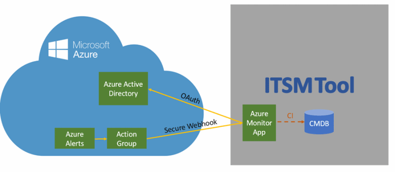
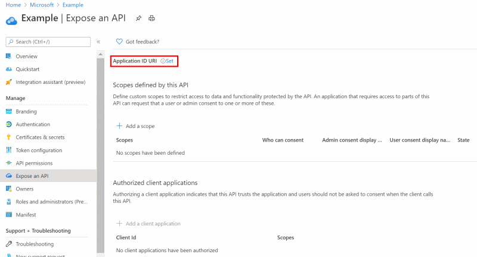

# Connect Azure to ITSM tools by using Secure Export

This article shows you how to configure the connection between your IT Service Management (ITSM) product or service by using Secure Export.

Secure Export is an updated version of [IT Service Management Connector (ITSMC)](./itsmc-overview.md). Both versions allow you to create work items in an ITSM tool when Azure Monitor sends alerts. The functionality includes metric, log, and Activity Log alerts.

ITSMC uses username and password credentials. Secure Export has stronger authentication because it uses Azure Active Directory (Azure AD). Azure AD is Microsoft's cloud-based identity and access management service. It helps users sign in and access internal or external resources. Using Azure AD with ITSM helps to identify Azure alerts (through the Azure AD application ID) that were sent to the external system.

> [!NOTE]
> The ability to connect Azure to ITSM tools by using Secure Export is in preview.

## Secure Export architecture

The Secure Export architecture introduces the following new capabilities:

* **New action group**: Alerts are sent to the ITSM tool through the Secure Webhook action group, instead of the ITSM action group that ITSMC uses.
* **Azure AD authentication**: Authentication occurs through Azure AD instead of username/password credentials.

## Secure Export data flow

The steps of the Secure Export data flow are:

1. Azure Monitor sends an alert that's configured to use Secure Export.
2. The alert payload is sent by a Secure Webhook action to the ITSM tool.
3. The ITSM application checks with Azure AD if the alert is authorized to enter the ITSM tool.
4. If the alert is authorized, the application:
   
   1. Creates a work item (for example, an incident) in the ITSM tool.
   2. Binds the ID of the configuration item (CI) to the customer management database (CMDB).

## Benefits of Secure Export

The main benefits of the integration are:

* **Better authentication**: Azure AD provides more secure authentication without the timeouts that commonly occur in ITSMC.
* **Alerts resolved in the ITSM tool**: Metric alerts implement "fired" and "resolved" states. When the condition is met, the alert state is "fired." When condition is not met anymore, the alert state is "resolved." In ITSMC, alerts can't be resolved automatically. With Secure Export, the resolved state flows to the ITSM tool and so is updated automatically.
* **[Common alert schema](./alerts-common-schema.md)**: In ITSMC, the schema of the alert payload differs based on the alert type. In Secure Export, there's a common schema for all alert types. This common schema contains the CI for all alert types. All alert types will be able to bind their CI with the CMDB.

Start using the ITSM Connector tool with these steps:

1. Register your app with Azure AD.
2. Create a Secure Webhook action group.
3. Configure your partner environment. 

Secure Export supports connections with the following ITSM tools:
* [BMC Helix](https://docs.microsoft.com/azure/azure-monitor/platform/it-service-management-connector-secure-webhook-connections#connect-bmc-helix-to-azure-monitor)

## Register with Azure Active Directory

Follow these steps to register the application with Azure AD:

1. Follow the steps in [Register an application with the Microsoft identity platform](../../active-directory/develop/quickstart-register-app.md).
2. In Azure AD, select **Expose application**.
3. Select **Set** for **Application ID URI**.

   
4. Select **Save**.

## Create a Secure Webhook action group

After your application is registered with Azure AD, you can create work items in your ITSM tool based on Azure alerts, by using the Secure Webhook action in action groups.

Action groups provide a modular and reusable way of triggering actions for Azure alerts. You can use action groups with metric alerts, Activity Log alerts, and Azure Log Analytics alerts in the Azure portal.
To learn more about action groups, see [Create and manage action groups in the Azure portal](./action-groups.md).

To add a webhook to an action, follow these instructions for Secure Webhook:

1. In the [Azure portal](https://portal.azure.com/), search for and select **Monitor**. The **Monitor** pane consolidates all your monitoring settings and data in one view.
2. Select **Alerts** > **Manage actions**.
3. Select [Add action group](./action-groups.md#create-an-action-group-by-using-the-azure-portal), and fill in the fields.
4. Enter a name in the **Action group name** box, and enter a name in the **Short name** box. The short name is used in place of a full action group name when notifications are sent using this group.
5. Select **Secure Webhook**.
6. Select these details:
   1. Select the object ID of the Azure Active Directory instance that you registered.
   2. For the URI, paste in the webhook URL that you copied from the [ITSM tool environment](https://docs.microsoft.com/azure/azure-monitor/platform/it-service-management-connector-secure-webhook-connections#configure-the-partner-environment).
   3. Set **Enable the common Alert Schema** to **Yes**. 

   The following image shows the configuration of a sample Secure Webhook action:

   

## Configure the ITSM tool environment

The configuration contain 2 steps:
1. Get the URI for the secure export definition.
2. Definitions according to the flow of the ITSM tool.

### Connect BMC Helix to Azure Monitor

The following sections provide details about how to connect your BMC Helix product and Secure Export in Azure.

### Prerequisites

Ensure that you've met the following prerequisites:

* Azure AD is registered.
* You have the supported version of BMC Helix Multi-Cloud Service Management (version 19.08 or later).

### Configure the BMC Helix connection

1.Use the following procedure in the BMC Helix environment in order to get the URI for the secure export:

   1. Log in to Integration Studio.
   2. Search for the **Create Incident from Azure Alerts** flow.
   3. Copy the webhook URL .
   
   
   
2. Follow the instructions according to the version:
   * [Enabling prebuilt integration with Azure Monitor for version 20.02](https://docs.bmc.com/docs/multicloud/enabling-prebuilt-integration-with-azure-monitor-879728195.html).
   * [Enabling prebuilt integration with Azure Monitor for version 19.11](https://docs.bmc.com/docs/multicloudprevious/enabling-prebuilt-integration-with-azure-monitor-904157623.html).

3. As a part of the configuration of the connection in BMC Helix, go into your integration BMC instance and follow these instructions:

   1. Select **catalog**.
   2. Select **Azure alerts**.
   3. Select **connectors**.
   4. Select **configuration**.
   5. Select the **add new connection** configuration.
   6. Fill in the information for the configuration section:
      - **Name**: Make up your own.
      - **Authorization type**: **NONE**
      - **Description**: Make up your own.
      - **Site**: **Cloud**
      - **Number of instances**: **2**, the default value.
      - **Check**: Selected by default to enable usage.
      - The Azure tenant ID and Azure application ID are taken from the application that you defined earlier.

## Next steps

* [Create ITSM work items from Azure alerts](./itsmc-overview.md)
