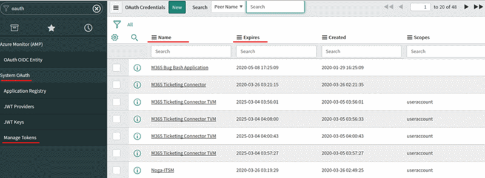

# Connect ServiceNow with IT Service Management Connector

This article provides information about how to configure the connection between your ServiceNow instance and the IT Service Management Connector (ITSMC) in Log Analytics to centrally manage your work items.

The following sections provide details about how to connect your ServiceNow product to ITSMC in Azure.

## Prerequisites
Ensure the following prerequisites are met:
- ITSMC installed. More information: [Adding the IT Service Management Connector Solution](./itsmc-definition.md#add-it-service-management-connector).
- ServiceNow supported versions: Orlando, New York, Madrid, London, Kingston, Jakarta, Istanbul, Helsinki, Geneva.
- Today the alerts that are sent from Azure Monitor can create in ServiceNow one of the following elements: Events, Incidents or Alerts.
> [!NOTE]
> ITSMC supports only the official SaaS offering from Service Now. Private deployments of Service Now are not supported. 

**ServiceNow Admins must do the following in their ServiceNow instance**:
- Generate client ID and client secret for the ServiceNow product. For information on how to generate client ID and secret, see the following information as required:

    - [Set up OAuth for Orlando](https://docs.servicenow.com/bundle/orlando-platform-administration/page/administer/security/task/t_SettingUpOAuth.html)
    - [Set up OAuth for New York](https://docs.servicenow.com/bundle/newyork-platform-administration/page/administer/security/task/t_SettingUpOAuth.html)
    - [Set up OAuth for Madrid](https://docs.servicenow.com/bundle/madrid-platform-administration/page/administer/security/task/t_SettingUpOAuth.html)
    - [Set up OAuth for London](https://docs.servicenow.com/bundle/london-platform-administration/page/administer/security/task/t_SettingUpOAuth.html)
    - [Set up OAuth for Kingston](https://docs.servicenow.com/bundle/kingston-platform-administration/page/administer/security/task/t_SettingUpOAuth.html)
	- [Set up OAuth for Jakarta](https://docs.servicenow.com/bundle/jakarta-platform-administration/page/administer/security/task/t_SettingUpOAuth.html)
    - [Set up OAuth for Istanbul](https://docs.servicenow.com/bundle/istanbul-platform-administration/page/administer/security/task/t_SettingUpOAuth.html)
    - [Set up OAuth for Helsinki](https://docs.servicenow.com/bundle/helsinki-platform-administration/page/administer/security/task/t_SettingUpOAuth.html)
    - [Set up OAuth for Geneva](https://docs.servicenow.com/bundle/geneva-servicenow-platform/page/administer/security/task/t_SettingUpOAuth.html)
> [!NOTE]
> As a part of the definition of the “Set up OAuth” we would recommend:
>
> 1) **Update the refresh token lifespan to 90 days (7,776,000 seconds):**
> As a part of the [Set up OAuth](https://nam06.safelinks.protection.outlook.com/?url=https%3A%2F%2Fdocs.servicenow.com%2Fbundle%2Fnewyork-platform-administration%2Fpage%2Fadminister%2Fsecurity%2Ftask%2Ft_SettingUpOAuth.html&data=02%7C01%7CNoga.Lavi%40microsoft.com%7C2c6812e429a549e71cdd08d7d1b148d8%7C72f988bf86f141af91ab2d7cd011db47%7C1%7C0%7C637208431696739125&sdata=Q7mF6Ej8MCupKaEJpabTM56EDZ1T8vFVyihhoM594aA%3D&reserved=0) in phase 2: [Create an endpoint for clients to access the instance](https://nam06.safelinks.protection.outlook.com/?url=https%3A%2F%2Fdocs.servicenow.com%2Fbundle%2Fnewyork-platform-administration%2Fpage%2Fadminister%2Fsecurity%2Ftask%2Ft_CreateEndpointforExternalClients.html&data=02%7C01%7CNoga.Lavi%40microsoft.com%7C2c6812e429a549e71cdd08d7d1b148d8%7C72f988bf86f141af91ab2d7cd011db47%7C1%7C0%7C637208431696749123&sdata=hoAJHJAFgUeszYCX1Q%2FXr4N%2FAKiFcm5WV7mwR2UqeWA%3D&reserved=0)
> After the definition of the endpoint, In ServiceNow blade search for System OAuth than select Application Registry. Pick the name of the OAuth that was defined and update the field of Refresh token Lifespan to 7,776,000 (90 days in seconds).
> At the end click update.
> 2) **We recommend to establish an internal procedure to ensure the connection remains alive:**
> According to the Refresh Token Lifespan to refresh the token. Please make sure to perform the following operations prior refresh token expected expiration time (Couple of days before the Refresh Token Lifespan expires we recommend):
>
>     1. [Complete a manual sync process for ITSM connector configuration](./itsmc-resync-servicenow.md)
>     2. Revoke to the old refresh token as it is not recommended to keep old keys from for security reasons. In ServiceNow blade search for System OAuth than select Manage Tokens. Pick the old token from the list according to the OAuth name and expiration date.
> 
>     3. Click on Revoke Access and than on Revoke.

- Install the User App for Microsoft Log Analytics integration (ServiceNow app). [Learn more](https://store.servicenow.com/sn_appstore_store.do#!/store/application/ab0265b2dbd53200d36cdc50cf961980/1.0.1 ).
> [!NOTE]
> ITSMC supports only the official User App for Microsoft Log Analytics integration that is downloaded from ServiceNow store. ITSMC do not support any code ingestion in ServiceNow side or the application that is not part of the official ServiceNow solution. 
- Create integration user role for the user app installed. Information on how to create the integration user role is [here](#create-integration-user-role-in-servicenow-app).

## **Connection procedure**
Use the following procedure to create a ServiceNow connection:

1. In Azure portal, go to **All Resources** and look for **ServiceDesk(YourWorkspaceName)**

2.	Under **WORKSPACE DATA SOURCES** click **ITSM Connections**.
	

3. At the top of the right pane, click **Add**.

4. Provide the information as described in the following table, and click **OK** to create the connection.

> [!NOTE]
> All these parameters are mandatory.

| **Field** | **Description** |
| --- | --- |
| **Connection Name**   | Type a name for the ServiceNow instance that you want to connect with ITSMC.  You use this name later in Log Analytics when you configure work items in this ITSM/ view detailed log analytics. |
| **Partner type**   | Select **ServiceNow**. |
| **Username**   | Type the integration user name that you created in the ServiceNow app to support the connection to ITSMC. More information: [Create ServiceNow app user role](#create-integration-user-role-in-servicenow-app).|
| **Password**   | Type the password associated with this user name. **Note**: User name and password are used for generating authentication tokens only, and are not stored anywhere within the ITSMC service.  |
| **Server URL**   | Type the URL of the ServiceNow instance that you want to connect to ITSMC. The URL should point to a supported SaaS version with suffix ".servicenow.com".|
| **Client ID**   | Type the client ID that you want to use for OAuth2 Authentication, which you generated earlier.  More information on generating client ID and secret:   [OAuth Setup](https://wiki.servicenow.com/index.php?title=OAuth_Setup). |
| **Client Secret**   | Type the client secret, generated for this ID.   |
| **Data Sync Scope**   | Select the ServiceNow work items that you want to sync to Azure Log Analytics, through the ITSMC.  The selected values are imported into log analytics.   **Options:**  Incidents and Change Requests.|
| **Sync Data** | Type the number of past days that you want the data from. **Maximum limit**: 120 days. |
| **Create new configuration item in ITSM solution** | Select this option if you want to create the configuration items in the ITSM product. When selected, ITSMC creates the affected CIs as configuration items (in case of non-existing CIs) in the supported ITSM system. **Default**: disabled. |

**When successfully connected, and synced**:

- Selected work items from ServiceNow instance are imported into Azure **Log Analytics.** You can view the summary of these work items on the IT Service Management Connector tile.

- You can create incidents from Log Analytics alerts or from log records, or from Azure alerts in this ServiceNow instance.

> [!NOTE]
> In ServiceNow there is a rate limit for requests per hour. 
> In order to configure the limit use this by defining "Inbound REST API rate limiting" in the ServiceNow instance.

## Create integration user role in ServiceNow app

User the following procedure:

1. Visit the [ServiceNow store](https://store.servicenow.com/sn_appstore_store.do#!/store/application/ab0265b2dbd53200d36cdc50cf961980/1.0.1) and install the **User App for ServiceNow and Microsoft OMS Integration** into your ServiceNow Instance.
   
   >[!NOTE]
   >As part of the ongoing transition from Microsoft Operations Management Suite (OMS) to Azure Monitor, OMS is now referred to as Log Analytics.     
2. After installation, visit the left navigation bar of the ServiceNow instance, search, and select Microsoft OMS integrator.  
3. Click **Installation Checklist**.

   The status is displayed as  **Not complete** if the user role is yet to be created.

4. In the text boxes, next to **Create integration user**, enter the user name for the user that can connect to ITSMC in Azure.
5. Enter the password for this user, and click **OK**.  

> [!NOTE]
> You use these credentials to make the ServiceNow connection in Azure.

The newly created user is displayed with the default roles assigned.

**Default roles**:
- personalize_choices
- import_transformer
- 	x_mioms_microsoft.user
- 	itil
- 	template_editor
- 	view_changer

Once the user is successfully created, the status of **Check Installation Checklist** moves to Completed, listing the details of the user role created for the app.

> [!NOTE]
> ITSM Connector can send incidents to ServiceNow without any other modules installed on your ServiceNow instance. If you are using EventManagement module in your ServiceNow instance and wish to create Events or Alerts in ServiceNow using the connector, add the following roles to the integration user:
> 
>    - evt_mgmt_integration
>    - evt_mgmt_operator  

## Next steps

* [ITSM Connector Overview](itsmc-overview.md)
* [Create ITSM work items from Azure alerts](./itsmc-definition.md#create-itsm-work-items-from-azure-alerts)
* [Troubleshooting problems in ITSM Connector](./itsmc-resync-servicenow.md)