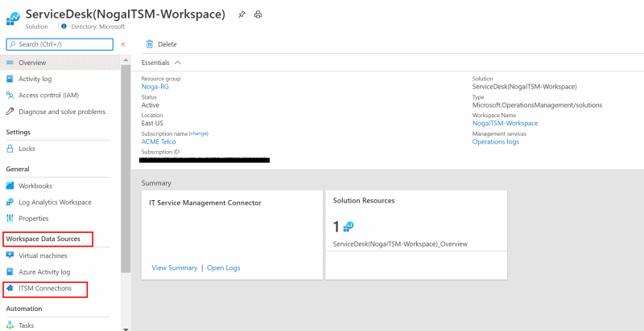
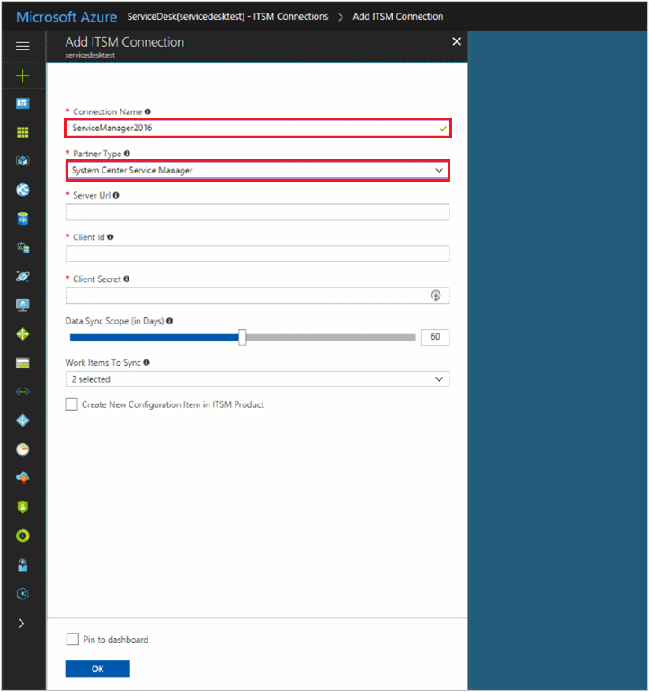
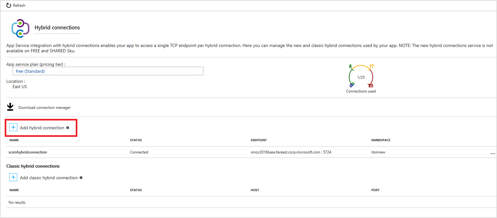
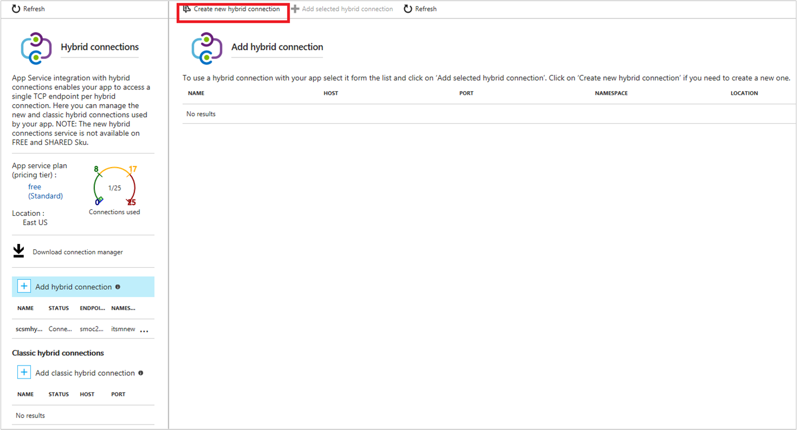
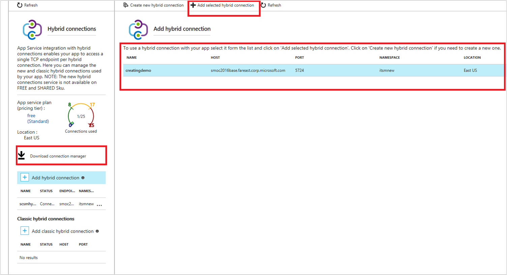
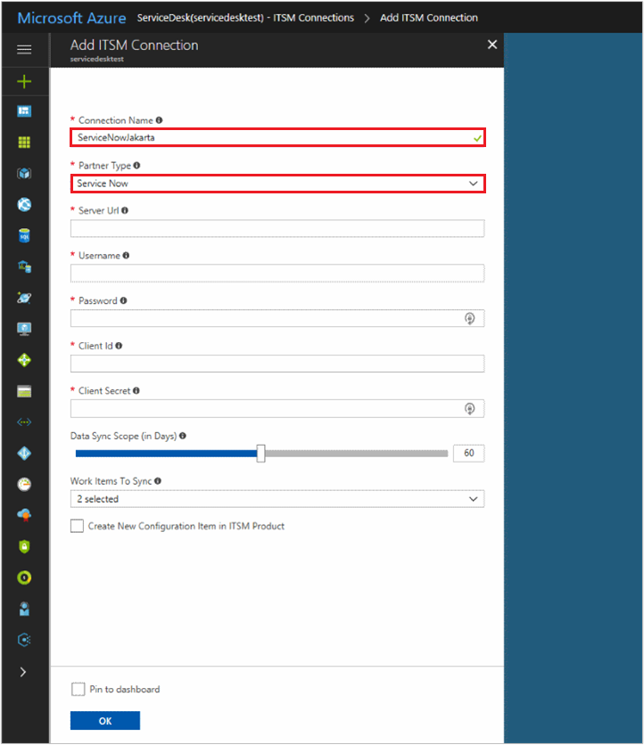
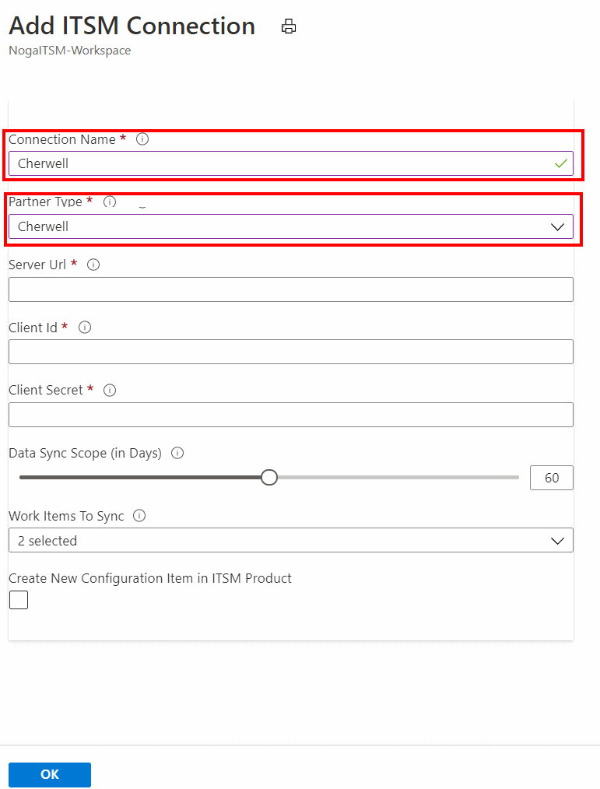

# Connect ITSM products/services with IT Service Management Connector
This article provides information about how to configure the connection between your ITSM product/service and the IT Service Management Connector (ITSMC) in Log Analytics to centrally manage your work items. For more information about ITSMC,  see [Overview](../../azure-monitor/platform/itsmc-overview.md).

The following ITSM products/services are supported. Select the product to view detailed information about how to connect the product to ITSMC.

- [System Center Service Manager](#connect-system-center-service-manager-to-it-service-management-connector-in-azure)
- [ServiceNow](#connect-servicenow-to-it-service-management-connector-in-azure)
- [Provance](#connect-provance-to-it-service-management-connector-in-azure)
- [Cherwell](#connect-cherwell-to-it-service-management-connector-in-azure)

> [!NOTE]
> 
> ITSM Connector can only connect to cloud-based ServiceNow instances. On-premises ServiceNow instances are currently not supported.

## Connect System Center Service Manager to IT Service Management Connector in Azure

The following sections provide details about how to connect your System Center Service Manager product to ITSMC in Azure.

### Prerequisites

Ensure the following prerequisites are met:

- ITSMC installed. More information: [Adding the IT Service Management Connector Solution](../../azure-monitor/platform/itsmc-overview.md#adding-the-it-service-management-connector-solution).
- The Service Manager Web application (Web app) is deployed and configured. Information on Web app is [here](#create-and-deploy-service-manager-web-app-service).
- Hybrid connection created and configured. More information: [Configure the hybrid Connection](#configure-the-hybrid-connection).
- Supported versions of Service Manager:  2012 R2 or 2016.
- User role:  [Advanced operator](https://technet.microsoft.com/library/ff461054.aspx).

### Connection procedure

Use the following procedure to connect your System Center Service Manager instance to ITSMC:

1. In Azure portal, go to **All Resources** and look for **ServiceDesk(YourWorkspaceName)**

2.	Under **WORKSPACE DATA SOURCES** click **ITSM Connections**.

	

3. At the top of the right pane, click **Add**.

4. Provide the information as described in the following table, and click **OK** to create the connection.

> [!NOTE]
> 
> All these parameters are mandatory.

| **Field** | **Description** |
| --- | --- |
| **Connection Name**   | Type a name for the System Center Service Manager instance that you want to connect with ITSMC.  You use this name later when you configure work items in this instance/ view detailed log analytics. |
| **Partner type**   | Select **System Center Service Manager**. |
| **Server URL**   | Type the URL of the Service Manager Web app. More information about Service Manager Web app is [here](#create-and-deploy-service-manager-web-app-service).
| **Client ID**   | Type the client ID that you generated (using the automatic script) for authenticating the Web app. More information about the automated script is [here.](../../azure-monitor/platform/itsmc-service-manager-script.md)|
| **Client Secret**   | Type the client secret, generated for this ID.   |
| **Sync Data**   | Select the Service Manager work items that you want to sync through ITSMC.  These work items are imported into Log Analytics. **Options:**  Incidents, Change Requests.|
| **Data Sync Scope** | Type the number of past days that you want the data from. **Maximum limit**: 120 days. |
| **Create new configuration item in ITSM solution** | Select this option if you want to create the configuration items in the ITSM product. When selected, Log Analytics creates the affected CIs as configuration items (in case of non-existing CIs) in the supported ITSM system. **Default**: disabled. |

**When successfully connected, and synced**:

- Selected work items from Service Manager are imported into Azure **Log Analytics.** You can view the summary of these work items on the IT Service Management Connector tile.

- You can create incidents from Log Analytics alerts or from log records, or from Azure alerts in this Service Manager instance.

Learn more: [Create ITSM work items from Azure alerts](../../azure-monitor/platform/itsmc-overview.md#create-itsm-work-items-from-azure-alerts).

### Create and deploy Service Manager web app service

To connect the on-premises Service Manager with ITSMC in Azure, Microsoft has created a Service Manager Web app on the GitHub.

To set up the ITSM Web app for your Service Manager, do the following:

- **Deploy the Web app** – Deploy the Web app, set the properties, and authenticate with Azure AD. You can deploy the web app by using the [automated script](../../azure-monitor/platform/itsmc-service-manager-script.md) that Microsoft has provided you.
- **Configure the hybrid connection** - [Configure this connection](#configure-the-hybrid-connection), manually.

#### Deploy the web app
Use the automated [script](../../azure-monitor/platform/itsmc-service-manager-script.md) to deploy the Web app, set the properties, and authenticate with Azure AD.

Run the script by providing the following required details:

- Azure subscription details
- Resource group name
- Location
- Service Manager server details (server name, domain, user name, and password)
- Site name prefix for your Web app
- ServiceBus Namespace.

The script creates the Web app using the name that you specified (along with few additional strings to make it unique). It generates the **Web app URL**, **client ID** and **client secret**.

Save the values, you use them when you create a connection with ITSMC.

**Check the Web app installation**

1. Go to **Azure portal** > **Resources**.
2. Select the Web app, click **Settings** > **Application Settings**.
3. Confirm the information about the Service Manager instance that you provided at the time of deploying the app through the script.

### Configure the hybrid connection

Use the following procedure to configure the hybrid connection that connects the Service Manager instance with ITSMC in Azure.

1. Find the Service Manager Web app, under **Azure Resources**.
2. Click **Settings** > **Networking**.
3. Under **Hybrid Connections**, click **Configure your hybrid connection endpoints**.

    
4. In the **Hybrid Connections** blade, click **Add hybrid connection**.

    

5. In the **Add Hybrid Connections** blade, click **Create new hybrid Connection**.

    

6. Type the following values:

   - **EndPoint Name**: Specify a name for the new Hybrid connection.
   - **EndPoint Host**: FQDN of the Service Manager management server.
   - **EndPoint Port**: Type 5724
   - **Servicebus namespace**: Use an existing servicebus namespace or create a new one.
   - **Location**: select the location.
   - **Name**: Specify a name to the servicebus if you are creating it.

     
6. Click **OK** to close the **Create hybrid connection** blade and start creating the hybrid connection.

    Once the Hybrid connection is created, it is displayed under the blade.

7. After the hybrid connection is created, select the connection and click **Add selected hybrid connection**.

    

#### Configure the listener setup

Use the following procedure to configure the listener setup for the hybrid connection.

1. In the **Hybrid Connections** blade, click **Download the Connection Manager** and install it on the machine where System Center Service Manager instance is running.

    Once the installation is complete, **Hybrid Connection Manager UI** option is available under **Start** menu.

2. Click **Hybrid Connection Manager UI** , you will be prompted for your Azure credentials.

3. Login with your Azure credentials and select your subscription where the Hybrid connection was created.

4. Click **Save**.

Your hybrid connection is successfully connected.

> [!NOTE]
> 
> After the hybrid connection is created, verify and test the connection by visiting the deployed Service Manager Web app. Ensure the connection is successful before you try to connect to ITSMC in Azure.

The following sample image shows the details of a successful connection:

## Connect ServiceNow to IT Service Management Connector in Azure

The following sections provide details about how to connect your ServiceNow product to ITSMC in Azure.

### Prerequisites
Ensure the following prerequisites are met:
- ITSMC installed. More information: [Adding the IT Service Management Connector Solution](../../azure-monitor/platform/itsmc-overview.md#adding-the-it-service-management-connector-solution).
- ServiceNow supported versions: Madrid, London, Kingston, Jakarta, Istanbul, Helsinki, Geneva.

**ServiceNow Admins must do the following in their ServiceNow instance**:
- Generate client ID and client secret for the ServiceNow product. For information on how to generate client ID and secret, see the following information as required:

    - [Set up OAuth for Madrid](https://docs.servicenow.com/bundle/madrid-platform-administration/page/administer/security/task/t_SettingUpOAuth.html)
    - [Set up OAuth for London](https://docs.servicenow.com/bundle/london-platform-administration/page/administer/security/task/t_SettingUpOAuth.html)
    - [Set up OAuth for Kingston](https://docs.servicenow.com/bundle/kingston-platform-administration/page/administer/security/task/t_SettingUpOAuth.html)
	- [Set up OAuth for Jakarta](https://docs.servicenow.com/bundle/jakarta-platform-administration/page/administer/security/task/t_SettingUpOAuth.html)
    - [Set up OAuth for Istanbul](https://docs.servicenow.com/bundle/istanbul-platform-administration/page/administer/security/task/t_SettingUpOAuth.html)
    - [Set up OAuth for Helsinki](https://docs.servicenow.com/bundle/helsinki-platform-administration/page/administer/security/task/t_SettingUpOAuth.html)
    - [Set up OAuth for Geneva](https://docs.servicenow.com/bundle/geneva-servicenow-platform/page/administer/security/task/t_SettingUpOAuth.html)

- Install the User App for Microsoft Log Analytics integration (ServiceNow app). [Learn more](https://store.servicenow.com/sn_appstore_store.do#!/store/application/ab0265b2dbd53200d36cdc50cf961980/1.0.1 ).
- Create integration user role for the user app installed. Information on how to create the integration user role is [here](#create-integration-user-role-in-servicenow-app).

### **Connection procedure**
Use the following procedure to create a ServiceNow connection:

1. In Azure portal, go to **All Resources** and look for **ServiceDesk(YourWorkspaceName)**

2.	Under **WORKSPACE DATA SOURCES** click **ITSM Connections**.
	

3. At the top of the right pane, click **Add**.

4. Provide the information as described in the following table, and click **OK** to create the connection.

> [!NOTE]
> All these parameters are mandatory.

| **Field** | **Description** |
| --- | --- |
| **Connection Name**   | Type a name for the ServiceNow instance that you want to connect with ITSMC.  You use this name later in Log Analytics when you configure work items in this ITSM/ view detailed log analytics. |
| **Partner type**   | Select **ServiceNow**. |
| **Username**   | Type the integration user name that you created in the ServiceNow app to support the connection to ITSMC. More information: [Create ServiceNow app user role](#create-integration-user-role-in-servicenow-app).|
| **Password**   | Type the password associated with this user name. **Note**: User name and password are used for generating authentication tokens only, and are not stored anywhere within the ITSMC service.  |
| **Server URL**   | Type the URL of the ServiceNow instance that you want to connect to ITSMC. |
| **Client ID**   | Type the client ID that you want to use for OAuth2 Authentication, which you generated earlier.  More information on generating client ID and secret:   [OAuth Setup](https://wiki.servicenow.com/index.php?title=OAuth_Setup). |
| **Client Secret**   | Type the client secret, generated for this ID.   |
| **Data Sync Scope**   | Select the ServiceNow work items that you want to sync to Azure Log Analytics, through the ITSMC.  The selected values are imported into log analytics.   **Options:**  Incidents and Change Requests.|
| **Sync Data** | Type the number of past days that you want the data from. **Maximum limit**: 120 days. |
| **Create new configuration item in ITSM solution** | Select this option if you want to create the configuration items in the ITSM product. When selected, ITSMC creates the affected CIs as configuration items (in case of non-existing CIs) in the supported ITSM system. **Default**: disabled. |

**When successfully connected, and synced**:

- Selected work items from ServiceNow instance are imported into Azure **Log Analytics.** You can view the summary of these work items on the IT Service Management Connector tile.

- You can create incidents from Log Analytics alerts or from log records, or from Azure alerts in this ServiceNow instance.

Learn more: [Create ITSM work items from Azure alerts](../../azure-monitor/platform/itsmc-overview.md#create-itsm-work-items-from-azure-alerts).

### Create integration user role in ServiceNow app

User the following procedure:

1. Visit the [ServiceNow store](https://store.servicenow.com/sn_appstore_store.do#!/store/application/ab0265b2dbd53200d36cdc50cf961980/1.0.1) and install the **User App for ServiceNow and Microsoft OMS Integration** into your ServiceNow Instance.
   
   >[!NOTE]
   >As part of the ongoing transition from Microsoft Operations Management Suite (OMS) to Azure Monitor, OMS is now referred to as Log Analytics.     
2. After installation, visit the left navigation bar of the ServiceNow instance, search, and select Microsoft OMS integrator.  
3. Click **Installation Checklist**.

   The status is displayed as  **Not complete** if the user role is yet to be created.

4. In the text boxes, next to **Create integration user**, enter the user name for the user that can connect to ITSMC in Azure.
5. Enter the password for this user, and click **OK**.  

> [!NOTE]
> 
> You use these credentials to make the ServiceNow connection in Azure.

The newly created user is displayed with the default roles assigned.

**Default roles**:
- personalize_choices
- import_transformer
- 	x_mioms_microsoft.user
- 	itil
- 	template_editor
- 	view_changer

Once the user is successfully created, the status of **Check Installation Checklist** moves to Completed, listing the details of the user role created for the app.

> [!NOTE]
> 
> ITSM Connector can send incidents to ServiceNow without any other modules installed on your ServiceNow instance. If you are using EventManagement module in your ServiceNow instance and wish to create Events or Alerts in ServiceNow using the connector, add the following roles to the integration user:
> 
>    - evt_mgmt_integration
>    - evt_mgmt_operator  

## Connect Provance to IT Service Management Connector in Azure

The following sections provide details about how to connect your Provance product to ITSMC in Azure.

### Prerequisites

Ensure the following prerequisites are met:

- ITSMC installed. More information: [Adding the IT Service Management Connector Solution](../../azure-monitor/platform/itsmc-overview.md#adding-the-it-service-management-connector-solution).
- Provance App should be registered with Azure AD - and client ID is made available. For detailed information, see [how to configure active directory authentication](../../app-service/configure-authentication-provider-aad.md).

- User role:  Administrator.

### Connection Procedure

Use the following procedure to create a Provance connection:

1. In Azure portal, go to **All Resources** and look for **ServiceDesk(YourWorkspaceName)**

2.	Under **WORKSPACE DATA SOURCES** click **ITSM Connections**.
	

3. At the top of the right pane, click **Add**.

4. Provide the information as described in the following table, and click **OK** to create the connection.

> [!NOTE]
> 
> All these parameters are mandatory.

| **Field** | **Description** |
| --- | --- |
| **Connection Name**   | Type a name for the Provance instance that you want to connect with ITSMC.  You use this name later when you configure work items in this ITSM/ view detailed log analytics. |
| **Partner type**   | Select **Provance**. |
| **Username**   | Type the user name that can connect to ITSMC.    |
| **Password**   | Type the password associated with this user name. **Note:** User name and password are used for generating authentication tokens only, and are not stored anywhere within the ITSMC service._|
| **Server URL**   | Type the URL of your Provance instance that you want to connect to ITSMC. |
| **Client ID**   | Type the client ID for authenticating this connection, which you generated in your Provance instance.  More information on client ID, see [how to configure active directory authentication](../../app-service/configure-authentication-provider-aad.md). |
| **Data Sync Scope**   | Select the Provance work items that you want to sync to Azure Log Analytics, through ITSMC.  These work items are imported into log analytics.   **Options:**   Incidents, Change Requests.|
| **Sync Data** | Type the number of past days that you want the data from. **Maximum limit**: 120 days. |
| **Create new configuration item in ITSM solution** | Select this option if you want to create the configuration items in the ITSM product. When selected, ITSMC creates the affected CIs as configuration items (in case of non-existing CIs) in the supported ITSM system. **Default**: disabled.|

**When successfully connected, and synced**:

- Selected work items from this Provance instance are imported into Azure **Log Analytics.** You can view the summary of these work items on the IT Service Management Connector tile.

- You can create incidents from Log Analytics alerts or from log records, or from Azure alerts in this Provance instance.

Learn more: [Create ITSM work items from Azure alerts](../../azure-monitor/platform/itsmc-overview.md#create-itsm-work-items-from-azure-alerts).

## Connect Cherwell to IT Service Management Connector in Azure

The following sections provide details about how to connect your Cherwell product to ITSMC in Azure.

### Prerequisites

Ensure the following prerequisites are met:

- ITSMC installed. More information: [Adding the IT Service Management Connector Solution](../../azure-monitor/platform/itsmc-overview.md#adding-the-it-service-management-connector-solution).
- Client ID generated. More information: [Generate client ID for Cherwell](#generate-client-id-for-cherwell).
- User role:  Administrator.

### Connection Procedure

Use the following procedure to create a Provance connection:

1. In Azure portal, go to **All Resources** and look for **ServiceDesk(YourWorkspaceName)**

2.	Under **WORKSPACE DATA SOURCES** click **ITSM Connections**.
	

3. At the top of the right pane, click **Add**.

4. Provide the information as described in the following table, and click **OK** to create the connection.

> [!NOTE]
> 
> All these parameters are mandatory.

| **Field** | **Description** |
| --- | --- |
| **Connection Name**   | Type a name for the Cherwell instance that you want to connect to ITSMC.  You use this name later when you configure work items in this ITSM/ view detailed log analytics. |
| **Partner type**   | Select **Cherwell.** |
| **Username**   | Type the Cherwell user name that can connect to ITSMC. |
| **Password**   | Type the password associated with this user name. **Note:** User name and password are used for generating authentication tokens only, and are not stored anywhere within the ITSMC service.|
| **Server URL**   | Type the URL of your Cherwell instance that you want to connect to ITSMC. |
| **Client ID**   | Type the client ID for authenticating this connection, which you generated in your Cherwell instance.   |
| **Data Sync Scope**   | Select the Cherwell work items that you want to sync through ITSMC.  These work items are imported into log analytics.   **Options:**  Incidents, Change Requests. |
| **Sync Data** | Type the number of past days that you want the data from. **Maximum limit**: 120 days. |
| **Create new configuration item in ITSM solution** | Select this option if you want to create the configuration items in the ITSM product. When selected, ITSMC creates the affected CIs as configuration items (in case of non-existing CIs) in the supported ITSM system. **Default**: disabled. |

**When successfully connected, and synced**:

- Selected work items from this Cherwell instance are imported into Azure **Log Analytics.** You can view the summary of these work items on the IT Service Management Connector tile.

- You can create incidents from Log Analytics alerts or from log records, or from Azure alerts in this Cherwell instance.

Learn more: [Create ITSM work items from Azure alerts](../../azure-monitor/platform/itsmc-overview.md#create-itsm-work-items-from-azure-alerts).

### Generate client ID for Cherwell

To generate the client ID/key for Cherwell, use the following procedure:

1. Log in to your Cherwell instance as admin.
2. Click **Security** > **Edit REST API client settings**.
3. Select **Create new client** > **client secret**.

    

## Next steps
 - [Create ITSM work items from Azure alerts](../../azure-monitor/platform/itsmc-overview.md#create-itsm-work-items-from-azure-alerts)
