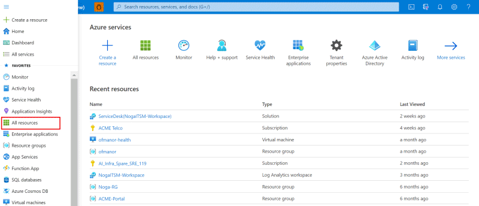
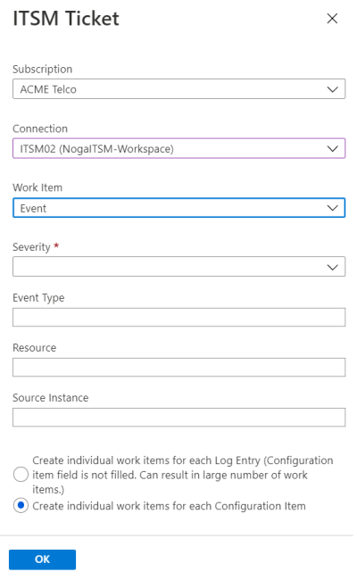

# Connect Azure to ITSM tools by using IT Service Management Connector

:::image type="icon" source="media/itsmc-overview/itsmc-symbol.png":::

This article provides information about how to configure the IT Service Management Connector (ITSMC) in Log Analytics to centrally manage your work items.

## Add IT Service Management Connector

Before you can create a connection, you need to add ITSMC.

1. In the Azure portal, select **Create a resource**:

   

2. Search for **IT Service Management Connector** in Azure Marketplace. Select **Create**:

   

3. In the **LA Workspace** section, select the Azure Log Analytics workspace where you want to install ITSMC.
   >[!NOTE]
   >
   > * ITSMC can be installed only in Log Analytics workspaces in the following regions: East US, West US 2, South Central US, West Central US, US Gov Arizona, US Gov Virginia, Canada Central, West Europe, South UK, Southeast Asia, Japan East, Central India, and Australia Southeast.

4. In the **Log Analytics workspace** section, select the resource group where you want to create the ITSMC resource:

   
   >[!NOTE]
   >As part of the ongoing transition from Microsoft Operations Management Suite (OMS) to Azure Monitor, OMS workspaces are now referred to as *Log Analytics workspaces*.

5. Select **OK**.

When the ITSMC resource is deployed, a notification appears at the upper-right corner of the window.

## Create an ITSM connection

After you've installed ITSMC, you can create a connection.

To create a connection, you'll need to prep your ITSM tool to allow the connection from ITSMC.  

Based on the ITSM product you're connecting to, select one of the following links for instructions:

- [ServiceNow](./itsmc-connections-servicenow.md)
- [System Center Service Manager](./itsmc-connections-scsm.md)
- [Cherwell](./itsmc-connections-cherwell.md)
- [Provance](./itsmc-connections-provance.md)

After you've prepped your ITSM tools, complete these steps to create a connection:

1. In **All resources**, look for **ServiceDesk(*your workspace name*)**:

   

1. Under **Workspace Data Sources** in the left pane, select **ITSM Connections**:

   
1. Select **Add Connection**.

1. Specify the connection settings as described according to ITSM products/services:

    - [ServiceNow](./itsmc-connections-servicenow.md)
    - [System Center Service Manager](./itsmc-connections-scsm.md)
    - [Cherwell](./itsmc-connections-cherwell.md)
    - [Provance](./itsmc-connections-provance.md)

   > [!NOTE]
   >
   > By default, ITSMC refreshes the connection's configuration data once every 24 hours. To refresh your connection's data instantly to reflect any edits or template updates that you make, select the **Sync** button on your connection's blade:
   >
   > 

## Use ITSMC

   You can use ITSMC to create alerts from Azure Monitor Alerts into the ITSM tool.

## Create ITSM work items from Azure alerts

After you create your ITSM connection, you can create work items in your ITSM tool based on Azure alerts. To create the work items, you'll use the ITSM action in action groups.

Action groups provide a modular and reusable way to trigger actions for your Azure alerts. You can use action groups with metric alerts, activity log alerts, and Azure Log Analytics alerts in the Azure portal.

> [!NOTE]
> After you create the ITSM connection, you need to wait for 30 minutes for the sync process to finish.

### Template definitions

   There are work item types that can use templates that are defined by the ITSM tool.
   By using templates, you can define fields that will be automatically populated according to fixed values that are defined as part of the action group. You define templates in the ITSM tool.
   You can define which template you would like to use as a part of the definition of the action group.

Use the following procedure to create action groups:

1. In the Azure portal, select  **Alerts**.
2. In the menu at the top of the screen, select **Manage actions**:

    

   The **Create action group** window appears.

3. Select the **Subscription** and **Resource group** where you want to create your action group. Provide an **Action group name** and **Display name** for your action group. Select **Next: Notifications**.

    

4. In the notification list, select **Next: Actions**.
5. In the actions list, select **ITSM** in the **Action Type** list. Provide a **Name** for the action. Select the pen button that represents **Edit details**.

    

6. In the **Subscription** list, select the subscription in which your Log Analytics workspace is located. In the **Connection** list, select your ITSM connector name. It will be followed by your workspace name. For example, MyITSMConnector(MyWorkspace).

7. Select a **Work Item** type.

8. If you want to fill out-of-the-box fields with fixed values, select **Use Custom Template**. Otherwise, choose an existing [template](#template-definitions) in the **Template** list and enter the fixed values in the template fields.

9. In the last section of the action ITSM group definition you can define how many work items will be created for each alert.

    >[!NOTE]
    >
    > * This section is relevant only for Log Search Alerts.
    > * For all other alert types one work item will be created per alert.

    * In a case you select in the "Work Item" dropdown "Incident" or "Alert":
    
        * If you check the **"Create individual work items for each Configuration Item"** check box, every configuration item in every alert will create a new work item. As a result of several alert for the same configuration items impacted, there are going to be more than one work item for each configuration item.

             For example:
             1) Alert 1 with 3 Configuration Items: A, B, C - will create 3 work items.
             2) Alert 2 with 1 Configuration Item: A - will create 1 work item.

        * If you clear the **"Create individual work items for each Configuration Item"** check box,
        ITSM connector will create a single work item for each alert rule and append to it all impacted configuration items. A new work item will be created if the previous one is closed.

        >[!NOTE]
        > In this case some of the fired alert will not generate new work items in the ITSM tool.

        For example:
         1) Alert 1 with 3 Configuration Items: A, B, C - will create 1 work item.
         2) Alert 2 for the same alert rule as in step a with 1 Configuration Item: D - D will be attached to the impacted configuration items list in the work item created in the step a.
         3) Alert 3 for a different alert rule with 1 Configuration Item: E - will create 1 work item.

    * In a case you select in the "Work Item" dropdown "Event":
    

        * If you select **"Create individual work items for each Log Entry (Configuration item field is not filled. Can result in large number of work items.)"** in the radio buttons selection, a work item will be created per each row in the search results of the log search alert query. In the payload of the work item the description property will have the row from the search results.
        * If you select **"Create individual work items for each Configuration Item"** in the radio buttons selection, every configuration item in every alert will create a new work item. There can be more than one work item per configuration item in the ITSM system. This will be the same as the checking the checkbox in Incident/Alert section.

10. Select **OK**.

When you create or edit an Azure alert rule, use an action group, which has an ITSM action. When the alert triggers, the work item is created or updated in the ITSM tool.

> [!NOTE]
>
>- For information about the pricing of the ITSM action, see the [pricing page](https://azure.microsoft.com/pricing/details/monitor/) for action groups.
>
>
>- The short description field in the alert rule definition is limited to 40 characters when you send it by using the ITSM action.

## Next steps

* [Troubleshooting problems in ITSM Connector](./itsmc-resync-servicenow.md)
