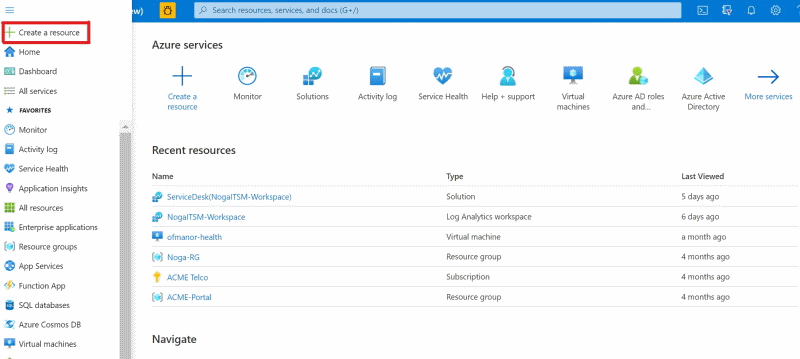
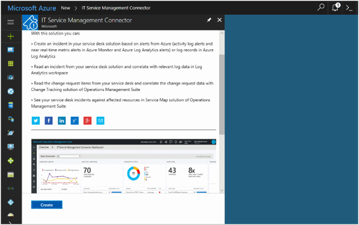
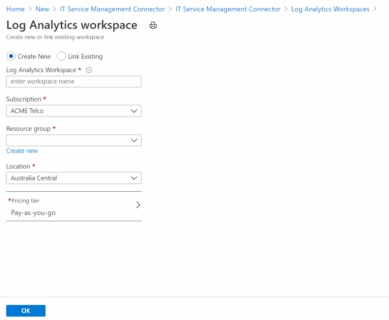
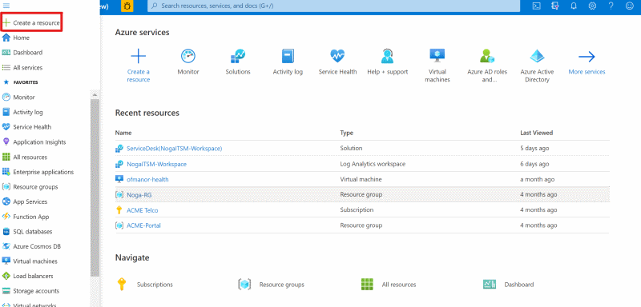
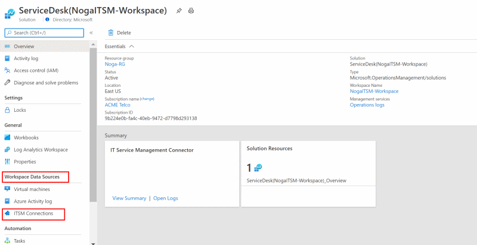
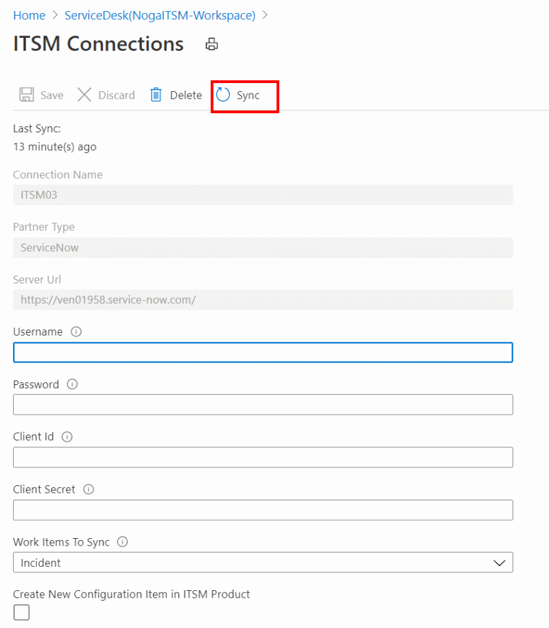
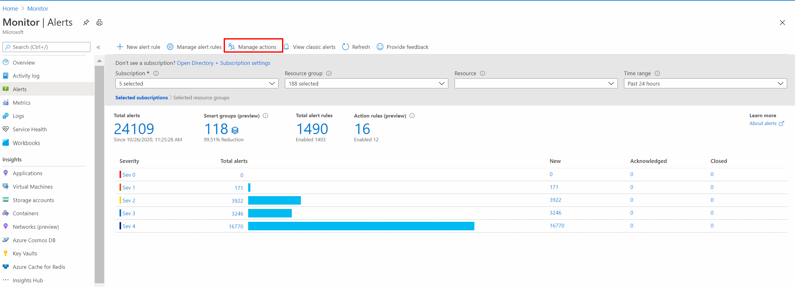
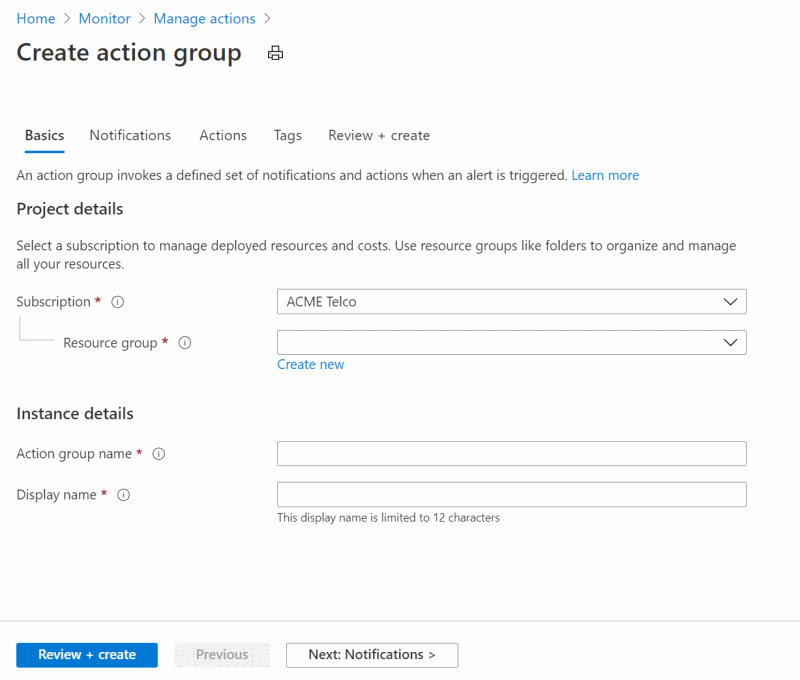
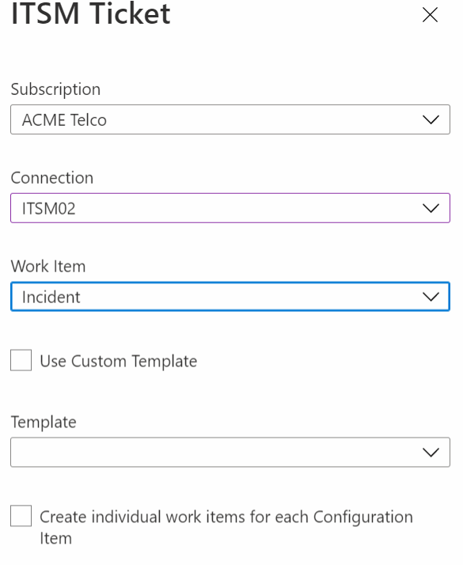

# Connect Azure to ITSM tools by using IT Service Management Connector

:::image type="icon" source="media/itsmc-overview/itsmc-symbol.png":::

IT Service Management Connector (ITSMC) allows you to connect Azure to a supported IT Service Management (ITSM) product or service.

Azure services like Azure Log Analytics and Azure Monitor provide tools to detect, analyze, and troubleshoot problems with your Azure and non-Azure resources. But the work items related to an issue typically reside in an ITSM product or service. ITSMC provides a bi-directional connection between Azure and ITSM tools to help you resolve issues faster.

ITSMC supports connections with the following ITSM tools:

-	ServiceNow
-	System Center Service Manager
-	Provance
-	Cherwell

   >[!NOTE]
> As of 1-Oct-2020 Cherwell and Provance ITSM integrations with Azure Alert will no longer will be enabled for new customers. New ITSM Connections will not be supported. Existing ITSM connections will be supported.

With ITSMC, you can:

-  Create work items in your ITSM tool, based on your Azure alerts (metric alerts, activity log alerts, and Log Analytics alerts).
-  Optionally, you can sync your incident and change request data from your ITSM tool to an Azure Log Analytics workspace.

For information about legal terms and the privacy policy, see [Microsoft Privacy Statement](https://go.microsoft.com/fwLink/?LinkID=522330&clcid=0x9).

You can start using ITSMC by completing the following steps:

1.	[Add ITSMC.](#add-it-service-management-connector)
2.	[Create an ITSM connection.](#create-an-itsm-connection)
3.	[Use the connection.](#use-itsmc)

##  Add IT Service Management Connector

Before you can create a connection, you need to add ITSMC.

1. In the Azure portal, select **Create a resource**:

   

2. Search for **IT Service Management Connector** in Azure Marketplace. Select **Create**:

   

3. In the **OMS Workspace** section, select the Azure Log Analytics workspace where you want to install ITSMC.
   >[!NOTE]
   > * As part of the ongoing transition from Microsoft Operations Management Suite (OMS) to Azure Monitor, OMS Workspaces are now referred to as *Log Analytics workspaces*.
   > * ITSMC can be installed only in Log Analytics workspaces in the following regions: East US, West US 2, South Central US, West Central US, US Gov Arizona, US Gov Virginia, Canada Central, West Europe, South UK, Southeast Asia, Japan East, Central India, and Australia Southeast.

4. In the **Log Analytics workspace** section, select the resource group where you want to create the ITSMC resource:

   
   >[!NOTE]
   >As part of the ongoing transition from Microsoft Operations Management Suite (OMS) to Azure Monitor, OMS workspaces are now referred to as *Log Analytics workspaces*.

5. Select **OK**.

When the ITSMC resource is deployed, a notification appears at the upper-right corner of the window.

## Create an ITSM connection

After you've installed ITSMC, you can create a connection.

To create a connection, you'll need to prep your ITSM tool to allow the connection from ITSMC.  

Based on the ITSM product you're connecting to, select one of the following links for instructions:

- [System Center Service Manager](./itsmc-connections.md#connect-system-center-service-manager-to-it-service-management-connector-in-azure)
- [ServiceNow](./itsmc-connections.md#connect-servicenow-to-it-service-management-connector-in-azure)
- [Provance](./itsmc-connections.md#connect-provance-to-it-service-management-connector-in-azure)  
- [Cherwell](./itsmc-connections.md#connect-cherwell-to-it-service-management-connector-in-azure)

After you've prepped your ITSM tools, complete these steps to create a connection:

1. In **All resources**, look for **ServiceDesk(*your workspace name*)**:

   

1. Under **Workspace Data Sources** in the left pane, select **ITSM Connections**:

   
   This page displays the list of connections.
1. Select **Add Connection**.

4. Specify the connection settings as described in [Configuring the ITSMC connection with your ITSM products/services](./itsmc-connections.md).

   > [!NOTE]
   >
   > By default, ITSMC refreshes the connection's configuration data once every 24 hours. To refresh your connection's data instantly to reflect any edits or template updates that you make, select the **Sync** button on your connection's blade:
   >
   > 

## Use ITSMC
   You can use ITSMC to create work items from Azure alerts, Log Analytics alerts, and Log Analytics log records.

## Template definitions
   There are work item types that can use templates that are defined by the ITSM tool.
   By using templates, you can define fields that will be automatically populated according to fixed values that are defined as part of the action group. You define templates in the ITSM tool. 
   You can define in which template you would like to use as a part of the definition of the action group.
      
## Create ITSM work items from Azure alerts

After you create your ITSM connection, you can create work items in your ITSM tool based on Azure alerts. To create the work items, you'll use the ITSM action in action groups.

Action groups provide a modular and reusable way to trigger actions for your Azure alerts. You can use action groups with metric alerts, activity log alerts, and Azure Log Analytics alerts in the Azure portal.

> [!NOTE]
> After you create the ITSM connection, you need to wait for 30 minutes for the sync process to finish.
> 

Use the following procedure to create work items:

1. In the Azure portal, select  **Alerts**.
2. In the menu at the top of the screen, select **Manage actions**:

    

   The **Create action group** window appears.

3. Select the **Subscription** and **Resource group** where you want to create your action group. Provide an **Action group name** and **Display name** for your action group. Select **Next: Notifications**.

    

4. In the notification list, select **Next: Actions**.
5. In the actions list, select **ITSM** in the **Action Type** list. Provide a **Name** for the action. Select the pen button that represents **Edit details**.
6. In the **Subscription** list, select the subscription in which your Log Analytics workspace is located. In the **Connection** list, select your ITSM connector name. It will be followed by your workspace name. For example, MyITSMConnector(MyWorkspace).

7. Select a **Work Item** type.

8. If you want to fill out-of-the-box fields with fixed values, select **Use Custom Template**. Otherwise, choose an existing [template](https://docs.microsoft.com/azure/azure-monitor/platform/itsmc-overview#template-definitions) in the **Template** list and enter the fixed values in the template fields.

9. If you select **Create individual work items for each Configuration Item**, every configuration item will have its own work item. There will be one work item per configuration item. It will be updated according to the alerts that will be created.

   * In a case you select in the work item dropdown "Incident" or "Alert": If you clear  the **Create individual work items for each Configuration Item** check box, every alert will create a new work item. There can be more than one alert per configuration item.

   
   
   * In a case you select in the work item dropdown "Event": If you select **Create individual work items for each Log Entry** in the radio buttons selection, every
   alert will create a new work item. If you select **Create individual work items for each Configuration Item** in the radio buttons selection, every configuration item will have its own work item. 

10. Select **OK**.

When you create or edit an Azure alert rule, use an action group, which has an ITSM action. When the alert triggers, the work item is created or updated in the ITSM tool.

> [!NOTE]
>
>- For information about the pricing of the ITSM action, see the [pricing page](https://azure.microsoft.com/pricing/details/monitor/) for action groups.
>
>
>- The short description field in the alert rule definition is limited to 40 characters when you send it by using the ITSM action.

## Visualize and analyze the incident and change request data

Depending on your configuration when you set up a connection, ITSMC can sync up to 120 days of incident and change request data. The log record schema for this data is provided in the [next section](#additional-information) of this article.

You can visualize the incident and change request data by using the ITSMC dashboard:

The dashboard also provides information about connector status, which you can use as a starting point to analyze problems with the connections.

You can also visualize the incidents synced against the affected computers in Service Map.

Service Map automatically discovers the application components on Windows and Linux systems and maps the communication between services. It allows you to view your servers as you think of them: as interconnected systems that deliver critical services. Service Map shows connections between servers, processes, and ports across any TCP-connected architecture. Other than the installation of an agent, no configuration is required. For more information, see [Using Service Map](../insights/service-map.md).

If you're using Service Map, you can view the service desk items created in ITSM solutions, as shown here:

## Additional information

### Data synced from your ITSM product
Incidents and change requests are synced from your ITSM product to your Log Analytics workspace, based on the connection's configuration.

This section shows some examples of data gathered by ITSMC.

The fields in **ServiceDesk_CL** vary depending on the work item type that you import into Log Analytics. Here's a list of fields for two work item types:

**Work item:** **Incidents**  
ServiceDeskWorkItemType_s="Incident"

**Fields**

- ServiceDeskConnectionName
- Service Desk ID
- State
- Urgency
- Impact
- Priority
- Escalation
- Created By
- Resolved By
- Closed By
- Source
- Assigned To
- Category
- Title
- Description
- Created Date
- Closed Date
- Resolved Date
- Last Modified Date
- Computer

**Work item:** **Change Requests**

ServiceDeskWorkItemType_s="ChangeRequest"

**Fields**
- ServiceDeskConnectionName
- Service Desk ID
- Created By
- Closed By
- Source
- Assigned To
- Title
- Type
- Category
- State
- Escalation
- Conflict Status
- Urgency
- Priority
- Risk
- Impact
- Assigned To
- Created Date
- Closed Date
- Last Modified Date
- Requested Date
- Planned Start Date
- Planned End Date
- Work Start Date
- Work End Date
- Description
- Computer

## Output data for a ServiceNow incident

| Log Analytics field | ServiceNow field |
|:--- |:--- |
| ServiceDeskId_s| Number |
| IncidentState_s | State |
| Urgency_s |Urgency |
| Impact_s |Impact|
| Priority_s | Priority |
| CreatedBy_s | Opened by |
| ResolvedBy_s | Resolved by|
| ClosedBy_s  | Closed by |
| Source_s| Contact type |
| AssignedTo_s | Assigned to  |
| Category_s | Category |
| Title_s|  Short description |
| Description_s|  Notes |
| CreatedDate_t|  Opened |
| ClosedDate_t| closed|
| ResolvedDate_t|Resolved|
| Computer  | Configuration item |

## Output data for a ServiceNow change request

| Log Analytics | ServiceNow field |
|:--- |:--- |
| ServiceDeskId_s| Number |
| CreatedBy_s | Requested by |
| ClosedBy_s | Closed by |
| AssignedTo_s | Assigned to  |
| Title_s|  Short description |
| Type_s|  Type |
| Category_s|  Category |
| CRState_s|  State|
| Urgency_s|  Urgency |
| Priority_s| Priority|
| Risk_s| Risk|
| Impact_s| Impact|
| RequestedDate_t  | Requested by date |
| ClosedDate_t | Closed date |
| PlannedStartDate_t  | 	Planned start date |
| PlannedEndDate_t  | 	Planned end date |
| WorkStartDate_t  | Actual start date |
| WorkEndDate_t | Actual end date|
| Description_s | Description |
| Computer  | Configuration Item |

## Troubleshoot ITSM connections
- If a connection fails from the connected source's UI and you get an **Error in saving connection** message, take the following steps:
   - For ServiceNow, Cherwell, and Provance connections:  
     - Ensure that you correctly entered  the user name, password, client ID, and client secret  for each of the connections.  
     - Ensure that you have sufficient privileges in the corresponding ITSM product to make the connection.  
   - For Service Manager connections:  
     - Ensure that the web app is successfully deployed and that the hybrid connection is created. To verify the connection is successfully established with the on-premises Service Manager computer, go to the web app URL as described in the documentation for making the [hybrid connection](./itsmc-connections.md#configure-the-hybrid-connection).  

- If data from ServiceNow isn't getting synced to Log Analytics, ensure that the ServiceNow instance isn't sleeping. ServiceNow dev instances sometimes go to sleep when they're idle for a long time. If that isn't what's happening, report the problem.
- If Log Analytics alerts fire but work items aren't created in the ITSM product, if configuration items aren't created/linked to work items, or for other information, see these resources:
   -  ITSMC: The solution shows a summary of connections, work items, computers, and more. Select the tile that has the **Connector Status** label. Doing so takes you to **Log Search** with the relevant query. Look at log records with a `LogType_S` of `ERROR` for more information.
   - **Log Search** page: View the errors and related information directly by using the query `*ServiceDeskLog_CL*`.

## Troubleshoot Service Manager web app deployment
-	If you have problems with web app deployment, ensure that you have permissions to create/deploy resources in the subscription.
-	If you get an **Object reference not set to instance of an object** error when you run the [script](itsmc-service-manager-script.md), ensure that you entered valid values in the **User Configuration** section.
-	If you fail to create the service bus relay namespace, ensure that the required resource provider is registered in the subscription. If it's not registered, manually create the service bus relay namespace from the Azure portal. You can also create it when you [create the hybrid connection](./itsmc-connections.md#configure-the-hybrid-connection) in the Azure portal.

## Contact us

If you have queries or feedback about the IT Service Management Connector, contact us at [omsitsmfeedback@microsoft.com](mailto:omsitsmfeedback@microsoft.com).

## Next steps
[Add ITSM products/services to IT Service Management Connector](./itsmc-connections.md)

