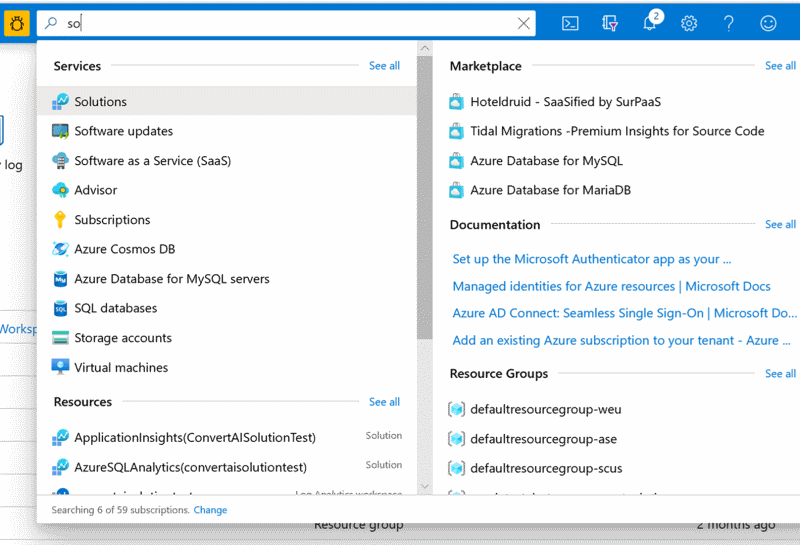
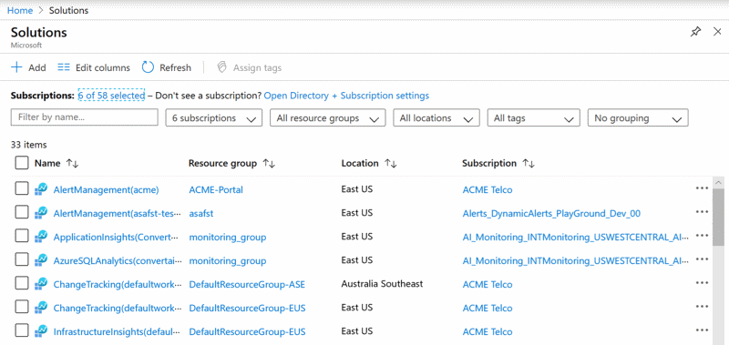
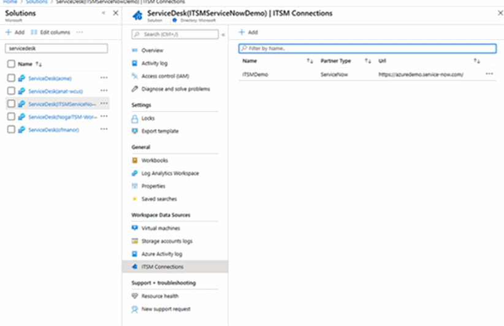
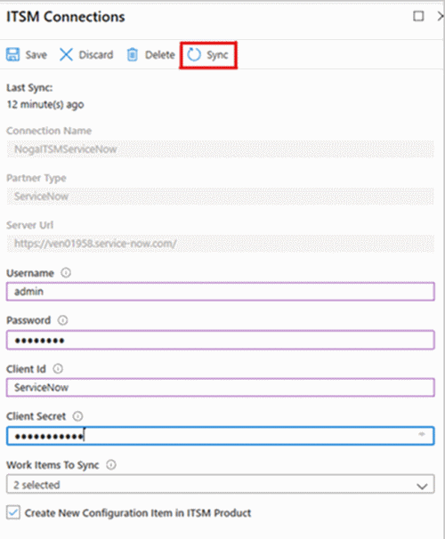

# How to manually fix ServiceNow sync problems

Azure Monitor can connect to third-party IT Service Management (ITSM) providers. ServiceNow is one of those providers.

For security reasons, you may need to refresh the authentication token used for your connection with ServiceNow.
Use the following synchronization process to reactivate the connection and refresh the token:

1. Search for the solution in the top search banner, then select the relevant solutions

    

1. In solution screen, choose "Select All" in the subscription filter and then filter by "ServiceDesk"

    

1. Select the solution of your ITSM connection.
1. Select ITSM connection in the left banner.

    

1. Select each connector from the list. 
    1. Click the Connector name in order to configure it
    1. Delete any connectors no longer in use

    1. Update the fields according to [these definitions](https://docs.microsoft.com/azure/azure-monitor/platform/itsmc-connections) based on your partner type

    1. Click on sync

       

    1. Click on save

        

f.    Review the notifications to see if the process finished with success 

## Next Steps

Learn more about [IT Service Management Connections](itsmc-connections.md)
