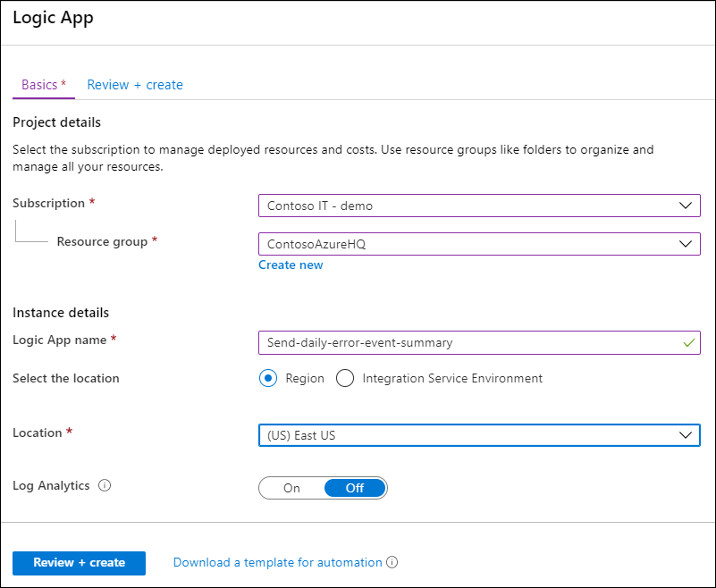
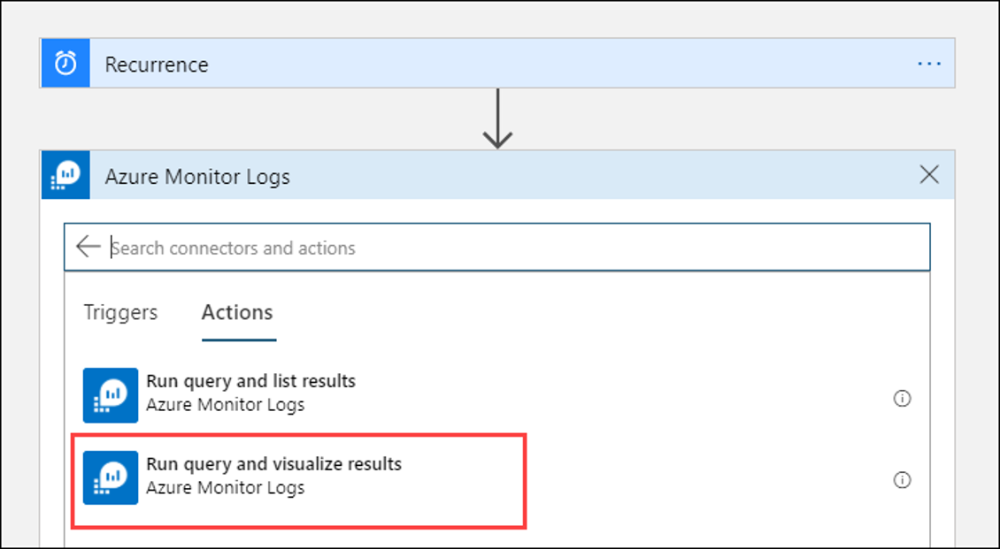
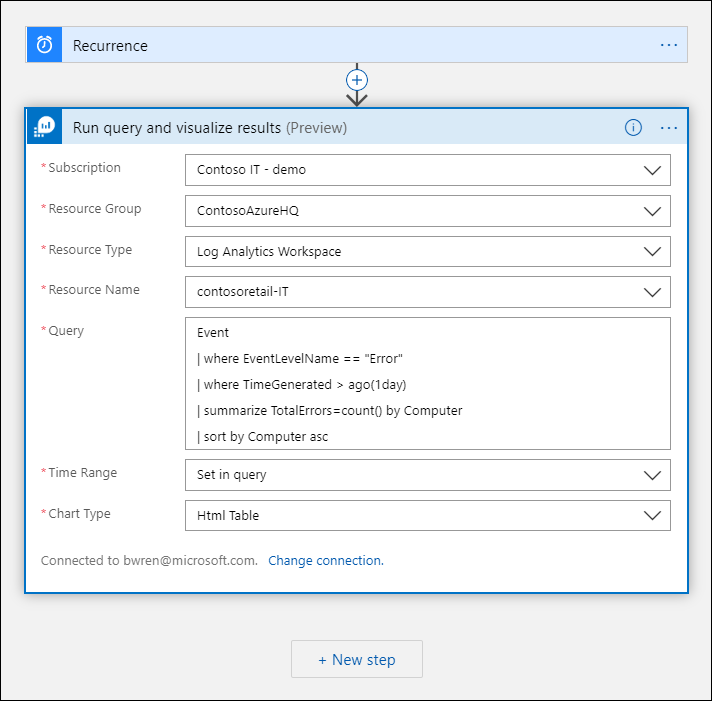
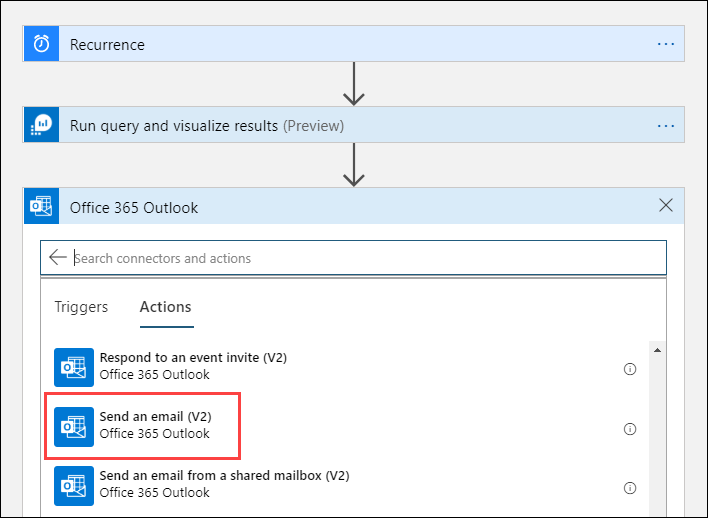
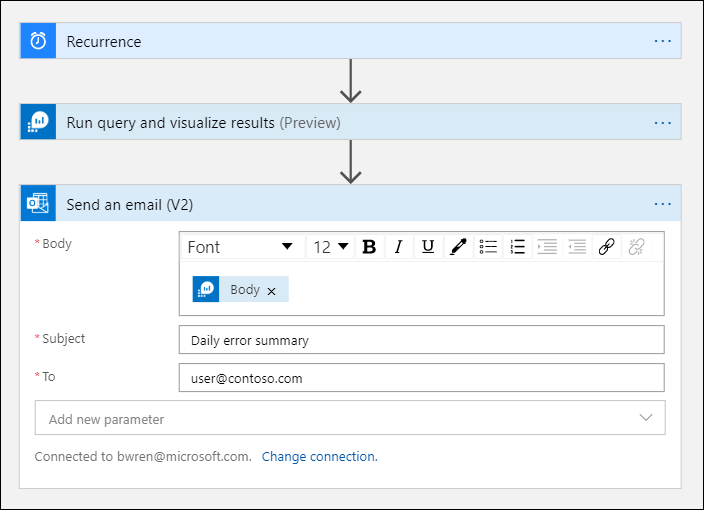

# Azure Monitor Logs connector for Logic Apps and Flow
[Azure Logic Apps](/azure/logic-apps/) and [Power Automate](https://ms.flow.microsoft.com) allow you to create automated workflows using hundreds of actions for a variety of services. The Azure Monitor Logs connector allows you to build workflows that retrieve data from a Log Analytics workspace or an Application Insights application in Azure Monitor. This article describes the actions included with the connector and provides a walkthrough to build a workflow using this data.

For example, you can create a logic app to use Azure Monitor log data in an email notification from Office 365, create a bug in Azure DevOps, or post a Slack message.  You can trigger a workflow by a simple schedule or from some action in a connected service such as when a mail or a tweet is received. 

## Connector limits
The Azure Monitor Logs connector has these limits:
* Max data size: 16 MB
* Max query response size 100 MB
* Max number of records: 500,000
* Max query timeout 110 second.

Depending on the size of your data and the query you use, the connector may hit its limits and fail. You can work around such cases when adjusting the trigger recurrence to run more frequently and query less data. You can use queries that aggregate your data to return less records and columns.

## Actions
The following table describes the actions included with the Azure Monitor Logs connector. Both allow you to run a log query against a Log Analytics workspace or Application Insights application. The difference is in the way the data is returned.

> [!NOTE]
> The Azure Monitor Logs connector replaces the [Azure Log Analytics connector](https://docs.microsoft.com/connectors/azureloganalytics/) and the [Azure Application Insights connector](https://docs.microsoft.com/connectors/applicationinsights/). This connector provides the same functionality as the others and is the preferred method for running a query against a Log Analytics workspace or an Application Insights application.


| Action | Description |
|:---|:---|
| [Run query and and list results](https://docs.microsoft.com/connectors/azuremonitorlogs/#run-query-and-list-results) | Returns each row as its own object. Use this action when you want to work with each row separately in the rest of the workflow. The action is typically followed by a [For each activity](../../logic-apps/logic-apps-control-flow-loops.md#foreach-loop). |
| [Run query and and visualize results](https://docs.microsoft.com/connectors/azuremonitorlogs/#run-query-and-visualize-results) | Returns all rows in the result set as a single formatted object. Use this action when you want to use the result set together in the rest of the workflow, such as sending the results in a mail.  |

## Walkthroughs
The following tutorials illustrate the use of the Azure Monitor connectors in Azure Logic Apps. You can perform these same example with Power Automate, the only difference being how to you create the initial workflow and run it when complete. Configuration of the workflow and actions is the same between both. See [Create a flow from a template in Power Automate](https://docs.microsoft.com/power-automate/get-started-logic-template) to get started.


### Create a Logic App

Go to **Logic Apps** in the Azure portal and click **Add**. Select a **Subscription**, **Resource group**, and **Region** to store the new logic app and then give it a unique name. You can turn on **Log Analytics** setting to collect information about runtime data and events as described in [Set up Azure Monitor logs and collect diagnostics data for Azure Logic Apps](../../logic-apps/monitor-logic-apps-log-analytics.md). This setting isn't required for using the Azure Monitor Logs connector.




Click **Review + create** and then **Create**. When the deployment is complete, click **Go to resource** to open the **Logic Apps Designer**.

### Create a trigger for the logic app
Under **Start with a common trigger**, select **Recurrence**. This creates a logic app that automatically runs at a regular interval. In the **Frequency** box of the action, select **Day** and in the **Interval** box, enter **1** to run the workflow once per day.


## Walkthrough: Mail visualized results
The following tutorial shows you how to create a logic app that sends the results of an Azure Monitor log query by email. 

### Add Azure Monitor Logs action
Click **+ New step** to add an action that runs after the recurrence action. Under **Choose an action**, type **azure monitor** and then select **Azure Monitor Logs**.


Click **Azure Log Analytics – Run query and visualize results**.




### Add Azure Monitor Logs action

Select the **Subscription** and **Resource Group** for your Log Analytics workspace. Select *Log Analytics Workspace* for the **Resource Type** and then select the workspace's name under **Resource Name**.

Add the following log query to the **Query** window.  

```Kusto
Event
| where EventLevelName == "Error" 
| where TimeGenerated > ago(1day)
| summarize TotalErrors=count() by Computer
| sort by Computer asc   
```

Select *Set in query* for the **Time Range** and **HTML Table** for the **Chart Type**.
   


The mail will be sent by the account associated with the current connection. You can specify another account by clicking on **Change connection**.

### Add email action

Click **+ New step**, and then click **+ Add an action**. Under **Choose an action**, type **outlook** and then select **Office 365 Outlook**.


Select **Send an email (V2)**.



Click anywhere in the **Body** box to open a **Dynamic content** window opens with values from the previous actions in the logic app. Select **See more** and then **Body** which is the results of the query in the Log Analytics action.


Specify the email address of a recipient in the **To** window and a subject for the email in **Subject**. 




### Save and test your logic app
Click **Save** and then **Run** to perform a test run of the logic app.


When the logic app completes, check the mail of the recipient that you specified.  You should have received a mail with a body similar to the following:


## Next steps

- Learn more about [log queries in Azure Monitor](../log-query/log-query-overview.md).
- Learn more about [Logic Apps](/azure/logic-apps/)
- Learn more about [Microsoft Flow](https://ms.flow.microsoft.com).

