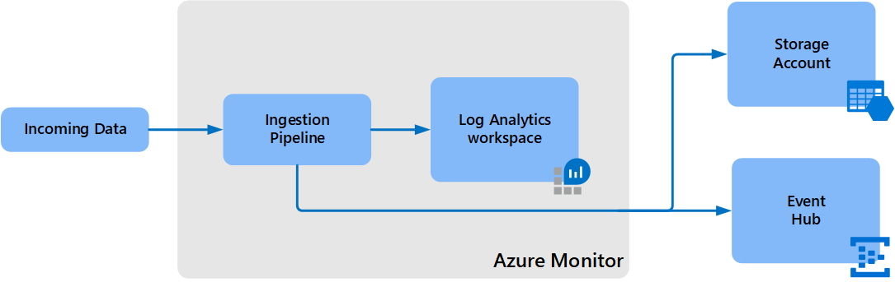
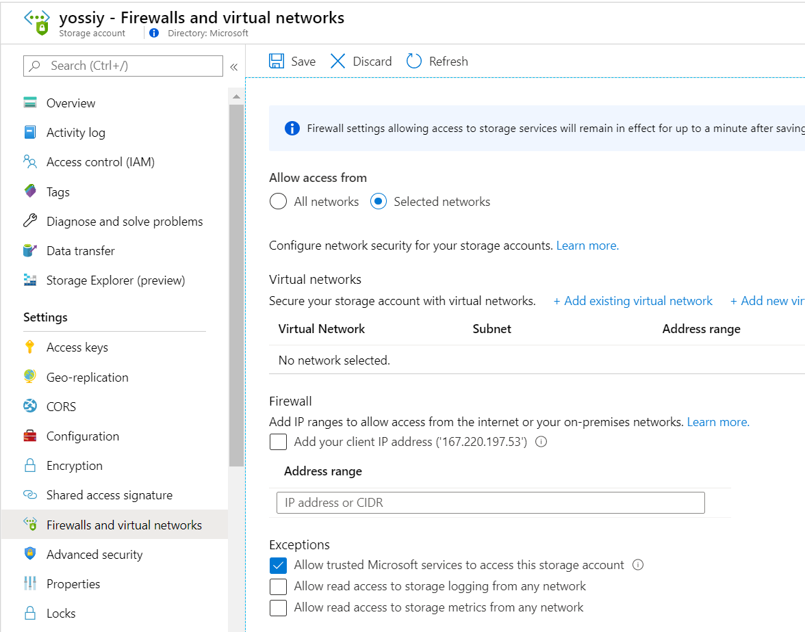

# Log Analytics workspace data export in Azure Monitor (preview)
Log Analytics workspace data export in Azure Monitor allows you to continuously export data from selected tables in your Log Analytics workspace to an Azure storage account or Azure Event Hubs as it's collected. This article provides details on this feature and steps to configure data export in your workspaces.

## Overview
Once data export is configured for your Log Analytics workspace, any new data sent to the selected tables in the workspace is automatically exported to your storage account hourly or to your event hub in near-real-time.



All data from included tables is exported without a filter. For example, when you configure a data export rule for *SecurityEvent* table, all data sent to the *SecurityEvent* table is exported starting from the configuration time.


## Other export options
Log Analytics workspace data export continuously exports data from a Log Analytics workspace. Other options to export data for particular scenarios include the following:

- Scheduled export from a log query using a Logic App. This is similar to the data export feature but allows you to send filtered or aggregated data to Azure storage. This method though is subject to [log query limits](../service-limits.md#log-analytics-workspaces)  See [Archive data from Log Analytics workspace to Azure storage using Logic App](logs-export-logic-app.md).
- One time export using a Logic App. See [Azure Monitor Logs connector for Logic Apps and Power Automate](logicapp-flow-connector.md).
- One time export to local machine using PowerShell script. See [Invoke-AzOperationalInsightsQueryExport](https://www.powershellgallery.com/packages/Invoke-AzOperationalInsightsQueryExport).


## Current limitations

- Configuration can currently only be performed using CLI or REST requests. You cannot use the Azure portal or PowerShell.
- Supported tables are currently limited those specific in the (#supported-tabes) section below. If the data export rule includes an unsupported table, the operation will succeed, but no data will be exported for that table. If the data export rule includes a table that doesn't exist, it will fail with the error *Table <tableName> does not exist in the workspace.*
- Your Log Analytics workspace can be in any region except for the following:
  - Switzerland North
  - Switzerland West
  - Azure government regions
- The destination storage account or event hub must be in the same region as the Log Analytics workspace.
- Names of tables to be exported can be no longer than 60 characters for a storage account and no more than 47 characters to an event hub. Tables with longer names will not be exported.

> [!NOTE]
> Log Analytics data export writes data as append blob which is currently in preview for Azure Data Lake Storage Gen2. You must open a support request before configuring export to this storage. Use the following details for this request.
> - Issue type: Technical
> - Subscription: Your subscription
> - Service: Data Lake Storage Gen2
> - Resource: Your resource name
> - Summary: Requesting subscription registration to accept data from Log Analytics Data Export.
> - Problem type: Connectivity
> - Problem subtype: Connectivity issue

## Data completeness
Data export will continue to retry sending data for up to 30 minutes in the event that the destination is unavailable. If it's still unavailable after 30 minutes then data will be discarded until the destination becomes available.

## Cost
There are currently no additional charges for the data export feature. Pricing for data export will be announced in the future and a notice provided prior to start of billing. If you choose to continue using data export after the notice period, you will be billed at the applicable rate.

## Export destinations

### Storage account
Data is sent to storage accounts every hour. The data export configuration creates a container for each table in the storage account with the name *am-* followed by the name of the table. For example, the table *SecurityEvent* would sent to a container named *am-SecurityEvent*.

The storage account blob path is *WorkspaceResourceId=/subscriptions/subscription-id/resourcegroups/\<resource-group\>/providers/microsoft.operationalinsights/workspaces/\<workspace\>/y=\<four-digit numeric year\>/m=\<two-digit numeric month\>/d=\<two-digit numeric day\>/h=\<two-digit 24-hour clock hour\>/m=00/PT1H.json*. Since append blobs are limited to 50K writes in storage, the number of exported blobs may extend if the number of appends is high. The naming pattern for blobs in such a case would be PT1H_#.json, where # is the incremental blob count.

The storage account data format is [JSON lines](diagnostic-logs-append-blobs.md). This means each record is delimited by a newline, with no outer records array and no commas between JSON records. 

[](media/logs-data-export/storage-data.png#lightbox)

Log Analytics data export can write append blobs to immutable storage accounts when time-based retention policies have the *allowProtectedAppendWrites* setting enabled. This allows writing new blocks to an append blob, while maintaining immutability protection and compliance. See [Allow protected append blobs writes](../../storage/blobs/storage-blob-immutable-storage.md#allow-protected-append-blobs-writes).

### Event hub
Data is sent to your event hub in near-real-time as it reaches Azure Monitor. An event hub is created for each data type that you export with the name *am-* followed by the name of the table. For example, the table *SecurityEvent* would sent to an event hub named *am-SecurityEvent*. If you want the exported data to reach a specific event hub, or if you have a table with a name that exceeds the 47 character limit, you can provide your own event hub name and export all tables to it.

The volume of exported data often increase over time, and the event hub scale needs to be increased to handle larger transfer rates and avoid throttling scenarios and data latency. You should use the auto-inflate feature of Event Hubs to automatically scale up and increase the number of throughput units and meet usage needs. See [Automatically scale up Azure Event Hubs throughput units](../../event-hubs/event-hubs-auto-inflate.md) for details.


## Prerequisites
Following are prerequisites that must be completed before configuring Log Analytics data export.

- The storage account and event hub must already be created and must be in the same region as the Log Analytics workspace. If you need to replicate your data to other storage accounts, you can use any of the [Azure Storage redundancy options](../../storage/common/storage-redundancy.md).  
- The storage account must be StorageV1 or StorageV2. Classic storage is not supported  
- If you have configured your storage account to allow access from selected networks, you need to add an exception in your storage account settings to allow Azure Monitor to write to your storage.

## Enable data export
The follow steps must be performed to enable Log Analytics data export. See the following sections for more details on each.

- Register resource provider.
- Allow trusted Microsoft services.
- Create one or more data export rules that define the tables to export and their destination.

### Register resource provider
The following Azure resource provider needs to registered for your subscription to enable Log Analytics data export. 

- Microsoft.Insights

This resource provider will probably already be registered for most Azure Monitor users. To verify, go to **Subscriptions** in the Azure portal. Select your subscription and then click **Resource providers** in the **Settings** section of the menu. Locate **Microsoft.Insights**. If its status is **Registered**, then it's already registered. If not, click **Register** to register it.

You can also use any of the available methods to register a resource provider as described in [Azure resource providers and types](../../azure-resource-manager/management/resource-providers-and-types.md). Following is a sample command using PowerShell:

```PowerShell
Register-AzResourceProvider -ProviderNamespace Microsoft.insights
```

### Allow trusted Microsoft services
If you have configured your Storage Account to allow access from selected networks, you need to add an exception to allow Azure Monitor to write to the account. From **Firewalls and virtual networks** for your storage account, select **Allow trusted Microsoft services to access this storage account**.

[](media/logs-data-export/storage-account-vnet.png#lightbox)


### Create or update data export rule
A data export rule defines data to be exported from all tables or a certain set of tables to a single destination. Create multiple rules if you need to send to multiple destinations.

Use the following command to create a data export rule to a storage account using CLI.

```azurecli
az monitor log-analytics workspace data-export create --resource-group resourceGroupName --workspace-name workspaceName --name ruleName --tables SecurityEvent Heartbeat --destination $storageAccountId
```

Use the following command to create a data export rule to an event hub using CLI.

```azurecli
az monitor log-analytics workspace data-export create --resource-group resourceGroupName --workspace-name workspaceName --name ruleName --tables SecurityEvent Heartbeat --destination $eventHubsNamespacesId
```

Use the following request to create a data export rule using the REST API. The request should use bearer token authorization and content type application/json.

```rest
PUT https://management.azure.com/subscriptions/<subscription-id>/resourcegroups/<resource-group-name>/providers/Microsoft.operationalInsights/workspaces/<workspace-name>/dataexports/<data-export-name>?api-version=2020-08-01
```

The body of the request specifies the tables destination. Following is a sample body for the REST request for a storage account.

```json
{
    "properties": {
        "destination": {
            "resourceId": "/subscriptions/subscription-id/resourcegroups/resource-group-name/providers/Microsoft.Storage/storageAccounts/storage-account-name"
        },
        "tablenames": [
"table1",
	"table2" 
        ],
        "enable": true
    }
}
```

Following is a sample body for the REST request for an event hub.

```json
{
    "properties": {
        "destination": {
            "resourceId": "/subscriptions/subscription-id/resourcegroups/resource-group-name/providers/Microsoft.EventHub/namespaces/eventhub-namespaces-name"
        },
        "tablenames": [
            "table1",
            "table2"
        ],
        "enable": true
    }
}

```


## View data export configuration
Use the following command to view the configuration of a data export rule using CLI.

```azurecli
az monitor log-analytics workspace data-export show --resource-group resourceGroupName --workspace-name workspaceName --name ruleName
```

Use the following request to view the configuration of a data export rule using the REST API. The request should use bearer token authorization.

```rest
GET https://management.azure.com/subscriptions/<subscription-id>/resourcegroups/<resource-group-name>/providers/Microsoft.operationalInsights/workspaces/<workspace-name>/dataexports/<data-export-name>?api-version=2020-08-01
```

## Disable an export rule
Export rules can be disabled to let you stop the export when you don’t need to retain data for a certain period such as when testing is being performed. Use the following command to disable a data export rule using CLI.

```azurecli
az monitor log-analytics workspace data-export update --resource-group resourceGroupName --workspace-name workspaceName --name ruleName --enable false
```

Use the following request to disable a data export rule using the REST API. The request should use bearer token authorization.

```rest
PUT https://management.azure.com/subscriptions/<subscription-id>/resourcegroups/<resource-group-name>/providers/Microsoft.operationalInsights/workspaces/<workspace-name>/dataexports/<data-export-name>?api-version=2020-08-01
Authorization: Bearer <token>
Content-type: application/json

{
    "properties": {
        "destination": {
            "resourceId": "/subscriptions/subscription-id/resourcegroups/resource-group-name/providers/Microsoft.Storage/storageAccounts/storage-account-name"
        },
        "tablenames": [
"table1",
	"table2" 
        ],
        "enable": false
    }
}
```

## Delete an export rule
Use the following command to delete a data export rule using CLI.

```azurecli
az monitor log-analytics workspace data-export delete --resource-group resourceGroupName --workspace-name workspaceName --name ruleName
```

Use the following request to delete a data export rule using the REST API. The request should use bearer token authorization.

```rest
DELETE https://management.azure.com/subscriptions/<subscription-id>/resourcegroups/<resource-group-name>/providers/Microsoft.operationalInsights/workspaces/<workspace-name>/dataexports/<data-export-name>?api-version=2020-08-01
```

## View all data export rules in a workspace
Use the following command to view all data export rules in a workspace using CLI.

```azurecli
az monitor log-analytics workspace data-export list --resource-group resourceGroupName --workspace-name workspaceName
```

Use the following request to view all data export rules in a workspace using the REST API. The request should use bearer token authorization.

```rest
GET https://management.azure.com/subscriptions/<subscription-id>/resourcegroups/<resource-group-name>/providers/Microsoft.operationalInsights/workspaces/<workspace-name>/dataexports?api-version=2020-08-01
```

## Unsupported tables
If the data export rule includes an unsupported table, the configuration will succeed, but no data will be exported for that table. If the table is later supported, then its data will be exported at that time.

If the data export rule includes a table that doesn't exist, it will fail with the error *Table <tableName> does not exist in the workspace*.


## Supported tables
Supported tables are currently limited to those specified below. All data from the table will be exported unless limitations are specified. This list will be updated as support for additional tables is added.


| Table | Limitations |
|:---|:---|:---|
| AADDomainServicesAccountLogon | |
| AADDomainServicesAccountManagement | |
| AADDomainServicesDirectoryServiceAccess | |
| AADDomainServicesLogonLogoff | |
| AADDomainServicesPolicyChange | |
| AADDomainServicesPrivilegeUse | |
| ADAssessmentRecommendation | |
| ADFActivityRun | |
| ADFPipelineRun | |
| ADFTriggerRun | |
| ADReplicationResult | |
| ADSecurityAssessmentRecommendation | |
| ADTDigitalTwinsOperation | |
| ADTEventRoutesOperation | |
| ADTModelsOperation | |
| ADTQueryOperation | |
| ADXCommand | |
| ADXQuery | |
| AegDeliveryFailureLogs | |
| AegPublishFailureLogs | |
| Alert | Some of the data to this table is ingested through storage account. This portion is missing in export currently. |
| ApiManagementGatewayLogs | |
| AppCenterError | |
| AppPlatformSystemLogs | |
| AppServiceAppLogs | |
| AppServiceAuditLogs | |
| AppServiceConsoleLogs | |
| AppServiceFileAuditLogs | |
| AppServiceHTTPLogs | |
| AppServicePlatformLogs | |
| AuditLogs | |
| AutoscaleEvaluationsLog | |
| AutoscaleScaleActionsLog | |
| AWSCloudTrail | |
| AzureAssessmentRecommendation | |
| AzureDevOpsAuditing | |
| BehaviorAnalytics | |
| BlockchainApplicationLog | |
| BlockchainProxyLog | |
| BlockchainProxyLog | |
| CommonSecurityLog | |
| CommonSecurityLog | |
| ComputerGroup | |
| ConfigurationData | Some of the data is ingested through internal services that isn't supported for export. This portion is missing in export currently. |
| ContainerImageInventory | |
| ContainerInventory | |
| ContainerLog | |
| ContainerLog | |
| ContainerNodeInventory | |
| ContainerServiceLog | |
| CoreAzureBackup | |
| DatabricksAccounts | |
| DatabricksClusters | |
| DatabricksDBFS | |
| DatabricksInstancePools | |
| DatabricksJobs | |
| DatabricksNotebook | |
| DatabricksSecrets | |
| DatabricksSQLPermissions | |
| DatabricksSSH | |
| DatabricksWorkspace | |
| DnsEvents | |
| DnsInventory | |
| Dynamics365Activity | |
| Event | Some of the data to this table is ingested through storage account. This portion is missing in export currently. |
| ExchangeAssessmentRecommendation | |
| ExchangeAssessmentRecommendation | |
| FailedIngestion | |
| FunctionAppLogs | |
| Heartbeat | Supported | |
| HuntingBookmark | |
| InsightsMetrics | Some of the data is ingested through internal services that isn't supported for export. This portion is missing in export currently. |
| IntuneAuditLogs | |
| IntuneOperationalLogs | |
| KubeEvents | |
| KubeHealth | |
| KubeMonAgentEvents | |
| KubeNodeInventory | |
| KubePodInventory | |
| KubeServices | |
| KubeServices | |
| McasShadowItReporting | |
| MicrosoftAzureBastionAuditLogs | |
| MicrosoftDataShareReceivedSnapshotLog | |
| MicrosoftDataShareSentSnapshotLog | |
| MicrosoftDataShareShareLog | |
| MicrosoftHealthcareApisAuditLogs | |
| NWConnectionMonitorPathResult | |
| NWConnectionMonitorTestResult | |
| OfficeActivity | Some of the data to ingested via webhooks from O365 into LA. This portion is missing in export currently. |
| Operation | Some of the data is ingested through internal services that isn't supported for export. This portion is missing in export currently. |
| Perf | Supported | |
| SCCMAssessmentRecommendation | | 
| SCOMAssessmentRecommendation | |
| SecurityAlert | |
| SecurityBaseline | |
| SecurityBaselineSummary | |
| SecurityDetection | |
| SecurityEvent | Supported | |
| SecurityIncident | |
| SecurityIoTRawEvent | |
| SecurityNestedRecommendation | |
| SecurityRecommendation | |
| SfBAssessmentRecommendation | |
| SfBOnlineAssessmentRecommendation | |
| SharePointOnlineAssessmentRecommendation | |
| SignalRServiceDiagnosticLogs | |
| SigninLogs | |
| SPAssessmentRecommendation | |
| SQLAssessmentRecommendation | |
| SucceededIngestion | |
| Syslog |Partial | Some of the data to this table is ingested through storage account. This portion is missing in export currently. |
| ThreatIntelligenceIndicator | |
| Update |Partial | Some of the data is ingested through internal services that isn't supported for export. This portion is missing in export currently. |
| UpdateRunProgress | |
| UpdateSummary | |
| Usage | |
| UserAccessAnalytics | |
| UserPeerAnalytics | |
| WindowsEvent | |
| WindowsFirewall | |
| WireData |Partial | Some of the data is ingested through internal services that isn't supported for export. This portion is missing in export currently. |
| WorkloadMonitoringPerf | |
| WorkloadMonitoringPerf | |
| WVDCheckpoints | |
| WVDConnections | |
| WVDErrors | |
| WVDFeeds | |
| WVDManagement | |

## Next steps

- [Query the exported data from Azure Data Explorer](azure-data-explorer-query-storage.md).
