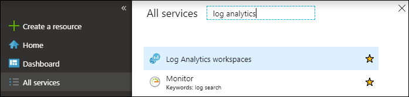
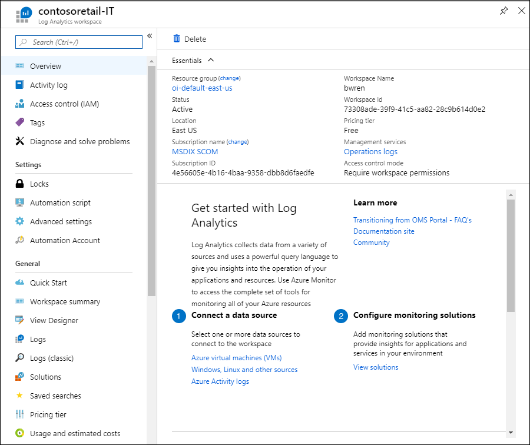

# Manage log data and workspaces in Azure Monitor
Azure Monitor stores log data in a Log Analytics workspace, which is essentially a container that includes data and configuration information. To manage access to log data, you perform various administrative tasks related to workspaces. You or other members of your organization might use multiple workspaces to manage different sets of data that is collected from all or portions of your IT infrastructure.

This article explains how to manage access to logs and to administer the workspaces that contain them. 

## Create a workspace
To create a Log Analytics workspace, you need to:

1. Have an Azure subscription.
2. Choose a workspace name.
3. Associate the workspace with one of your subscriptions and resource groups.
4. Choose a geographical location.

Refer to the following articles for details on creating a workspace:

- [Create a Log Analytics workspace in the Azure portal](../learn/quick-create-workspace.md)
- [Create a Log Analytics workspace with Azure CLI 2.0](../learn/quick-create-workspace-cli.md)
- [Create a Log Analytics workspace with Azure PowerShell](../learn/quick-create-workspace-posh.md)

## Determine the number of workspaces you need
A Log Analytics workspace is an Azure resource and is a container where data is collected, aggregated, analyzed, and presented in Azure Monitor. You can have multiple workspaces per Azure subscription, and you can have access to more than one workspace, with the ability to easily query across them. This section describes when it can be helpful to create more than one workspace.

A Log Analytics workspace provides:

* A geographic location for data storage.
* Data isolation to define different user access rights in workspace-centric mode. Not relevant when working in resource-centric mode.
* Scope for configuration of settings like [pricing tier](https://docs.microsoft.com/azure/azure-monitor/platform/manage-cost-storage#changing-pricing-tier), [retention](https://docs.microsoft.com/azure/azure-monitor/platform/manage-cost-storage#change-the-data-retention-period) and [data capping](https://docs.microsoft.com/azure/azure-monitor/platform/manage-cost-storage#daily-cap).
* Charges related to data ingestion and retention are made on the workspace resource.

From consumption point of view, we recommend you create as few workspaces as possible. It makes administration and query experience easier and quicker. But, based on the preceding characteristics, you may want to create multiple workspaces if:

* You are a global company and you need log data stored in specific regions for data sovereignty or compliance reasons.
* You are using Azure and you want to avoid outbound data transfer charges by having a workspace in the same region as the Azure resources it manages.
* You are a managed service provider and need to keep the Log Analytics data for each customer you manage isolated from other customer’s data.
* You manage multiple customers and you want each customer / department / business group to see their own data, but not data from others, and there is no business need for a consolidated cross customer / department / business group view.”.

When using Windows agents to collect data, you can [configure each agent to report to one or more workspaces](../../azure-monitor/platform/agent-windows.md).

If you are using System Center Operations Manager, each Operations Manager management group can be connected with only one workspace. You can install the Microsoft Monitoring Agent on computers managed by Operations Manager and have the agent report to both Operations Manager and a different Log Analytics workspace.

Once the workspace architecture is defined, you should enforce this policy on Azure resources with [Azure Policy](../../governance/policy/overview.md). This can provide a built-in definition that would automatically apply to all Azure resources. For example, you could set a policy to ensure that all your Azure resources in a particular region sent all their diagnostic logs to a particular workspace.

## View workspace details
While you analyze data in your Log Analytics workspace from the **Azure Monitor** menu in the Azure portal, you create and manage workspaces in the **Log Analytics workspaces** menu.
 

1. Sign in to the [Azure portal](https://portal.azure.com) and click **All services**. In the list of resources, type **Log Analytics**. As you begin typing, the list filters based on your input. Select **Log Analytics**  workspaces.  

      

3. Select your workspace from the list.

4. The workspace page displays details about the workspace, getting started, configuration, and links for additional information.  

      


## Workspace permissions and scope
The data that a user has access to are determined by multiple factors that are listed in the following table. Each is described in the sections below.

| Factor | Description |
|:---|:---|
| [Access mode](#access-modes) | Method that the user uses to accesses the workspace.  Defines the scope of the data available and the access control mode that's applied. |
| [Access control mode](#access-control-mode) | Setting on the workspace that defines whether permissions are applied at the workspace or resource level. |
| [Permissions](#manage-accounts-and-users) | Permissions applied to individual or groups of users for the workspace or resource. Defines what data the user will have access to. |
| [Table level RBAC](#table-level-rbac) | Optional granular permissions that applies to all users regardless of their access mode or access control mode. Defines which data types a user can access. |


## Access modes
The _access mode_ refers to how a user accesses a Log Analytics workspace and defines the scope of data they can access. 

**Workspace-centric**: In this mode, a user can view all logs in the workspace that they have permissions to. Queries in this mode are scoped to all data in all tables in the workspace. This is the access mode used when logs are accessed with the workspace as the scope, such as when you select **Logs** from the **Azure Monitor** menu in the Azure portal.

**Resource-centric**: When you access the workspace for a particular resource, such as when you select **Logs** from a resource menu in the Azure portal, you can view logs for only that resource in all tables that you have access to. Queries in this mode are scoped to only data associated with that resource. This mode also enables granular role-based access control (RBAC). 

> [!NOTE]
> Logs are available for resource-centric queries only if they were properly associated with the relevant resource. Currently, the following resources have limitations: 
> - Computers outside of Azure
> - Service Fabric
> - Application Insights
> - Containers
>
> You can test if logs are properly associated with their resource by running a query and inspecting the records you're interested in. If the correct resource ID is in the [_ResourceId](log-standard-properties.md#_resourceid) property, then data is available to resource-centric queries.

### Comparing access modes

The following table summarizes the access modes:

| | Workspace-centric | Resource-centric |
|:---|:---|:---|
| Who is each model intended for? | Central administration. Administrators who need to configure data collection and users who need access to a wide variety of resources. Also currently required for users who have to access logs for resources outside of Azure. | Application teams. Administrators of Azure resources being monitored. |
| What does a user require to view logs? | Permissions to the workspace. See **Workspace permissions** in [Manage accounts and users](#manage-accounts-and-users). | Read access to the resource. See **Resource permissions** in [Manage accounts and users](#manage-accounts-and-users). Permissions can be inherited (such as from the containing resource group) or directly assigned to the resource. Permission to the logs for the resource will be automatically assigned. |
| What is the scope of permissions? | Workspace. Users with access to the workspace can query all logs in that workspace from tables that they have permissions to. See [Table access control](#table-level-rbac) | Azure resource. User can query logs for resources they have access to from any workspace but can't query logs for other resources. |
| How can user access logs? | Start **Logs** from **Azure Monitor** menu or **Log Analytics workspaces**. | Start **Logs** from the menu for the Azure resource. |


## Access control mode
The _Access control mode_ is a setting on each workspaces that defines how permissions are determined for that workspace.

**Require workspace permissions**:  This control mode does not allow granular RBAC. For a user to access the workspace, they must be granted permissions to the workspace or to specific tables. 

If a user accesses the workspace in workspace-centric mode, they will have access to all data any tables that they've been granted access to. If a user accesses the workspace in resource-centric mode, they will have access to only data for that resource in any tables that they've been granted access to.

This is the default setting for all workspaces created before March 2019.

**Use resource or workspace permissions**: This control mode allows granular RBAC. Users are be granted access to only data associated with resources they can view through Azure permissions, resources for which they have `read` permission. 

When a user accesses the workspace in workspace-centric mode, workspace permissions will apply. When a user accesses the workspace in resource-centric mode, only resource permissions will be verified, and workspace permissions will be ignored. Enable RBAC for a user by removing them from workspace permissions and allowing their resource permissions to be recognized.

This is the default setting for all workspaces created after March 2019.

> [!NOTE]
> If a user has only resource permissions to the workspace, they will only be able to access the workspace using [Resource-centric mode](#access-modes).


### Define access control mode in Azure portal
You can view the current workspace access control mode on the **Overview** page for the workspace in the **Log Analytics workspace** menu.


You can change this setting on the **Properties** page for the workspace. Changing the setting will be disabled if you don't have permissions to configure the workspace.


### Define access control mode in PowerShell

Use the following command to examine the access control mode for all workspaces in the subscription:

```powershell
Get-AzResource -ResourceType Microsoft.OperationalInsights/workspaces -ExpandProperties | foreach {$_.Name + ": " + $_.Properties.features.enableLogAccessUsingOnlyResourcePermissions} 
```

Use the following script to set the access control mode for a specific workspace:

```powershell
$WSName = "my-workspace"
$Workspace = Get-AzResource -Name $WSName -ExpandProperties
if ($Workspace.Properties.features.enableLogAccessUsingOnlyResourcePermissions -eq $null) 
    { $Workspace.Properties.features | Add-Member enableLogAccessUsingOnlyResourcePermissions $true -Force }
else 
    { $Workspace.Properties.features.enableLogAccessUsingOnlyResourcePermissions = $true }
Set-AzResource -ResourceId $Workspace.ResourceId -Properties $Workspace.Properties -Force
```

Use the following script to set the access control mode for all workspaces in the subscription

```powershell
Get-AzResource -ResourceType Microsoft.OperationalInsights/workspaces -ExpandProperties | foreach {
if ($_.Properties.features.enableLogAccessUsingOnlyResourcePermissions -eq $null) 
    { $_.Properties.features | Add-Member enableLogAccessUsingOnlyResourcePermissions $true -Force }
else 
    { $_.Properties.features.enableLogAccessUsingOnlyResourcePermissions = $true }
Set-AzResource -ResourceId $_.ResourceId -Properties $_.Properties -Force
```

### Define access mode in Resource Manager template
To configure the access mode in an Azure Resource Manager template, set the **enableLogAccessUsingOnlyResourcePermissions** feature flag on the workspace to one of the following values.

- **false**: Set the workspace to workspace-centric permissions. This is the default setting if the flag isn't set.
- **true**: Set the workspace to resource-centric permissions.


## Manage accounts and users
The permissions to the workspace that are applied to a particular user are defined by their access mode and the [access control mode](#access-control-mode) of the workspace. **Workspace permissions** are applied when a user accesses any workspace using **workspace-centric** in [workspace-centric mode](#access-modes). **Resource permissions** are applied when a user accesses a workspace with **Use resource or workspace permissions** [access control mode](#access-control-mode) using [resource-centric mode](#access-modes).

### Workspace permissions
Each workspace can have multiple accounts associated with it, and each account can have access to multiple workspaces. Access is managed via [Azure role-based access](../../role-based-access-control/role-assignments-portal.md). 


The following activities also require Azure permissions:

| Action                                                          | Azure Permissions Needed | Notes |
|-----------------------------------------------------------------|--------------------------|-------|
| Adding and removing monitoring solutions                        | `Microsoft.Resources/deployments/*` <br> `Microsoft.OperationalInsights/*` <br> `Microsoft.OperationsManagement/*` <br> `Microsoft.Automation/*` <br> `Microsoft.Resources/deployments/*/write` | These permissions need to be granted at resource group or subscription level. |
| Changing the pricing tier                                       | `Microsoft.OperationalInsights/workspaces/*/write` | |
| Viewing data in the *Backup* and *Site Recovery* solution tiles | Administrator / Co-administrator | Accesses resources deployed using the classic deployment model |
| Creating a workspace in the Azure portal                        | `Microsoft.Resources/deployments/*` <br> `Microsoft.OperationalInsights/workspaces/*` ||


#### Manage access to Log Analytics Workspace using Azure permissions 
To grant access to the Log Analytics workspace using Azure permissions, follow the steps in [use role assignments to manage access to your Azure subscription resources](../../role-based-access-control/role-assignments-portal.md).

Azure has two built-in user roles for Log Analytics workspaces:
- Log Analytics Reader
- Log Analytics Contributor

Members of the *Log Analytics Reader* role can:
- View and search all monitoring data 
- View monitoring settings, including viewing the configuration of Azure diagnostics on all Azure resources.

The Log Analytics Reader role includes the following Azure actions:

| Type    | Permission | Description |
| ------- | ---------- | ----------- |
| Action | `*/read`   | Ability to view all Azure resources and resource configuration. Includes viewing: <br> Virtual machine extension status <br> Configuration of Azure diagnostics on resources <br> All properties and settings of all resources |
| Action | `Microsoft.OperationalInsights/workspaces/analytics/query/action` | Ability to perform Log Search v2 queries |
| Action | `Microsoft.OperationalInsights/workspaces/search/action` | Ability to perform Log Search v1 queries |
| Action | `Microsoft.Support/*` | Ability to open support cases |
|Not Action | `Microsoft.OperationalInsights/workspaces/sharedKeys/read` | Prevents reading of workspace key required to use the data collection API and to install agents. This prevents the user from adding new resources to the workspace |


Members of the *Log Analytics Contributor* role can:
- Read all monitoring data as Log Analytics Reader can  
- Creating and configuring Automation accounts  
- Adding and removing management solutions    
    > [!NOTE] 
    > In order to successfully perform the last two actions, this permission needs to be granted at the resource group or subscription level.  

- Reading storage account keys   
- Configure collection of logs from Azure Storage  
- Edit monitoring settings for Azure resources, including
  - Adding the VM extension to VMs
  - Configuring Azure diagnostics on all Azure resources

> [!NOTE] 
> You can use the ability to add a virtual machine extension to a virtual machine to gain full control over a virtual machine.

The Log Analytics Contributor role includes the following Azure actions:

| Permission | Description |
| ---------- | ----------- |
| `*/read`     | Ability to view all resources and resource configuration. Includes viewing: <br> Virtual machine extension status <br> Configuration of Azure diagnostics on resources <br> All properties and settings of all resources |
| `Microsoft.Automation/automationAccounts/*` | Ability to create and configure Azure Automation accounts, including adding and editing runbooks |
| `Microsoft.ClassicCompute/virtualMachines/extensions/*` <br> `Microsoft.Compute/virtualMachines/extensions/*` | Add, update and remove virtual machine extensions, including the Microsoft Monitoring Agent extension and the OMS Agent for Linux extension |
| `Microsoft.ClassicStorage/storageAccounts/listKeys/action` <br> `Microsoft.Storage/storageAccounts/listKeys/action` | View the storage account key. Required to configure Log Analytics to read logs from Azure storage accounts |
| `Microsoft.Insights/alertRules/*` | Add, update, and remove alert rules |
| `Microsoft.Insights/diagnosticSettings/*` | Add, update, and remove diagnostics settings on Azure resources |
| `Microsoft.OperationalInsights/*` | Add, update, and remove configuration for Log Analytics workspaces |
| `Microsoft.OperationsManagement/*` | Add and remove management solutions |
| `Microsoft.Resources/deployments/*` | Create and delete deployments. Required for adding and removing solutions, workspaces, and automation accounts |
| `Microsoft.Resources/subscriptions/resourcegroups/deployments/*` | Create and delete deployments. Required for adding and removing solutions, workspaces, and automation accounts |

To add and remove users to a user role, it is necessary to have `Microsoft.Authorization/*/Delete` and `Microsoft.Authorization/*/Write` permission.

Use these roles to give users access at different scopes:
- Subscription - Access to all workspaces in the subscription
- Resource Group - Access to all workspace in the resource group
- Resource - Access to only the specified workspace

You should perform assignments at the resource level (workspace) to assure accurate access control.  Use [custom roles](../../role-based-access-control/custom-roles.md) to create roles with the specific permissions needed.

### Resource permissions 
When users query logs from a workspace using resource-centric access, they'll have the following permissions on the resource:

| Permission | Description |
| ---------- | ----------- |
| `Microsoft.Insights/logs/<tableName>/read`<br><br>Examples:<br>`Microsoft.Insights/logs/*/read`<br>`Microsoft.Insights/logs/Heartbeat/read` | Ability to view all log data for the resource.  |


This permission is usually granted from a role that includes _\*/read or_ _\*_ permissions such as the built-in [Reader](../../role-based-access-control/built-in-roles.md#reader) and [Contributor](../../role-based-access-control/built-in-roles.md#contributor) roles. Note that custom roles that include specific actions or dedicated built-in roles might not include this permission.

See [Defining per-table access control](#table-level-rbac) below if you want to create different access control for different tables.


## Table level RBAC
**Table level RBAC** allows you to provide more granular control to data in a Log Analytics workspace in addition to the other permissions. This control allows you to define specific data types that are accessible only to a specific set of users.

You implement table access control with [Azure custom roles](../../role-based-access-control/custom-roles.md) to either grant or deny access to specific [tables](../log-query/logs-structure.md) in the workspace. These roles are applied to workspaces with either workspace-centric or resource-centric [access control modes](#access-control-mode) regardless of the user's [access mode](#access-modes).

Create a [custom role](../../role-based-access-control/custom-roles.md) with the following actions to define access to table access control.

- To grant access to a table, include it in the **Actions** section of the role definition.
- To deny access to a table, include it in the **NotActions** section of the role definition.
- Use * to specify all tables.

For example, to create a role with access to the _Heartbeat_ and _AzureActivity_ tables, create a custom role using the following actions:

```
"Actions":  [
              "Microsoft.OperationalInsights/workspaces/query/Heartbeat/read",
              "Microsoft.OperationalInsights/workspaces/query/AzureActivity/read"
  ],
```

To create a role with access to only _SecurityBaseline_ and no other tables, create a custom role using the following actions:

```
    "Actions":  [
        "Microsoft.OperationalInsights/workspaces/query/SecurityBaseline/read"
    ],
    "NotActions":  [
        "Microsoft.OperationalInsights/workspaces/query/*/read"
    ],
```

### Custom logs
 Custom logs are created by data sources such as custom logs and HTTP Data Collector API. The easiest way to identify the type of log is by checking the tables listed under [Custom Logs in the log schema](../log-query/get-started-portal.md#understand-the-schema).

 You can't currently grant or deny access to individual custom logs, but you can grant or deny access to all custom logs. To create a role with access to all custom logs, create a custom role using the following actions:

```
    "Actions":  [
        "Microsoft.OperationalInsights/workspaces/query/Tables.Custom/read"
    ],
```

### Considerations

- If a user is granted global read permission with the standard Reader or Contributor roles that include the _\*/read_ action, it will override the per-table access control and give them access to all log data.
- If a user is granted per-table access but no other permissions, they would be able to access log data from the API but not from the Azure portal. To provide access to the Azure portal, use Log Analytics Reader as its base role.
- Administrators for the subscription will have access to all data types regardless of any other permission settings.
- Workspace owners are treated like any other user for per-table access control.
- You should assign roles to security groups instead of individual users to reduce the number of assignments. This will also help you use existing group management tools to configure and verify access.


## Next steps
* See [Log Analytics agent overview](../../azure-monitor/platform/log-analytics-agent.md) to gather data from computers in your datacenter or other cloud environment.
* See [Collect data about Azure Virtual Machines](../../azure-monitor/learn/quick-collect-azurevm.md) to configure data collection from Azure VMs.  

