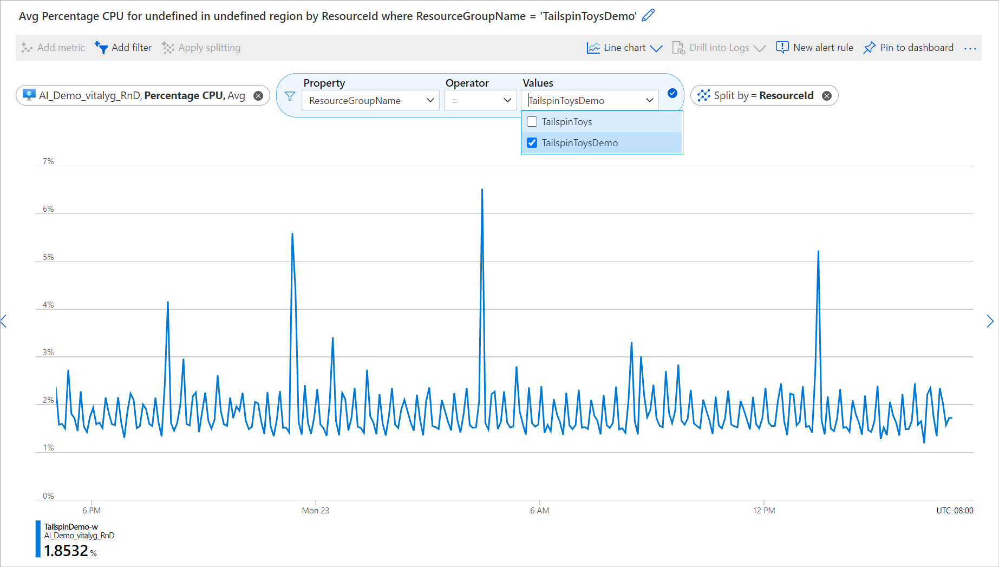
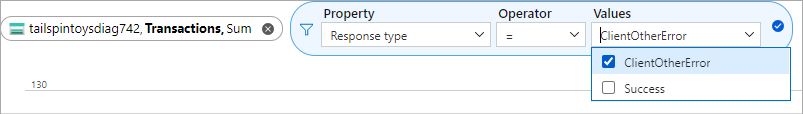
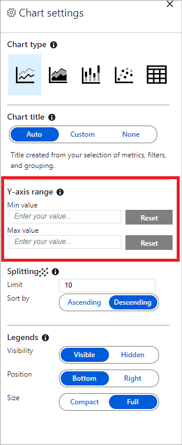
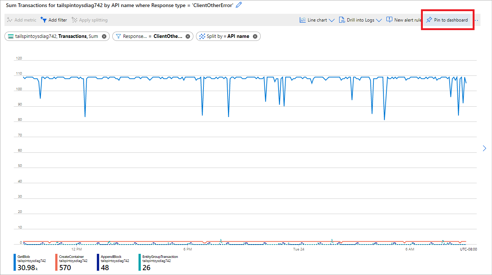
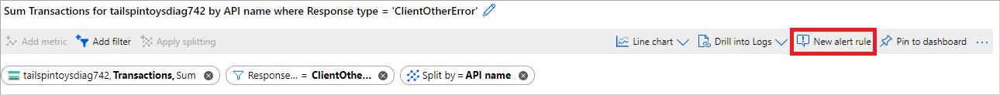

# Advanced features of Azure Metrics Explorer

> [!NOTE]
> This article assumes that you are familiar with basic features of Metrics Explorer. If you are a new user and want to learn how to create your first metric chart, see [Getting started with Azure Metrics Explorer](metrics-getting-started.md).

## Metrics in Azure

[Metrics in Azure Monitor](data-platform-metrics.md) are the series of measured values and counts that are collected and stored over time. There are standard (or “platform”) metrics, and custom metrics. The standard metrics are provided to you by the Azure platform itself. Standard metrics reflect the health and usage statistics of your Azure resources. Whereas custom metrics are sent to Azure by your applications using the [Application Insights API for custom events and metrics](../app/api-custom-events-metrics.md),  [Windows Azure Diagnostics (WAD) extension](./diagnostics-extension-overview.md), or by [Azure Monitor REST API](./metrics-store-custom-rest-api.md).

## Using the scope picker 

The cross resource scope picker is a feature in Azure Metrics Explorer that allows you to view metrics across multiple resources that are within the same subscription and location. Below are instructions on how to use the scope picker to query metrics for multiple resources. 

### Selecting a resource 

Select **Metrics** from the **Azure Monitor** menu or from the **Monitoring** section of a resource's menu. Click on the "Select a scope" button to open the scope picker, which will allow you to select the resource(s) you want to see metrics for. This should already be populated if you opened metrics explorer from a resource's menu. 

### Selecting multiple resources 

Some resource types have enabled the ability to query for metrics over multiple resources, as long as they are within the same subscription and location. These resource types can be found at the top of the “Resource Types” dropdown. 

> [!WARNING] 
> You must have Monitoring Reader permission at the subscription level to visualize metrics across multiple resources, resource groups or a subscription. In order to do this, please follow the instructions in [this document](https://docs.microsoft.com/azure/role-based-access-control/role-assignments-portal).

In order to visualize metrics over multiple resources, start by selecting multiple resources within the scope picker. 

> [!NOTE]
> You are only able to select multiple resources within the same resource type, location and subscription. Resources outside of this criteria will be unselectable. 

When you are done selecting, click on the “Apply” button to save your selection. 

### Selecting a resource group or subscription 

> [!WARNING]
> You must have Monitoring Reader permission at the subscription level to visualize metrics across multiple resources, resource groups or a subscription. 

For multi-resource compatible types, you can also query for metrics across a subscription or multiple resource groups. Start by selecting a subscription or one or more resource groups: 

You will then need to select a resource type and location before you can continue applying your new scope. 

You are also able to expand the selected scopes to verify which resources this will apply to.

Once you are finished selecting your scopes, click “Apply” to save your selections. 

### Splitting and filtering by resource group / resource 

After plotting your resources, you can use the splitting and filtering tool to gain more insight into your data. 

Splitting allows you to visualize how different segments of the metric compare with each other. For instance, when you are plotting a metric for multiple resources you can use the “Apply splitting” tool to split by resource id or resource group. This will allow you to easily compare a single metric across multiple resources or resource groups.  

For example, below is a chart of the percentage CPU across 9VMs. By splitting by resource id, you can easily see how percentage CPU differs per VM. 

In addition to splitting, you can use the filtering feature to only display the resource groups that you want to see.  For instance, if you want to view the percentage CPU for VMs for a certain resource group, you can use the "Add filter” tool to filter by resource group. In this example we filter by TailspinToys, which removes metrics associated with resources in TailspinToysDemo. 

### Pinning your multi-resource charts 

> [!WARNING] 
> You must have Monitoring Reader permission at the subscription level to visualize metrics across multiple resources, resource groups or a subscription. In order to do this, please follow the instructions in [this document](https://docs.microsoft.com/azure/role-based-access-control/role-assignments-portal). 

To pin your multi-resource chart please follow the instructions [here](https://docs.microsoft.com/azure/azure-monitor/platform/metrics-charts#create-alert-rules). 

## Create views with multiple metrics and charts

You can create charts that plot multiple metrics lines or show multiple metric charts at once. This functionality allows you to:

- correlate related metrics on the same graph to see how one value is related to another
- display metrics with different units of measure in close proximity
- visually aggregate and compare metrics from multiple resources

For example, if you have 5 storage accounts and you want to know how much total space is consumed between them, you can create a (stacked) area chart which shows the individual and sum of all the values at particular points in time.

### Multiple metrics on the same chart

First, [create a new chart](metrics-getting-started.md#create-your-first-metric-chart). Click **Add Metric** and repeat the steps to add another metric on the same chart.

   > [!NOTE]
   > You typically don’t want to have metrics with different units of measure (i.e. “milliseconds” and “kilobytes”) or with significantly different scale on one chart. Instead, consider using multiple charts. Click on the Add Chart button to create multiple charts in metrics explorer.

### Multiple charts

Click the **Add chart** and create another chart with a different metric.

### Order or delete multiple charts

To order or delete multiple charts, click on the ellipses ( **...** ) symbol to open the chart menu and choose the appropriate menu item of **Move up**, **Move down**, or **Delete**.

## Changing aggregation

When you add a metric to a chart, metrics explorer automatically pre-selects its default aggregation. The default makes sense in the basic scenarios, but you can use a different aggregation to gain additional insights about the metric. Viewing different aggregations on a chart requires that you understand how metrics explorer handles them. 

Metrics are the series of measurements (or "metric values") captured over the time period. When you plot a chart, the values of the selected metric are separately aggregated over the *time grain*. You select the size of the time grain [using the Metrics Explorer time picker panel](metrics-getting-started.md#select-a-time-range). If you don’t make an explicit selection of the time grain, the time granularity is automatically selected based on the currently selected time range. Once the time grain is determined, the metric values that were captured during each time grain interval are aggregated and placed onto the chart - one datapoint per time grain.

For example, suppose the chart is showing the **Server Response Time** metric using the **Average** aggregation over the **last 24 hours** time span:

- If the time granularity is set to 30 minutes, the chart is drawn from 48 aggregated datapoints (e.g. the line chart connects 48 dots in the chart plot area). That is, 24 hours x 2 datapoints per hour. Each datapoint represents the *average* of all captured response times for server requests that occurred during each of the relevant 30 min time periods.
- If you switch the time granularity to 15 minutes, you get 96 aggregated datapoints.  That is, 24 hours x 4 datapoints per hour.

There are five basic stats aggregation types available in the metrics explorer: **Sum**, **Count**, **Min**, **Max**, and **Average**. The **Sum** aggregation is sometimes referred as **Total** aggregation. For many metrics, Metrics Explorer will hide the aggregations that are totally irrelevant and cannot be used.

- **Sum** – the sum of all values captured over the aggregation interval
- **Count** – the number of measurements captured over the aggregation interval. Note that **Count** will be equal to **Sum** in the case where the metric is always captured with the value of 1. This is common when the metric tracks the count of distinct events, and each measurement represents one event (i.e. the code fires off a metric record every time a new request comes in)
- **Average** – the average of the metric values captured over the aggregation interval
- **Min** – the smallest value captured over the aggregation interval
- **Max** – the largest value captured over the aggregation interval

## Apply filters to charts

You can apply filters to the charts that show metrics with dimensions. For example, if the metric “Transaction count” has a dimension, “Response type”, which indicates whether the response from transactions succeeded or failed then filtering on this dimension would plot a chart line for only successful (or only failed) transactions. 

### To add a filter

1. Select **Add filter** above the chart

2. Select which dimension (property) you want to filter

   

3. Select which dimension values you want to include when plotting the chart (this example shows filtering out the successful storage transactions):

   

4. After selecting the filter values, click away from the Filter Selector to close it. Now the chart shows how many storage transactions have failed:

   

5. You can repeat steps 1-4 to apply multiple filters to the same charts.

## Apply splitting to a chart

You can split a metric by dimension to visualize how different segments of the metric compare against each other, and identify the outlying segments of a dimension.

### Apply splitting

1. Click on **Apply splitting** above the chart.
 
   > [!NOTE]
   > Splitting cannot be used with charts that have multiple metrics. Also, you can have multiple filters but only one splitting dimension applied to any single chart.

2. Choose a dimension on which you want to segment your chart:

   

   Now the chart now shows multiple lines, one for each segment of dimension:

   

3. Click away from the **Grouping Selector** to close it.

   > [!NOTE]
   > Use both Filtering and Splitting on the same dimension to hide the segments that are irrelevant for your scenario and make charts easier to read.

## Lock boundaries of chart y-axis

Locking the range of the y-axis becomes important when the chart shows smaller fluctuations of larger values. 

For example, when the volume of successful requests drops down from 99.99% to 99.5%, it may represent a significant reduction in the quality of service. However, noticing a small numeric value fluctuation would be difficult or even impossible from the default chart settings. In this case you could lock the lowest boundary of the chart to 99%, which would make this small drop more apparent. 

Another example is a fluctuation in the available memory, where the value will technically never reach 0. Fixing the range to a higher value may make the drops in available memory easier to spot. 

To control the y-axis range, use the “…” chart menu, and select **Chart settings** to access advanced chart settings.

 Modify the values in the Y-Axis Range  section, or use **Auto** button to revert to defaults.
 
 

> [!WARNING]
> Locking the boundaries of y-axis for the charts that track various counts or sums over a period of time (and thus use count, sum, minimum, or maximum aggregations) usually requires specifying a fixed time granularity rather than relying on the automatic defaults. This is necessary is because the values on charts change when the time granularity is automatically modified by the user resizing browser window or going from one screen resolution to another. The resulting change in time granularity effects the look of the chart, invalidating current selection of y-axis range.

## Change colors of chart lines

After you configure the charts, the chart lines are automatically assigned a color from a default palette. You can change those colors.

To change the color of a chart line, click on the colored bar in the legend that corresponds to the chart. The color picker dialog will open. Use the color picker to configure the color for the line.

After the chart colors are configured, they will remain that way when you pin the chart to a dashboard. The following section shows you how to pin a chart.

## Pin charts to dashboards

After configuring the charts, you may want to add it to the dashboards so that you can view it again, possibly in context of other monitoring telemetry, or share with your team.

To pin a configured chart to a dashboard:

After configuring your chart, click **Pin to dashboard** in the right top corner of the chart.

## Create alert rules

You can use the criteria you have set to visualize your metrics as the basis of a metric based alert rule. The new alerting rule will include your target resource, metric, splitting, and filter dimensions from your chart. You will be able to modify these settings later on the alert rule creation pane.

### To create a new alert rule, click **New Alert rule**

You will be taken to the alert rule creation pane with the underlying metric dimensions from your chart pre-populated to make it easier to generate custom alert rules.

Check out this [article](alerts-metric.md) to learn more about setting up metric alerts.

## Troubleshooting

*I don't see any data on my chart.*

* Filters apply to all the charts on the pane. Make sure that, while you're focusing on one chart, you didn't set a filter that excludes all the data on another.

* If you want to set different filters on different charts, create them in different blades, save them as separate favorites. If you want, you can pin them to the dashboard so that you can see them alongside each other.

* If you segment a chart by a property that is not defined on the metric, then there will be nothing on the chart. Try clearing the segmentation (splitting), or choose a different property.

## Next steps

  Read [Creating custom KPI dashboards](../learn/tutorial-app-dashboards.md) to learn about the best practices for creating actionable dashboards with metrics.
