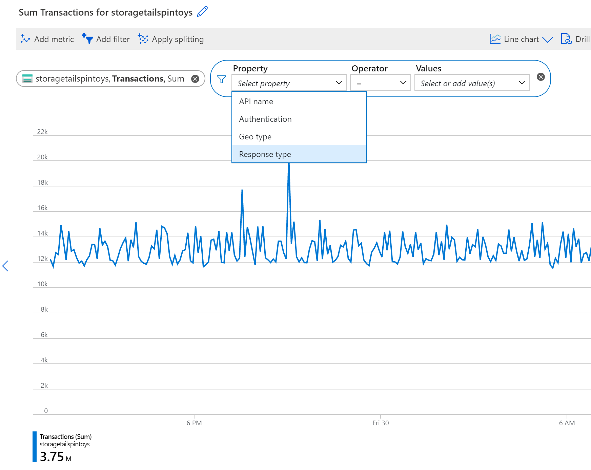
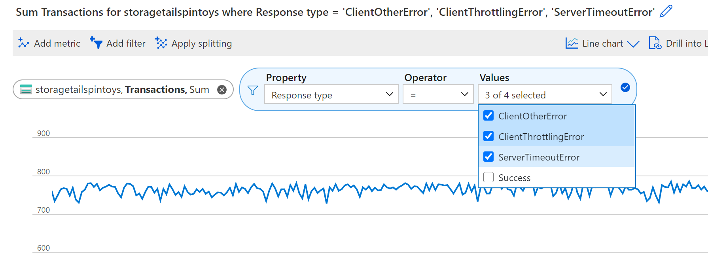
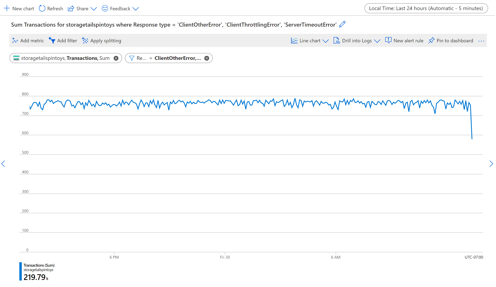
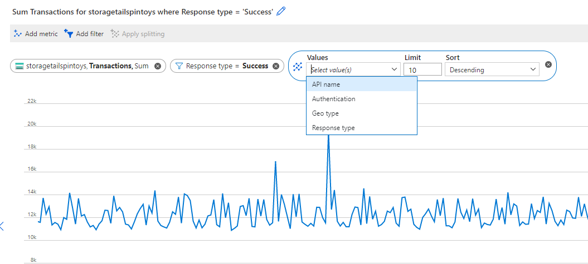
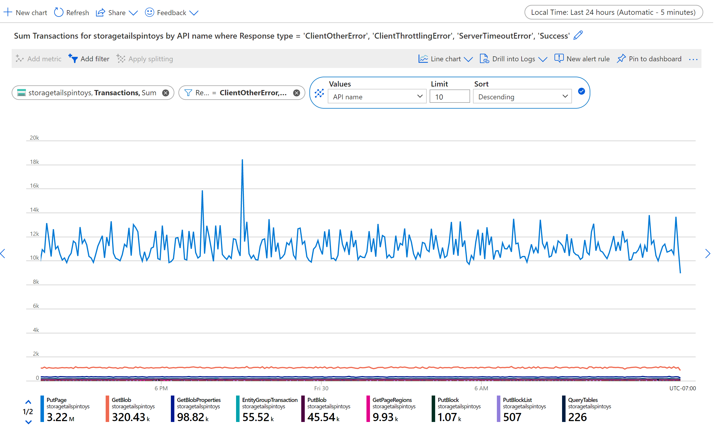
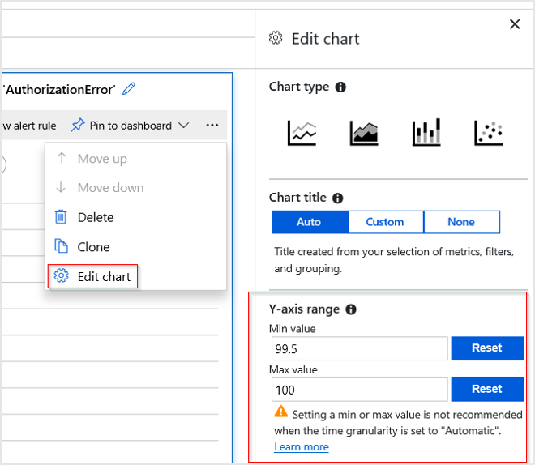
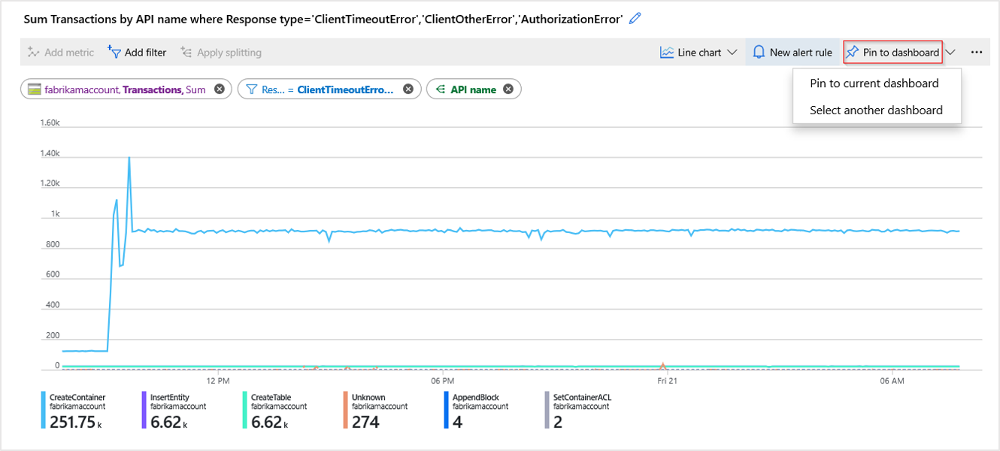
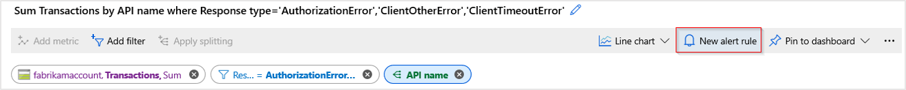
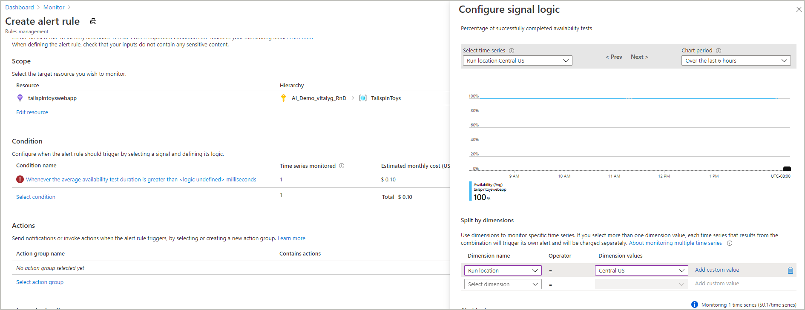

# Advanced features of Azure Metrics Explorer

> [!NOTE]
> This article assumes that you are familiar with basic features of Metrics Explorer. If you are a new user and want to learn how to create your first metric chart, see [Getting started with Azure Metrics Explorer](metrics-getting-started.md).

## Metrics in Azure

[Metrics in Azure Monitor](data-platform-metrics.md) are the series of measured values and counts that are collected and stored over time. There are standard (or “platform”) metrics, and custom metrics. The standard metrics are provided to you by the Azure platform itself. Standard metrics reflect the health and usage statistics of your Azure resources. Whereas custom metrics are sent to Azure by your applications using the [Application Insights API for custom events and metrics](https://docs.microsoft.com/azure/application-insights/app-insights-api-custom-events-metrics),  [Windows Azure Diagnostics (WAD) extension](https://docs.microsoft.com/azure/azure-monitor/platform/diagnostics-extension-overview), or by [Azure Monitor REST API](https://docs.microsoft.com/azure/azure-monitor/platform/metrics-store-custom-rest-api).

## Create views with multiple metrics and charts

You can create charts that plot multiple metrics lines or show multiple metric charts at once. This functionality allows you to:

- correlate related metrics on the same graph to see how one value is related to another
- display metrics with different units of measure in close proximity
- visually aggregate and compare metrics from multiple resources

For example, if you have 5 storage accounts and you want to know how much total space is consumed between them, you can create a (stacked) area chart which shows the individual and sum of all the values at particular points in time.

### Multiple metrics on the same chart

First, [create a new chart](metrics-getting-started.md#create-your-first-metric-chart). Click **Add Metric** and repeat the steps to add another metric on the same chart.

   > [!NOTE]
   > You typically don’t want to have metrics with different units of measure (i.e. “milliseconds” and “kilobytes”) or with significantly different scale on one chart. Instead, consider using multiple charts. Click on the Add Chart button to create multiple charts in metrics explorer.

### Multiple charts

Click the **Add chart** and create another chart with a different metric.

### Order or delete multiple charts

To order or delete multiple charts, click on the ellipses ( **...** ) symbol to open the chart menu and choose the appropriate menu item of **Move up**, **Move down**, or **Delete**.

## Apply filters to charts

You can apply filters to the charts that show metrics with dimensions. For example, if the metric “Transaction count” has a dimension, “Response type”, which indicates whether the response from transactions succeeded or failed then filtering on this dimension would plot a chart line for only successful (or only failed) transactions. 

### To add a filter

1. Select **Add filter** above the chart

2. Select which dimension (property) you want to filter

   

3. Select which dimension values you want to include when plotting the chart (this example shows filtering out the successful storage transactions):

   

4. After selecting the filter values, click away from the Filter Selector to close it. Now the chart shows how many storage transactions have failed:

   

5. You can repeat steps 1-4 to apply multiple filters to the same charts.

## Apply splitting to a chart

You can split a metric by dimension to visualize how different segments of the metric compare against each other, and identify the outlying segments of a dimension.

### Apply splitting

1. Click on **Apply splitting** above the chart.
 
   > [!NOTE]
   > Splitting cannot be used with charts that have multiple metrics. Also, you can have multiple filters but only one splitting dimension applied to any single chart.

2. Choose a dimension on which you want to segment your chart:

   

   Now the chart now shows multiple lines, one for each segment of dimension:

   

3. Click away from the **Grouping Selector** to close it.

   > [!NOTE]
   > Use both Filtering and Splitting on the same dimension to hide the segments that are irrelevant for your scenario and make charts easier to read.

## Lock boundaries of chart y-axis

Locking the range of the y-axis becomes important when the chart shows smaller fluctuations of larger values. 

For example, when the volume of successful requests drops down from 99.99% to 99.5%, it may represent a significant reduction in the quality of service. However, noticing a small numeric value fluctuation would be difficult or even impossible from the default chart settings. In this case you could lock the lowest boundary of the chart to 99%, which would make this small drop more apparent. 

Another example is a fluctuation in the available memory, where the value will technically never reach 0. Fixing the range to a higher value may make the drops in available memory easier to spot. 

To control the y-axis range, use the “…” chart menu, and select **Edit chart** to access advanced chart settings. Modify the values in the Y-Axis Range  section, or use **Auto** button to revert to defaults.

> [!WARNING]
> Locking the boundaries of y-axis for the charts that track various counts or sums over a period of time (and thus use count, sum, minimum, or maximum aggregations) usually requires specifying a fixed time granularity rather than relying on the automatic defaults. This is necessary is because the values on charts change when the time granularity is automatically modified by the user resizing browser window or going from one screen resolution to another. The resulting change in time granularity effects the look of the chart, invalidating current selection of y-axis range.

## Pin charts to dashboards

After configuring the charts, you may want to add it to the dashboards so that you can view it again, possibly in context of other monitoring telemetry, or share with your team.

To pin a configured chart to a dashboard:

After configuring your chart, click on the **Chart Actions** menu in the right top corner of the chart, and click **Pin to dashboard**.

## Create alert rules

You can use the criteria you have set to visualize your metrics as the basis of a metric based alert rule. The new alerting rule will include your target resource, metric, splitting, and filter dimensions from your chart. You will be able to modify these settings later on the alert rule creation pane.

### To create a new alert rule, click **New Alert rule**

You will be taken to the alert rule creation pane with the underlying metric dimensions from your chart pre-populated to make it easier to generate custom alert rules.

Check out this [article](alerts-metric.md) to learn more about setting up metric alerts.

## Troubleshooting

*I don't see any data on my chart.*

* Filters apply to all the charts on the pane. Make sure that, while you're focusing on one chart, you didn't set a filter that excludes all the data on another.

* If you want to set different filters on different charts, create them in different blades, save them as separate favorites. If you want, you can pin them to the dashboard so that you can see them alongside each other.

* If you segment a chart by a property that is not defined on the metric, then there will be nothing on the chart. Try clearing the segmentation (splitting), or choose a different property.

## Next steps

  Read [Creating custom KPI dashboards](https://docs.microsoft.com/azure/application-insights/app-insights-tutorial-dashboards) to learn about the best practices for creating actionable dashboards with metrics.

