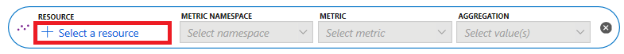
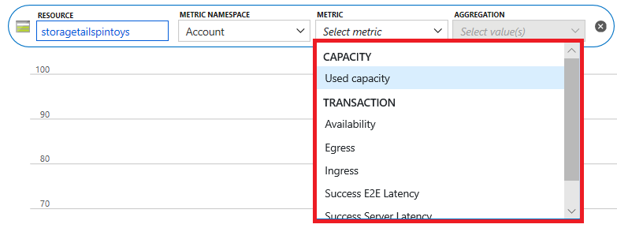
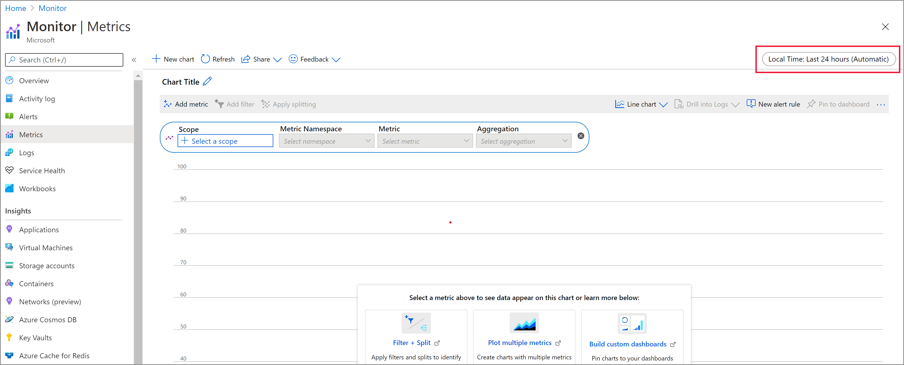

# Getting started with Azure Metrics Explorer

## Where do I start
Azure Monitor metrics explorer is a component of the Microsoft Azure portal that allows plotting charts, visually correlating trends, and investigating spikes and dips in metrics' values. Use the metrics explorer to investigate the health and utilization of your resources. Start in the following order:

1. [Pick a resource and a metric](#create-your-first-metric-chart) and you see a basic chart. Then [select a time range](#select-a-time-range) that is relevant for your investigation.

1. Try [applying dimension filters and splitting](#apply-dimension-filters-and-splitting). The filters and splitting allow you to analyze which segments of the metric contribute to the overall metric value and identify possible outliers.

1. Use [advanced settings](#advanced-chart-settings) to customize the chart before pinning to dashboards. [Configure alerts](alerts-metric-overview.md) to receive notifications when the metric value exceeds or drops below a threshold.

## Create your first metric chart

To create a metric chart, from your resource, resource group, subscription, or Azure Monitor view, open the **Metrics** tab and follow these steps:

1. Using the resource picker, select the resource for which you want to see metrics. (The resource is pre-selected if you opened **Metrics** in the context of a specific resource).

    > 

2. For some resources, you must pick a namespace. The namespace is just a way to organize metrics so that you can easily find them. For example, storage accounts have separate namespaces for storing Files, Tables, Blobs, and Queues metrics. Many resource types only have one namespace.

3. Select a metric from a list of available metrics.

    > 

4. Optionally, you can change the metric aggregation. For example, you might want your chart to show minimum, maximum, or average values of the metric.

> [!NOTE]
> Use the **Add metric** button and repeat these steps if you want to see multiple metrics plotted in the same chart. For multiple charts in one view, select the **Add chart** button on top.

## Select a time range

By default, the chart shows the most recent 24 hours of metrics data. Use the **time picker** panel to change the time range, zoom in, or zoom out on your chart. 

## Apply dimension filters and splitting

[Filtering](metrics-charts.md#apply-filters-to-charts) and [splitting](metrics-charts.md#apply-splitting-to-a-chart) are powerful diagnostic tools for the metrics that have dimensions. These features show how various metric segments ("dimension values") impact the overall value of the metric, and allow you to identify possible outliers.

- **Filtering** lets you choose which dimension values are included in the chart. For example, you might want to show successful requests when charting the *server response time* metric. You would need to apply the filter on the *success of request* dimension. 

- **Splitting** controls whether the chart displays separate lines for each value of a dimension, or aggregates the values into a single line. For example, you can see one line for an average response time across all server instances, or see separate lines for each server. You would need to apply splitting on the *server instance* dimension to see separate lines.

See [examples of the charts](metric-chart-samples.md) that have filtering and splitting applied. The article shows the steps were used to configure the charts.

## Advanced chart settings

You can customize chart style, title, and modify advanced chart settings. When done with customization, pin it to a dashboard to save your work. You can also configure metrics alerts. Follow [product documentation](metrics-charts.md) to learn about these and other advanced features of Azure Monitor metrics explorer.

## Next steps

* [Learn about advanced features of Metrics Explorer](metrics-charts.md)
* [Troubleshooting Metrics Explorer](metrics-troubleshoot.md)
* [See a list of available metrics for Azure services](metrics-supported.md)
* [See examples of configured charts](metric-chart-samples.md)
