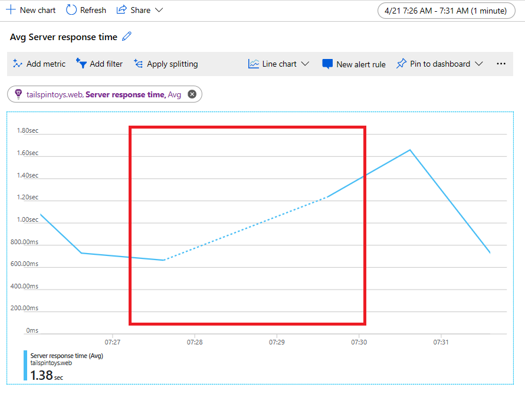
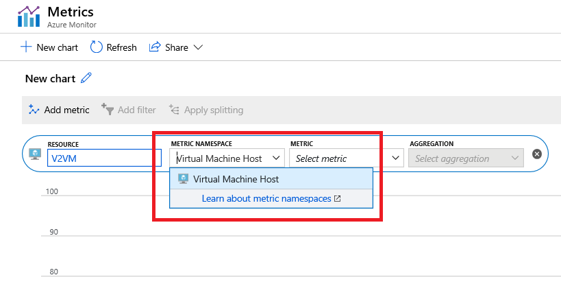

# Troubleshooting metrics charts

Use this article if you run into issues with creating, customizing, or interpreting charts in Azure metrics explorer. If you are new to metrics, learn about [getting started with metrics explorer](metrics-getting-started.md) and [advanced features of metrics explorer](metrics-charts.md). You can also see [examples](metric-chart-samples.md) of the configured metric charts.

## Can't find your resource to select it

You clicked on the **Select a resource** button, but don't see your resource in the resource picker dialog.

**Solution:** Metrics explorer requires you to select subscriptions and resource groups before listing available resources. If you don't see your resource:

1. Ensure that you've selected correct subscription in the **Subscription** dropdown. If your subscription isn't listed, click on the  **Directory + Subscription settings** and add a subscription with your resource.

1. Ensure that you've selected the correct resource group.
    > [!WARNING]
    > For best performance, when you first open metrics explorer, the **Resource group** dropdown has no pre-selected resource groups. You must pick at least one group before you can see any resources.

## Chart shows no data

Sometimes the charts might show no data after selecting correct resources and metrics. This behavior can be caused by several of the following reasons:

### Microsoft.Insights resource provider isn't registered for your subscription

Exploring metrics requires *Microsoft.Insights* resource provider registered in your subscription. In many cases, it is registered automatically (that is, after you configure an alert rule, customize diagnostic settings for any resource, or configure an autoscale rule). If the Microsoft.Insights resource provider is not registered, you must manually register it by  following steps described in [Azure resource providers and types](../../azure-resource-manager/resource-manager-supported-services.md).

**Solution:** Open **Subscriptions**, **Resource providers** tab, and verify that *Microsoft.Insights* is registered for your subscription.

### You don't have sufficient access rights to your resource

In Azure, access to metrics is controlled by [role-based access control (RBAC)](../../role-based-access-control/overview.md). You must be a member of [monitoring reader](../../role-based-access-control/built-in-roles.md#monitoring-reader), [monitoring contributor](../../role-based-access-control/built-in-roles.md#monitoring-contributor), or [contributor](../../role-based-access-control/built-in-roles.md#contributor) to explore metrics for any resource.

**Solution:** Ensure that you have sufficient permissions for the resource from which you are exploring metrics.

### Your resource didn't emit metrics during the selected time range

Some resources don’t constantly emit their metrics. For example, Azure will not collect metrics for stopped virtual machines. Other resources might emit their metrics only when some condition occurs. For example, a metric showing processing time of a transaction requires at least one transaction. If there were no transactions in the selected time range, the chart will naturally be empty. Additionally, while most of the metrics in Azure are collected every minute, there are some that are collected less frequently. See the metric documentation to get more details about the metric that you are trying to explore.

**Solution:** Change the time of the chart to a wider range. You may start from “Last 30 days” using a larger time granularity (or relying on the “Automatic time granularity” option).

### You picked a time range greater than 30 days

[Most metrics in Azure are stored for 93 days](data-platform-metrics.md#retention-of-metrics). However, you can only query for no more than 30 days worth of data on any single chart. This limitation doesn't apply to [log-based metrics](../app/pre-aggregated-metrics-log-metrics.md#log-based-metrics).

**Solution:** If you see a blank chart or your chart only displays part of metric data, verify that the difference between start- and end- dates in the time picker doesn't exceed the 30-day interval.

### All metric values were outside of the locked y-axis range

By [locking the boundaries of chart y-axis](metrics-charts.md#lock-boundaries-of-chart-y-axis), you can unintentionally  make the chart display area not show the chart line. For example, if the y-axis is locked to a range between 0% and 50%, and the metric has a constant value of 100%, the line is always rendered outside of the visible area, making the chart appear blank.

**Solution:** Verify that the y-axis boundaries of the chart aren’t locked outside of the range of the metric values. If the y-axis boundaries are locked, you may want to temporarily reset them to ensure that the metric values don’t fall outside of the chart range. Locking the y-axis range isn’t recommended with automatic granularity for the charts with **sum**, **min**, and **max** aggregation because their values will change with granularity by resizing browser window or going from one screen resolution to another. Switching granularity may leave the display area of your chart empty.

### You are looking at a Guest OS metric but didn’t enable Azure Diagnostic Extension

Collection of **Guest OS** metrics requires configuring the Azure Diagnostics Extension or enabling it using the **Diagnostic Settings** panel for your resource.

**Solution:** If Azure Diagnostics Extension is enabled but you are still unable to see your metrics, follow steps outlined in [Azure Diagnostics Extension troubleshooting guide](diagnostics-extension-troubleshooting.md#metric-data-doesnt-appear-in-the-azure-portal). See also the troubleshooting steps for [Cannot pick Guest OS namespace and metrics](metrics-troubleshoot.md#cannot-pick-guest-os-namespace-and-metrics)

## “Error retrieving data” message on dashboard

This problem may happen when your dashboard was created with a metric that was later deprecated and removed from Azure. To verify that it is the case, open the **Metrics** tab of your resource, and check the available metrics in the metric picker. If the metric is not shown, the metric has been removed from Azure. Usually, when a metric is deprecated, there is a better new metric that provides with a similar perspective on the resource health.

**Solution:** Update the failing tile by picking an alternative metric for your chart on dashboard. You can [review a list of available metrics for Azure services](metrics-supported.md).

## Chart shows dashed line

Azure metrics charts use dashed line style to indicate that there is a missing value (also known as “null value”) between two known time grain data points. For example, if in the time selector you picked “1 minute” time granularity but the metric was reported at 07:26, 07:27, 07:29, and 07:30 (note a minute gap between second and third data points), then a dashed line will connect 07:27 and 07:29 and a solid line will connect all other data points. The dashed line drops down to zero when the metric uses **count** and **sum** aggregation. For the **avg**, **min** or **max** aggregations, the dashed line connects two nearest known data points. Also, when the data is missing on the rightmost or leftmost side of the chart, the dashed line expands to the direction of the missing data point.
  

**Solution:** This behavior is by design. It is useful for identifying missing data points. The line chart is a superior choice for visualizing trends of high-density metrics but may be difficult to interpret for the metrics with sparse values, especially when corelating values with time grain is important. The dashed line makes reading of these charts easier but if your chart is still unclear, consider viewing your metrics with a different chart type. For example, a scattered plot chart for the same metric clearly shows each time grain by only visualizing a dot when there is a value and skipping the data point altogether when the value is missing:
  

   > [!NOTE]
   > If you still prefer a line chart for your metric, moving mouse over the chart may help to assess the time granularity by highlighting the data point at the location of the mouse pointer.

## Chart shows unexpected drop in values

In many cases, the perceived drop in the metric values is a misunderstanding of the data shown on the chart. You can be misled by a drop in sums or counts when the chart shows the most-recent minutes because the last metric data points haven’t been received or processed by Azure yet. Depending on the service, the latency of processing metrics can be within a couple minutes range. For charts showing a recent time range with a 1- or 5- minute granularity, a drop of the value over the last few minutes becomes more noticeable:
    

**Solution:** This behavior is by design. We believe that showing data as soon as we receive it is beneficial even when the data is *partial* or *incomplete*. Doing so allows you to make important conclusion sooner and start investigation right away. For example, for a metric that shows the number of failures, seeing a partial value X tells you that there were at least X failures on a given minute. You can start investigating the problem right away, rather than wait to see the exact count of failures that happened on this minute, which might not be as important. The chart will update once we receive the entire set of data, but at that time it may also show new incomplete data points from more recent minutes.

## Cannot pick Guest OS namespace and metrics

Virtual machines and virtual machine scale sets have two categories of metrics: **Virtual Machine Host** metrics that are collected by the Azure hosting environment, and **Guest OS** metrics that are collected by the [monitoring agent](agents-overview.md) running on your virtual machines. You install the monitoring agent by enabling [Azure Diagnostic Extension](diagnostics-extension-overview.md).

By default, Guest OS metrics are stored in Azure Storage account, which you pick from the **Diagnostic settings** tab of your resource. If Guest OS metrics aren't collected or metrics explorer cannot access them, you will only see the **Virtual Machine Host** metric namespace:

**Solution:** If you don't see **Guest OS** namespace and metrics in metrics explorer:

1. Confirm that [Azure Diagnostic Extension](diagnostics-extension-overview.md) is enabled and configured to collect metrics.
    > [!WARNING]
    > You cannot use [Log Analytics agent](agents-overview.md#log-analytics-agent) (also referred to as the Microsoft Monitoring Agent, or "MMA") to send **Guest OS** into a storage account.

1. Verify that storage account isn't protected by the firewall.

1. Use the [Azure storage explorer](https://azure.microsoft.com/features/storage-explorer/) to validate that metrics are flowing into the storage account. If metrics aren't collected, follow the [Azure Diagnostics Extension troubleshooting guide](diagnostics-extension-troubleshooting.md#metric-data-doesnt-appear-in-the-azure-portal).

## Next steps

* [Learn about getting started with Metric Explorer](metrics-getting-started.md)
* [Learn about advanced features of Metric Explorer](metrics-charts.md)
* [See a list of available metrics for Azure services](metrics-supported.md)
* [See examples of configured charts](metric-chart-samples.md)
