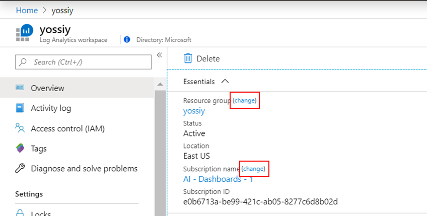

# Move a Log Analytics workspace to different subscription or resource group

In this article, you'll learn the steps to move Log Analytics workspace to another resource group or subscription in the same region. You can learn more about moving Azure resources through the Azure portal, PowerShell, the Azure CLI, or the REST API. at [Move resources to a new resource group or subscription](../../azure-resource-manager/management/move-resource-group-and-subscription.md). 

> [!IMPORTANT]
> You can't move a workspace to a different region.

## Verify Active Directory tenant
The workspace source and destination subscriptions must exist within the same Azure Active Directory tenant. Use Azure PowerShell to verify that both subscriptions have the same tenant ID.

``` PowerShell
(Get-AzSubscription -SubscriptionName <your-source-subscription>).TenantId
(Get-AzSubscription -SubscriptionName <your-destination-subscription>).TenantId
```

## Workspace move considerations
Managed solutions that are installed in the workspace will be moved with the Log Analytics workspace move operation. Connected agents will remain connected and keep send data to the workspace after the move. Since the move operation requires that there are no Linked Services from the workspace, solutions that rely on that link must be removed to allow the workspace move.

Solutions that must be removed before you can unlink your automation account:

- Update Management
- Change Tracking
- Start/Stop VMs during off-hours
- Azure Security Center

>[!IMPORTANT]
> - Once enabled on a workspace, Azure Sentinel **does not currently support** the moving of that workspace to other resource groups or subscriptions. If you need to move the workspace, contact [Azure Sentinel](mailto:AzureSentinel@microsoft.com).

### Delete solutions in Azure portal
Use the following procedure to remove the solutions using the Azure portal:

1. Open the menu for the resource group that any solutions are installed in.
2. Select the solutions to remove.
3. Click **Delete Resources** and then confirm the resources to be removed by clicking **Delete**.


### Delete using PowerShell

To remove the solutions using PowerShell, use the [Remove-AzResource](/powershell/module/az.resources/remove-azresource?view=azps-2.8.0) cmdlet as shown in the following example:

``` PowerShell
Remove-AzResource -ResourceType 'Microsoft.OperationsManagement/solutions' -ResourceName "ChangeTracking(<workspace-name>)" -ResourceGroupName <resource-group-name>
Remove-AzResource -ResourceType 'Microsoft.OperationsManagement/solutions' -ResourceName "Updates(<workspace-name>)" -ResourceGroupName <resource-group-name>
Remove-AzResource -ResourceType 'Microsoft.OperationsManagement/solutions' -ResourceName "Start-Stop-VM(<workspace-name>)" -ResourceGroupName <resource-group-name>
```

### Remove alert rules for Start/Stop VMs solution
To remove **Start/Stop VMs** solution, you also need to remove the alert rules created by the solution. Use the following procedure in the Azure portal to remove these rules.

1. Open the **Monitor** menu and then select **Alerts**.
2. Click **Manage alert rules**.
3. Select the following three alert rules, and then click **Delete**.

   - AutoStop_VM_Child
   - ScheduledStartStop_Parent
   - SequencedStartStop_Parent

    

## Unlink Automation account
Use the following procedure to unlink the Automation account from the workspace using the Azure portal:

1. Open the **Automation accounts** menu and then select the account to remove.
2. In the **Related Resources** section of the menu, select **Linked workspace**. 
3. Click **Unlink workspace** to unlink the workspace from your Automation account.

    

## Move your workspace

### Azure portal
Use the following procedure to move your workspace using the Azure portal:

1. Open the **Log Analytics workspaces** menu and then select your workspace.
2. In the **Overview** page, click **change** next to either **Resource group** or **Subscription**.
3. A new page opens with a list of resources related to the workspace. Select the resources to move to the same destination subscription and resource group as the workspace. 
4. Select a destination **Subscription** and **Resource group**. If you're moving the workspace to another resource group in the same subscription, you won't see the **Subscription** option.
5. Click **OK** to move the workspace and selected resources.

    

### PowerShell
To move your workspace using PowerShell, use the [Move-AzResource](/powershell/module/AzureRM.Resources/Move-AzureRmResource) as in the following example:

``` PowerShell
Move-AzResource -ResourceId "/subscriptions/00000000-0000-0000-0000-000000000000/resourceGroups/MyResourceGroup01/providers/Microsoft.OperationalInsights/workspaces/MyWorkspace" -DestinationSubscriptionId "00000000-0000-0000-0000-000000000000" -DestinationResourceGroupName "MyResourceGroup02"
```

> [!IMPORTANT]
> After the move operation, removed solutions and Automation account link should be reconfigured to bring the workspace back to its previous state.


## Next steps
- For a list of which resources support move, see [Move operation support for resources](../../azure-resource-manager/management/move-support-resources.md).
