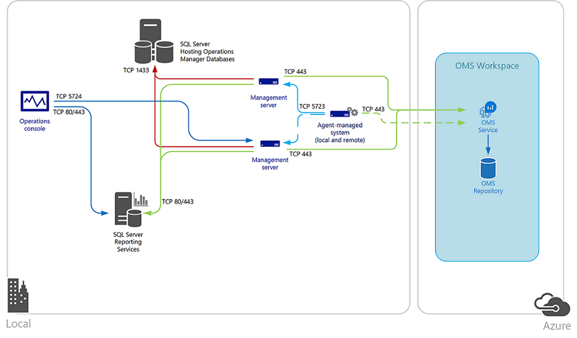
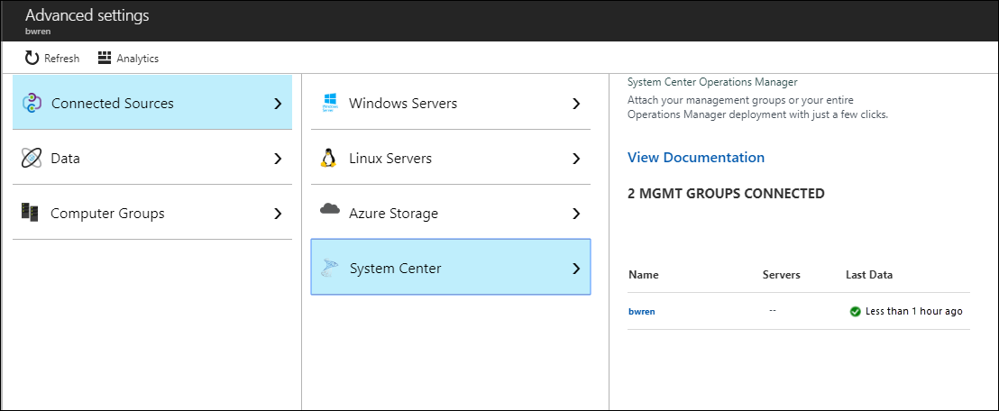

# Connect Operations Manager to Azure Monitor

[!INCLUDE [azure-monitor-log-analytics-rebrand](../../../includes/azure-monitor-log-analytics-rebrand.md)]

To maintain your existing investment in [System Center Operations Manager](https://docs.microsoft.com/system-center/scom/key-concepts?view=sc-om-1807) and use extended capabilities with Azure Monitor, you can integrate Operations Manager with your Log Analytics workspace. This allows you to leverage the opportunities of logs in Azure Monitor while continuing to use Operations Manager to:

* Monitor the health of your IT services with Operations Manager
* Maintain integration with your ITSM solutions supporting incident and problem management
* Manage the lifecycle of agents deployed to on-premises and public cloud IaaS virtual machines that you monitor with Operations Manager

Integrating with System Center Operations Manager adds value to your service operations strategy by using the speed and efficiency of Azure Monitor in collecting, storing, and analyzing log data from Operations Manager. Azure Monitor log queries help correlate and work towards identifying the faults of problems and surfacing recurrences in support of your existing problem management process. The flexibility of the query engine to examine performance, event and alert data, with rich dashboards and reporting capabilities to expose this data in meaningful ways, demonstrates the strength Azure Monitor brings in complimenting Operations Manager.

The agents reporting to the Operations Manager management group collect data from your servers based on the [Log Analytics data sources](agent-data-sources.md) and solutions you have enabled in your workspace. Depending on the solutions enabled, their data are either sent directly from an Operations Manager management server to the service, or because of the volume of data collected on the agent-managed system, are sent directly from the agent to a Log Analytics workspace. The management server forwards the data directly to the service; it is never written to the operational or data warehouse database. When a management server loses connectivity with Azure Monitor, it caches the data locally until communication is re-established. If the management server is offline due to planned maintenance or unplanned outage, another management server in the management group resumes connectivity with Azure Monitor.  

The following diagram shows the connection between the management servers and agents in a System Center Operations Manager management group and Azure Monitor, including the direction and ports.



If your IT security policies do not allow computers on your network to connect to the Internet, management servers can be configured to connect to the Log Analytics gateway to receive configuration information and send collected data depending on the solutions enabled. For more information and steps on how to configure your Operations Manager management group to communicate through a Log Analytics gateway to Azure Monitor, see [Connect computers to Azure Monitor using the Log Analytics gateway](../../azure-monitor/platform/gateway.md).  

## Prerequisites

Before starting, review the following requirements.

* Azure Monitor only supports System Center Operations Manager 2016 or later, Operations Manager 2012 SP1 UR6 or later, and Operations Manager 2012 R2 UR2 or later. Proxy support was added in Operations Manager 2012 SP1 UR7 and Operations Manager 2012 R2 UR3.
* Integrating System Center Operations Manager 2016 with US Government cloud requires an updated Advisor management pack included with Update Rollup 2 or later. System Center Operations Manager 2012 R2 requires an updated Advisor management pack included with Update Rollup 3 or later.
* All Operations Manager agents must meet minimum support requirements. Ensure that agents are at the minimum update, otherwise Windows agent communication may fail and generate errors in the Operations Manager event log.
* A Log Analytics workspace. For further information, review [Log Analytics workspace overview](design-logs-deployment.md). 
* You authenticate to Azure with an account that is a member of the [Log Analytics Contributor role](manage-access.md#manage-access-using-azure-permissions).

* Supported Regions - Only the following Azure regions are supported by System Center Operations Manager to connect to a Log Analytics workspace:
    - West Central US
    - Australia South East
    - West Europe
    - East US
    - South East Asia
    - Japan East
    - UK South
    - Central India
    - Canada Central
    - West US 2

>[!NOTE]
>Recent changes to Azure APIs will prevent customers from being able to successfully configure integration between their management group and Azure Monitor for the first time. For customers who have already integrated their management group with the service, you are not impacted unless you need to reconfigure your existing connection.  
>A new management pack has been released for the following versions of Operations Manager:
> - For System Center Operations Manager 2019, this management pack is included with the source media and installed during setup of a new management group or during an upgrade.
>- Operations Manager 1801 management pack is also applicable for Operations Manager 1807.
>- For System Center Operations Manager 1801, download the management pack from [here](https://www.microsoft.com/download/details.aspx?id=57173).
>- For System Center 2016 - Operations Manager, download the management pack from [here](https://www.microsoft.com/download/details.aspx?id=57172).  
>- For System Center Operations Manager 2012 R2, download the management pack from [here](https://www.microsoft.com/download/details.aspx?id=57171).  


### Network

The information below list the proxy and firewall configuration information required for the Operations Manager agent, management servers, and Operations console to communicate with Azure Monitor. Traffic from each component is outbound from your network to Azure Monitor.

|Resource | Port number| Bypass HTTP Inspection|  
|---------|------|-----------------------|  
|**Agent**|||  
|\*.ods.opinsights.azure.com| 443 |Yes|  
|\*.oms.opinsights.azure.com| 443|Yes|  
|\*.blob.core.windows.net| 443|Yes|  
|\*.azure-automation.net| 443|Yes|  
|**Management server**|||  
|\*.service.opinsights.azure.com| 443||  
|\*.blob.core.windows.net| 443| Yes|  
|\*.ods.opinsights.azure.com| 443| Yes|  
|*.azure-automation.net | 443| Yes|  
|**Operations Manager console to Azure Monitor**|||  
|service.systemcenteradvisor.com| 443||  
|\*.service.opinsights.azure.com| 443||  
|\*.live.com| 80 and 443||  
|\*.microsoft.com| 80 and 443||  
|\*.microsoftonline.com| 80 and 443||  
|\*.mms.microsoft.com| 80 and 443||  
|login.windows.net| 80 and 443||  
|portal.loganalytics.io| 80 and 443||
|api.loganalytics.io| 80 and 443||
|docs.loganalytics.io| 80 and 443||  

### TLS 1.2 protocol

To insure the security of data in transit to Azure Monitor, we strongly encourage you to configure the agent and management group to use at least Transport Layer Security (TLS) 1.2. Older versions of TLS/Secure Sockets Layer (SSL) have been found to be vulnerable and while they still currently work to allow backwards compatibility, they are **not recommended**. For additional information, review [Sending data securely using TLS 1.2](../../azure-monitor/platform/data-security.md#sending-data-securely-using-tls-12).

## Connecting Operations Manager to Azure Monitor

Perform the following series of steps to configure your Operations Manager management group to connect to one of your Log Analytics workspaces.

During initial registration of your Operations Manager management group with a Log Analytics workspace, the option to specify the proxy configuration for the management group is not available in the Operations console.  The management group has to be successfully registered with the service before this option is available.  To work around this, you need to update the system proxy configuration using Netsh on the system your running the Operations console from to configure integration, and all management servers in the management group.  

1. Open an elevated command-prompt.
   a. Go to **Start** and type **cmd**.
   b. Right-click **Command prompt** and select Run as administrator**.
1. Enter the following command and press **Enter**:

    `netsh winhttp set proxy <proxy>:<port>`

After completing the following steps to integrate with Azure Monitor, you can remove the configuration by running `netsh winhttp reset proxy` and then use the **Configure proxy server** option in the Operations console to specify the proxy or Log Analytics gateway server.

1. In the Operations Manager console, select the **Administration** workspace.
1. Expand the Operations Management Suite node and click **Connection**.
1. Click the **Register to Operations Management Suite** link.
1. On the **Operations Management Suite Onboarding Wizard: Authentication** page, enter the email address or phone number and password of the administrator account that is associated with your OMS subscription, and click **Sign in**.

   >[!NOTE]
   >The Operations Management Suite name has been retired.

1. After you are successfully authenticated, on the **Operations Management Suite Onboarding Wizard: Select Workspace** page, you are prompted to select your Azure tenant, subscription, and Log Analytics workspace. If you have more than one workspace, select the workspace you want to register with the Operations Manager management group from the drop-down list, and then click **Next**.

   > [!NOTE]
   > Operations Manager only supports one Log Analytics workspace at a time. The connection and the computers that were registered to Azure Monitor with the previous workspace are removed from Azure Monitor.
   >
   >
1. On the **Operations Management Suite Onboarding Wizard: Summary** page, confirm your settings and if they are correct, click **Create**.
1. On the **Operations Management Suite Onboarding Wizard: Finish** page, click **Close**.

### Add agent-managed computers

After configuring integration with your Log Analytics workspace, it only establishes a connection with the service, no data is collected from the agents reporting to your management group. This won’t happen until after you configure which specific agent-managed computers collect log data for Azure Monitor. You can either select the computer objects individually or you can select a group that contains Windows computer objects. You cannot select a group that  contains instances of another class, such as logical disks or SQL databases.

1. Open the Operations Manager console and select the **Administration** workspace.
1. Expand the Operations Management Suite node and click **Connection**.
1. Click the **Add a Computer/Group** link under the Actions heading on the right-side of the pane.
1. In the **Computer Search** dialog box, you can search for computers or groups monitored by Operations Manager. Select computers or groups including the Operations Manager Management Server to onboard to Azure Monitor, click **Add**, and then click **OK**.

You can view computers and groups configured to collect data from the Managed Computers node under Operations Management Suite in the **Administration** workspace of the Operations console. From here, you can add or remove computers and groups as necessary.

### Configure proxy settings in the Operations console

Perform the following steps if an internal proxy server is between the management group and Azure Monitor. These settings are centrally managed from the management group and distributed to agent-managed systems that are included in the scope to collect log data for Azure Monitor.  This is beneficial for when certain solutions bypass the management server and send data directly to the service.

1. Open the Operations Manager console and select the **Administration** workspace.
1. Expand Operations Management Suite, and then click **Connections**.
1. In the OMS Connection view, click **Configure Proxy Server**.
1. On **Operations Management Suite Wizard: Proxy Server** page, select **Use a proxy server to access the Operations Management Suite**, and then type the URL with the port number, for example, http://corpproxy:80 and then click **Finish**.

If your proxy server requires authentication, perform the following steps to configure credentials and settings that need to propagate to managed computers that reports to Azure Monitor in the management group.

1. Open the Operations Manager console and select the **Administration** workspace.
1. Under **RunAs Configuration**, select **Profiles**.
1. Open the **System Center Advisor Run As Profile Proxy** profile.
1. In the Run As Profile Wizard, click Add to use a Run As account. You can create a [Run As account](https://technet.microsoft.com/library/hh321655.aspx) or use an existing account. This account needs to have sufficient permissions to pass through the proxy server.
1. To set the account to manage, choose **A selected class, group, or object**, click **Select…** and then click **Group…** to open the **Group Search** box.
1. Search for and then select **Microsoft System Center Advisor Monitoring Server Group**. Click **OK** after selecting the group to close the **Group Search** box.
1. Click **OK** to close the **Add a Run As account** box.
1. Click **Save** to complete the wizard and save your changes.

After the connection is created and you configure which agents will collect and report log data to Azure Monitor, the following configuration is applied in the management group, not necessarily in order:

* The Run As Account **Microsoft.SystemCenter.Advisor.RunAsAccount.Certificate** is created. It is associated with the Run As profile **Microsoft System Center Advisor Run As Profile Blob** and is targeting two classes - **Collection Server** and **Operations Manager Management Group**.
* Two connectors are created.  The first is named **Microsoft.SystemCenter.Advisor.DataConnector** and is automatically configured with a subscription that forwards all alerts generated from instances of all classes in the management group to Azure Monitor. The second connector is **Advisor Connector**, which is responsible for communicating with Azure Monitor and sharing data.
* Agents and groups that you have selected to collect data in the management group is added to the **Microsoft System Center Advisor Monitoring Server Group**.

## Management pack updates

After configuration is completed, the Operations Manager management group establishes a connection with Azure Monitor. The management server synchronizes with the web service and receive updated configuration information in the form of management packs for the solutions you have enabled that integrate with Operations Manager. Operations Manager checks for updates of these management packs and automatically download and imports them when they’re available. There are two rules in particular which control this behavior:

* **Microsoft.SystemCenter.Advisor.MPUpdate** - Updates the base Azure Monitor management packs. Runs every 12 hours by default.
* **Microsoft.SystemCenter.Advisor.Core.GetIntelligencePacksRule** - Updates solution management packs enabled in your workspace. Runs every five (5) minutes by default.

You can override these two rules to either prevent automatic download by disabling them, or modify the frequency for how often the management server synchronizes with Azure Monitor to determine if a new management pack is available and should be downloaded. Follow the steps [How to Override a Rule or Monitor](https://technet.microsoft.com/library/hh212869.aspx) to modify the **Frequency** parameter with a value in seconds to change the synchronization schedule, or modify the **Enabled** parameter to disable the rules. Target the overrides to all objects of class Operations Manager Management Group.

To continue following your existing change control process for controlling management pack releases in your production management group, you can disable the rules and enable them during specific times when updates are allowed. If you have a development or QA management group in your environment and it has connectivity to the Internet, you can configure that management group with a Log Analytics workspace to support this scenario. This allows you to review and evaluate the iterative releases of the Azure Monitor management packs before releasing them into your production management group.

## Switch an Operations Manager group to a new Log Analytics Workspace

1. Sign in to the Azure portal at [https://portal.azure.com](https://portal.azure.com).
1. In the Azure portal, click **More services** found on the lower left-hand corner. In the list of resources, type **Log Analytics**. As you begin typing, the list filters based on your input. Select **Log Analytics** and then create a workspace.  
1. Open the Operations Manager console with an account that is a member of the Operations Manager Administrators role and select the **Administration** workspace.
1. Expand Log Analytics, and select **Connections**.
1. Select the **Re-configure Operation Management Suite** link on the middle-side of the pane.
1. Follow the **Log Analytics Onboarding Wizard** and enter the email address or phone number and password of the administrator account that is associated with your new Log Analytics workspace.

   > [!NOTE]
   > The **Operations Management Suite Onboarding Wizard: Select Workspace** page presents the existing workspace that is in use.
   >
   >

## Validate Operations Manager Integration with Azure Monitor

There are a few different ways you can verify that Azure Monitor to Operations Manager integration is successful.

### To confirm integration from the Azure portal

1. In the Azure portal, click **More services** found on the lower left-hand corner. In the list of resources, type **Log Analytics**. As you begin typing, the list filters based on your input.
1. In your list of Log Analytics workspaces, select the applicable workspace.  
1. Select **Advanced settings**, select **Connected Sources**, and then select **System Center**.
1. In the table under the System Center Operations Manager section, you should see the name of the management group listed with the number of agents and status when data was last received.

   

### To confirm integration from the Operations console

1. Open the Operations Manager console and select the **Administration** workspace.
1. Select **Management Packs** and in the **Look for:** text box type **Advisor** or **Intelligence**.
1. Depending on the solutions you have enabled, you see a corresponding management pack listed in the search results.  For example, if you have enabled the Alert Management solution, the management pack Microsoft System Center Advisor Alert Management is in the list.
1. From the **Monitoring** view, navigate to the **Operations Management Suite\Health State** view.  Select a Management server under the **Management Server State** pane, and in the **Detail View** pane confirm the value for property **Authentication service URI** matches the Log Analytics Workspace ID.

   

## Remove Integration with Azure Monitor

When you no longer require integration between your Operations Manager management group and the Log Analytics workspace, there are several steps required to properly remove the connection and configuration in the management group. The following procedure has you update your Log Analytics workspace by deleting the reference of your management group, delete the Azure Monitor connectors, and then delete management packs supporting integration with the service.  

Management packs for the solutions you have enabled that integrate with Operations Manager and the management packs required to support integration with Azure Monitor cannot be easily deleted from the management group. This is because some of the Azure Monitor management packs have dependencies on other related management packs. To delete management packs having a dependency on other management packs, download the script [remove a management pack with dependencies](https://gallery.technet.microsoft.com/scriptcenter/Script-to-remove-a-84f6873e) from TechNet Script Center.  

1. Open the Operations Manager Command Shell with an account that is a member of the Operations Manager Administrators role.

    > [!WARNING]
    > Verify you do not have any custom management packs with the word Advisor or IntelligencePack in the name before proceeding, otherwise the following steps delete them from the management group.
    >

1. From the command shell prompt, type `Get-SCOMManagementPack -name "*Advisor*" | Remove-SCOMManagementPack -ErrorAction SilentlyContinue`
1. Next type, `Get-SCOMManagementPack -name "*IntelligencePack*" | Remove-SCOMManagementPack -ErrorAction SilentlyContinue`
1. To remove any management packs remaining which have a dependency on other System Center Advisor management packs, use the script *RecursiveRemove.ps1* you downloaded from the TechNet Script Center earlier.  

    > [!NOTE]
    > The step to remove the Advisor management packs with PowerShell will not automatically delete the Microsoft System Center Advisor or Microsoft System Center Advisor Internal management packs.  Do not attempt to delete them.  
    >  

1. Open the Operations Manager Operations console with an account that is a member of the Operations Manager Administrators role.
1. Under **Administration**, select the **Management Packs** node and in the **Look for:** box, type **Advisor** and verify the following management packs are still imported in your management group:

   * Microsoft System Center Advisor
   * Microsoft System Center Advisor Internal

1. In the Azure portal, click the **Settings** tile.
1. Select **Connected Sources**.
1. In the table under the System Center Operations Manager section, you should see the name of the management group you want to remove from the workspace. Under the column **Last Data**, click **Remove**.  

    > [!NOTE]
    > The **Remove** link will not be available until after 14 days if there is no activity detected from the connected management group.  
    >

1. A window will appear asking you to confirm that you want to proceed with the removal.  Click **Yes** to proceed.

To delete the two connectors - Microsoft.SystemCenter.Advisor.DataConnector and Advisor Connector, save the PowerShell script below to your computer and execute using the following examples:

```
    .\OM2012_DeleteConnectors.ps1 "Advisor Connector" <ManagementServerName>
    .\OM2012_DeleteConnectors.ps1 "Microsoft.SystemCenter.Advisor.DataConnector" <ManagementServerName>
```

> [!NOTE]
> The computer you run this script from, if not a management server, should have the Operations Manager command shell installed depending on the version of your management group.
>
>

```powershell
    param(
    [String] $connectorName,
    [String] $msName="localhost"
    )
    $mg = new-object Microsoft.EnterpriseManagement.ManagementGroup $msName
    $admin = $mg.GetConnectorFrameworkAdministration()
    ##########################################################################################
    # Configures a connector with the specified name.
    ##########################################################################################
    function New-Connector([String] $name)
    {
         $connectorForTest = $null;
         foreach($connector in $admin.GetMonitoringConnectors())
    {
    if($connectorName.Name -eq ${name})
    {
         $connectorForTest = Get-SCOMConnector -id $connector.id
    }
    }
    if ($connectorForTest -eq $null)
    {
         $testConnector = New-Object Microsoft.EnterpriseManagement.ConnectorFramework.ConnectorInfo
         $testConnector.Name = $name
         $testConnector.Description = "${name} Description"
         $testConnector.DiscoveryDataIsManaged = $false
         $connectorForTest = $admin.Setup($testConnector)
         $connectorForTest.Initialize();
    }
    return $connectorForTest
    }
    ##########################################################################################
    # Removes a connector with the specified name.
    ##########################################################################################
    function Remove-Connector([String] $name)
    {
        $testConnector = $null
        foreach($connector in $admin.GetMonitoringConnectors())
       {
        if($connector.Name -eq ${name})
       {
         $testConnector = Get-SCOMConnector -id $connector.id
       }
      }
     if ($testConnector -ne $null)
     {
        if($testConnector.Initialized)
     {
     foreach($alert in $testConnector.GetMonitoringAlerts())
     {
       $alert.ConnectorId = $null;
       $alert.Update("Delete Connector");
     }
     $testConnector.Uninitialize()
     }
     $connectorIdForTest = $admin.Cleanup($testConnector)
     }
    }
    ##########################################################################################
    # Delete a connector's Subscription
    ##########################################################################################
    function Delete-Subscription([String] $name)
    {
      foreach($testconnector in $admin.GetMonitoringConnectors())
      {
      if($testconnector.Name -eq $name)
      {
        $connector = Get-SCOMConnector -id $testconnector.id
      }
    }
    $subs = $admin.GetConnectorSubscriptions()
    foreach($sub in $subs)
    {
      if($sub.MonitoringConnectorId -eq $connector.id)
      {
        $admin.DeleteConnectorSubscription($admin.GetConnectorSubscription($sub.Id))
      }
     }
    }
    #New-Connector $connectorName
    write-host "Delete-Subscription"
    Delete-Subscription $connectorName
    write-host "Remove-Connector"
    Remove-Connector $connectorName
```

In the future if you plan on reconnecting your management group to a Log Analytics workspace, you need to re-import the `Microsoft.SystemCenter.Advisor.Resources.\<Language>\.mpb` management pack file. Depending on the version of System Center Operations Manager deployed in your environment, you can find this file in the following location:

* On the source media under the `\ManagementPacks` folder for System Center 2016 - Operations Manager and higher.
* From the most recent update rollup applied to your management group. For Operations Manager 2012, the source folder is `%ProgramFiles%\Microsoft System Center 2012\Operations Manager\Server\Management Packs for Update Rollups` and for 2012 R2, it is located in `System Center 2012 R2\Operations Manager\Server\Management Packs for Update Rollups`.

## Next steps

To add functionality and gather data, see [Add Azure Monitor solutions from the Solutions Gallery](../../azure-monitor/insights/solutions.md).
