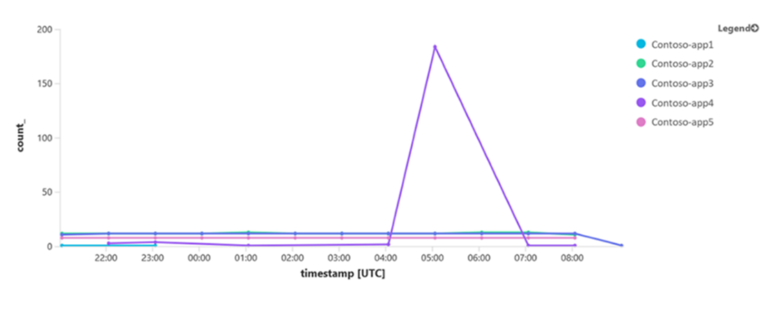

# OMS portal moving to Azure

> [!NOTE]
> This article applies to both the Azure public cloud and government cloud except where noted otherwise.

The Azure portal is the hub for all Azure services and offers a rich management experience with capabilities such as dashboards for pinning resources, intelligent search for finding resources, and tagging for resource management. To consolidate and streamline the monitoring and management workflow, we started adding the OMS portal capabilities into the Azure portal. All of the features of the OMS portal are now part of the Azure portal. In fact, some of the new features such as Traffic Analytics are only available in the Azure portal. You will be able to accomplish everything you were doing in the OMS portal with the Azure portal and more. If you haven’t already done so, you should start using the Azure portal today!

**The OMS portal will be officially retired on January 15, 2019** for Azure commercial cloud and for Azure US Government cloud, the OMS portal **will be officially retired on March 30, 2019.** We are excited to move to the Azure portal and expect the transition to be easy. But we understand changes are difficult and can be disruptive. Send any questions, feedback, or concerns to **LAUpgradeFeedback@microsoft.com**. The rest of this article goes over the key scenarios and the roadmap for this transition.

## What is changing? 
The following changes are being announced with the deprecation of the OMS portal. Each of these changes is described in more detail in the sections below.

- You can create new [workspaces only](#new-workspaces) in the Azure portal.
- The new alert management experience [replaces the Alert Management solution](#changes-to-alerts).
- [User access management](#user-access-and-role-migration) is now done in the Azure portal using Azure role-based access control.
- The [Application Insights Connector is no longer required](#application-insights-connector-and-solution) since the same functionality is enabled through cross-workspace queries.
- The [OMS Mobile App](#oms-mobile-app) is being deprecated. 
- The [NSG solution is being replaced](#azure-network-security-group-analytics) with enhanced functionality available via Traffic Analytics solution.
- New connections from System Center Operations Manager to Log Analytics require [updated management packs](#system-center-operations-manager).
- See [Migrate your OMS Update Deployments to Azure](../../automation/migrate-oms-update-deployments.md) for details on changes to [Update Management](../../automation/automation-update-management.md).


## What should I do now?
While most features will continue to work without performing any migration, you do need to perform the following tasks:

- You need to [migrate your user permissions](#user-access-and-role-migration) to the Azure portal.
- See [Migrate your OMS Update Deployments to Azure](../../automation/migrate-oms-update-deployments.md) for details on transitioning the Update Management solution.

Refer to [Common questions for transition from OMS portal to Azure portal for Log Analytics users](oms-portal-faq.md) for information about how to transition to the Azure portal. Send any feedback, questions, or concerns to **LAUpgradeFeedback@microsoft.com**.

## User access and role migration
Azure portal access management is richer and more powerful than the access management in the OMS Portal. See [Manage workspaces](manage-access.md#manage-accounts-and-users) for details of access management in Log Analytics.

> [!NOTE]
> Previous versions of this article stated that the permissions would automatically be converted from the OMS portal to the Azure portal. This automatic conversion is no longer planned, and you must perform the conversion yourself.

You may already have appropriate access in the Azure portal in which case you don't need to make any changes. There are a couple of cases where you may not have appropriate access in which case your administrator must assign you permissions.

- You have ReadOnly User permissions in the OMS portal but no permissions in the Azure portal. 
- You have Contributor permissions in the OMS portal but only Reader access in the Azure portal.
 
In both of these cases, your administrator needs to manually assign you the appropriate role from the following table. We recommend that you assign this role at the resource group or subscription level.  More prescriptive guidance will be provided shortly for both these cases.

| OMS portal permission | Azure Role |
|:---|:---|
| ReadOnly | Log Analytics Reader |
| Contributor | Log Analytics Contributor |
| Administrator | Owner | 
 

## New workspaces
You are no longer be able to create new workspaces using the OMS portal. Follow the guidance in [Create a Log Analytics workspace in the Azure portal](../../azure-monitor/learn/quick-create-workspace.md) to create a new workspace in the Azure portal.

## Changes to alerts

### Alert extension  

> [!NOTE]
> Alerts have now been fully extended into the Azure portal for the public cloud. Existing alert rules can be viewed in the OMS portal, but they can only be managed in the Azure portal. Extension of alerts into the Azure portal will start for the Azure government cloud on February, 2019.

Alerts have been [extended into the Azure portal](../../azure-monitor/platform/alerts-extend.md). Once this is complete, management actions on alerts will only be available in Azure portal. Existing alerts will continue to be listed in the OMS portal. If you access alerts programmatically by using the Log Analytics Alert REST API or Log Analytics Alert Resource Template, you'll need to use action groups instead of actions in your API calls, Azure Resource Manager templates, and PowerShell commands.

### Alert management solution
As a change from a previous announcement, the [Alert Management solution](../../azure-monitor/platform/alert-management-solution.md) will continue to be available and fully supported in the Azure portal. You can continue to install the solution from Azure Marketplace.

While the Alert Management solution continues to be available, we encourage you to use [Azure Monitor's unified alerting interface]((../../azure-monitor/platform/alerts-overview.md) to visualize and manage all alerts in Azure. This new experience natively aggregates alerts from multiple sources within Azure including log alerts from Log Analytics. If you are using Azure Monitor’s unified alerting interface, then the Alert Management solution is only required to enable integration of alerts from System Center Operation Manager to Azure. In Azure Monitor’s unified alerting interface, you can see distributions of your alerts, take advantage of automated grouping of related alerts via smart groups, and view alerts across multiple subscriptions while applying rich filters. Future advancements in alert management will primarily be available from this new experience. 

The data collected by the Alert Management solution (records with a type of Alert) continues to be in Log Analytics as long as the solution is installed for the workspace. 

## OMS Mobile App
The OMS mobile app will be sunsetted along with the OMS portal. Instead of the OMS mobile app, to access information about your IT infrastructure, dashboards and saved queries, you can access the Azure portal directly from your browser in your mobile device. To get alerts, you should configure [Azure Action Groups](../../azure-monitor/platform/action-groups.md) to receive notifications in the form of SMS or a voice call

## Application Insights Connector and solution
[Application Insights Connector](../../azure-monitor/platform/app-insights-connector.md) provides a way to include Application Insights data into a Log Analytics workspace. This data duplication was required to enable visibility across infrastructure and application data. With Application Insights extended data retention support in March, 2019 and the ability to perform [cross-resource queries](../../azure-monitor/log-query/cross-workspace-query.md), there is no need to duplicate data from your Application Insights resources and send it to Log Analytics. Furthermore, the Connector sends a subset of the applications properties to Log Analytics, while the cross-resource queries gives you enhanced flexibility.  

As such, Application Insights Connector will be deprecated and removed from Azure Marketplace along with OMS portal deprecation on March 30, 2019, while existing connections will continue to work until June 30, 2019. With OMS portal deprecation, there is no way to configure and remove existing connections from the portal.  This will be supported using the REST API that will be made available in January, 2019 and a notification will be posted on [Azure updates](https://azure.microsoft.com/updates/). 

### Recommendation for monitoring multiple Application Insights resources 
Listing multiple Application Insights resources in a query can be cumbersome and difficult to maintain. Instead, you can leverage function to separate the query logic from the applications scoping.  

This example demonstrates how you can monitor multiple Application Insights resources and visualize the count of failed requests by application name. Before you begin, run this query in the workspace that is connected to Application Insights resources to get the list of connected applications: 

```
ApplicationInsights
| summarize by ApplicationName
```

Create a function using union operator with the list of applications, then save the query as function with the alias applicationsScoping.  

```
union withsource=SourceApp 
app('Contoso-app1').requests,  
app('Contoso-app2').requests, 
app('Contoso-app3').requests, 
app('Contoso-app4').requests, 
app('Contoso-app5').requests 
| parse SourceApp with * "('" applicationName "')" *  
```

>[!NOTE]
>You can modify the listed applications at any time by navigating to Query explorer in the Logs portal and editing the function, or from the SavedSearch PowerShell cmdlet. The withsource= SourceApp command adds a column to the results that designates the application that sent the log. 
>
>The query uses Application Insights schema, although the query is executed in the workspace since the applicationsScoping function returns the Application Insights data structure. 
>
>The parse operator is optional in this example – it extracts the application name from SourceApp property. 

You are now ready to use applicationsScoping function in the cross-resource query. The function alias returns the union of the requests from all the defined applications. The query then filters for failed requests and visualizes the trends by application. 

### Query across Application Insights resources and workspace data 
When you stop the Connector and need to perform queries over a time range that was trimmed by Application Insights data retention (90 days), you need to perform [cross-resource queries](../../azure-monitor/log-query/cross-workspace-query.md) on the workspace and Application Insights resources for intermediate period. This is until your applications data accumulates per the new Application Insights data retention mentioned above. The query requires some manipulations since the schemas in Application Insights and the workspace are different. See the table later in this section highlighting the schema differences. 

For example, if the connector stopped working on 2018-11-01, when you query logs across Application Insights resources and applications data in the workspace, the query looks like the following:

```
applicationsScoping //this brings data from Application Insights resources 
| where timestamp between (datetime("2018-11-01") .. now()) 
| where success == 'False' 
| where duration > 1000 
| union ( 
    ApplicationInsights //this is Application Insights data in Log Analytics worspace 
    | where TimeGenerated < (datetime("2018-12-01") 
    | where RequestSuccess == 'False' 
    | where RequestDuration > 1000 
    | extend duration = RequestDuration //align to Application Insights schema 
    | extend timestamp = TimeGenerated //align to Application Insights schema 
    | extend name = RequestName //align to Application Insights schema 
    | extend resultCode = ResponseCode //align to Application Insights schema 
    | project-away RequestDuration , RequestName , ResponseCode , TimeGenerated 
) 
| project timestamp , duration , name , resultCode 
```

### Application Insights and Log Analytics workspace schema differences

| Log Analytics workspace properties| Application Insights resource properties|
|------------|------------| 
| AnonUserId | user_id|
| ApplicationId | appId|
| ApplicationName | appName|
| ApplicationTypeVersion | application_Version |
| AvailabilityCount | itemCount |
| AvailabilityDuration | duration |
| AvailabilityMessage | message |
| AvailabilityRunLocation | location |
| AvailabilityTestId | id |
| AvailabilityTestName | name |
| AvailabilityTimestamp | timestamp |
| Browser | client_browser |
| City | client_city |
| ClientIP | client_IP |
| Computer | cloud_RoleInstance | 
| Country | client_CountryOrRegion | 
| CustomEventCount | itemCount | 
| CustomEventDimensions | customDimensions |
| CustomEventName | name | 
| DeviceModel | client_Model | 
| DeviceType | client_Type | 
| ExceptionCount | itemCount | 
| ExceptionHandledAt | handledAt |
| ExceptionMessage | message | 
| ExceptionType | type |
| OperationID | operation_id |
| OperationName | opeation_Name | 
| OS | client_OS | 
| PageViewCount | itemCount |
| PageViewDuration | duration | 
| PageViewName | name | 
| ParentOpeartionID | operation_Id | 
| RequestCount | itemCount | 
| RequestDuration | duration | 
| RequestID | id | 
| RequestName | name | 
| RequestSuccess | success | 
| ResponseCode | resultCode | 
| Role | cloud_RoleName |
| RoleInstance | cloud_RoleInstance |
| SessionId | session_Id | 
| SourceSystem | operation_SyntheticSource |
| TelemetryTYpe | type |
| URL | _url |
| UserAccountId | user_AccountId |


## Azure Network Security Group Analytics
The [Azure Network Security Group Analytics solution](../../azure-monitor/insights/azure-networking-analytics.md#azure-network-security-group-analytics-solution-in-log-analytics) will be replaced with the recently launched [Traffic Analytics](https://azure.microsoft.com/blog/traffic-analytics-in-preview/) which provides visibility into user and application activity on cloud networks. Traffic Analytics helps you audit your organization's network activity, secure applications and data, optimize workload performance and stay compliant. 

This solution analyzes NSG Flow logs and provides insights into the following.

- Traffic flows across your networks between Azure and Internet, public cloud regions, VNETs, and subnets.
- Applications and protocols on your network, without the need for sniffers or dedicated flow collection appliances.
- Top talkers, chatty applications, VM conversations in the cloud, traffic hotspots.
- Sources and destinations of traffic across VNETs, inter-relationships between critical business services and applications.
- Security including malicious traffic, ports open to the Internet, applications or VMs attempting Internet access.
- Capacity utilization, which helps you eliminate issues of over provisioning or underutilization.

You can continue to rely on Diagnostics Settings to send NSG logs to Log Analytics so your existing saved searches, alerts, dashboards will continue to work. Customers who have already installed the solution can continue to use it until further notice. Starting September 5, the Network Security Group Analytics solution will be removed from the marketplace and made available through the community as a [Azure QuickStart Template](https://azure.microsoft.com/resources/templates/?resourceType=Microsoft.Operationalinsights).

## System Center Operations Manager
If you've [connected your Operations Manager management group to Log Analytics](../../azure-monitor/platform/om-agents.md), then it will continue to work with no changes. For new connections though, you must follow the guidance in [Microsoft System Center Operations Manager Management Pack to configure Operations Management Suite](https://blogs.technet.microsoft.com/momteam/2018/07/25/microsoft-system-center-operations-manager-management-pack-to-configure-operations-management-suite/).

## Next steps
- See [Common questions for transition from OMS portal to Azure portal for Log Analytics users](oms-portal-faq.md) for guidance on moving from the OMS portal to the Azure portal.
