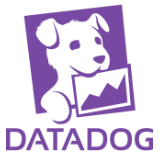
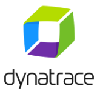

# Azure Monitor partner integrations

Listed in alphabetical order. 

## AlertLogic Log Manager

Alert Logic Log Manager collects VM, application, and Azure platform logs for security analysis and retention. It also collects the Azure Activity Log through the Azure Monitor API. This information is used to detect malfeasance and meet compliance requirements.

[Go to the documentation.][alertlogic-doc]

 

## AppDynamics

AppDynamics Application Performance Management (APM) enables application owners to rapidly troubleshoot performance bottlenecks and optimize the performance of their applications running in Azure environment. It can monitor Azure Cloud Services (PaaS), web & worker roles, Virtual Machines (IaaS), Remote Service Detection (Microsoft Azure Service Bus), Microsoft Azure Queue, Microsoft Azure Remote Services (Azure Blob), Azure Queue (Microsoft Service Bus), Data Storage, and Microsoft Azure Blob Storage. AppDynamics APM is available in the Azure Marketplace.

[Go to the documentation.][appdynamics-doc]

## Microfocus ArcSight

ArcSight has a smart connector for Azure Monitor event hubs.

[Learn more.][arcsight-doc]

## Atlassian JIRA

You can create JIRA tickets on Azure Monitor alerts.

[Go to the documentation.][atlassian-doc]

## Botmetric

[Learn more.][botmetric-doc]

## Circonus

Circonus is a microservices monitoring and analytics platform built for on premises or SaaS deployment. It is fully automatable API-Centric platform is more scalable and reliable than systems it monitors. Developed for the requirements of DevOps, Circonus delivers percentile-based alerts, graphs, dashboards, and machine-learning intelligence that enable business optimization. Circonus monitors your Microsoft Azure cloud resources and their applications in real time. You can use Circonus to collect and track metrics for the variables you want to measure for your resources and applications. With Circonus, you gain system-wide visibility into Azure’s resource utilization, application performance, and operational health.

[Go to the documentation.][circonus-doc]

## CloudHealth

Unite and automate your cloud with a platform built to save time and money. CloudHealth provides visibility, intuitive optimization, and rock-solid governance practices for cloud management. The Cloudhealth platform enables enterprises and MSPs to maximize return on cloud investments. Make confident decisions around cost, usage, performance, and security.

[Learn More.][cloudhealth-doc]

## CloudMonix

CloudMonix offers monitoring, automation, and self-healing services for Microsoft Azure platform.

[Go to the documentation.][cloudmonix-doc]

## Datadog

Datadog is the world’s leading monitoring service for cloud-scale applications. It brings together data from servers, databases, tools, and services to present a unified view of your entire stack. These capabilities are provided on a SaaS-based data analytics platform. This service enables Dev and Ops teams to work collaboratively to avoid downtime, resolve performance problems, and ensure that development and deployment cycles finish on time. By integrating Datadog and Azure, you can collect and view metrics from across your infrastructure. Correlate VM metrics with application-level metrics. Slice and dice your metrics using any combination of properties and custom tags.

[Go to the documentation.][datadog-doc]

## Dynatrace

The Dynatrace OneAgent integrates with Azure VMs and App Services via the Azure extension mechanism. This way Dynatrace OneAgent can gather performance metrics about hosts, network, and services. Besides just displaying metrics, Dynatrace visualizes environments end-to-end. It shows transactions from the client side to the database layer. Dynatrace provides AI-based correlation of problems and fully integrated root-cause-analysis to give method level insights into code and database. This insight makes troubleshooting and performance optimizations much easier.

[Go to the documentation.][dynatrace-doc]

## Elastic

Elastic is a search company. As the creators of the Elastic Stack (Elasticsearch, Kibana, Beats, and Logstash), Elastic builds self-managed and SaaS offerings that make data usable in real time and at scale for search, logging, security, and analytics use cases.

[Go to the documentation.][elastic-doc]

## Grafana

Grafana is an open-source application that enables you to visualize time series metric data.

[Go to the documentation.][grafana-doc]

## InfluxData

InfluxData, the creator of InfluxDB, delivers a modern Open Source Platform built from the ground up for analyzing metrics and events (time series data) for DevOps and IoT applications. Whether the data comes from humans, sensors, or machines, InfluxData empowers developers to build next-generation monitoring, analytics, and IoT applications faster, easier, and to scale delivering real business value quickly. Based in San Francisco, InfluxData’s more than 420 customers include Cisco, eBay, IBM, and Siemens.

[Go to the documentation.][influxdata-doc]

## Logic Monitor

LogicMonitor® is the leading SaaS-based, performance monitoring platform for complex IT infrastructure. With coverage for thousands of technologies, LogicMonitor provides granular visibility into infrastructure and application performance. LM Cloud’s comprehensive Azure monitoring enables users to correlate the performance of Azure cloud, on-premises, and hybrid cloud resources -- all from a single platform. Automated resource discovery, built in monitoring templates, preconfigured alert thresholds, and customizable dashboards combine to give IT the speed, flexibility, and visibility required to succeed.

[Go to the documentation.][logicmonitor-doc]

## Moogsoft

Moogsoft AIOps accelerates the agile business transformation.

Microsoft Azure Automation and Control tools provide a real-time window into the status of the Applications and microservices deployed in Azure. They help orchestrate diagnostics and runbooks for faster remediation. Other third-party tools provide a window into the on-premises Applications and infrastructure status.

Moogsoft AIOps automates the Event to Remediation workflow without changing existing processes and organizational structure. 

Moogsoft runs in your Azure real-estate with integration to monitoring and automation tools across the hybrid fabric. Moogsoft 
 - actively detects application impacting incidents earlier 
 - dynamically orchestrates the appropriate resources to make them situation aware 
 - reduces the mean time to remediate and adverse impact on customer experience. 

[Go to the documentation.][moogsoft-doc]

## NewRelic

[Learn more.][newrelic-doc]

## OpsGenie

OpsGenie acts as a dispatcher for the alerts generated by Azure. OpsGenie determines the right people to notify based on on-call schedules and escalations. It can notify them using by email, text messages (SMS), phone calls, or push notifications. Azure generates alerts for detected problems. OpsGenie ensures the right people are working on the problem.

[Go to the documentation.][opsgenie-doc]

## PagerDuty

PagerDuty, the leading incident management solution, has provided first-class support for Azure Alerts on metrics. PagerDuty supports notifications on Azure Monitor alerts, autoscale notifications, activity log events, and platform-level metrics for Azure services. These enhancements give you increased visibility into the core Azure Platform. You can take full advantage of PagerDuty’s incident management capabilities for real-time response. The expanded Azure integration is made possible through webhooks. Webhooks allow you to set up and customize the solution quickly and easily.

[Go to the documentation.][pagerduty-doc]

## QRadar

The Microsoft Azure DSM and Microsoft Azure Event Hub Protocol are available for download from [the IBM support website](https://www.ibm.com/support). You can [learn more about the integration with Azure here][qradar-doc].

## ScienceLogic

ScienceLogic delivers the next generation IT service assurance platform for managing any technology, anywhere. ScienceLogic delivers the scale, security, automation, and resiliency necessary to simplify the tasks of managing IT resources, services, and applications. The ScienceLogic platform uses Azure APIs to interface with Microsoft Azure. ScienceLogic gives you real-time visibility into your Azure services and resources. So you know when something’s not working and you can fix it faster. You can also manage Azure alongside your other clouds and data center systems and services.

[Learn more.][sciencelogic-doc]

## Serverless360

Serverless360 is a one platform tool to operate, manage, and monitor Azure serverless components. Manageability is one of the key challenges with serverless implementations. Hundreds of small, discrete serverless services are scattered in various places – managing and operating such solutions is complex. Serverless360 solves these challenges with rich set of sophisticated tools. It can monitor serverless services like Azure Functions, Logic Apps, Event Grids, Service Bus Queues, Topics, Relays, Event Hubs, Storage queues, files, blob, and tables. Serverless360 is available in the Azure Marketplace. These capabilities are available on both SaaS and private hosting (hosted on your own environment).  

[Learn more.][serverless360-doc]

## SignalFx

SignalFx is the leader in real-time operational intelligence for data-driven DevOps. The service discovers and collects metrics across every component in the cloud. It replaces traditional point tools and provides real-time visibility into today’s dynamic environments. Leveraging the massively scalable SignalFx platform, the SaaS platform is optimized for container and microservices based architectures and provides powerful visualization, proactive alerting, and collaborative triage capabilities across organizations of all sizes. SignalFx integrates directly with Azure Monitor as well as through open-source connectors such as *Telegraf*, *statsD*, and *collectd* to provide best in class dashboards, analytics, and alerts for Azure.

[Go to the documentation.][signalfx-doc]

## SIGNL4

SIGNL4 - the mobile alerting app for operations teams - is the fastest way to route critical alerts from Azure Monitor to the right people at the right time – anywhere by push, text, and voice calls. SIGNL4 manages on-call duties and shifts of your team, tracks delivery and ownership of alerts and escalates if necessary. Full transparency across your team is provided. Using the super-easy REST web-hook of SIGNL4 any Azure service can be connected with no effort. With SIGNL4, you will see up to 10x faster response over email notifications and manual alerting.

[Go to the documentation.][signl4-doc]

## SolarWinds

[Learn more.][solarwinds-doc]

## Splunk

The Azure Monitor Add-on for Splunk is [available in the Splunkbase here](https://splunkbase.splunk.com/app/3534/).

[Go to the documentation.][splunk-doc]

## Sumo Logic

Sumo Logic is a secure, cloud-native, machine data analytics service, delivering real-time, continuous intelligence from structured, semi-structured, and unstructured data across the entire application lifecycle and stack. More than 1,000 customers around the globe rely on Sumo Logic for the analytics and insights to build, run, and secure their applications and cloud infrastructures. With Sumo Logic, customers gain a multi-tenant, service-model advantage to help increase competitive advantage, business value, and growth.

[Learn more.][sumologic-doc]

## Turbonomic

Turbonomic delivers workload automation for hybrid clouds by simultaneously optimizing performance, cost, and compliance in real time. Turbonomic helps organizations be elastic in their Azure estate by continuously optimizing the estate to ensure applications constantly get the resources they require to deliver their SLA and nothing more across compute, storage, and network for the IaaS and PaaS layer. Organizations can simulate migrations, properly scale workloads, and retire datacenter resources to responsibly migrate to Azure on-time, within budget, while assuring both performance and compliance. Turbonomic is API driven and runs as an agentless VM in Azure and on-premises.

[Learn more.][turbonomic-doc]

## Next steps
- [Learn more about Azure Monitor](../../azure-monitor/overview.md)
- [Access metrics using the REST API](rest-api-walkthrough.md)
- [Stream the Activity Log to a non-Microsoft service](../../azure-monitor/platform/activity-logs-stream-event-hubs.md)
- [Stream Diagnostic Logs to a non-Microsoft service](../../azure-monitor/platform/diagnostic-logs-stream-event-hubs.md)

<!--Partner Documentation-->
[alertlogic-doc]: https://legacy.docs.alertlogic.com/userGuides/log-manager-collection-sources.htm "AlertLogic documentation."
[appdynamics-doc]: https://www.appdynamics.com/net/azure/ "AppDynamics documentation."
[arcsight-doc]: https://community.softwaregrp.com/t5/Discussions/Announcing-General-Availability-of-ArcSight-Smart-Connectors-7/m-p/1671852 "ArcSight documentation."
[atlassian-doc]: https://azure.microsoft.com/blog/automated-notifications-from-azure-monitor-for-atlassian-jira/
[botmetric-doc]: https://www.botmetric.com/blog/announcing-botmetric-cost-governance-beta-microsoft-azure/ "Botmetric introduction."
[circonus-doc]: https://support.circonus.com/support/solutions/articles/24000013515-azure-integration 
[cloudhealth-doc]: https://www.cloudhealthtech.com/azure
[cloudmonix-doc]: https://cloudmonix.com/features/azure-management/ "CloudMonix introduction."
[datadog-doc]: https://docs.datadoghq.com/integrations/azure/ "Datadog documentation."
[dynatrace-doc]: https://help.dynatrace.com/infrastructure-monitoring/paas/how-do-i-monitor-microsoft-azure-web-apps/ "Dynatrace documentation."
[elastic-doc]: https://www.elastic.co/guide/en/logstash/master/azure-module.html "Elastic documentation."
[grafana-doc]: ./grafana-plugin.md "Azure Monitor Grafana integration."
[influxdata-doc]: ./../../azure-monitor/platform/collect-custom-metrics-linux-telegraf.md "Azure Monitor Influx data Telegraf integration."
[logicmonitor-doc]: https://www.logicmonitor.com/lmcloud-azure/ "Logic Monitor documentation."
[moogsoft-doc]: https://www.moogsoft.com/partners/microsoft-azure "Moogsoft documentation."
[newrelic-doc]: https://newrelic.com/azure "NewRelic documentation."
[opsgenie-doc]: https://www.opsgenie.com/docs/integrations/azure-integration "OpsGenie documentation."
[pagerduty-doc]: https://www.pagerduty.com/docs/guides/azure-integration-guide/ "PagerDuty documentation."
[qradar-doc]: https://www.ibm.com/support/knowledgecenter/SS42VS_DSM/c_dsm_guide_microsoft_azure_overview.html?cp=SS42VS_7.3.0 "QRadar documentation."
[sciencelogic-doc]: https://www.sciencelogic.com/product/technologies/microsoft/azure "ScienceLogic documentation."
[serverless360-doc]: https://docs.serverless360.com/docs/ "Serverless360 documentation."
[signalfx-doc]: https://docs.signalfx.com/en/latest/getting-started/send-data.html#connect-to-azure "SignalFx documentation."
[signl4-doc]: https://www.signl4.com/blog/mobile-alert-notifications-azure-monitor/ "SIGNL4 documentation."
[solarwinds-doc]: https://www.solarwinds.com/topics/azure-monitoring "SolarWinds documentation."
[splunk-doc]: https://github.com/Microsoft/AzureMonitorAddonForSplunk/wiki/Azure-Monitor-Addon-For-Splunk "Splunk documentation."
[sumologic-doc]: https://www.sumologic.com/azure "SumoLogic documentation."
[turbonomic-doc]: https://turbonomic.com/solutions/technologies/azure-cloud/ "Turbonomic introduction."

