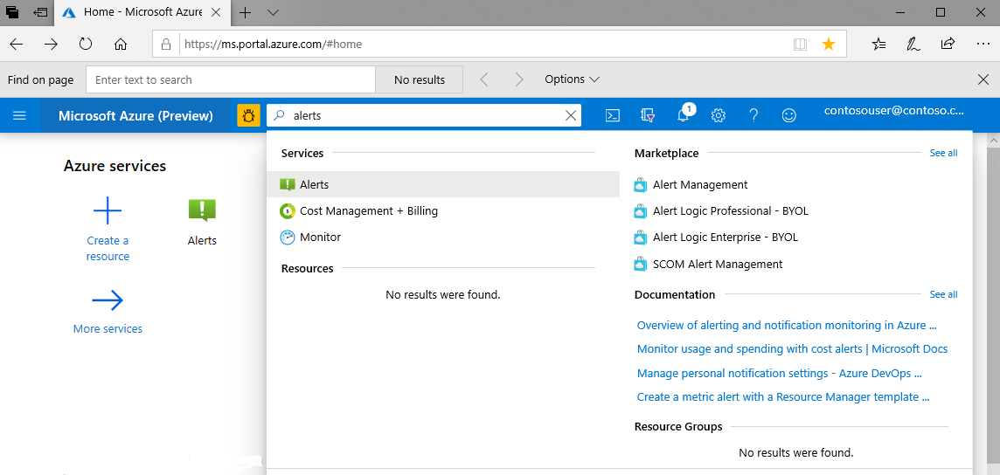
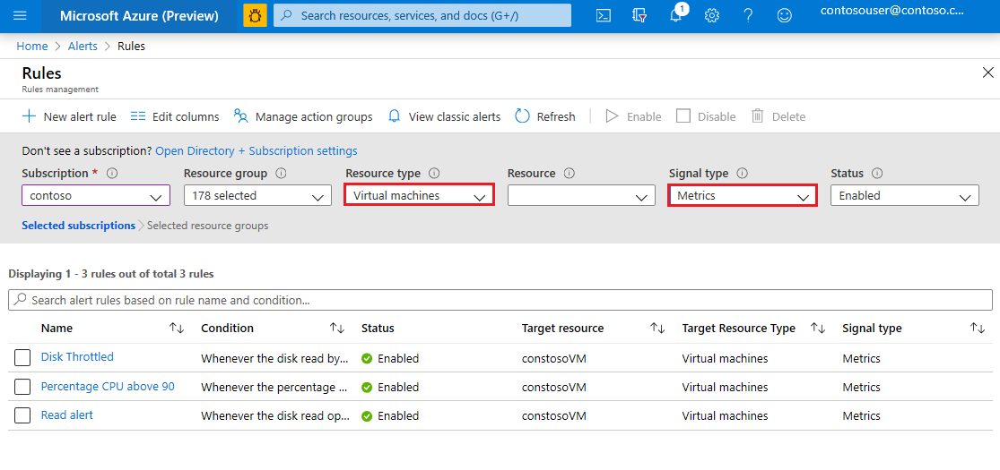
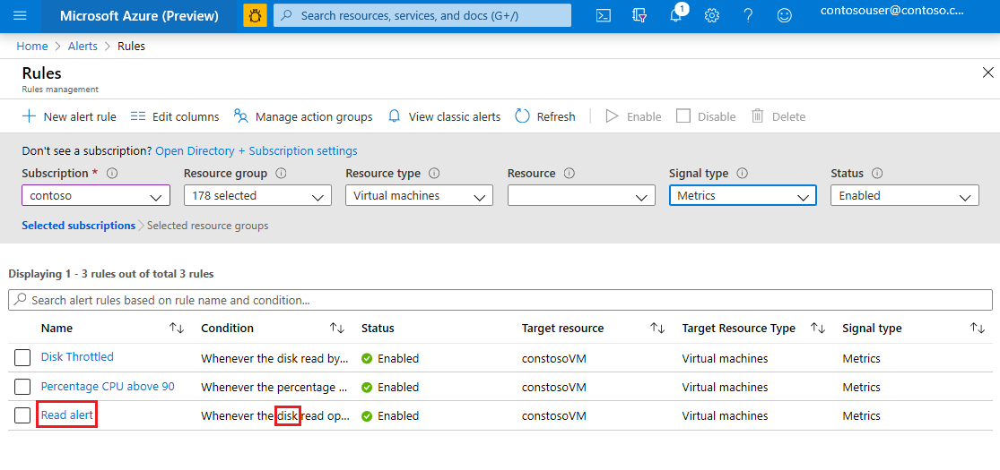
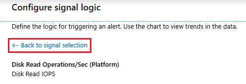
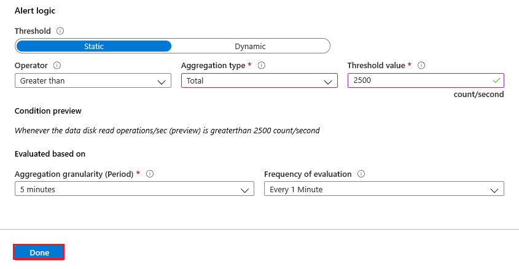
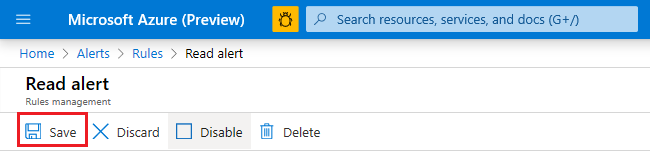

# Disk metrics deprecation in the Azure portal

Deprecated disk-related metrics will soon be removed from the Azure portal. A new version of each deprecated metric is available for you to use. This article shows you which metrics are new and how to update your metric alerts to use them.

## List of new metrics

This table maps each deprecated metric to it's corresponding new metric. 

|Deprecated metric|New (replacement) metric|
|----|----|
|Data Disk QD (Deprecated)|Data Disk Queue Depth (Preview)|
|Data Disk Read Bytes/Sec (Deprecated)|Data Disk Read Bytes/Sec (Preview)|
|Data Disk Read Operations/Sec (Deprecated)|Data Disk Read Operations/Sec (Preview)|
|Data Disk Write Bytes/Sec (Deprecated)|Data Disk Write Bytes/Sec (Preview)|
|Data Disk Write Operations/Sec (Deprecated)|Data Disk Write Operations/Sec (Preview)|
|OS QD (Deprecated)|OS Queue Depth (Preview)|
|OS Read Bytes/Sec (Deprecated)|OS Read Bytes/Sec (Preview)|
|OS Read Operations/Sec (Deprecated)|OS Read Operations/Sec (Preview)|
|OS Write Bytes/Sec (Deprecated)|OS Write Bytes/Sec (Preview)|
|OS Write Operations/Sec (Deprecated)|OS Write Operations/Sec (Preview)|

<a id="update-metrics" />

## Migrate metrics in your metric alerts

Update your metric alerts to use new metrics.

1. In the Azure portal, search for **Alerts**. Then, in the **Services** section, choose **Alerts**.

   > [!div class="mx-imgBorder"]
   > 

2. In the **Alerts** page, choose the **Manage Alert Rules** button. 

   > [!div class="mx-imgBorder"]
   > 

3. In the **Resource group** drop-down list, select the **Virtual Machines** checkbox, and in the **Signal type** drop-down-list, select the **Metrics** checkbox. 

   > [!div class="mx-imgBorder"]
   > 

4. In the list of metrics, identify conditions that relate to disks. Click the name of the rule. 

   The name appears as a hyperlink in the **Name** column of the table.

   > [!div class="mx-imgBorder"]
   > 

5. In the **Conditions** section of the **Rules management** page, click the condition of the alert. 

   The condition appears as a hyperlink.  

   > [!div class="mx-imgBorder"]
   > 

   The **Configure signal logic** page appears and the settings of the condition appear in the **Alert logic** section of that page.

6. Make a record of these settings as they'll disappear when you remove the deprecated metric.

   > [!div class="mx-imgBorder"]
   > 

   > [!TIP] 
   > Consider capturing these settings in a screenshot or in a text file. 

7. Click the **Back to signal selection** link.

   > [!div class="mx-imgBorder"]
   > 

8. In the **Configure signal logic** page, choose the appropriate replacement metric (new metric). Use the [table](#update-metrics) that appears earlier in this article to identity the name of the new metric.

   > [!TIP] 
   > Begin typing in the search bar to narrow the list of metric names. 

   > [!div class="mx-imgBorder"]
   > 

9. Choose the **Done** button. 

   > [!div class="mx-imgBorder"]
   > 

10. Commit your changes by choosing the **Save** button. 

    > [!div class="mx-imgBorder"]
    > 

