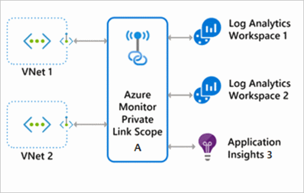
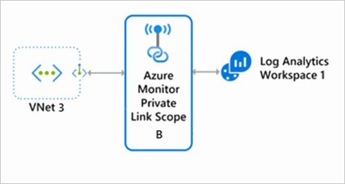
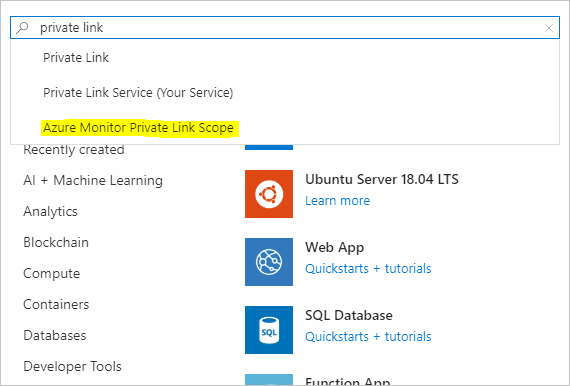
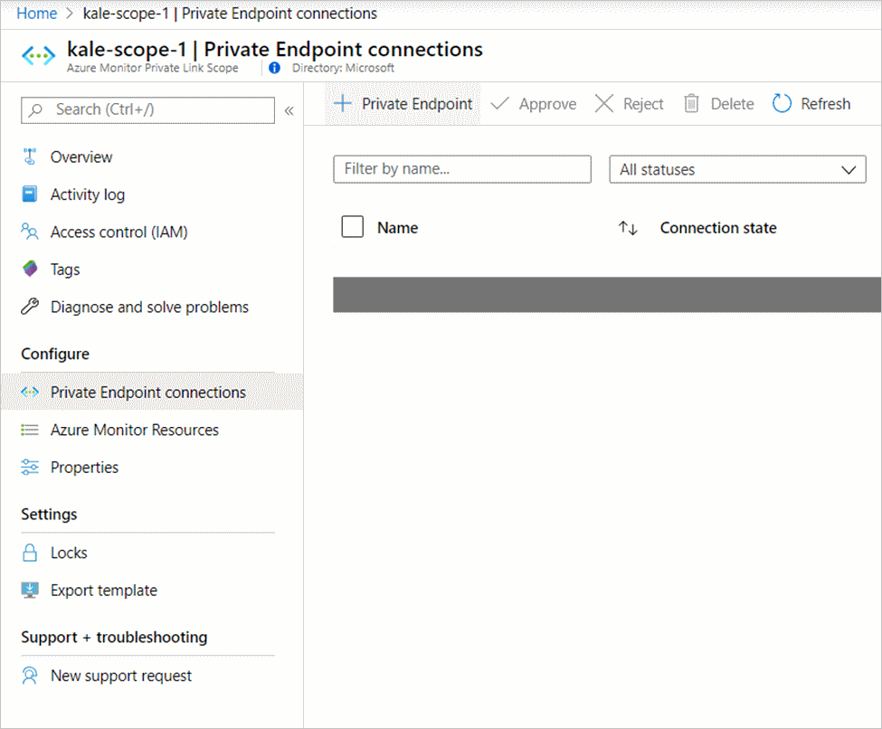
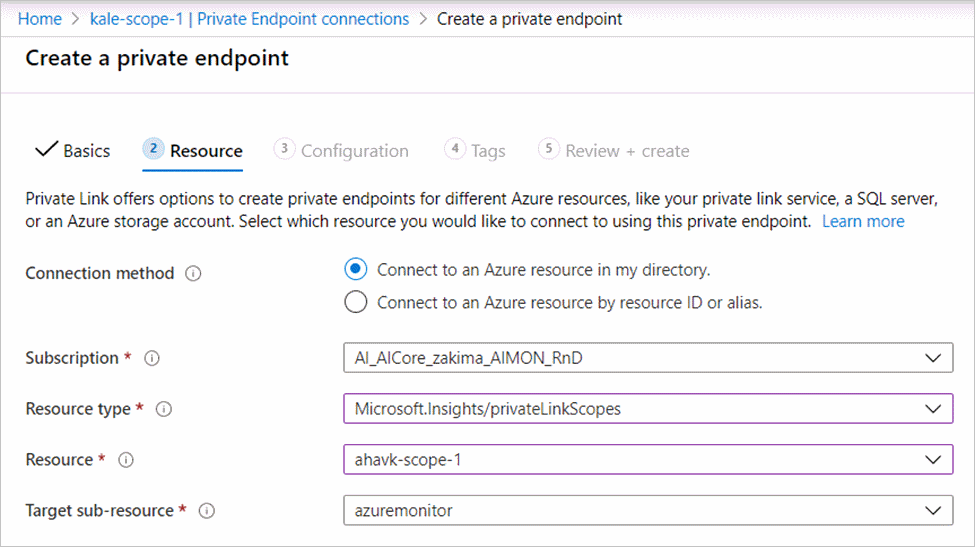
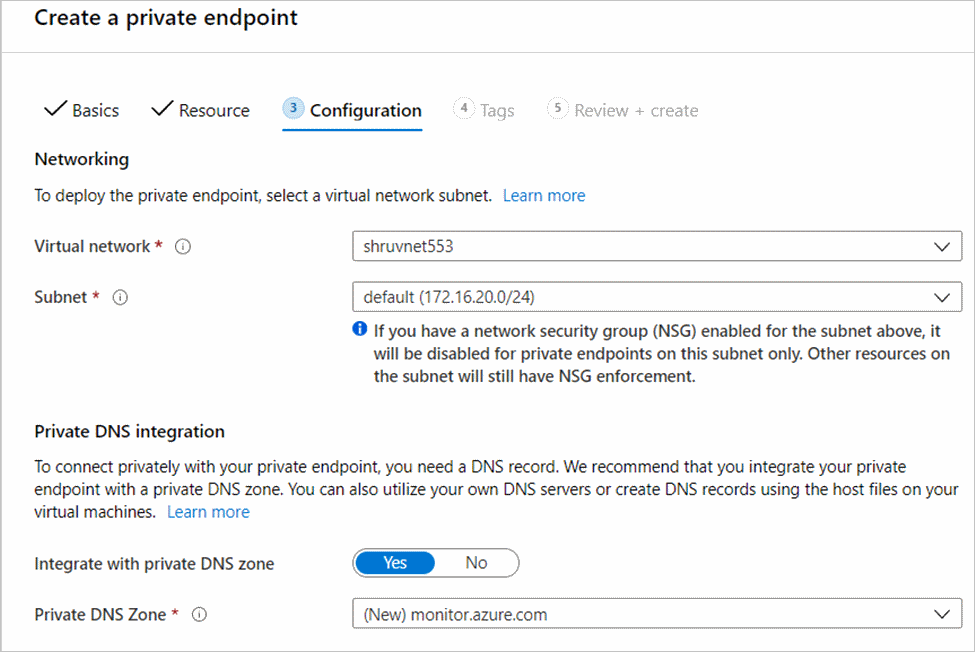
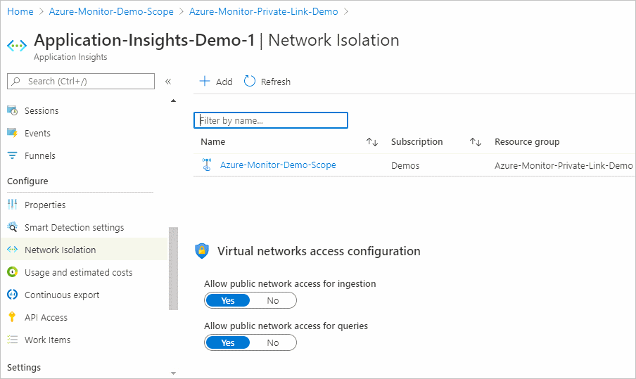

# Use Azure Private Link to securely connect networks to Azure Monitor

> [!IMPORTANT]
> At this time, you must **request access** to use this capability. You may apply for access using the [signup form](https://aka.ms/AzMonPrivateLinkSignup).


[Azure Private Link](../../private-link/private-link-overview.md) allows you to securely link Azure PaaS services to your virtual network using private endpoints. For many services, you just set up an endpoint per resource. However, Azure Monitor is a constellation of different interconnected services that work together to monitor your workloads. As a result, we have built a resource called an Azure Monitor Private Link Scope (AMPLS) that allows you to define the boundaries of your monitoring network and connect to your virtual network. This article covers when to use and how to set up an Azure Monitor Private Link Scope.

## Advantages

With Private Link you can:

- Connect privately to Azure Monitor without opening up any public network access
- Ensure your monitoring data is only accessed through authorized private networks
- Prevent data exfiltration from your private networks by defining specific Azure Monitor resources that connect through your private endpoint
- Securely connect your private on-premises network to Azure Monitor using ExpressRoute and Private Link
- Keep all traffic inside the Microsoft Azure backbone network

For more information, see  [Key Benefits of Private Link](../../private-link/private-link-overview.md#key-benefits).

## How it works

Azure Monitor Private Link Scope is a grouping resource to connect one or more private endpoints (and therefore the virtual networks they are contained in) to one or more Azure Monitor resources. The resources include Log Analytics workspaces and Application Insights components.


> [!NOTE]
> A single Azure Monitor resource can belong to multiple AMPLSs, but you cannot connect a single VNet to more than one AMPLS. 

## Planning based on your network

Before setting up your AMPLS resources, consider your network isolation requirements. Evaluate your virtual networks' access to public internet, and the access restrictions of each of your Azure Monitor resources (that is, Application Insights components and Log Analytics workspaces).

### Evaluate which virtual networks should connect to a Private Link

Start by evaluating which of your virtual networks (VNets) have restricted access to the internet. VNets that have free internet may not require a Private Link to access your Azure Monitor resources. The monitoring resources your VNets connect to may restrict incoming traffic and require a Private Link connection (either for log ingestion or query). In such cases, even a VNet that has access to the public internet needs to connect to these resources over a Private Link, and through an AMPLS.

### Evaluate which Azure Monitor resources should have a Private Link

Review each of your Azure Monitor resources:

- Should the resource allow ingestion of logs from resources located on specific VNets only?
- Should the resource be queried only by clients located on specific VNETs?

If the answer to any of these questions is yes, set the restrictions as explained in [Configuring Log Analytics](#configure-log-analytics) workspaces and [Configuring Application Insights components](#configure-application-insights) and associate these resources to a single or several AMPLS(s). Virtual networks that should access these monitoring resources need to have a Private Endpoint that connects to the relevant AMPLS.
Remember – you can connect the same workspaces or application to multiple AMPLS, to allow them to be reached by different networks.

### Group together monitoring resources by network accessibility

Since each VNet can connect to only one AMPLS resource, you must group together monitoring resources that should be accessible to the same networks. The simplest way to manage this grouping is to create one AMPLS per VNet, and select the resources to connect to that network. However, to reduce resources and improve manageability, you may want to reuse an AMPLS across networks.

For example, if your internal virtual networks VNet1 and VNet2 should connect to workspaces Workspace1 and Workspace2 and Application Insights component Application Insights 3, associate all three resources to the same AMPLS. If VNet3 should only access Workspace1, create another AMPLS resource, associate Workspace1 to it, and connect VNet3 as shown in the following diagrams:





## Example connection

Start by creating an Azure Monitor Private Link Scope resource.

1. Go to **Create a resource** in the Azure portal and search for **Azure Monitor Private Link Scope**.

   

2. Click **create**.
3. Pick a Subscription and Resource Group.
4. Give the AMPLS a name. It is best to use a name that is clear what purpose and security boundary the Scope will be used for so that someone won't accidentally break network security boundaries. For example, "AppServerProdTelem".
5. Click **Review + Create**. 

   

6. Let the validation pass, and then click **Create**.

## Connect Azure Monitor resources

You can connect your AMPLS first to private endpoints and then to Azure Monitor resources or vice versa, but the connection process goes faster if you start with your Azure Monitor resources. Here's how we connect Azure Monitor Log Analytics workspaces and Application Insights components to an AMPLS

1. In your Azure Monitor Private Link scope, click on **Azure Monitor Resources** in the left-hand menu. Click the **Add** button.
2. Add the workspace or component. Clicking the **Add** button brings up a dialog where you can select Azure Monitor resources. You can browse through your subscriptions and resource groups, or you can type in their name to filter down to them. Select the workspace or component and click **Apply** to add them to your scope.

    

### Connect to a private endpoint

Now that you have resources connected to your AMPLS, create a private endpoint to connect our network. You can do this task in the [Azure portal Private Link center](https://portal.azure.com/#blade/Microsoft_Azure_Network/PrivateLinkCenterBlade/privateendpoints), or inside your Azure Monitor Private Link Scope, as done in this example.

1. In your scope resource, click on **Private Endpoint connections** in the left-hand resource menu. Click on **Private Endpoint** to start the endpoint create process. You can also approve connections that were started in the Private Link center here by selecting them and clicking **Approve**.

    

2. Pick the subscription, resource group, and name of the endpoint, and the region it should live in. The region needs to be the same region as the virtual network you will connect it to.

3. Click **Next: Resource**. 

4. In the Resource screen,

   a. Pick the **Subscription** that contains your Azure Monitor Private Scope resource. 

   b. For **resource type**, choose **Microsoft.insights/privateLinkScopes**. 

   c. From the **resource** drop-down, choose your Private Link scope you created earlier. 

   d. Click **Next: Configuration >**.
      

5. On the configuration pane,

   a.    Choose the **virtual network** and **subnet** that you want to connect to your Azure Monitor resources. 
 
   b.    Choose **Yes** for **Integrate with private DNS zone**, and let it automatically create a new Private DNS Zone. 
 
   c.    Click **Review + create**.
 
   d.    Let validation pass. 
 
   e.    Click **Create**. 

    

You have now created a new private endpoint that is connected to this Azure Monitor Private Link scope.

## Configure Log Analytics

Go to the Azure portal. In your Azure Monitor Log Analytics workspace resource is a menu item **Network Isolation** on the left-hand side. You can control two different states from this menu. 


First, you can connect this Log Analytics resource to any Azure Monitor Private Link scopes that you have access to. Click **Add** and select the Azure Monitor Private Link Scope.  Click **Apply** to connect it. All connected scopes show up in this screen. Making this connection allows network traffic in the connected virtual networks to reach this workspace. Making the connection has the same effect as connecting it from the scope as we did in [Connecting Azure Monitor resources](#connect-azure-monitor-resources).  

Second, you can control how this resource can be reached from outside of the private link scopes listed above. 
If you set **Allow public network access for ingestion** to **No**, then machines outside of the connected scopes cannot upload data to this workspace. If you set **Allow public network access for queries** to **No**, then machines outside of the scopes cannot access data in this workspace. That data includes access to workbooks, dashboards, query API-based client experiences, insights in the Azure portal, and more. Experiences running outside the Azure portal which consume Log Analytics data also have to be running within the private-linked VNET.

Restricting access in this manner only applies to data in the workspace. Configuration changes, including turning these access settings on or off, are managed by Azure Resource Manager. Restrict access to Resource Manager using the appropriate roles, permissions, network controls, and auditing. For more information, see [Azure Monitor Roles, Permissions, and Security](roles-permissions-security.md).

> [!NOTE]
> Logs and metrics uploaded to a workspace via [Diagnostic Settings](diagnostic-settings.md) go over a secure private Microsoft channel, and are not controlled by these settings.

## Configure Application Insights

Go to the Azure portal. In your Azure Monitor Application Insights component resource is a menu item **Network Isolation** on the left-hand side. You can control two different states from this menu.



First, you can connect this Application Insights resource to Azure Monitor Private Link scopes that you have access to. Click **Add** and select the **Azure Monitor Private Link Scope**. Click Apply to connect it. All connected scopes show up in this screen. Making this connection allows network traffic in the connected virtual networks to reach this component. Making the connection has the same effect as connecting it from the scope as we did in [Connecting Azure Monitor resources](#connect-azure-monitor-resources). 

Second, you can control how this resource can be reached from outside of the private link scopes listed previously. If you set **Allow public network access for ingestion** to **No**, then machines or SDKs outside of the connected scopes cannot upload data to this component. If you set **Allow public network access for queries** to **No**, then machines outside of the scopes cannot access data in this Application Insights resource. That data includes access to APM logs, metrics, and the live metrics stream, as well as experiences built on top such as workbooks, dashboards, query API-based client experiences, insights in the Azure portal, and more. 

Note that non-portal consumption experiences also have to be running within the private-linked VNET that includes the monitored workloads. 

You’ll need to add resources hosting the monitored workloads to the private link. Here’s [documentation](https://docs.microsoft.com/azure/app-service/networking/private-endpoint) for how to do this for App Services.

Restricting access in this manner only applies to data in the Application Insights resource. Configuration changes, including turning these access settings on or off, are managed by Azure Resource Manager. Instead, restrict access to Resource Manager using the appropriate roles, permissions, network controls, and auditing. For more information, see [Azure Monitor Roles, Permissions, and Security](roles-permissions-security.md).

> [!NOTE]
> To fully secure workspace-based Application Insights, you need to lock down both access to Application Insights resource as well as the underlying Log Analytics workspace.
>
> Code-level diagnostics (profiler/debugger) need you to provide your own storage account to support private link. Here's [documentation](https://docs.microsoft.com/azure/azure-monitor/app/profiler-bring-your-own-storage) for how to do this.

## Use APIs and command line

You can automate the process described earlier using Azure Resource Manager templates and command-line interfaces.

To create and manage private link scopes, use [az monitor private-link-scope](https://docs.microsoft.com/cli/azure/monitor/private-link-scope?view=azure-cli-latest). Using this command, you can create scopes, associate Log Analytics workspaces and Application Insights components, and add/remove/approve private endpoints.

To manage network access, use the flags `[--ingestion-access {Disabled, Enabled}]` and `[--query-access {Disabled, Enabled}]`on [Log Analytics workspaces](https://docs.microsoft.com/cli/azure/monitor/log-analytics/workspace?view=azure-cli-latest) or [Application Insights components](https://docs.microsoft.com/cli/azure/ext/application-insights/monitor/app-insights/component?view=azure-cli-latest).

## Collect custom logs over Private Link

Storage accounts are used in the ingestion process of custom logs. By default, service-managed storage accounts are used. However to ingest custom logs on private links, you must use your own storage accounts and associate them with Log Analytics workspace(s). See more details on how to set up such accounts using the [command line](https://docs.microsoft.com/cli/azure/monitor/log-analytics/workspace/linked-storage?view=azure-cli-latest).

For more information on bringing your own storage account, see [Customer-owned storage accounts for log ingestion](private-storage.md)

## Restrictions and limitations

### Agents

The latest versions of the Windows and Linux agents must be used on private networks to enable secure telemetry ingestion to Log Analytics workspaces. Older versions cannot upload monitoring data in a private network.

**Log Analytics Windows agent**

Use the Log Analytics agent version 10.20.18038.0 or later.

**Log Analytics Linux agent**

Use agent version 1.12.25 or later. If you cannot, run the following commands on your VM.

```cmd
$ sudo /opt/microsoft/omsagent/bin/omsadmin.sh -X
$ sudo /opt/microsoft/omsagent/bin/omsadmin.sh -w <workspace id> -s <workspace key>
```

### Azure portal

To use Azure Monitor portal experiences such as Application Insights and Log Analytics, you need to allow the Azure portal and Azure Monitor extensions to be accessible on the private networks. Add **AzureActiveDirectory**, **AzureResourceManager**, **AzureFrontDoor.FirstParty**, and **AzureFrontdoor.Frontend** [service tags](../../firewall/service-tags.md) to your firewall.

### Programmatic access

To use the REST API, [CLI](https://docs.microsoft.com/cli/azure/monitor?view=azure-cli-latest) or PowerShell with Azure Monitor on private networks,  add the [service tags](https://docs.microsoft.com/azure/virtual-network/service-tags-overview)  **AzureActiveDirectory** and **AzureResourceManager** to your firewall.

Adding these tags allows you to perform actions such as querying log data, create, and manage Log Analytics workspaces and AI components.

### Application Insights SDK downloads from a content delivery network

Bundle the JavaScript code in your script so that the browser does not attempt to download code from a CDN. An example is provided on [GitHub](https://github.com/microsoft/ApplicationInsights-JS#npm-setup-ignore-if-using-snippet-setup)

### Log Analytics solution download

To allow the Log Analytics Agent to download solution packs, add the appropriate fully qualified domain names to your firewall allow list. 


| Cloud environment | Agent Resource | Ports | Direction |
|:--|:--|:--|:--|
|Azure Public     | scadvisorcontent.blob.core.windows.net         | 443 | Outbound
|Azure Government | usbn1oicore.blob.core.usgovcloudapi.net | 443 |  Outbound
|Azure China 21Vianet      | mceast2oicore.blob.core.chinacloudapi.cn| 443 | Outbound

### Browser DNS settings

If you're connecting to your Azure Monitor resources over a Private Link, traffic to these resource must go through the private endpoint that is configured on your network. To enable the private endpoint, update your DNS settings as explained in [Connect to a private endpoint](#connect-to-a-private-endpoint). Some browsers use their own DNS settings instead of the ones you set. The browser might attempt to connect to Azure Monitor public endpoints and bypass the Private Link entirely. Verify that your browsers settings don't override or cache old DNS settings. 

## Next steps

- Learn about [private storage](private-storage.md)
