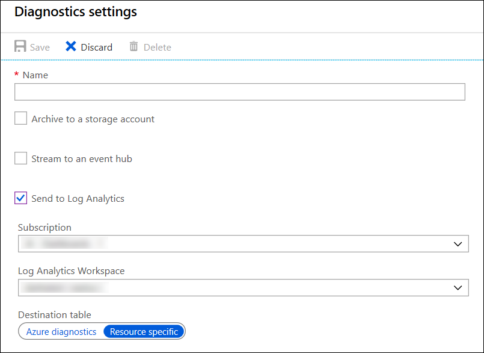

# Collect Azure platform logs in Log Analytics workspace in Azure Monitor
[Platform logs](platform-logs-overview.md) in Azure, including Azure Activity log and resource logs, provide detailed diagnostic and auditing information for Azure resources and the Azure platform they depend on. This article describes collecting resource logs in a Log Analytics workspace which allows you to analyze it with other monitoring data collected in Azure Monitor Logs using powerful log queries and also to leverage other Azure Monitor features such as alerts and visualizations. 

## What you can do with platform logs in a workspace
Collecting platform logs into a Log Analytics workspace allows you to analyze the logs of all your Azure resources together and to take advantage of all the features available to [Azure Monitor Logs](data-platform-logs.md) which includes the following:

* **Log queries** - Create [log queries](../log-query/log-query-overview.md) using a powerful query language to quickly analyze and gain insights into your diagnostic data, and to analyze it with data collected from other sources in Azure Monitor.
* **Alerting** - Get proactive notification of critical conditions and patterns identified in your resource logs using [log alerts in Azure Monitor](alerts-log.md).
* **Visualizations** - Pin the results of a log query to an Azure dashboard or include it in a workbook as part of an interactive report.

## Prerequisites
You need to [create a new workspace](../learn/quick-create-workspace.md) if you don't already have one. The workspace does not have to be in the same subscription as the resource sending logs as long as the user who configures the setting has appropriate RBAC access to both subscriptions.

## Create a diagnostic setting
Send platform logs to a Log Analytics workspace and other destinations by creating a diagnostic setting for an Azure resource. See [Create diagnostic setting to collect logs and metrics in Azure](diagnostic-settings.md) for details.

## Activity log collection
You can send the Activity log from any single subscription to up to five Log Analytics workspaces. Resource log data collected in a Log Analytics workspace is stored in the **AzureActivity** table. 

## Resource log collection mode
Resource log data collected in a Log Analytics workspace is stored in tables as described in [Structure of Azure Monitor Logs](../log-query/logs-structure.md). The tables used by resource logs depend on what type of collection the resource is using:

- Azure diagnostics - All data written is to the _AzureDiagnostics_ table.
- Resource-specific - Data is written to individual table for each category of the resource.

### Azure Diagnostics mode 
In this mode, all data from any [diagnostic setting](diagnostic-settings.md) will be collected in the _AzureDiagnostics_ table. This is the legacy method used today by most Azure services.

Since multiple resource types send data to the same table, its schema is the superset of the schemas of all the different data types being collected.

Consider the following example where diagnostic settings are being collected in the same workspace for the following data types:

- Audit logs of service 1 (having a schema consisting of columns A, B, and C)  
- Error logs of service 1 (having a schema consisting of columns D, E, and F)  
- Audit logs of service 2 (having a schema consisting of columns G, H, and I)  

The AzureDiagnostics table will look as follows:  

| ResourceProvider    | Category     | A  | B  | C  | D  | E  | F  | G  | H  | I  |
| -- | -- | -- | -- | -- | -- | -- | -- | -- | -- | -- |
| Microsoft.Service1 | AuditLogs    | x1 | y1 | z1 |    |    |    |    |    |    |
| Microsoft.Service1 | ErrorLogs    |    |    |    | q1 | w1 | e1 |    |    |    |
| Microsoft.Service2 | AuditLogs    |    |    |    |    |    |    | j1 | k1 | l1 |
| Microsoft.Service1 | ErrorLogs    |    |    |    | q2 | w2 | e2 |    |    |    |
| Microsoft.Service2 | AuditLogs    |    |    |    |    |    |    | j3 | k3 | l3 |
| Microsoft.Service1 | AuditLogs    | x5 | y5 | z5 |    |    |    |    |    |    |
| ... |

### Resource-Specific
In this mode, individual tables in the selected workspace are created for each category selected in the diagnostic setting. This method is recommended since it makes it much easier to work with the data in log queries, provides better discoverability of schemas and their structure, improves performance across both ingestion latency and query times, and the ability to grant RBAC rights on a specific table. All Azure services will eventually migrate to the Resource-Specific mode. 

The example above would result in three tables being created:
 
- Table *Service1AuditLogs* as follows:

    | Resource Provider | Category | A | B | C |
    | -- | -- | -- | -- | -- |
    | Service1 | AuditLogs | x1 | y1 | z1 |
    | Service1 | AuditLogs | x5 | y5 | z5 |
    | ... |

- Table *Service1ErrorLogs* as follows:  

    | Resource Provider | Category | D | E | F |
    | -- | -- | -- | -- | -- | 
    | Service1 | ErrorLogs |  q1 | w1 | e1 |
    | Service1 | ErrorLogs |  q2 | w2 | e2 |
    | ... |

- Table *Service2AuditLogs* as follows:  

    | Resource Provider | Category | G | H | I |
    | -- | -- | -- | -- | -- |
    | Service2 | AuditLogs | j1 | k1 | l1|
    | Service2 | AuditLogs | j3 | k3 | l3|
    | ... |

### Select the collection mode
Most Azure resources will write data to the workspace in either **Azure Diagnostic** or **Resource-Specific mode** without giving you a choice. See the [documentation for each service](diagnostic-logs-schema.md) for details on which mode it uses. All Azure services will eventually use Resource-Specific mode. As part of this transition, some resources will allow you to select a mode in the diagnostic setting. You should specify resource-specific mode for any new diagnostic settings since this makes the data easier to manage and may help you to avoid complex migrations at a later date.
  
   

> [!NOTE]
> Currently, **Azure diagnostics** and **Resource-specific** mode can only be selected when configuring the diagnostic setting in the Azure portal. If you configure the setting using CLI, PowerShell, or Rest API, it will default to **Azure diagnostic**.

You can modify an existing diagnostic setting to resource-specific mode. In this case, data that was already collected will remain in the _AzureDiagnostics_ table until it's removed according to your retention setting for the workspace. New data will be collected in to the dedicated table. Use the [union](https://docs.microsoft.com/azure/kusto/query/unionoperator) operator to query data across both tables.

Continue to watch [Azure Updates](https://azure.microsoft.com/updates/) blog for announcements about Azure services supporting Resource-Specific mode.

### Column limit in AzureDiagnostics
There is a 500 property limit for any table in Azure Monitor Logs. Once this limit is reached, any rows containing data with any property outside of the first 500 will be dropped at ingestion time. The *AzureDiagnostics* table is in particular susceptible to this limit since it includes properties for all Azure services writing to it.

If you're collecting resource logs from multiple services, _AzureDiagnostics_ may exceed this limit, and data will be missed. Until all Azure services support resource-specific mode, you should configure resources to write to multiple workspaces to reduce the possibility of reaching the 500 column limit.

### Azure Data Factory
Azure Data Factory, because of a very detailed set of logs, is a service that is known to write a large number of columns and potentially cause _AzureDiagnostics_ to exceed its limit. For any diagnostic settings configured before the resource-specific mode was enabled there will be a new column created for every uniquely-named user parameter against any activity. More columns will be created because of the verbose nature of activity inputs and outputs.
 
You should migrate your logs to use the resource-specific mode as soon as possible. If you are unable to do so immediately, an interim alternative is to isolate Azure Data Factory logs into their own workspace to minimize the chance of these logs impacting other log types being collected in your workspaces.

## Next steps

* [Read more about resource logs](platform-logs-overview.md).
* [Create diagnostic setting to collect logs and metrics in Azure](diagnostic-settings.md).
