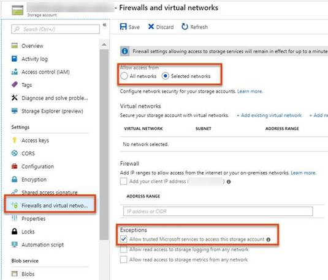

# Get started with roles, permissions, and security with Azure Monitor

[!INCLUDE [updated-for-az](../../../includes/updated-for-az.md)]

Many teams need to strictly regulate access to monitoring data and settings. For example, if you have team members who work exclusively on monitoring (support engineers, DevOps engineers) or if you use a managed service provider, you may want to grant them access to only monitoring data while restricting their ability to create, modify, or delete resources. This article shows how to quickly apply a built-in monitoring RBAC role to a user in Azure or build your own custom role for a user who needs limited monitoring permissions. It then discusses security considerations for your Azure Monitor-related resources and how you can limit access to the data they contain.

## Built-in monitoring roles
Azure Monitor’s built-in roles are designed to help limit access to resources in a subscription while still enabling those responsible for monitoring infrastructure to obtain and configure the data they need. Azure Monitor provides two out-of-the-box roles: A Monitoring Reader and a Monitoring Contributor.

### Monitoring Reader
People assigned the Monitoring Reader role can view all monitoring data in a subscription but cannot modify any resource or edit any settings related to monitoring resources. This role is appropriate for users in an organization, such as support or operations engineers, who need to be able to:

* View monitoring dashboards in the portal and create their own private monitoring dashboards.
* View alert rules defined in [Azure Alerts](alerts-overview.md)
* Query for metrics using the [Azure Monitor REST API](https://msdn.microsoft.com/library/azure/dn931930.aspx), [PowerShell cmdlets](powershell-quickstart-samples.md), or [cross-platform CLI](cli-samples.md).
* Query the Activity Log using the portal, Azure Monitor REST API, PowerShell cmdlets, or cross-platform CLI.
* View the [diagnostic settings](diagnostic-logs-overview.md#diagnostic-settings) for a resource.
* View the [log profile](activity-log-export.md) for a subscription.
* View autoscale settings.
* View alert activity and settings.
* Access Application Insights data and view data in AI Analytics.
* Search Log Analytics workspace data including usage data for the workspace.
* View Log Analytics management groups.
* Retrieve the search schema in Log Analytics workspace.
* List monitoring packs in Log Analytics workspace.
* Retrieve and execute saved searches in Log Analytics workspace.
* Retrieve the Log Analytics workspace storage configuration.

> [!NOTE]
> This role does not give read access to log data that has been streamed to an event hub or stored in a storage account. [See below](#security-considerations-for-monitoring-data) for information on configuring access to these resources.
> 
> 

### Monitoring Contributor
People assigned the Monitoring Contributor role can view all monitoring data in a subscription and create or modify monitoring settings, but cannot modify any other resources. This role is a superset of the Monitoring Reader role, and is appropriate for members of an organization’s monitoring team or managed service providers who, in addition to the permissions above, also need to be able to:

* Publish monitoring dashboards as a shared dashboard.
* Set [diagnostic settings](diagnostic-logs-overview.md#diagnostic-settings) for a resource.\*
* Set the [log profile](activity-log-export.md) for a subscription.\*
* Set alert rules activity and settings via [Azure Alerts](alerts-overview.md).
* Create Application Insights web tests and components.
* List Log Analytics workspace shared keys.
* Enable or disable monitoring packs in Log Analytics workspace.
* Create and delete and execute saved searches in Log Analytics workspace.
* Create and delete the Log Analytics workspace storage configuration.

\*user must also separately be granted ListKeys permission on the target resource (storage account or event hub namespace) to set a log profile or diagnostic setting.

> [!NOTE]
> This role does not give read access to log data that has been streamed to an event hub or stored in a storage account. [See below](#security-considerations-for-monitoring-data) for information on configuring access to these resources.
> 
> 

## Monitoring permissions and custom RBAC roles
If the above built-in roles don’t meet the exact needs of your team, you can [create a custom RBAC role](../../role-based-access-control/custom-roles.md) with more granular permissions. Below are the common Azure Monitor RBAC operations with their descriptions.

| Operation | Description |
| --- | --- |
| Microsoft.Insights/ActionGroups/[Read, Write, Delete] |Read/write/delete action groups. |
| Microsoft.Insights/ActivityLogAlerts/[Read, Write, Delete] |Read/write/delete activity log alerts. |
| Microsoft.Insights/AlertRules/[Read, Write, Delete] |Read/write/delete alert rules (from alerts classic). |
| Microsoft.Insights/AlertRules/Incidents/Read |List incidents (history of the alert rule being triggered) for alert rules. This only applies to the portal. |
| Microsoft.Insights/AutoscaleSettings/[Read, Write, Delete] |Read/write/delete autoscale settings. |
| Microsoft.Insights/DiagnosticSettings/[Read, Write, Delete] |Read/write/delete diagnostic settings. |
| Microsoft.Insights/EventCategories/Read |Enumerate all categories possible in the Activity Log. Used by the Azure portal. |
| Microsoft.Insights/eventtypes/digestevents/Read |This permission is necessary for users who need access to Activity Logs via the portal. |
| Microsoft.Insights/eventtypes/values/Read |List Activity Log events (management events) in a subscription. This permission is applicable to both programmatic and portal access to the Activity Log. |
| Microsoft.Insights/ExtendedDiagnosticSettings/[Read, Write, Delete] | Read/write/delete diagnostic settings for network flow logs. |
| Microsoft.Insights/LogDefinitions/Read |This permission is necessary for users who need access to Activity Logs via the portal. |
| Microsoft.Insights/LogProfiles/[Read, Write, Delete] |Read/write/delete log profiles (streaming Activity Log to event hub or storage account). |
| Microsoft.Insights/MetricAlerts/[Read, Write, Delete] |Read/write/delete near real-time metric alerts |
| Microsoft.Insights/MetricDefinitions/Read |Read metric definitions (list of available metric types for a resource). |
| Microsoft.Insights/Metrics/Read |Read metrics for a resource. |
| Microsoft.Insights/Register/Action |Register the Azure Monitor resource provider. |
| Microsoft.Insights/ScheduledQueryRules/[Read, Write, Delete] |Read/write/delete log alerts in Azure Monitor. |


> [!NOTE]
> Access to alerts, diagnostic settings, and metrics for a resource requires that the user has Read access to the resource type and scope of that resource. Creating (“write”) a diagnostic setting or log profile that archives to a storage account or streams to event hubs requires the user to also have ListKeys permission on the target resource.
> 
> 

For example, using the above table you could create a custom RBAC role for an “Activity Log Reader” like this:

```powershell
$role = Get-AzRoleDefinition "Reader"
$role.Id = $null
$role.Name = "Activity Log Reader"
$role.Description = "Can view activity logs."
$role.Actions.Clear()
$role.Actions.Add("Microsoft.Insights/eventtypes/*")
$role.AssignableScopes.Clear()
$role.AssignableScopes.Add("/subscriptions/mySubscription")
New-AzRoleDefinition -Role $role 
```

## Security considerations for monitoring data
Monitoring data—particularly log files—can contain sensitive information, such as IP addresses or user names. Monitoring data from Azure comes in three basic forms:

1. The Activity Log, which describes all control-plane actions on your Azure subscription.
2. Diagnostic Logs, which are logs emitted by a resource.
3. Metrics, which are emitted by resources.

All three of these data types can be stored in a storage account or streamed to Event Hub, both of which are general-purpose Azure resources. Because these are general-purpose resources, creating, deleting, and accessing them is a privileged operation reserved for an administrator. We suggest that you use the following practices for monitoring-related resources to prevent misuse:

* Use a single, dedicated storage account for monitoring data. If you need to separate monitoring data into multiple storage accounts, never share usage of a storage account between monitoring and non-monitoring data, as this may inadvertently give those who only need access to monitoring data (for example, a third-party SIEM) access to non-monitoring data.
* Use a single, dedicated Service Bus or Event Hub namespace across all diagnostic settings for the same reason as above.
* Limit access to monitoring-related storage accounts or event hubs by keeping them in a separate resource group, and [use scope](../../role-based-access-control/overview.md#scope) on your monitoring roles to limit access to only that resource group.
* Never grant the ListKeys permission for either storage accounts or event hubs at subscription scope when a user only needs access to monitoring data. Instead, give these permissions to the user at a resource or resource group (if you have a dedicated monitoring resource group) scope.

### Limiting access to monitoring-related storage accounts
When a user or application needs access to monitoring data in a storage account, you should [generate an Account SAS](https://msdn.microsoft.com/library/azure/mt584140.aspx) on the storage account that contains monitoring data with service-level read-only access to blob storage. In PowerShell, this might look like:

```powershell
$context = New-AzStorageContext -ConnectionString "[connection string for your monitoring Storage Account]"
$token = New-AzStorageAccountSASToken -ResourceType Service -Service Blob -Permission "rl" -Context $context
```

You can then give the token to the entity that needs to read from that storage account, and it can list and read from all blobs in that storage account.

Alternatively, if you need to control this permission with RBAC, you can grant that entity the Microsoft.Storage/storageAccounts/listkeys/action permission on that particular storage account. This is necessary for users who need to be able to set a diagnostic setting or log profile to archive to a storage account. For example, you could create the following custom RBAC role for a user or application that only needs to read from one storage account:

```powershell
$role = Get-AzRoleDefinition "Reader"
$role.Id = $null
$role.Name = "Monitoring Storage Account Reader"
$role.Description = "Can get the storage account keys for a monitoring storage account."
$role.Actions.Clear()
$role.Actions.Add("Microsoft.Storage/storageAccounts/listkeys/action")
$role.Actions.Add("Microsoft.Storage/storageAccounts/Read")
$role.AssignableScopes.Clear()
$role.AssignableScopes.Add("/subscriptions/mySubscription/resourceGroups/myResourceGroup/providers/Microsoft.Storage/storageAccounts/myMonitoringStorageAccount")
New-AzRoleDefinition -Role $role 
```

> [!WARNING]
> The ListKeys permission enables the user to list the primary and secondary storage account keys. These keys grant the user all signed permissions (read, write, create blobs, delete blobs, etc.) across all signed services (blob, queue, table, file) in that storage account. We recommend using an Account SAS described above when possible.
> 
> 

### Limiting access to monitoring-related event hubs
A similar pattern can be followed with event hubs, but first you need to create a dedicated Listen authorization rule. If you want to grant,  access to an application that only needs to listen to monitoring-related event hubs, do the following:

1. Create a shared access policy on the event hub(s) that were created for streaming monitoring data with only Listen claims. This can be done in the portal. For example, you might call it “monitoringReadOnly.” If possible, you will want to give that key directly to the consumer and skip the next step.
2. If the consumer needs to be able to get the key ad hoc, grant the user the ListKeys action for that event hub. This is also necessary for users who need to be able to set a diagnostic setting or log profile to stream to event hubs. For example, you might create an RBAC rule:
   
   ```powershell
   $role = Get-AzRoleDefinition "Reader"
   $role.Id = $null
   $role.Name = "Monitoring Event Hub Listener"
   $role.Description = "Can get the key to listen to an event hub streaming monitoring data."
   $role.Actions.Clear()
   $role.Actions.Add("Microsoft.ServiceBus/namespaces/authorizationrules/listkeys/action")
   $role.Actions.Add("Microsoft.ServiceBus/namespaces/Read")
   $role.AssignableScopes.Clear()
   $role.AssignableScopes.Add("/subscriptions/mySubscription/resourceGroups/myResourceGroup/providers/Microsoft.ServiceBus/namespaces/mySBNameSpace")
   New-AzRoleDefinition -Role $role 
   ```

## Monitoring within a secured Virtual Network

Azure Monitor needs access to your Azure resources to provide the services you enable. If you would like to monitor your Azure resources while still securing them from access to the Public Internet, you can enable the following settings.

### Secured Storage Accounts 

Monitoring data is often written to a storage account. You may want to make sure that the data copied to a Storage Account cannot be accessed by unauthorized users. For additional security, you can lock down network access to only allow your authorized resources and trusted Microsoft services access to a storage account by restricting a storage account to use "selected networks".

Azure Monitor is considered one of these "trusted Microsoft services" If you allow trusted Microsoft services to access your Secured Storage, Azure monitor will have access to your secured Storage Account; enabling writing Azure Monitor diagnostic logs, activity log, and metrics to your Storage Account under these protected conditions. This will also enable Log Analytics to read logs from secured storage.   


For more information, see [Network security and Azure Storage](../../storage/common/storage-network-security.md)

## Next steps
* [Read about RBAC and permissions in Resource Manager](../../role-based-access-control/overview.md)
* [Read the overview of monitoring in Azure](../../azure-monitor/overview.md)


