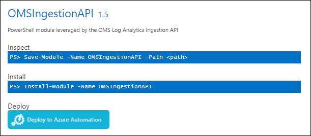
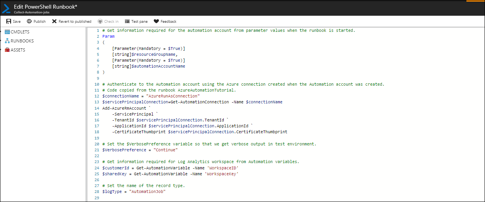
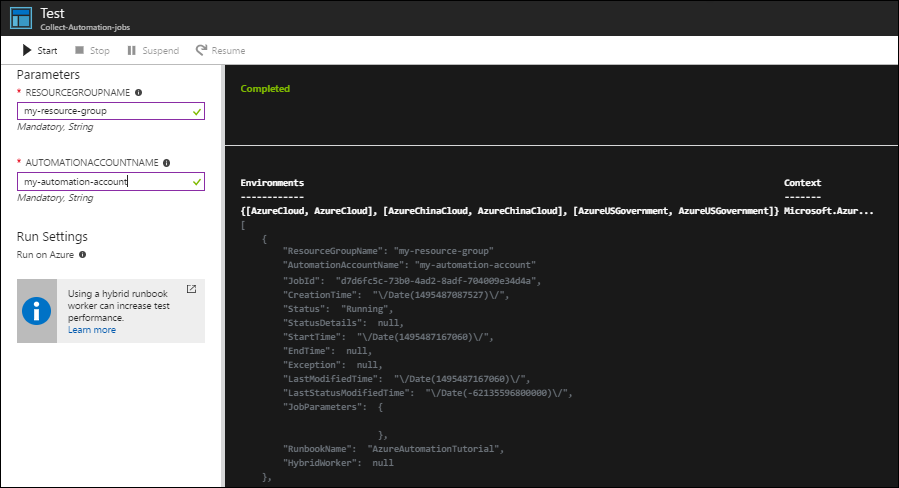
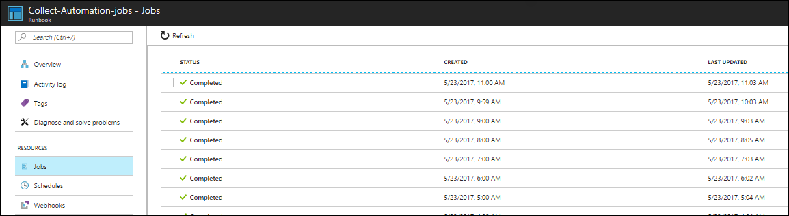

# Collect data in Log Analytics with an Azure Automation runbook

[!INCLUDE [updated-for-az](../../../includes/updated-for-az.md)]

You can collect a significant amount of data in Log Analytics from a variety of sources including [data sources](../../azure-monitor/platform/agent-data-sources.md) on agents and also [data collected from Azure](../../azure-monitor/platform/collect-azure-metrics-logs.md). There are a scenarios though where you need to collect data that isn't accessible through these standard sources. In these cases, you can use the [HTTP Data Collector API](../../azure-monitor/platform/data-collector-api.md) to write data to Log Analytics from any REST API client. A common method to perform this data collection is using a runbook in Azure Automation.

This tutorial walks through the process for creating and scheduling a runbook in Azure Automation to write data to Log Analytics.

## Prerequisites
This scenario requires the following resources configured in your Azure subscription. Both can be a free account.

- [Log Analytics workspace](../../azure-monitor/learn/quick-create-workspace.md).
- [Azure automation account](../..//automation/automation-quickstart-create-account.md).

## Overview of scenario
For this tutorial, you'll write a runbook that collects information about Automation jobs. Runbooks in Azure Automation are implemented with PowerShell, so you'll start by writing and testing a script in the Azure Automation editor. Once you verify that you're collecting the required information, you'll write that data to Log Analytics and verify the custom data type. Finally, you'll create a schedule to start the runbook at regular intervals.

> [!NOTE]
> You can configure Azure Automation to send job information to Log Analytics without this runbook. This scenario is primarily used to support the tutorial, and it's recommended that you send the data to a test workspace.

## 1. Install Data Collector API module
Every [request from the HTTP Data Collector API](../../azure-monitor/platform/data-collector-api.md#create-a-request) must be formatted appropriately and include an authorization header. You can do this in your runbook, but you can reduce the amount of code required by using a module that simplifies this process. One module that you can use is [OMSIngestionAPI module](https://www.powershellgallery.com/packages/OMSIngestionAPI) in the PowerShell Gallery.

To use a [module](../../automation/automation-integration-modules.md) in a runbook, it must be installed in your Automation account.  Any runbook in the same account can then use the functions in the module. You can install a new module by selecting **Assets** > **Modules** > **Add a module** in your Automation account.

The PowerShell Gallery though gives you a quick option to deploy a module directly to your automation account so you can use that option for this tutorial.



1. Go to [PowerShell Gallery](https://www.powershellgallery.com/).
2. Search for **OMSIngestionAPI**.
3. Click on the **Deploy to Azure Automation** button.
4. Select your automation account and click **OK** to install the module.

## 2. Create Automation variables
[Automation variables](../../automation/automation-variables.md) hold values that can be used by all runbooks in your Automation account. They make runbooks more flexible by allowing you to change these values without editing the actual runbook. Every request from the HTTP Data Collector API requires the ID and key of the Log Analytics workspace, and variable assets are ideal to store this information.


1. In the Azure portal, navigate to your Automation account.
2. Select **Variables** under **Shared Resources**.
2. Click **Add a variable** and create the two variables in the following table.

| Property | Workspace ID Value | Workspace Key Value |
|:--|:--|:--|
| Name | WorkspaceId | WorkspaceKey |
| Type | String | String |
| Value | Paste in the Workspace ID of your Log Analytics workspace. | Paste in with the Primary or Secondary Key of your Log Analytics workspace. |
| Encrypted | No | Yes |

## 3. Create runbook

Azure Automation has an editor in the portal where you can edit and test your runbook. You have the option to use the script editor to work with [PowerShell directly](../../automation/automation-edit-textual-runbook.md) or [create a graphical runbook](../../automation/automation-graphical-authoring-intro.md). For this tutorial, you will work with a PowerShell script.



1. Navigate to your Automation account.
2. Click **Runbooks** > **Add a runbook** > **Create a new runbook**.
3. For the runbook name, type **Collect-Automation-jobs**. For the runbook type, select **PowerShell**.
4. Click **Create** to create the runbook and start the editor.
5. Copy and paste the following code into the runbook. Refer to the comments in the script for explanation of the code.
    ```
    # Get information required for the automation account from parameter values when the runbook is started.
    Param
    (
        [Parameter(Mandatory = $True)]
        [string]$resourceGroupName,
        [Parameter(Mandatory = $True)]
        [string]$automationAccountName
    )
    
    # Authenticate to the Automation account using the Azure connection created when the Automation account was created.
    # Code copied from the runbook AzureAutomationTutorial.
    $connectionName = "AzureRunAsConnection"
    $servicePrincipalConnection=Get-AutomationConnection -Name $connectionName
    Connect-AzAccount `
        -ServicePrincipal `
        -TenantId $servicePrincipalConnection.TenantId `
        -ApplicationId $servicePrincipalConnection.ApplicationId `
        -CertificateThumbprint $servicePrincipalConnection.CertificateThumbprint 
    
    # Set the $VerbosePreference variable so that we get verbose output in test environment.
    $VerbosePreference = "Continue"
    
    # Get information required for Log Analytics workspace from Automation variables.
    $customerId = Get-AutomationVariable -Name 'WorkspaceID'
    $sharedKey = Get-AutomationVariable -Name 'WorkspaceKey'
    
    # Set the name of the record type.
    $logType = "AutomationJob"
    
    # Get the jobs from the past hour.
    $jobs = Get-AzAutomationJob -ResourceGroupName $resourceGroupName -AutomationAccountName $automationAccountName -StartTime (Get-Date).AddHours(-1)
    
    if ($jobs -ne $null) {
        # Convert the job data to json
        $body = $jobs | ConvertTo-Json
    
        # Write the body to verbose output so we can inspect it if verbose logging is on for the runbook.
        Write-Verbose $body
    
        # Send the data to Log Analytics.
        Send-OMSAPIIngestionFile -customerId $customerId -sharedKey $sharedKey -body $body -logType $logType -TimeStampField CreationTime
    }
    ```

## 4. Test runbook
Azure Automation includes an environment to [test your runbook](../../automation/automation-testing-runbook.md) before you publish it. You can inspect the data collected by the runbook and verify that it writes to Log Analytics as expected before publishing it to production.



1. Click **Save** to save the runbook.
1. Click **Test pane** to open the runbook in the test environment.
1. Since your runbook has parameters, you're prompted to enter values for them. Enter the name of the resource group and the automation account that your going to collect job information from.
1. Click **Start** to the start the runbook.
1. The runbook will start with a status of **Queued** before it goes to **Running**.
1. The runbook should display verbose output with the jobs collected in json format. If no jobs are listed, then there may have been no jobs created in the automation account in the last hour. Try starting any runbook in the automation account and then perform the test again.
1. Ensure that the output doesn't show any errors in the post command to Log Analytics. You should have a message similar to the following.

	

## 5. Verify records in Log Analytics
Once the runbook has completed in test, and you verified that the output was successfully received, you can verify that the records were created using a [log search in Log Analytics](../../azure-monitor/log-query/log-query-overview.md).


1. In the Azure portal, select your Log Analytics workspace.
2. Click on **Log Search**.
3. Type the following command `Type=AutomationJob_CL` and click the search button. Note that the record type includes _CL that isn't specified in the script. That suffix is automatically appended to the log type to indicate that it's a custom log type.
4. You should see one or more records returned indicating that the runbook is working as expected.

## 6. Publish the runbook
Once you've verified that the runbook is working correctly, you need to publish it so you can run it in production. You can continue to edit and test the runbook without modifying the published version.


1. Return to your automation account.
2. Click on **Runbooks** and select **Collect-Automation-jobs**.
3. Click **Edit** and then **Publish**.
4. Click **Yes** when asked to verify that you want to overwrite the previously published version.

## 7. Set logging options
For test, you were able to view [verbose output](../../automation/automation-runbook-output-and-messages.md#message-streams) because you set the $VerbosePreference variable in the script. For production, you need to set the logging properties for the runbook if you want to view verbose output. For the runbook used in this tutorial, this will display the json data being sent to Log Analytics.


1. In the properties for your runbook select **Logging and tracing** under **Runbook Settings**.
2. Change the setting for **Log verbose records** to **On**.
3. Click **Save**.

## 8. Schedule runbook
The most common way to start a runbook that collects monitoring data is to schedule it to run automatically. You do this by creating a [schedule in Azure Automation](../../automation/automation-schedules.md) and attaching it to your runbook.


1. In the properties for your runbook, select **Schedules** under **Resources**.
2. Click **Add a schedule** > **Link a schedule to your runbook** > **Create a new schedule**.
5. Type in the following values for the schedule and click **Create**.

| Property | Value |
|:--|:--|
| Name | AutomationJobs-Hourly |
| Starts | Select any time at least 5 minutes past the current time. |
| Recurrence | Recurring |
| Recur every | 1 hour |
| Set expiration | No |

Once the schedule is created, you need to set the parameter values that will be used each time this schedule starts the runbook.

1. Click **Configure parameters and run settings**.
1. Fill in values for your **ResourceGroupName** and **AutomationAccountName**.
1. Click **OK**.

## 9. Verify runbook starts on schedule
Every time a runbook is started, [a job is created](../../automation/automation-runbook-execution.md) and any output logged. In fact, these are the same jobs that the runbook is collecting. You can verify that the runbook starts as expected by checking the jobs for the runbook after the start time for the schedule has passed.



1. In the properties for your runbook, select **Jobs** under **Resources**.
2. You should see a listing of jobs for each time the runbook was started.
3. Click on one of the jobs to view its details.
4. Click on **All logs** to view the logs and output from the runbook.
5. Scroll to the bottom to find an entry similar to the image below.<br>
6. Click on this entry to view the detailed json data that was sent to Log Analytics.

## Next steps
- Use [View Designer](../../azure-monitor/platform/view-designer.md) to create a view displaying the data that you've collected to the Log Analytics repository.
- Package your runbook in a [management solution](../../azure-monitor/insights/solutions-creating.md) to distribute to customers.
- Learn more about [Log Analytics](https://docs.microsoft.com/azure/log-analytics/).
- Learn more about [Azure Automation](https://docs.microsoft.com/azure/automation/).
- Learn more about the [HTTP Data Collector API](../../azure-monitor/platform/data-collector-api.md).
