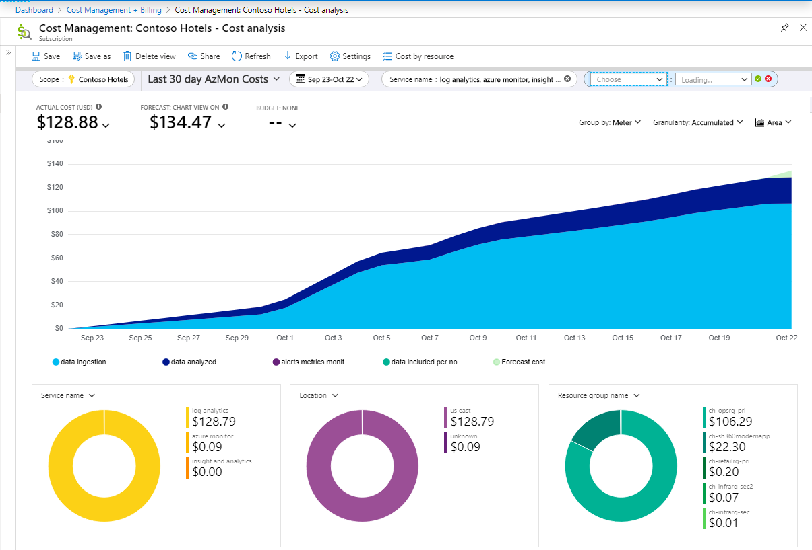

# Monitoring usage and estimated costs in Azure Monitor

> [!NOTE]
> This article, describes how to view usage and estimated costs across multiple Azure monitoring features. Related articles for specific components of Azure Monitor include:
> - [Manage usage and costs with Azure Monitor Logs](manage-cost-storage.md) describes how to control your costs by changing your data retention period, and how to analyze and alert on your data usage.
> - [Manage usage and costs for Application Insights](../../azure-monitor/app/pricing.md) describes how to analyze data usage in Application Insights.

## Azure Monitor pricing model

The basic Azure Monitor billing model is a cloud-friendly, consumption-based pricing ("Pay-As-You-Go"). You only pay for what you use. Pricing details are available for [alerting, metrics, notifications](https://azure.microsoft.com/pricing/details/monitor/), [Log Analytics](https://azure.microsoft.com/pricing/details/log-analytics/) and [Application Insights](https://azure.microsoft.com/pricing/details/application-insights/). 

In addition to the Pay-As-You-Go model for log data, Log Analytics has Capacity Reservations, which enable you to save as much as 25% compared to the Pay-As-You-Go price. The capacity reservation pricing enables you to buy a reservation starting at 100 GB/day. Any usage above the reservation level will be billed at the Pay-As-You-Go rate. [Learn more](https://azure.microsoft.com/pricing/details/monitor/) about Capacity Reservation pricing.

Some customers will have access to [legacy Log Analytics pricing tiers](https://docs.microsoft.com/azure/azure-monitor/platform/manage-cost-storage#legacy-pricing-tiers) and the [legacy Enterprise Application Insights pricing tier](https://docs.microsoft.com/azure/azure-monitor/app/pricing#legacy-enterprise-per-node-pricing-tier). 

## Understanding your Azure Monitor costs

There are two phases for understanding costs. The first is when considering Azure Monitor as your monitoring solution. 

### Estimating the costs to manage your environment

If you're not yet using Azure Monitor Logs, you can use the [Azure Monitor pricing calculator](https://azure.microsoft.com/pricing/calculator/?service=monitor) to estimate the cost of using Azure Monitor. Start by entering "Azure Monitor" in the Search box, and clicking on the resulting Azure Monitor tile. Scroll down the page to Azure Monitor, and select one of the options from the Type dropdown:

- Metrics queries and Alerts  
- Log Analytics
- Application Insights

In each of these, the pricing calculator will help you estimate your likely costs based on your expected utilization.

For example, with Log Analytics you can enter the number of VMs and the GB of data you expect to collect from each VM. Typically 1 GB to 3 GB of data month is ingested from a typical Azure VM. If you're already evaluating Azure Monitor Logs already, you can use your data statistics from your own environment. See below for how to determine the [number of monitored VMs](https://docs.microsoft.com/azure/azure-monitor/platform/manage-cost-storage#understanding-nodes-sending-data) and the [volume of data your workspace is ingesting](https://docs.microsoft.com/azure/azure-monitor/platform/manage-cost-storage#understanding-ingested-data-volume).

Similarly for Application Insights, if you enable the "Estimate data volume based on application activity" functionality, you can provide inputs about your application (requests per month and page views per month, in case you will collect client-side telemetry), and then the calculator will tell you the median and 90th percentile amount of data collected by similar applications. These applications span the range of Application Insights configuration (e.g some have default sampling, some have no sampling etc.), so you still have the control to reduce the volume of data you ingest far below the median level using sampling. But this is a starting point to understand what other, similar customers are seeing. [Learn more](https://docs.microsoft.com/azure/azure-monitor/app/pricing#estimating-the-costs-to-manage-your-application) about estimating costs for Application Insights.

### Understanding your usage and estimated costs

It is important to understand and track your usage once using Azure Monitor, and there are rich set of tools to facilitate this. 

Azure provides a great deal of useful functionality in the [Azure Cost Management + Billing](https://docs.microsoft.com/azure/cost-management/quick-acm-cost-analysis?toc=/azure/billing/TOC.json) hub. After opening the **Azure Cost Management + Billing** hub, click on **Cost Management** and select the [Scope](https://docs.microsoft.com/azure/cost-management/understand-work-scopes) (the set of resources to investigate). 

Then to see the Azure Monitor costs for the last 30 days, click on the **Daily Costs** tile, choose "Last 30 days" under Relative dates, and add a filter which selects the Service names:

1. Azure Monitor
2. Application Insights
3. Log Analytics
4. Insight and Analytics

This results in a view such as:

From here, you can drill in from this accumulated cost summary to get the finer details in the "Cost by resource" view. In the current pricing tiers, Azure Log data is charged on the same set of meters whether it originates from Log Analytics or Application Insights. To separate costs from your Log Analytics or Application Insights usage, you can add a filter on **Resource type**. To see all Application Insights costs, filter the Resource type to "microsoft.insights/components", and for Log Analytics costs, filter Resource type to "microsoft.operationalinsights/workspaces". 

More detail of your usage is available by [downloading your usage from the Azure portal](https://docs.microsoft.com/azure/billing/billing-download-azure-invoice-daily-usage-date#download-usage-in-azure-portal). 
In the downloaded spreadsheet, you can see usage per Azure resource per day. In this Excel spreadsheet, usage from your Application Insights resources can be found by first filtering on the "Meter Category" column to show "Application Insights" and "Log Analytics", and then adding a filter on the "Instance ID" column which is "contains microsoft.insights/components".  Most Application Insights usage is reported on meters with the Meter Category of Log Analytics, since there is a single logs backend for all Azure Monitor components.  Only Application Insights resources on legacy pricing tiers and multi-step web tests are reported with a Meter Category of Application Insights.  The usage is shown in the "Consumed Quantity" column and the unit for each entry is shown in the "Unit of Measure" column.  More details are available to help you [understand your Microsoft Azure bill](https://docs.microsoft.com/azure/billing/billing-understand-your-bill). 

> [!NOTE]
> Using **Cost Management** in the **Azure Cost Management + Billing** hub is the preferred approach to broadly understanding monitoring costs.  The **Usage and Estimated Costs** experiences for [Log Analytics](https://docs.microsoft.com/azure/azure-monitor/platform/manage-cost-storage#understand-your-usage-and-estimate-costs)  and [Application Insights](https://docs.microsoft.com/azure/azure-monitor/app/pricing#understand-your-usage-and-estimate-costs) provide deeper insights for each of those parts of Azure Monitor.

Another option for viewing your Azure Monitor usage is the **Usage and estimated costs** page in the Monitor hub. This shows the usage of core monitoring features such as [alerting, metrics, notifications](https://azure.microsoft.com/pricing/details/monitor/), [Azure Log Analytics](https://azure.microsoft.com/pricing/details/log-analytics/), and [Azure Application Insights](https://azure.microsoft.com/pricing/details/application-insights/). For customers on the pricing plans available before April 2018, this also includes Log Analytics usage purchased through the Insights and Analytics offer.

On this page, users can view their resource usage for the past 31 days, aggregated per subscription. `Drill-ins` show usage trends over the 31-day period. A lot of data needs to come together for this estimate, so please be patient as the page loads.

This example shows monitoring usage and an estimate of the resulting costs:

Select the link in the monthly usage column to open a chart that shows usage trends over the last 31-day period: 

## Operations Management Suite subscription entitlements

Customers who purchased Microsoft Operations Management Suite E1 and E2 are eligible for per-node data ingestion entitlements for [Log Analytics](https://www.microsoft.com/cloud-platform/operations-management-suite) and [Application Insights](https://docs.microsoft.com/azure/application-insights/app-insights-pricing). To receive these entitlements for Log Analytics workspaces or Application Insights resources in a given subscription: 

- Log Analytics workspaces should use the "Per-node (OMS)" pricing tier.
- Application Insights resources should use the "Enterprise" pricing tier.

Depending on the number of nodes of the suite that your organization purchased, moving some subscriptions into a Pay-As-You-Go (Per GB) pricing tier could be advantageous, but this requires careful consideration.

> [!WARNING]
> If your organization has current Microsoft Operations Management Suite E1 and E2, it is usually best to keep your Log Analytics workspaces in the "Per-node (OMS)" pricing tier, and your Application Insights resources in the "Enterprise" pricing tier. 
>
