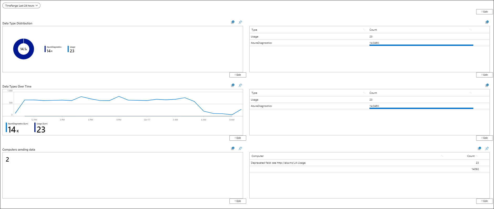
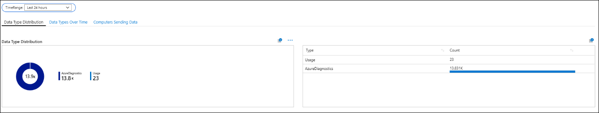
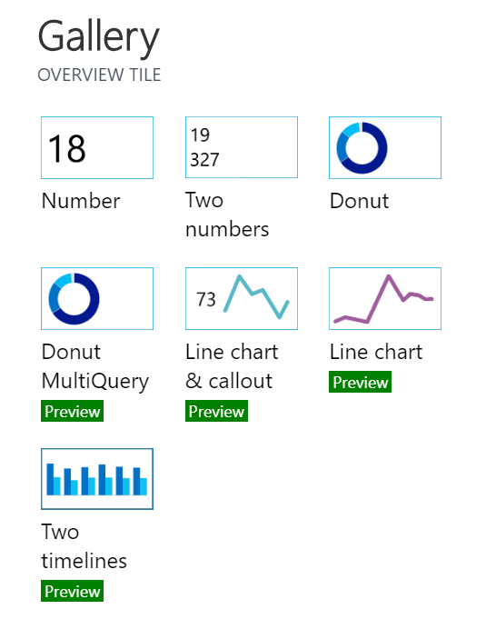

# Azure Monitor view designer to workbooks conversion options
[View designer](view-designer.md) is a feature of Azure Monitor that allows you to create custom views to help you visualize data in your Log Analytics workspace, with charts, lists, and timelines. They are being phased out and replaced with workbooks which provide additional functionality. This article compares fundamental concepts between the two and options for converting views to workbooks.

## Basic workbook designs

View designer has a fixed static style of representation, while workbooks enable freedom to include and modify how the data is represented. The images below depict two examples of how you might arrange workbooks when converting views.

[Vertical workbook](view-designer-conversion-examples.md#vertical)

[Tabbed workbook](view-designer-conversion-examples.md#tabbed)

## Tile conversion
View designer uses the overview tile feature to represent and summarize the overall state. These are represented in seven tiles, ranging from numbers to charts. In workbooks, users can create similar visualizations and pin them to resemble the original style of overview tiles. 

## View dashboard conversion
View designer tiles typically consist of two sections, a visualization and a list that matches the data from the visualization, for example the **Donut & List** tile.

With workbooks, we allow the user to choose to query one or both sections of the view. Formulating queries in workbooks is a simple two-step process. First, the data is generated from the query, and second, the data is rendered as a visualization.  An example of how this view would be recreated in workbooks is as follows:

## Next steps
- [Accessing workbooks & permissions](view-designer-conversion-access.md)