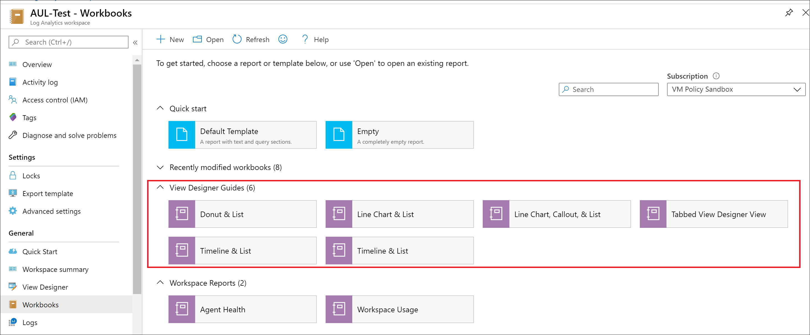
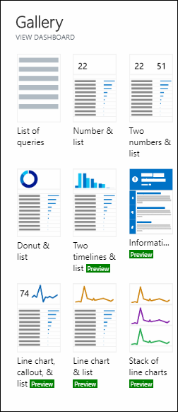
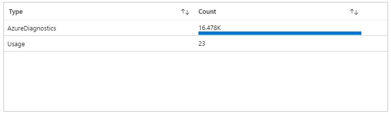
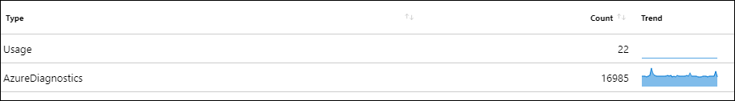
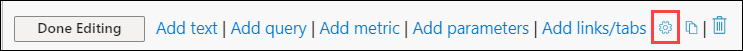

# View designer to workbooks conversion common tasks
[View designer](view-designer.md) is a feature of Azure Monitor that allows you to create custom views to help you visualize data in your Log Analytics workspace, with charts, lists, and timelines. They are being phased out and replaced with workbooks which provide additional functionality. This article details tasks that are common in converting views to workbooks.


## Quickstart with preset view designer templates

Workbooks in Log Analytics workspaces already have templates made to match some of the views in view designer. Under the **View Designer Guides** category, select **View Designer Transition Guide** to learn about your options or select one of the preset templates.



## Enabling time range filter
View designer has a built-in default time range filter, however, in workbooks this setting is not enabled by default. Workbooks do allow users to create their own time range filters that might be more applicable to their data logs. The steps to generate the filter are listed below:

Select the **Add parameters** option. The default **Style** is set to *Pills*.


 Select the **Add Parameter** button.


From the sidebar menu, in the **Parameter name** textbox, type *TimeRange*. Set **Parameter Type** as *Time Range Picker*. Select the **Required?** checkbox.


Save the parameter in the upper left corner of the sidebar menu. You can leave the dropdown as *unset* by default or select a default **TimeRange** value, such as *24 hours*. Select **Done Editing**.

Parameters can be used in queries by adding curly braces {} around your parameter name. More details on parameters can be found in the [Workbooks documentation on parameters](https://github.com/microsoft/Application-Insights-Workbooks/blob/master/Documentation/Parameters/Parameters.md).

## Updating queries with the TimeRange parameter

### Option 1: Select TimeRange from the Time Range dropdown


### Option 2: Update your log queries

In your query add the line: `| where TimeGenerated {TimeRange}` as in the following example:

Original query
```KQL
search * 
| summarize count() by Type
```

Updated query
```KQL
search * 
| where TimeGenerated {TimeRange} 
| summarize count() by Type
```

## Including a List
Most of the view designer views include a list, and you can reproduce this standard list in a workbook.



Add a visualization by clicking **Add query** from the cell options.


View designer employs a default query that matches the syntax from the Original example. This can be updated by changing the query to the updated form as in the following example:

Original query
```KQL
search * 
| summarize AggregatedValue = count() by Type
```

Updated query
```KQL
search * 
| summarize Count = count() by Type
```

This will generate a list that looks similar to the following:



## Enabling sparklines
A common feature for grids is to add sparklines to summarize various data patterns over time. View designer offers the **Enable Sparklines** feature for all lists, as does workbooks. To include sparklines in your data that match view designer,join the data with your original query as in the following example:

Original query
```KQL
search *
| summarize AggregatedValue = count() by Type) on Type
```

Updated query
```KQL
search * 
| summarize AggregatedValue = count() by Type
| join kind = inner (search * 
    | make-series Trend = count() default=0 on TimeGenerated from {TimeRange:start} to {TimeRange:end} step {TimeRange:grain} by Type) on Type
| project Type, AggregatedValue, Trend
```

Select **Column Settings**.


Update the **Column renderer** dropdown to be a *Spark area*.


Save the settings and run the query again to update your table to include a sparkline.

The resulting grid will look similar to following:


## Advanced cell settings
To mirror view designer, you can perform tasks such as changing the size of workbook cells or adding pins and external links to logs.

To access **Advanced Settings** select the gear icon at the bottom of each cell.



This will display a menu with various options:


To add a pin and a link to an external query select the corresponding checkboxes. To add a title to your cell, type the desired title into the **Chart title** section.

By default any workbooks cell is set to take up the entire page width, but you can adjust this by scaling the cell down under the **Style** tab of the **Advanced Settings** menu


 
## Additional parameters
Select **Add Parameter** to create a new parameter in your workbook. 

To select a Subscription, type *Subscription* into the **Parameter name** field in the side menu and select *Subscription Picker* from the **Parameter type** dropdown


To select a Resource, type *Resource* into the **Parameter name** field in the side menu and select *Resource Picker* from the **Parameter type** dropdown.


This will insert dropdowns to let you access your various subscriptions and resources.


## Next steps
- [Tile conversions](view-designer-conversion-tiles.md)
