# Azure Monitor view designer tile conversions
[View designer](view-designer.md) is a feature of Azure Monitor that allows you to create custom views to help you visualize data in your Log Analytics workspace, with charts, lists, and timelines. They are being phased out and replaced with workbooks which provide additional functionality. This article provides details for converting different tiles to workbooks.

## Donut & list tile

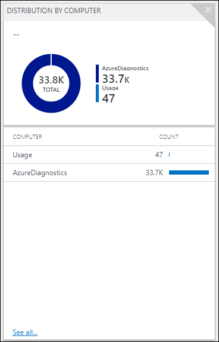

Recreating the donut & list tile in workbooks involves two separate visualizations. For the donut portion there are two options.
For both start by selecting **Add query** and paste the original query from view designer into the cell.

**Option 1:** Select **Pie Chart** from the **Visualization** dropdown:
 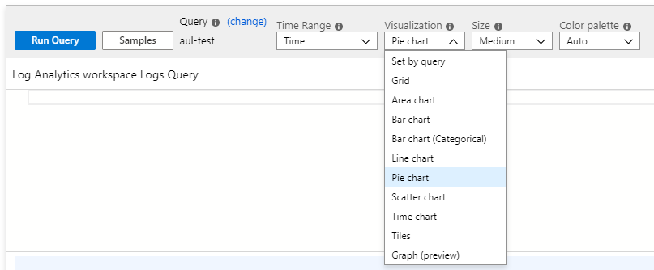

**Option 2:** Select **Set by query** from the **Visualization** dropdown and add `| render piechart` to the query:

 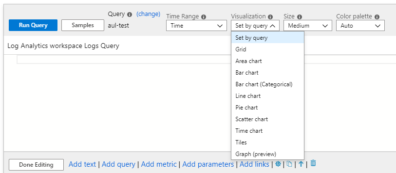

**Example**

Original query
```KQL
search * 
| summarize AggregatedValue = count() by Type 
| order by AggregatedValue desc
```

Updated query
```KQL
search * 
| summarize AggregatedValue = count() by Type 
| order by AggregatedValue desc 
| render piechart
```

For creating a list and enabling sparklines, see the article on [common tasks](view-designer-conversion-tasks.md).

Following is an example of how the donut & list tile might be reinterpreted in workbooks:


## Line chart & list tile
 

To recreate the line chart portion update the query as follows:

Original query
```KQL
search * 
| summarize AggregatedValue = count() by Type
```

Updated query
```KQL
search * 
| make-series Count = count() default=0 on TimeGenerated from {TimeRange:start} to {TimeRange:end} step {TimeRange:grain} by Type
```

There are two options for visualizing the line chart

**Option 1:** Select **Line chart** from the **Visualization** dropdown:
 
 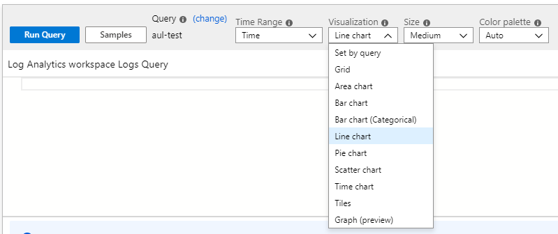

**Option 2:** Select **Set by query** from the **Visualization** dropdown and add `| render linechart` to the query:

 

**Example**

```KQL
search * 
| make-series Count = count() default=0 on TimeGenerated from {TimeRange:start} to {TimeRange:end} step {TimeRange:grain} by Type 
| render linechart_
```

For creating a list and enabling sparklines, see the article on [common tasks](view-designer-conversion-tasks.md).

Following is an example of how the line chart & list tile might be reinterpreted in workbooks:

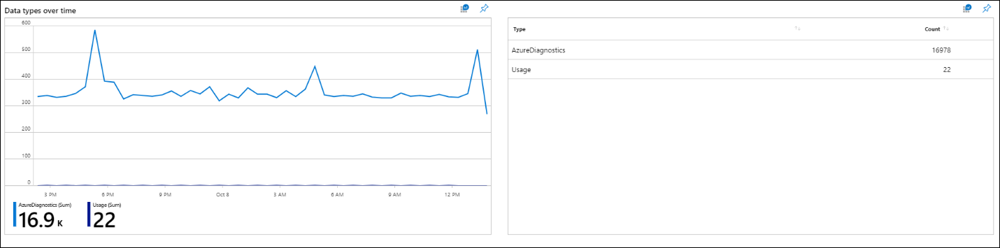

## Number & list tile

 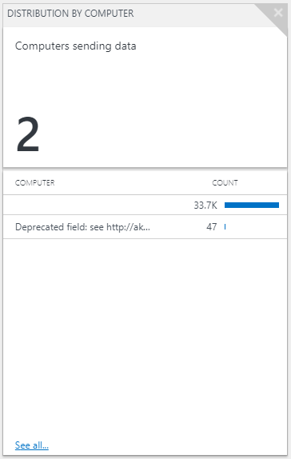

For the number tile, update the query as follows:

Original query
```KQL
search * 
| summarize AggregatedValue = count() by Computer | count
```

Updated query
```KQL
search *
| summarize AggregatedValue = count() by Computer 
| summarize Count = count()
```

Change the Visualization dropdown to **Tiles** and then select **Tile Settings**.
 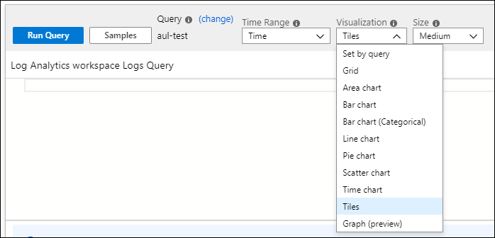

Leave the **Title** section blank and select **Left**. Change the value for **Use column:** to **Count**, and **Column Renderer** to **Big Number**:

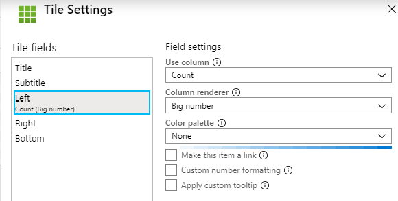

 
For creating a list and enabling sparklines, see the article on [common tasks](view-designer-conversion-tasks.md).

Following is an example of how the number & list tile might be reinterpreted in workbooks:


## Timeline & List

 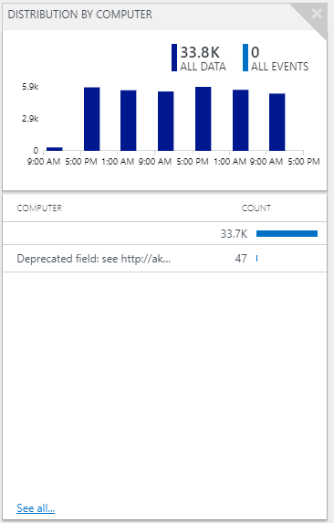

For the timeline update your query as follows:

Original query
```KQL
search * 
| sort by TimeGenerated desc
```

Updated query
```KQL
search * 
| summarize Count = count() by Computer, bin(TimeGenerated,{TimeRange:grain})
```

There are two options for visualizing the query as a bar chart:

**Option 1:** Select **Bar chart** from the **Visualization** dropdown:
 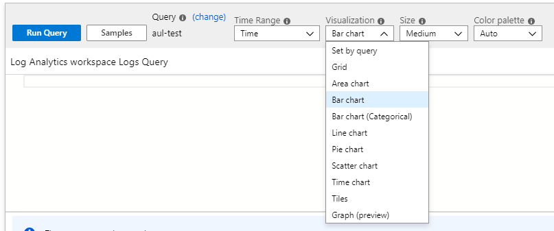
 
**Option 2:** Select **Set by query** from the **Visualization** dropdown and add `| render barchart` to the query:

 

 
For creating a list and enabling sparklines, see the article on [common tasks](view-designer-conversion-tasks.md).

Following is an example of how the timeline & list tile might be reinterpreted in workbooks:

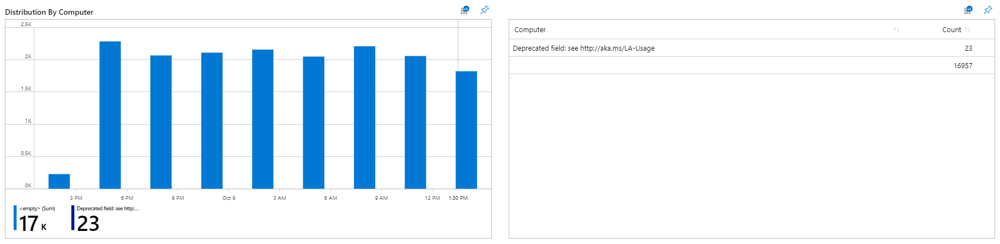

## Next steps

- [Overview of view designer to workbooks transition](view-designer-conversion-overview.md)
