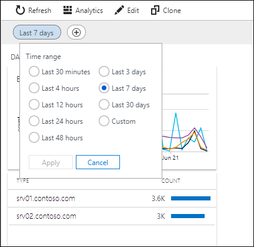
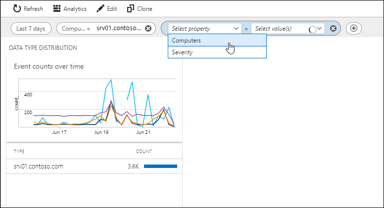
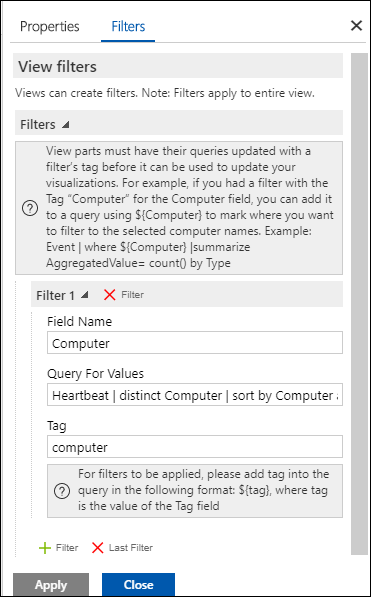

# Filters in Azure Monitor views
A **filter** in an [Azure Monitor view](view-designer.md) allows users to filter the data in the view by the value of a particular property without modifying the view itself.  For example, you could allow users of your view to filter the view for data only from a particular computer or set of computers.  You can create multiple filters on a single view to allow users to filter by multiple properties.  This article describes how to use a filter and add one to a custom view.

## Using a filter
Click the date time range at the top of a view to open the drop down where you can change the date time range for the view.

Click the **+** to add a filter using custom filters that are defined for the view. Either select a value for the filter from the dropdown or type in a value. Continue to add filters by clicking the **+**. 

If you remove all of the values for a filter, then that filter will no longer be applied.

## Creating a filter

Create a filter from the **Filters** tab when [editing a view](view-designer.md).  The filter is global for the view and applies to all parts in the view.  

The following table describes the settings for a filter.

| Setting | Description |
|:---|:---|
| Field Name | Name of the field used for filtering.  This field must match the summarize field in **Query for Values**. |
| Query for Values | Query to run to populate filter dropdown for the user.  This query must use either [summarize](/azure/kusto/query/summarizeoperator) or [distinct](/azure/kusto/query/distinctoperator) to provide unique values for a particular field, and it must match the **Field Name**.  You can use [sort](/azure/kusto/query/sortoperator) to sort the values that are displayed to the user. |
| Tag | Name for the field that's used in queries supporting the filter and is also displayed to the user. |

### Examples

The following table includes a few examples of common filters.  

| Field Name | Query for Values | Tag |
|:--|:--|:--|
| Computer   | Heartbeat &#124; distinct Computer &#124; sort by Computer asc | Computers |
| EventLevelName | Event &#124; distinct EventLevelName | Severity |
| SeverityLevel | Syslog &#124; distinct SeverityLevel | Severity |
| SvcChangeType | ConfigurationChange &#124; distinct svcChangeType | ChangeType |

## Modify view queries

For a filter to have any effect, you must modify any queries in the view to filter on the selected values.  If you don't modify any queries in the view, then any values the user selects will have no effect.

The syntax for using a filter value in a query is: 

    where ${filter name}  

For example, if your view has a query that returns events and uses a filter called _Computers_, you could use the following query.

    Event | where ${Computers} | summarize count() by EventLevelName

If you added another filter called Severity, you could use the following query to use both filters.

    Event | where ${Computers} | where ${Severity} | summarize count() by EventLevelName

## Next steps
* Learn more about the [Visualization Parts](view-designer-parts.md) you can add to your custom view.
