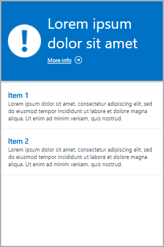
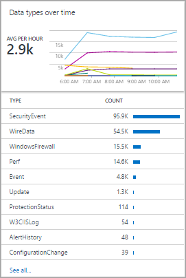

# Reference guide to View Designer visualization parts in Azure Monitor
By using View Designer in Azure Monitor, you can create a variety of custom views in the Azure portal that can help you visualize data in your Log Analytics workspace. This article is a reference guide to the settings for the visualization parts that are available in your custom views.

For more information about View Designer, see:

* [View Designer](view-designer.md): Provides an overview of View Designer and procedures for creating and editing custom views.
* [Tile reference](view-designer-tiles.md): Provides a reference to the settings for each available tile in your custom views.

The available View Designer tile types are described in the following table:

| View type | Description |
|:--- |:--- |
| [List of queries](#list-of-queries-part) |Displays a list of log queries. You can select each query to display its results. |
| [Number and list](#number-and-list-part) |The header displays a single number that shows a count of records from a log query. The list displays the top ten results from a query, with a graph that indicates the relative value of a numeric column or its change over time. |
| [Two numbers and list](#two-numbers-and-list-part) |The header displays two numbers that show counts of records from separate log queries. The list displays the top ten results from a query, with a graph that indicates the relative value of a numeric column or its change over time. |
| [Donut and list](#donut-and-list-part) |The header displays a single number that summarizes a value column in a log query. The donut graphically displays results of the top three records. |
| [Two timelines and list](#two-timelines-and-list-part) |The header displays the results of two log queries over time as column charts, with a callout that displays a single number that summarizes a value column in a log query. The list displays the top ten results from a query, with a graph that indicates the relative value of a numeric column or its change over time. |
| [Information](#information-part) |The header displays static text and an optional link. The list displays one or more items with a static title and text. |
| [Line chart, callout, and list](#line-chart-callout-and-list-part) |The header displays a line chart, with multiple series from a log query over time and a callout with a summarized value. The list displays the top ten results from a query, with a graph that indicates the relative value of a numeric column or its change over time. |
| [Line chart and list](#line-chart-and-list-part) |The header displays a line chart, with multiple series from a log query over time. The list displays the top ten results from a query, with a graph that indicates the relative value of a numeric column or its change over time. |
| [Stack of line charts part](#stack-of-line-charts-part) |Displays three separate line charts, with multiple series from a log query over time. |

The next sections describe the tile types and their properties in detail.

> [!NOTE]
> Parts in views are based on [log queries](../log-query/log-query-overview.md) in your Log Analytics workspace. They do not currently support [cross resource queries](../log-query/cross-workspace-query.md) to retrieve data from Application Insights.

## List of queries part
The list of queries part displays a list of log queries. You can select each query to display its results. The view includes a single query by default, and you can select **+ Query** to add additional queries.

| Setting | Description |
|:--- |:--- |
| **General** | |
| Title |The text that's displayed at the top of the view. |
| New Group |Select this link to create a new group in the view, starting at the current view. |
| Pre-selected filters |A comma-delimited list of properties to include in the left filter pane when you select a query. |
| Render mode |The initial view that's displayed when the query is selected. You can select any available views after they open the query. |
| **Queries** | |
| Search query |The query to run. |
| Friendly name | The descriptive name that's displayed. |

## Number and list part
The header displays a single number that shows a count of records from a log query. The list displays the top ten results from a query, with a graph that indicates the relative value of a numeric column or its change over time.

| Setting | Description |
|:--- |:--- |
| **General** | |
| Group title |The text that's displayed at the top of the view. |
| New Group |Select this link to create a new group in the view, starting at the current view. |
| Icon |The image file that's displayed next to the result in the header. |
| Use Icon |Select this link to display the icon. |
| **Title** | |
| Legend |The text that's displayed at the top of the header. |
| Query |The query to run for the header. The count of the records that are returned by the query is displayed. |
| Click-through navigation | Action taken when you click on the header.  For more information, see [Common Settings](#click-through-navigation). |
| **List** | |
| Query |The query to run for the list. The first two properties for the first ten records in the results are displayed. The first property is a text value, and the second property is a numeric value. Bars are automatically created that are based on the relative value of the numeric column.  Use the `Sort` command in the query to sort the records in the list. To run the query and return all records, you can select **See all**. |
| Hide graph |Select this link to disable the graph at the right of the numeric column. |
| Enable sparklines |Select this link to display a sparkline instead of a horizontal bar. For more information, see [Common Settings](#sparklines). |
| Color |The color of the bars or sparklines. |
| Name and value separator |The single-character delimiter to use to parse the text property into multiple values. For more information, see [Common Settings](#sparklines). |
| Click-through navigation | Action taken when you click on an item in the list.  For more information, see [Common Settings](#click-through-navigation). |
| **List** |**> Column titles** |
| Name |The text that's displayed at the top of the first column. |
| Value |The text that's displayed at the top of the second column. |
| **List** |**> Thresholds** |
| Enable Thresholds |Select this link to enable thresholds. For more information, see [Common Settings](#thresholds). |

## Two numbers and list part
The header has two numbers that display a count of records from separate log queries. The list displays the top ten results from a query, with a graph that indicates the relative value of a numeric column or its change over time.

| Setting | Description |
|:--- |:--- |
| **General** | |
| Group title |The text that's displayed at the top of the view. |
| New Group |Select this link to create a new group in the view, starting at the current view. |
| Icon |The image file that's displayed next to the result in the header. |
| Use Icon |Select this link to display the icon. |
| **Title Navigation** | |
| Click-through navigation | Action taken when you click on the header.  For more information, see [Common Settings](#click-through-navigation). |
| **Title** | |
| Legend |The text that's displayed at the top of the header. |
| Query |The query to run for the header. The count of the records that are returned by the query is displayed. |
| **List** | |
| Query |The query to run for the list. The first two properties for the first ten records in the results are displayed. The first property is a text value, and the second property is a numeric value. Bars are automatically created based on the relative value of the numeric column.  Use the `Sort` command in the query to sort the records in the list. To run the query and return all records, you can select **See all**. |
| Hide graph |Select this link to disable the graph at the right of the numeric column. |
| Enable sparklines |Select this link to display a sparkline instead of a horizontal bar. For more information, see [Common Settings](#sparklines). |
| Color |The color of the bars or sparklines. |
| Operation |The operation to perform for the sparkline. For more information, see [Common Settings](#sparklines). |
| Name and value separator |The single-character delimiter to use to parse the text property into multiple values. For more information, see [Common Settings](#sparklines). |
| Click-through navigation | Action taken when you click on an item in the list.  For more information, see [Common Settings](#click-through-navigation). |
| **List** |**> Column titles** |
| Name |The text that's displayed at the top of the first column. |
| Value |The text that's displayed at the top of the second column. |
| **List** |**> Thresholds** |
| Enable Thresholds |Select this link to enable thresholds. For more information, see [Common Settings](#thresholds). |

## Donut and list part
The header displays a single number that summarizes a value column in a log query. The donut graphically displays results of the top three records.

| Setting | Description |
|:--- |:--- |
| **General** | |
| Group title |The text that's displayed at the top of the tile. |
| New Group |Select this link to create a new group in the view, starting at the current view. |
| Icon |The image file that's displayed next to the result in the header. |
| Use Icon |Select this link to display the icon. |
| **Header** | |
| Title |The text that's displayed at the top of the header. |
| Subtitle |The text that's displayed under the title at the top of the header. |
| **Donut** | |
| Query |The query to run for the donut. The first property is a text value, and the second property is a numeric value. |
| Click-through navigation | Action taken when you click on the header.  For more information, see [Common Settings](#click-through-navigation). |
| **Donut** |**> Center** |
| Text |The text that's displayed under the value inside the donut. |
| Operation |The operation to perform on the value property to summarize it as a single value.<ul><li>Sum: Adds the values of all records.</li><li>Percentage: The ratio of the records returned by the values in **Result values used in center operation** to the total records in the query.</li></ul> |
| Result values used in center operation |Optionally, select the plus sign (+) to add one or more values. The results of the query are limited to records with the property values you specify. If no values are added, all records are included in the query. |
| **Additional options** |**> Colors** |
| Color 1 Color 2 Color 3 |Select the color for each of the values that are displayed in the donut. |
| **Additional options** |**> Advanced color mapping** |
| Field value |Type the name of a field to display it as a different color if it is included in the donut. |
| Color |Select the color for the unique field. |
| **List** | |
| Query |The query to run for the list. The count of the records that are returned by the query is displayed. |
| Hide graph |Select this link to disable the graph at the right of the numeric column. |
| Enable sparklines |Select this link to display a sparkline instead of a horizontal bar. For more information, see [Common Settings](#sparklines). |
| Color |The color of the bars or sparklines. |
| Operation |The operation to perform for the sparkline. For more information, see [Common Settings](#sparklines). |
| Name and value separator |The single-character delimiter to use to parse the text property into multiple values. For more information, see [Common Settings](#sparklines). |
| Click-through navigation | Action taken when you click on an item in the list.  For more information, see [Common Settings](#click-through-navigation). |
| **List** |**> Column titles** |
| Name |The text that's displayed at the top of the first column. |
| Value |The text that's displayed at the top of the second column. |
| **List** |**> Thresholds** |
| Enable Thresholds |Select this link to enable thresholds. For more information, see [Common Settings](#thresholds). |

## Two timelines and list part
The header displays the results of two log queries over time as column charts, with a callout that displays a single number that summarizes a value column in a log query. The list displays the top ten results from a query, with a graph that indicates the relative value of a numeric column or its change over time.

| Setting | Description |
|:--- |:--- |
| **General** | |
| Group title |The text that's displayed at the top of the tile. |
| New Group |Select this link to create a new group in the view, starting at the current view. |
| Icon |The image file that's displayed next to the result in the header. |
| Use Icon |Select this link to display the icon. |
| **Title Navigation** | |
| Click-through navigation | Action taken when you click on the header.  For more information, see [Common Settings](#click-through-navigation). |
| **First chart Second chart** | |
| Legend |The text that's displayed under the callout for the first series. |
| Color |The color to use for the columns in the series. |
| Query |The query to run for the first series. The count of records over each time interval is represented by the chart columns. |
| Operation |The operation to perform on the value property to summarize it as a single value for the callout.<ul><li>Sum: The sum of the values from all records.</li><li>Average: The average of the values from all records.</li><li>Last sample: The value from the last interval that's included in the chart.</li><li>First sample: The value from the first interval that's included in the chart.</li><li>Count: The count of all records that are returned by the query.</li></ul> |
| **List** | |
| Query |The query to run for the list. The count of the records that are returned by the query is displayed. |
| Hide graph |Select this link to disable the graph at the right of the numeric column. |
| Enable sparklines |Select this link to display a sparkline instead of a horizontal bar. For more information, see [Common Settings](#sparklines). |
| Color |The color of the bars or sparklines. |
| Operation |The operation to perform for the sparkline. For more information, see [Common Settings](#sparklines). |
| Click-through navigation | Action taken when you click on an item in the list.  For more information, see [Common Settings](#click-through-navigation). |
| **List** |**> Column titles** |
| Name |The text that's displayed at the top of the first column. |
| Value |The text that's displayed at the top of the second column. |
| **List** |**> Thresholds** |
| Enable Thresholds |Select this link to enable thresholds. For more information, see [Common Settings](#thresholds). |

## Information part
The header displays static text and an optional link. The list displays one or more items with a static title and text.

| Setting | Description |
|:--- |:--- |
| **General** | |
| Group title |The text that's displayed at the top of the tile. |
| New Group |Select this link to create a new group in the view, starting at the current view. |
| Color |The background color for the header. |
| **Header** | |
| Image |The image file that's displayed in the header. |
| Label |The text that's displayed in the header. |
| **Header** |**> Link** |
| Label |The link text. |
| Url |The Url for the link. |
| **Information items** | |
| Title |The text that's displayed for the title of each item. |
| Content |The text that's displayed for each item. |

## Line chart, callout, and list part
The header displays a line chart with multiple series from a log query over time and a callout with a summarized value. The list displays the top ten results from a query, with a graph that indicates the relative value of a numeric column or its change over time.

| Setting | Description |
|:--- |:--- |
| **General** | |
| Group title |The text that's displayed at the top of the tile. |
| New Group |Select this link to create a new group in the view, starting at the current view. |
| Icon |The image file that's displayed next to the result in the header. |
| Use Icon |Select this link to display the icon. |
| **Header** | |
| Title |The text that's displayed at the top of the header. |
| Subtitle |The text that's displayed under the title at the top of the header. |
| **Line chart** | |
| Query |The query to run for the line chart. The first property is a text value, and the second property is a numeric value. This query ordinarily uses the *measure* keyword to summarize results. If the query uses the *interval* keyword, the x-axis of the chart uses this time interval. If the query does not include the *interval* keyword, the x-axis uses hourly intervals. |
| Click-through navigation | Action taken when you click on the header.  For more information, see [Common Settings](#click-through-navigation). |
| **Line chart** |**> Callout** |
| Callout title |The text that's displayed above the callout value. |
| Series Name |Property value for the series to use for the callout value. If no series is provided, all records from the query are used. |
| Operation |The operation to perform on the value property to summarize it as a single value for the callout.<ul><li>Average: The average of the values from all records.</li><li>Count: The count of all records that are returned by the query.</li><li>Last sample: The value from the last interval that's included in the chart.</li><li>Max: The maximum value from the intervals that are included in the chart.</li><li>Min: The minimum value from the intervals that are included in the chart.</li><li>Sum: The sum of the values from all records.</li></ul> |
| **Line chart** |**> Y-axis** |
| Use Logarithmic Scale |Select this link to use a logarithmic scale for the y-axis. |
| Units |Specify the units for the values to be returned by the query. This information is used to display chart labels that indicate the value types and, optionally, to convert the values. The *Unit* type specifies the category of the unit and defines the available *Current Unit* type values. If you select a value in *Convert to*, the numeric values are converted from the *Current Unit* type to the *Convert to* type. |
| Custom label |The text that's displayed for the y-axis next to the label for the *Unit* type. If no label is specified, only the *Unit* type is displayed. |
| **List** | |
| Query |The query to run for the list. The count of the records that are returned by the query is displayed. |
| Hide graph |Select this link to disable the graph at the right of the numeric column. |
| Enable sparklines |Select this link to display a sparkline instead of a horizontal bar. For more information, see [Common Settings](#sparklines). |
| Color |The color of the bars or sparklines. |
| Operation |The operation to perform for the sparkline. For more information, see [Common Settings](#sparklines). |
| Name and value separator |The single-character delimiter to use to parse the text property into multiple values. For more information, see [Common Settings](#sparklines). |
| Click-through navigation | Action taken when you click on an item in the list.  For more information, see [Common Settings](#click-through-navigation). |
| **List** |**> Column titles** |
| Name |The text that's displayed at the top of the first column. |
| Value |The text that's displayed at the top of the second column. |
| **List** |**> Thresholds** |
| Enable Thresholds |Select this link to enable thresholds. For more information, see [Common Settings](#thresholds). |

## Line chart and list part
The header displays a line chart with multiple series from a log query over time. The list displays the top ten results from a query, with a graph that indicates the relative value of a numeric column or its change over time.

| Setting | Description |
|:--- |:--- |
| **General** | |
| Group title |The text that's displayed at the top of the tile. |
| New Group |Select this link to create a new group in the view, starting at the current view. |
| Icon |The image file that's displayed next to the result in the header. |
| Use Icon |Select this link to display the icon. |
| **Header** | |
| Title |The text that's displayed at the top of the header. |
| Subtitle |The text that's displayed under the title at the top of the header. |
| **Line chart** | |
| Query |The query to run for the line chart. The first property is a text value, and the second property is a numeric value. This query ordinarily uses the *measure* keyword to summarize results. If the query uses the *interval* keyword, the x-axis of the chart uses this time interval. If the query does not include the *interval* keyword, the x-axis uses hourly intervals. |
| Click-through navigation | Action taken when you click on the header.  For more information, see [Common Settings](#click-through-navigation). |
| **Line chart** |**> Y-axis** |
| Use Logarithmic Scale |Select this link to use a logarithmic scale for the y-axis. |
| Units |Specify the units for the values to be returned by the query. This information is used to display chart labels that indicate the value types and, optionally, to convert the values. The *Unit* type specifies the category of the unit and defines the available *Current Unit* type values. If you select a value in *Convert to*, the numeric values are converted from the *Current Unit* type to the *Convert to* type. |
| Custom label |The text that's displayed for the y-axis next to the label for the *Unit* type. If no label is specified, only the *Unit* type is displayed. |
| **List** | |
| Query |The query to run for the list. The count of the records that are returned by the query is displayed. |
| Hide graph |Select this link to disable the graph at the right of the numeric column. |
| Enable sparklines |Select this link to display a sparkline instead of a horizontal bar. For more information, see [Common Settings](#sparklines). |
| Color |The color of the bars or sparklines. |
| Operation |The operation to perform for the sparkline. For more information, see [Common Settings](#sparklines). |
| Name and value separator |The single-character delimiter to use to parse the text property into multiple values. For more information, see [Common Settings](#sparklines). |
| Click-through navigation | Action taken when you click on an item in the list.  For more information, see [Common Settings](#click-through-navigation). |
| **List** |**> Column titles** |
| Name |The text that's displayed at the top of the first column. |
| Value |The text that's displayed at the top of the second column. |
| **List** |**> Thresholds** |
| Enable Thresholds |Select this link to enable thresholds. For more information, see [Common Settings](#thresholds). |

## Stack of line charts part
The stack of line chart displays three separate line charts, with multiple series from a log query over time, as shown here:

| Setting | Description |
|:--- |:--- |
| **General** | |
| Group title |The text that's displayed at the top of the tile. |
| New Group |Select this link to create a new group in the view, starting at the current view. |
| Icon |The image file that's displayed next to the result in the header. |
| **Chart 1 Chart 2 Chart 3** |**> Header** |
| Title |The text that's displayed at the top of the chart. |
| Subtitle |The text that's displayed under the title at the top of the chart. |
| **Chart 1 Chart 2 Chart 3** |**Line chart** |
| Query |The query to run for the line chart. The first property is a text value, and the second property is a numeric value. This query ordinarily uses the *measure* keyword to summarize results. If the query uses the *interval* keyword, the x-axis of the chart uses this time interval. If the query does not include the *interval* keyword, the x-axis uses hourly intervals. |
| Click-through navigation | Action taken when you click on the header.  For more information, see [Common Settings](#click-through-navigation). |
| **Chart** |**> Y-axis** |
| Use Logarithmic Scale |Select this link to use a logarithmic scale for the y-axis. |
| Units |Specify the units for the values to be returned by the query. This information is used to display chart labels that indicate the value types and, optionally, to convert the values. The *Unit* type specifies the category of the unit and defines the available *Current Unit* type values. If you select a value in *Convert to*, the numeric values are converted from the *Current Unit* type to the *Convert to* type. |
| Custom label |The text that's displayed for the y-axis next to the label for the *Unit* type. If no label is specified, only the *Unit* type is displayed. |

## Common settings
The following sections describe settings that are common to several visualization parts.

### Name and value separator
The name and value separator is the single-character delimiter to use to parse the text property from a list query into multiple values. If you specify a delimiter, you can provide names for each field, separated by the same delimiter in the **Name** box.

For example, consider a property called *Location* that included values such as *Redmond-Building 41* and *Bellevue-Building 12*. You can specify a dash (-) for the name and value separator and *City-Building* for the name. This approach parses each value into two properties called *City* and *Building*.

### Click-Through Navigation
Click-through navigation defines what action will be taken when you click on a header or list item in a view.  This will either open a query in the [Log Analytics](../../azure-monitor/log-query/portals.md) or launch another view.

The following table describes the settings for click-through navigation.

| Setting           | Description |
|:--|:--|
| Log Search (Auto) | Log query to run when you select a header item.  This is the same log query that the item is based on.
| Log Search        | Log query to run when you select an item in a list.  Type the query into the **Navigation query** box.   Use *{selected item}* to include the syntax for the item that the user selected.  For example, if the query has a column named *Computer* and the navigation query is *{selected item}*, a query such as *Computer="MyComputer"* is run when you select a computer. If the navigation query is *Type=Event {selected item}*, the query *Type=Event Computer="MyComputer"* is run. |
| View              | View to open when you select a header item or an item in a list.  Select the name of a view in your workspace in the **View Name** box. |

### Sparklines
A sparkline is a small line chart that illustrates the value of a list entry over time. For visualization parts with a list, you can select whether to display a horizontal bar, which indicates the relative value of a numeric column, or a sparkline, which indicates its value over time.

The following table describes the settings for sparklines:

| Setting | Description |
|:--- |:--- |
| Enable Sparklines |Select this link to display a sparkline instead of a horizontal bar. |
| Operation |If sparklines are enabled, this is the operation to perform on each property in the list to calculate the values for the sparkline.<ul><li>Last sample: The last value for the series over the time interval.</li><li>Max: The maximum value for the series over the time interval.</li><li>Min: The minimum value for the series over the time interval.</li><li>Sum: The sum of the values for the series over the time interval.</li><li>Summary: Uses the same `measure` command as the query in the header.</li></ul> |

### Thresholds
By using thresholds, you can display a colored icon next to each item in a list. Thresholds give you a quick visual indicator of items that exceed a particular value or fall within a particular range. For example, you can display a green icon for items with an acceptable value, yellow if the value is within a range that indicates a warning, and red if it exceeds an error value.

When you enable thresholds for a part, you must specify one or more thresholds. If the value of an item is greater than a threshold value and lower than the next threshold value, the color for that value is used. If the item is greater than the highest threshold value, another color is used. 

Each threshold set has one threshold with a value of **Default**. This is the color that's set if no other values are exceeded. You can add or remove thresholds by selecting the **Add** (+) or **Delete** (x) button.

The following table describes the settings for thresholds:

| Setting | Description |
|:--- |:--- |
| Enable Thresholds |Select this link to display a color icon at the left of each value. The icon indicates the value's health relative to specified thresholds. |
| Name |The name of the threshold value. |
| Threshold |The value for the threshold. The health color for each list item is set to the color of the highest threshold value that's exceeded by the item's value. If no threshold values are exceeded, a default color is used. |
| Color |The color that indicates the threshold value. |

## Next steps
* Learn about [log queries](../log-query/log-query-overview.md) to support the queries in visualization parts.
