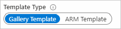

# Programmatically manage workbooks

Resource owners have the option to create and manage their workbooks programmatically via Resource Manager templates.

This can be useful in scenarios like:
* Deploying org- or domain-specific analytics reports along with resources deployments. For instance, you may deploy org-specific performance and failure workbooks for your new apps or virtual machines.
* Deploying standard reports or dashboards using workbooks for existing resources.

The workbook will be created in the desired sub/resource-group and with the content specified in the Resource Manager templates.

There are two types of workbook resources that can be managed programmatically:
* [Workbook templates](#azure-resource-manager-template-for-deploying-a-workbook-template)
* [Workbook instances](#azure-resource-manager-template-for-deploying-a-workbook-instance)

## Azure Resource Manager template for deploying a workbook template

1. Open a workbook you want to deploy programmatically.
2. Switch the workbook to edit mode by clicking on the _Edit_ toolbar item.
3. Open the _Advanced Editor_ using the _</>_ button on the toolbar.
4. Ensure you are on the _Gallery Template_ tab.

    
1. Copy the JSON in the gallery template to the clipboard.
2. Below is a sample Azure Resource Manager template that deploys a workbook template to Azure Monitor workbook gallery. Paste the JSON you copied in place of `<PASTE-COPIED-WORKBOOK_TEMPLATE_HERE>`. A reference Azure Resource Manager template that creates a workbook template can be found [here](https://github.com/microsoft/Application-Insights-Workbooks/blob/master/Documentation/ARM-template-for-creating-workbook-template).

    ```json
    {
        "$schema": "http://schema.management.azure.com/schemas/2015-01-01/deploymentTemplate.json#",
        "contentVersion": "1.0.0.0",
        "parameters": {
            "resourceName": {
                "type": "string",
                "defaultValue": "my-workbook-template",
                "metadata": {
                    "description": "The unique name for this workbook template instance"
                }
            }
        },
        "resources": [
            {
                "name": "[parameters('resourceName')]",
                "type": "microsoft.insights/workbooktemplates",
                "location": "[resourceGroup().location]",
                "apiVersion": "2019-10-17-preview",
                "dependsOn": [],
                "properties": {
                    "galleries": [
                        {
                            "name": "A Workbook Template",
                            "category": "Deployed Templates",
                            "order": 100,
                            "type": "workbook",
                            "resourceType": "Azure Monitor"
                        }
                    ],
                    "templateData": <PASTE-COPIED-WORKBOOK_TEMPLATE_HERE>
                }
            }
        ]
    }
    ```
1. In the `galleries` object fill in the `name` and `category` keys with your values. Learn more about [parameters](#parameters) in the next section.
2. Deploy this Azure Resource Manager template using either the [Azure portal](https://docs.microsoft.com/azure/azure-resource-manager/templates/deploy-portal#deploy-resources-from-custom-template), [command line interface](https://docs.microsoft.com/azure/azure-resource-manager/templates/deploy-cli), [PowerShell](https://docs.microsoft.com/azure/azure-resource-manager/templates/deploy-powershell), etc.
3. Open the Azure portal and navigate to the workbook gallery chosen in the Azure Resource Manager template. In the example template, navigate to the Azure Monitor workbook gallery:
    1. Open the Azure portal and navigate to Azure Monitor
    2. Open `Workbooks` from the table of contents
    3. Find your template in the gallery under category `Deployed Templates` (will be one of the purple items).

### Parameters

|Parameters                |Explanation                                                                                             |
|:-------------------------|:-------------------------------------------------------------------------------------------------------|
| `name`                   | The name of the workbook template resource in Azure Resource Manager.                                  |
|`type`                    | Always microsoft.insights/workbooktemplates                                                            |
| `location`               | The Azure location that the workbook will be created in.                                               |
| `apiVersion`             | 2019-10-17 preview                                                                                     |
| `type`                   | Always microsoft.insights/workbooktemplates                                                            |
| `galleries`              | The set of galleries to show this workbook template in.                                                |
| `gallery.name`           | The friendly name of the workbook template in the gallery.                                             |
| `gallery.category`       | The group in the gallery to place the template in.                                                     |
| `gallery.order`          | A number that decides the order to show the template within a category in the gallery. Lower order implies higher priority. |
| `gallery.resourceType`   | The resource type corresponding to the gallery. This is usually the resource type string corresponding to the resource (for example, microsoft.operationalinsights/workspaces ). |
|`gallery.type`            | Referred to as workbook type, this is a unique key that differentiates the gallery within a resource type. Application Insights, for example, have types `workbook` and `tsg` corresponding to different workbook galleries. |

### Galleries

| Gallery                                        | Resource type                                      | Workbook type |
| :--------------------------------------------- |:---------------------------------------------------|:--------------|
| Workbooks in Azure Monitor                     | `Azure Monitor`                                    | `workbook`    |
| VM Insights in Azure Monitor                   | `Azure Monitor`                                    | `vm-insights` |
| Workbooks in Log analytics workspace           | `microsoft.operationalinsights/workspaces`         | `workbook`    |
| Workbooks in Application Insights              | `microsoft.insights/component`                     | `workbook`    |
| Troubleshooting guides in Application Insights | `microsoft.insights/component`                     | `tsg`         |
| Usage in Application Insights                  | `microsoft.insights/component`                     | `usage`       |
| Workbooks in Kubernetes service                | `Microsoft.ContainerService/managedClusters`       | `workbook`    |
| Workbooks in Resource groups                   | `microsoft.resources/subscriptions/resourcegroups` | `workbook`    |
| Workbooks in Azure Active Directory            | `microsoft.aadiam/tenant`                          | `workbook`    |
| VM Insights in Virtual machines                | `microsoft.compute/virtualmachines`                | `insights`    |
| VM Insights in virtual machine scale sets      | `microsoft.compute/virtualmachinescalesets`        | `insights`    |

## Azure Resource Manager template for deploying a workbook instance

1. Open a workbook that you want to deploy programmatically.
2. Switch the workbook to edit mode by clicking on the _Edit_ toolbar item.
3. Open the _Advanced Editor_ using the _</>_ button on the toolbar.
4. In the editor, switch _Template Type_ to _Resource Manager template_.
5. The Resource Manager template for creating shows up in the editor. Copy the content and use as-is or merge it with a larger template that also deploys the target resource.

    

## Sample Azure Resource Manager template
This template shows how to deploy a simple workbook that displays a 'Hello World!'
```json
{
    "$schema": "http://schema.management.azure.com/schemas/2015-01-01/deploymentTemplate.json#",
    "contentVersion": "1.0.0.0",
    "parameters": {
        "workbookDisplayName":  {             
            "type":"string",
            "defaultValue": "My Workbook",
            "metadata": {
                "description": "The friendly name for the workbook that is used in the Gallery or Saved List. Needs to be unique in the scope of the resource group and source" 
            }
        },
        "workbookType":  {             
            "type":"string",
            "defaultValue": "tsg",
            "metadata": {
                "description": "The gallery that the workbook will been shown under. Supported values include workbook, `tsg`, Azure Monitor, etc." 
            }
        },
        "workbookSourceId":  {             
            "type":"string",
            "defaultValue": "<insert-your-resource-id-here>",
            "metadata": {
                "description": "The id of resource instance to which the workbook will be associated" 
            }
        },
        "workbookId": {
            "type":"string",
            "defaultValue": "[newGuid()]",
            "metadata": {
                "description": "The unique guid for this workbook instance" 
            }
        }
    },    
    "resources": [
        {
            "name": "[parameters('workbookId')]",
            "type": "Microsoft.Insights/workbooks",
            "location": "[resourceGroup().location]",
            "kind": "shared",
            "apiVersion": "2018-06-17-preview",
            "dependsOn": [],
            "properties": {
                "displayName": "[parameters('workbookDisplayName')]",
                "serializedData": "{\"version\":\"Notebook/1.0\",\"items\":[{\"type\":1,\"content\":\"{\\\"json\\\":\\\"Hello World!\\\"}\",\"conditionalVisibility\":null}],\"isLocked\":false}",
                "version": "1.0",
                "sourceId": "[parameters('workbookSourceId')]",
                "category": "[parameters('workbookType')]"
            }
        }
    ],
    "outputs": {
        "workbookId": {
            "type": "string",
            "value": "[resourceId( 'Microsoft.Insights/workbooks', parameters('workbookId'))]"
        }
    }
}
```

### Template parameters

| Parameter | Explanation |
| :------------- |:-------------|
| `workbookDisplayName` | The friendly name for the workbook that is used in the Gallery or Saved List. Needs to be unique in the scope of the resource group and source |
| `workbookType` | The gallery that the workbook will be shown under. Supported values include workbook, `tsg`, Azure Monitor, etc. |
| `workbookSourceId` | The ID of the resource instance to which the workbook will be associated. The new workbook will show up related to this resource instance - for example in the resource's table of content under _Workbook_. If you want your workbook to show up in the workbook gallery in Azure Monitor, use the string _Azure Monitor_ instead of a resource ID. |
| `workbookId` | The unique guid for this workbook instance. Use _[newGuid()]_ to automatically create a new guid. |
| `kind` | Used to specify if the created workbook is shared or private. Use value _shared_ for shared workbooks and _user_ for private ones. |
| `location` | The Azure location where the workbook will be created. Use _[resourceGroup().location]_ to create it in the same location as the resource group |
| `serializedData` | Contains the content or payload to be used in the workbook. Use the Resource Manager template from the workbooks UI to get the value |

### Workbook types
Workbook types specify which workbook gallery type the new workbook instance will show up under. Options include:

| Type | Gallery location |
| :------------- |:-------------|
| `workbook` | The default used in most reports, including the Workbooks gallery of Application Insights, Azure Monitor, etc.  |
| `tsg` | The Troubleshooting Guides gallery in Application Insights |
| `usage` | The _More_ gallery under _Usage_ in Application Insights |

### Limitations
For a technical reason, this mechanism cannot be used to create workbook instances in the _Workbooks_ gallery of Application Insights. We are working on addressing this limitation. In the meanwhile, we recommend that you use the Troubleshooting Guide gallery (workbookType: `tsg`) to deploy Application Insights related workbooks.

## Next steps

Explore how workbooks are being used to power the new [Azure Monitor for Storage experience](../insights/storage-insights-overview.md).
