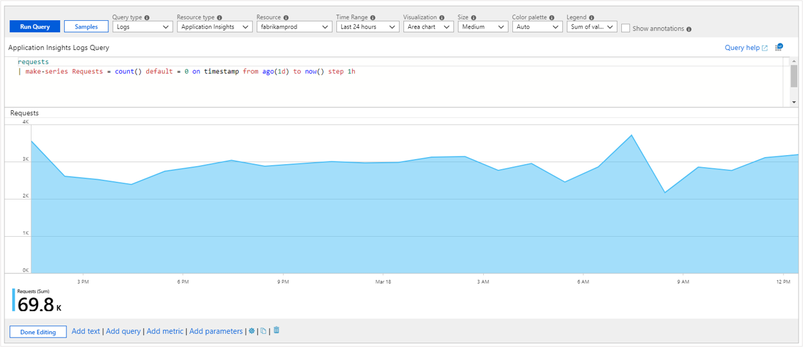
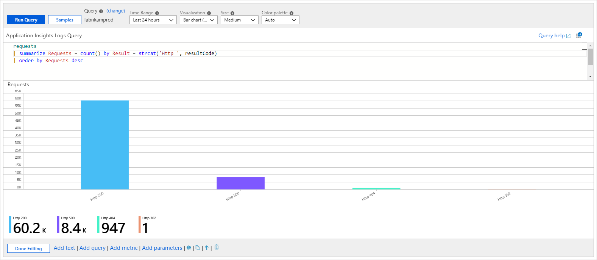
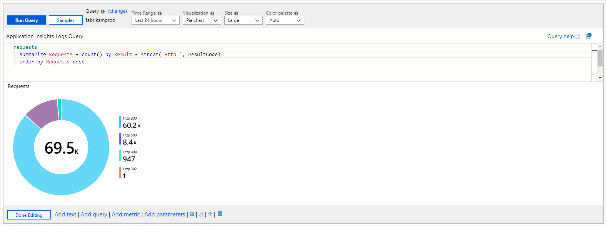
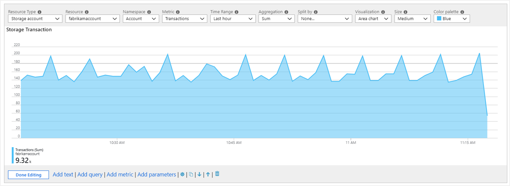
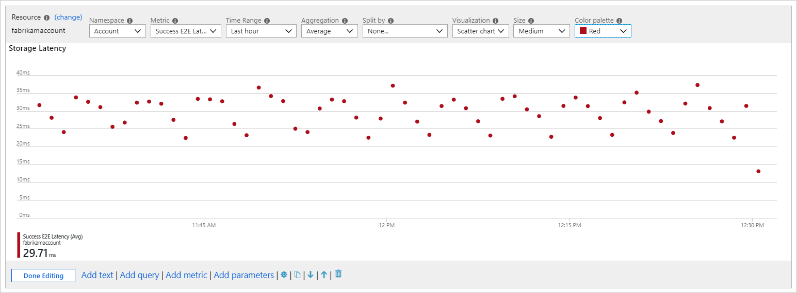
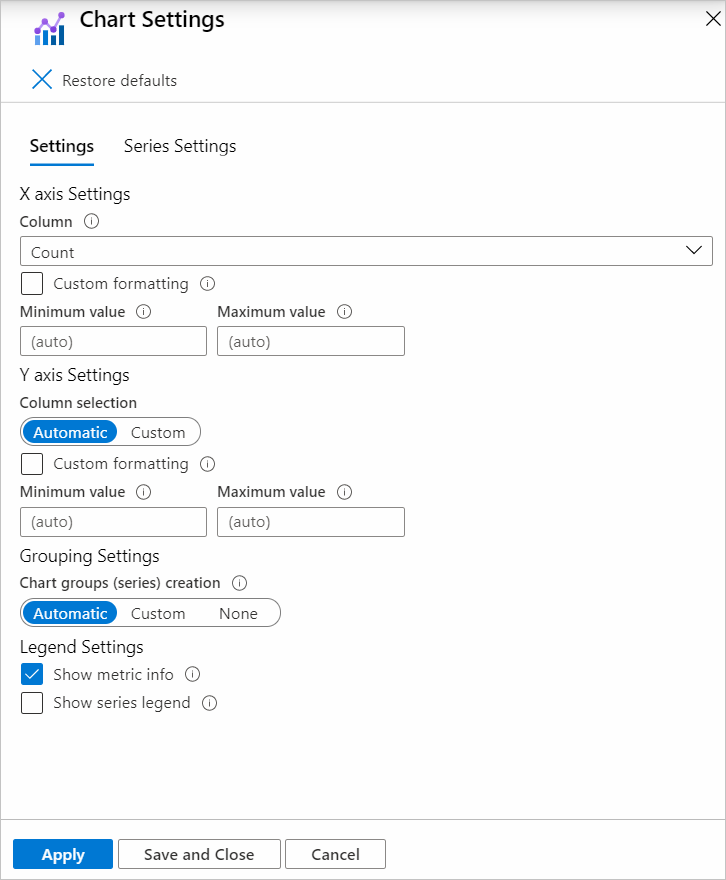

# Chart visualizations

Workbooks allow monitoring data to be presented as charts. Supported chart types include line, bar, bar categorical, area, scatter plots, pie, and time. Authors can choose to customize the height, width, color palette, legend, titles, no-data message, etc. of the chart and customize axis types and series colors using chart settings.

Workbooks support charts for both logs and metric data sources.

## Log charts

Azure Monitor logs gives resources owners detailed information about the workings of their apps and infrastructure. Unlike metrics, log information is not collected by default and requires some kind of collection on-boarding. However, when present logs provide a lot of information about the state of the resource and data useful for diagnostics. Workbooks allow presenting log data as visual charts for user analysis.

### Adding a log chart

The example below shows the trend of requests to an app over the previous days.

1. Switch the workbook to edit mode by selecting the **Edit** toolbar item.
2. Use the **Add query** link to add a log query control to the workbook.
3. Select the query type as **Log**, resource type (for example, Application Insights) and the resources to target.
4. Use the Query editor to enter the [KQL](/azure/kusto/query/) for your analysis (for example, trend of requests).
5. Set the visualization to one of: **Area**, **Bar**, **Bar (categorical)**, **Line**, **Pie**, **Scatter**, or **Time**.
6. Set other parameters if needed - like time range, visualization, size, color palette, and legend.

[](./media/workbooks-chart-visualizations/log-chart.png#lightbox)

### Log chart parameters

| Parameter | Explanation | Example |
| ------------- |:-------------|:-------------|
| `Query Type` | The type of query to use. | Log, Azure Resource Graph, etc. |
| `Resource Type` | The resource type to target. | Application Insights, Log Analytics, or Azure-first |
| `Resources` | A set of resources to get the metrics value from. | MyApp1 |
| `Time Range` | The time window to view the log chart. | Last hour, Last 24 hours, etc. |
| `Visualization` | The visualization to use. | Area, Bar, Line, Pie, Scatter, Time, bar categorical |
| `Size` | The vertical size of the control. | Small, medium, large, or full |
| `Color palette` | The color palette to use in the chart. Ignored in multi-metric or segmented mode. | Blue, green, red, etc. |
| `Legend` | The aggregation function to use for the legend. | Sum or Average of values or Max, Min, First, Last value |
| `Query` | Any KQL query that returns data in the format expected by the chart visualization. | _requests \| make-series Requests = count() default = 0 on timestamp from ago(1d) to now() step 1h_ |

### Time-series charts

Time series charts like area, bar, line, scatter, and time can be easily created using the query control in Workbooks. The key is having time and metric information in the result set.

#### Simple time-series

The query below  returns a table with two columns: *timestamp* and *Requests*. The query control uses *timestamp* for the X-axis and *Requests* for the Y-axis.

```kusto
requests
| summarize Requests = count() by bin(timestamp, 1h)
```

[](./media/workbooks-chart-visualizations/log-chart-line-simple.png#lightbox)

#### Time-series with multiple metrics

The query below returns a table with three columns: *timestamp*, *Requests*, and *Users*. The query control uses *timestamp* for the X-axis and *Requests* & *Users* as separate series on the Y-axis.

```kusto
requests
| summarize Requests = count(), Users = dcount(user_Id) by bin(timestamp, 1h)
```

[](./media/workbooks-chart-visualizations/log-chart-line-multi-metric.png#lightbox)

#### Segmented Time-series

The query below returns a table with three columns: *timestamp*, *Requests*, and *RequestName* where *RequestName* is a categorical column with the names of requests. The query control here uses *timestamp* for the X-axis and adds a series per value of *RequestName*.

```
requests
| summarize Request = count() by bin(timestamp, 1h), RequestName = name
```

[](./media/workbooks-chart-visualizations/log-chart-line-segmented.png#lightbox)

### Summarize vs. make-series

The examples in the previous section use the `summarize` operator because it is easier to understand. However, summarize does have a major limitation as it omits the results row if there are no items in the bucket. It can have the effect of shifting the chart time window depending on whether the empty buckets are in the front or backside of the time range.

It is usually better to use the `make-series` operator to create time series data, which has the option to provide default values for empty buckets.

The following query uses the `make-series` operator.

```kusto
requests
| make-series Requests = count() default = 0 on timestamp from ago(1d) to now() step 1h by RequestName = name
```

The query below shows a similar chart with the `summarize` operator

```kusto
requests
| summarize Request = count() by bin(timestamp, 1h), RequestName = name
```

Even though the underlying result set is different. All a user has to do is set the visualization to area, line, bar, or time and Workbooks will take care of the rest.

[](./media/workbooks-chart-visualizations/log-chart-line-make-series.png#lightbox)

### Categorical bar chart or histogram

Categorical charts allow users to represent a dimension or column on the X-axis of a chart, this is especially useful in histograms. The example below shows the distribution of requests by their result code.

```kusto
requests
| summarize Requests = count() by Result = strcat('Http ', resultCode)
| order by Requests desc
```

The query returns two columns: *Requests* metric and *Result* category. Each value of the *Result* column will get its own bar in the chart with height proportional to the *Requests metric*.

[](./media/workbooks-chart-visualizations/log-chart-categorical-bar.png#lightbox)

### Pie charts

Pie charts allow the visualization of numerical proportion. The example below shows the proportion of requests by their result code.

```kusto
requests
| summarize Requests = count() by Result = strcat('Http ', resultCode)
| order by Requests desc
```

The query returns two columns: *Requests* metric and *Result* category. Each value of the *Result* column will get its own slice in the pie with size proportional to the *Requests* metric.

[](./media/workbooks-chart-visualizations/log-chart-pie-chart.png#lightbox)

## Metric charts

Most Azure resources emit metric data about state and health (for example, CPU utilization, storage availability, count of database transactions, failing app requests, etc.). Workbooks allow the visualization of this data as time-series charts.)

### Adding a metric chart

The following example will show the number of transactions in a storage account over the prior hour. This allows the storage owner to see the transaction trend and look for anomalies in behavior.

1. Switch the workbook to edit mode by selecting the **Edit** toolbar item.
2. Use the **Add metric** link to add a metric control to the workbook.
3. Select a resource type (for example, Storage Account), the resources to target, the metric namespace and name, and the aggregation to use.
4. Set other parameters if needed - like time range, split-by, visualization, size, and color palette.

[](./media/workbooks-chart-visualizations/metric-chart.png#lightbox)

### Metric chart parameters

| Parameter | Explanation | Example |
| ------------- |:-------------|:-------------|
| `Resource Type` | The resource type to target. | Storage or Virtual Machine. |
| `Resources` | A set of resources to get the metrics value from. | MyStorage1 |
| `Namespace` | The namespace with the metric. | Storage > Blob |
| `Metric` | The metric to visualize. | Storage > Blob > Transactions |
| `Aggregation` | The aggregation function to apply to the metric. | Sum, Count, Average, etc. |
| `Time Range` | The time window to view the metric in. | Last hour, Last 24 hours, etc. |
| `Visualization` | The visualization to use. | Area, Bar, Line, Scatter, Grid |
| `Split By` | Optionally split the metric on a dimension. | Transactions by Geo type |
| `Size` | The vertical size of the control. | Small, medium, or large |
| `Color palette` | The color palette to use in the chart. Ignored if the `Split by` parameter is used. | Blue, green, red, etc. |

### Examples

Transactions split by API name as a line chart:

[](./media/workbooks-chart-visualizations/metric-chart-storage-split-line.png#lightbox)

Transactions split by response type as a large bar chart:

[](./media/workbooks-chart-visualizations/metric-chart-storage-bar-large.png#lightbox)

Average latency as a scatter chart:

[](./media/workbooks-chart-visualizations/metric-chart-storage-scatter.png#lightbox)

## Chart settings

Authors can use chart settings to customize which fields are used in the chart axes, the axis units, custom formatting, ranges, grouping behaviors, legends, and series colors.

### The settings tab

The settings tab controls:

- The axis settings, including which fields, custom formatting that allows users to set the number formatting to the axis values and custom ranges.
- Grouping settings, including which field, the limits before an "Others" group is created.
- Legend settings, including showing metrics (series name, colors, and numbers) at the bottom, and/or a legend (series names and colors).



#### Custom formatting

Number formatting options include:

| Formatting option             | Explanation                                                                                           |
|:---------------------------- |:-------------------------------------------------------------------------------------------------------|
| `Units`                      | The units for the column - various options for percentage, counts, time, byte, count/time, bytes/time, etc. For example, the unit for a value of 1234 can be set to milliseconds and it's rendered as 1.234s.                                  |
| `Style`                      | The format to render it as - decimal, currency, percent.                                               |
| `Show group separator`       | Checkbox to show group separators. Renders 1234 as 1,234 in the US.                                    |
| `Minimum integer digits`     | Minimum number of integer digits to use (default 1).                                                   |
| `Minimum fractional digits`  | Minimum number of fractional digits to use (default 0).                                                |
| `Maximum fractional digits`  | Maximum number of fractional digits to use.                                                            |
| `Minimum significant digits` | Minimum number of significant digits to use (default 1).                                               |
| `Maximum significant digits` | Maximum number of significant digits to use.                                                           |


### The series tab

The series setting tab lets you adjust the labels and colors shown for series in the chart.

- The `Series name` field is used to match a series in the data and if matched, the display label and color will be displayed.
- The `Comment` field is useful for template authors, as this comment may be used by translators to localize the display labels.


## Next steps

- Learn how to create a [tile in workbooks](workbooks-tile-visualizations.md).
- Learn how to create [interactive workbooks](workbooks-interactive.md).