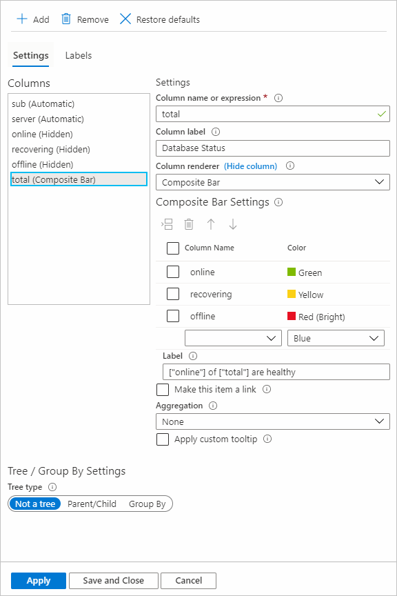
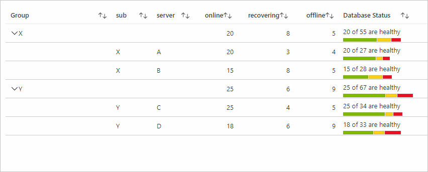
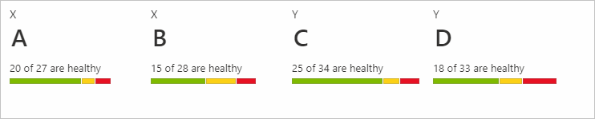
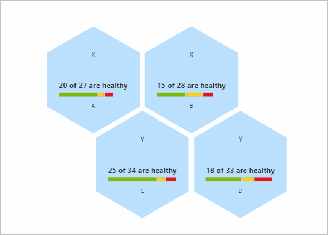

# Composite bar renderer

Workbook allows rendering data using composite bar, a bar made up of multiple bars.

The image below shows the composite bar for database status representing how many servers are online, offline, and in recovering state.


Composite bar renderer is supported for grids, tiles, and graphs visualizations.

## Adding composite bar renderer

1. Switch the workbook to edit mode by selecting *Edit* toolbar item.
2. Select *Add* then *Add query*.
3. Set *Data source* to "JSON" and *Visualization* to "Grid".
4. Add the following JSON data.

```json
[
    {"sub":"X", "server": "A", "online": 20, "recovering": 3, "offline": 4, "total": 27},
    {"sub":"X", "server": "B", "online": 15, "recovering": 8, "offline": 5, "total": 28},
    {"sub":"Y", "server": "C", "online": 25, "recovering": 4, "offline": 5, "total": 34},
    {"sub":"Y", "server": "D", "online": 18, "recovering": 6, "offline": 9, "total": 33}
]
```

5. Run query.
6. Select **Column Settings** to open the settings.
7. Select "total" from *Columns* and choose "Composite Bar" for *Column renderer*.
8. Set the following settings under *Composite Bar Settings*.

| Column Name | Color        |
|-------------|--------------|
| online      | Green        |
| recovering  | Yellow       |
| offline     | Red (Bright) |

9. Add Label:`["online"] of ["total"] are healthy`
10. In the column settings for online, offline, and recovering you can set column renderer to "Hidden" (Optional).
11. Select *Labels* at the top and update label for the total column as "Database Status" (Optional).
12. Select on **Apply**

The composite bar settings will look like the screenshot below:



The composite bar with the settings above:


## Composite bar settings

Select column name and corresponding color to render that column in that color as a part of composite bar. You can insert, delete, and move rows up and down.

### Label

Composite bar label is displayed at the top of the composite bar. You can use a mix of static text, columns, and parameter.  If Label is empty, the value of the current columns is displayed as the label. In the previous example if we left the label field black the value of total columns would be displayed.

Refer to columns with `["columnName"]`.

Refer to parameters with `{paramName}`.

Both column name and parameter name are case sensitive. You can also make labels a link by selecting "Make this item as a link" and then add link settings.

### Aggregation

Aggregations are useful for Tree/Group By visualizations. The data for a column for the group row is decided by the aggregation set for that column. There are three types of aggregations applicable for composite bars: None, Sum, and Inherit.

To add Group By settings:

1. In column settings, go to the column you want to add settings to.
2. In *Tree/Group By Settings* under *Tree type*, select **Group By**
3. Select the field you would like to group by.


#### None

None aggregation means display no results for that column for the group rows.


#### Sum

If aggregation is set as Sum, then the column in the group row will show the composite bar by using the sum of the columns used to render it. The label will also use the sum of the columns referred in it.

In the example below the online, offline, and recovering all have max aggregation set to them and the aggregation for the total column is sum.


#### Inherit

If aggregation is set as inherit, then the column in the group row will show the composite bar by using the aggregation set by users for the columns used to render it. The columns used in label also use the aggregation set by the user. If the current column renderer is composite bar and is refereed in the label (like "total" in the example above), then sum is used as the aggregation for that column.

In the example below, the online, offline, and recovering all have max aggregation set to them and the aggregation for total column is inherit.



## Sorting

For grid visualizations, the sorting of the rows for the column with the composite bar renderer works based on the value that is the sum of the columns used to render the composite bar computer dynamically. In the previous examples, the value used for sorting is the sum of the online, recovering, and the offline columns for that particular row.

## Tiles visualization

1. Select **Add** and *add query*.
2. Change the data source to JSON enter the data from the [previous example](#adding-composite-bar-renderer).
3. Change visualization to *Tiles*.
4. Run query.
5. Select **Tile Settings**.
6. Select *Left* in Tile fields.
7. Enter the settings below under *Field Settings*.
    1. Use column: "server".
    2. Column renderer: "Text".
8. Select *Bottom* in Tile fields.
9. Enter the settings below under *Field Settings*.
    1. Use column: "total".
    2. Column renderer: "Composite Bar".
    3. Enter Set the following settings under "Composite Bar Settings".

    | Column Name | Color        |
    |-------------|--------------|
    | online      | Green        |
    | recovering  | Yellow       |
    | offline     | Red (Bright) |

    4. Add Label:`["online"] of ["total"] are healthy`.
10. Select **Apply**.

Composite bar settings for tiles:


The Composite bar view for Tiles with the above settings will look like this:



## Graphs visualization

To make a composite bar renderer for Graphs visualization (type Hive Clusters), follow the instructions below.

1. Select **Add** and *add query*.
2. Change the data source to JSON enter the data from the [previous example](#adding-composite-bar-renderer).
3. Change visualization to *Graphs*.
4. Run query.
5. Select **Graph Settings**.
6. Select *Center Content* in Node Format Settings.
7. Enter the settings below under *Field Settings*.
    1. Use column: "total".
    2. Column renderer: "Composite Bar".
    3. Enter the following settings under *Composite Bar Settings*.

    |Column Name  |     Color    |
    |-------------|--------------|
    | online      | Green        |
    | recovering  | Yellow       |
    | offline     | Red (Bright) |

   4. Add Label:`["online"] of ["total"] are healthy`.
9. Enter the settings below under *Layout Settings*.
    1. Graph Type: **Hive Clusters**.
    2. Node ID select: "server".
    3. Group By Field: "None".
    4. Node Size: 100.
    5. Margin between hexagons: 5.
    6. Coloring Type type: **None**.
1. Select **Apply**.
    
Composite bar settings for graphs:


The Composite bar view for Graph with the above settings will look like this:



## Next steps

* [Deploy](workbooks-automate.md) workbooks with Azure Resource Manager.
* [Control](workbooks-access-control.md) and share access to your workbook resources.
