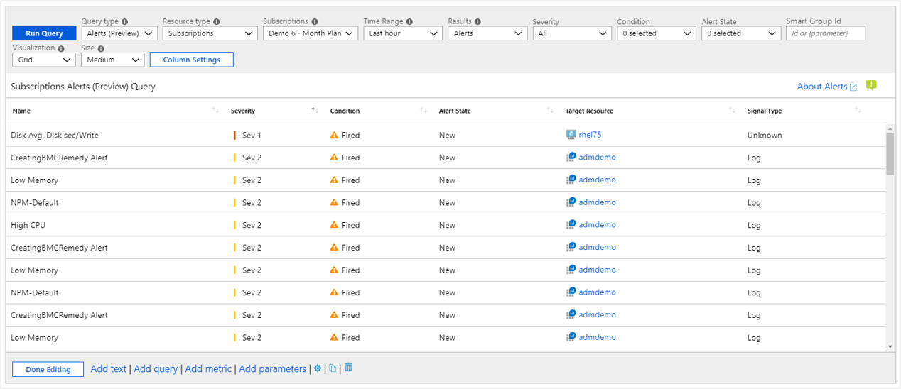

# Azure Monitor workbooks data sources

Workbooks are compatible with a large number of data sources. This article will walk you through data sources which are currently available for Azure Monitor workbooks.

## Logs

Workbooks allow querying logs from the following sources:

* Azure Monitor Logs (Application Insights Resources and Log Analytics Workspaces.)
* Resource-centric data (Activity logs)

Workbook authors can use KQL queries that transform the underlying resource data to select a result set that can visualized as text, charts, or grids.

Workbook authors can easily query across multiple resources creating a truly unified rich reporting experience.

## Metrics

Azure resources emit [metrics](data-platform-metrics.md) that can be accessed via workbooks. Metrics can be accessed in workbooks through a specialized control that allows you to specify the target resources, the desired metrics, and their aggregation. This data can then be plotted in charts or grids.

## Azure Resource Graph 

Workbooks support querying for resources and their metadata using Azure Resource Graph (ARG). This functionality is primarily used to build custom query scopes for reports. The resource scope is expressed via a KQL-subset that ARG supports – which is often sufficient for common use cases.

To make a query control use this data source, use the Query type drop-down to choose Azure Resource Graph and select the subscriptions to target. Use the Query control to add the ARG KQL-subset that selects an interesting resource subset.

## Alerts (preview)

Workbooks allow users to visualize the active alerts related to their resources. This feature allows the creation of reports that bring together notification data (alert) and diagnostic information (metrics, logs) into one report. This information can also be joined together to create rich reports that combine insights across these data sources.

To make a query control use this data source, use the Query type drop-down to choose Alerts and select the subscriptions, resource groups or resources to target. Use the alert filter drop downs to select an interesting subset of alerts for your analytic needs.

## Workload health (preview)

Azure Monitor has functionality that proactively monitors the availability and performance of Windows or Linux guest operating systems. Azure Monitor models key components and their relationships, criteria for how to measure the health of those components, and which components alert you when an unhealthy condition is detected. Workbooks allow users to use this information to create rich interactive reports.

To make a query control use this data source, use the **Query type** drop-down to choose Workload Health and select subscription, resource group or VM resources to target. Use the health filter drop downs to select an interesting subset of health incidents for your analytic needs.

## Azure resource health 

Workbooks support getting Azure resource health and combining it with other data sources to create rich, interactive health reports

To make a query control use this data source, use the **Query type** drop-down to choose Azure health and select the resources to target. Use the health filter drop downs to select an interesting subset of resource issues for your analytic needs.

## Azure Data Explorer (preview)

Workbooks now have support for querying from [Azure Data Explorer](https://docs.microsoft.com/azure/data-explorer/) clusters with the powerful [Kusto](https://docs.microsoft.com/azure/kusto/query/index) query language.   

## Next steps

* [Get started](workbooks-visualizations.md) learning more about workbooks many rich visualizations options.
* [Control](workbooks-access-control.md) and share access to your workbook resources.
