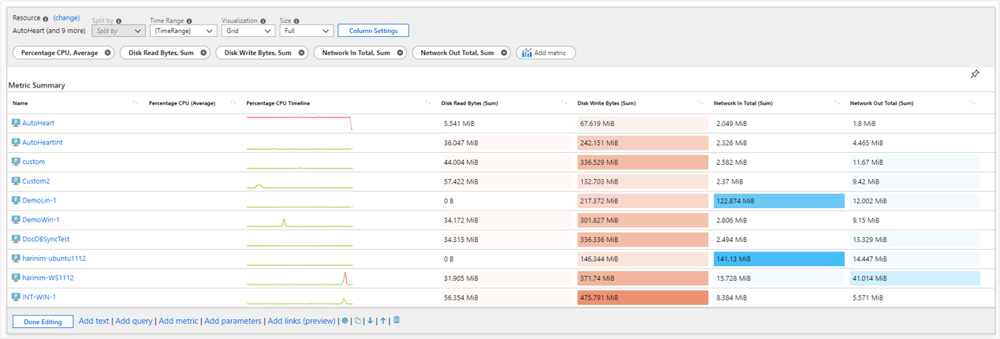
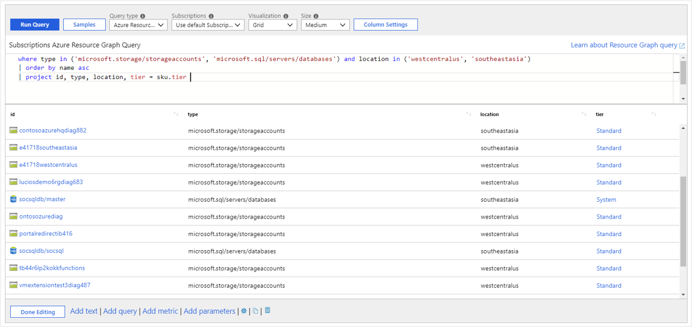
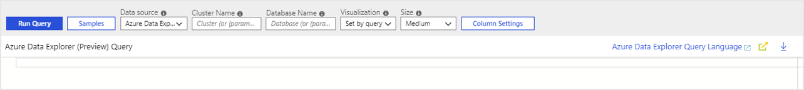
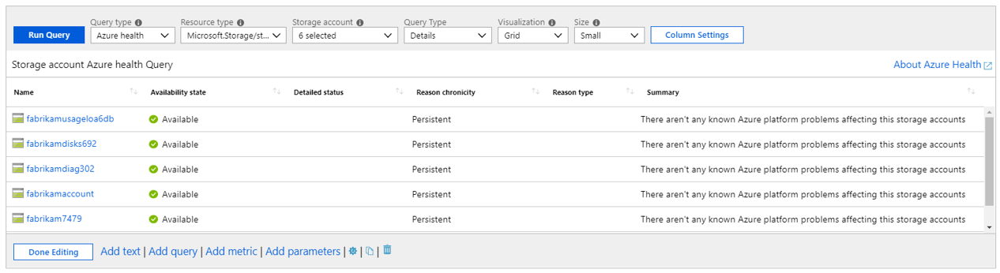

# Azure Monitor workbooks data sources

Workbooks are compatible with a large number of data sources. This article will walk you through data sources which are currently available for Azure Monitor workbooks.

## Logs

Workbooks allow querying logs from the following sources:

* Azure Monitor Logs (Application Insights Resources and Log Analytics Workspaces.)
* Resource-centric data (Activity logs)

Workbook authors can use KQL queries that transform the underlying resource data to select a result set that can visualized as text, charts, or grids.

Workbook authors can easily query across multiple resources creating a truly unified rich reporting experience.

## Metrics

Azure resources emit [metrics](data-platform-metrics.md) that can be accessed via workbooks. Metrics can be accessed in workbooks through a specialized control that allows you to specify the target resources, the desired metrics, and their aggregation. This data can then be plotted in charts or grids.

## Azure Resource Graph

Workbooks support querying for resources and their metadata using Azure Resource Graph (ARG). This functionality is primarily used to build custom query scopes for reports. The resource scope is expressed via a KQL-subset that ARG supports – which is often sufficient for common use cases.

To make a query control use this data source, use the Query type drop-down to choose Azure Resource Graph and select the subscriptions to target. Use the Query control to add the ARG KQL-subset that selects an interesting resource subset.

## Azure Resource Manager

Workbook supports Azure Resource Manager REST operations. This allows the ability to query management.azure.com endpoint without the need to provide your own authorization header token.

To make a query control use this data source, use the Data source drop-down to choose Azure Resource Manager. Provide the appropriate parameters such as Http method, url path, headers, url parameters and/or body.

> [!NOTE]
> Only `GET`, `POST`, and `HEAD` operations are currently supported.

## Azure Data Explorer

Workbooks now have support for querying from [Azure Data Explorer](https://docs.microsoft.com/azure/data-explorer/) clusters with the powerful [Kusto](https://docs.microsoft.com/azure/kusto/query/index) query language.   

## Workload health

Azure Monitor has functionality that proactively monitors the availability and performance of Windows or Linux guest operating systems. Azure Monitor models key components and their relationships, criteria for how to measure the health of those components, and which components alert you when an unhealthy condition is detected. Workbooks allow users to use this information to create rich interactive reports.

To make a query control use this data source, use the **Query type** drop-down to choose Workload Health and select subscription, resource group or VM resources to target. Use the health filter drop downs to select an interesting subset of health incidents for your analytic needs.

## Azure resource health

Workbooks support getting Azure resource health and combining it with other data sources to create rich, interactive health reports

To make a query control use this data source, use the **Query type** drop-down to choose Azure health and select the resources to target. Use the health filter drop downs to select an interesting subset of resource issues for your analytic needs.

## JSON

The JSON provider allows you to create a query result from static JSON content. It is most commonly used in Parameters to create dropdown parameters of static values. Simple JSON arrays or objects will automatically be converted into grid rows and columns.  For more specific behaviors, you can use the Results tab and JSONPath settings to configure columns.

## Alerts (preview)

> [!NOTE]
> The suggested way to query for Azure Alert information is by using the [Azure Resource Graph](#azure-resource-graph) data source, by querying the `AlertsManagementResources` table.
>
> See the [Azure Resource Graph table reference](https://docs.microsoft.com/azure/governance/resource-graph/reference/supported-tables-resources), or the [Alerts template](https://github.com/microsoft/Application-Insights-Workbooks/blob/master/Workbooks/Azure%20Resources/Alerts/Alerts.workbook) for examples.
>
> The Alerts data source will remain available for a period of time while authors transition to using ARG. Use of this data source in templates is discouraged. 

Workbooks allow users to visualize the active alerts related to their resources. 
Limitations: the alerts data source requires read access to the Subscription in order to query resources, and may not show newer kinds of alerts. 

To make a query control use this data source, use the _Data source_ drop-down to choose _Alerts (preview)_ and select the subscriptions, resource groups or resources to target. Use the alert filter drop downs to select an interesting subset of alerts for your analytic needs.

## Custom endpoint

Workbooks support getting data from any external source. If your data lives outside Azure you can bring it to Workbooks by using this data source type.

To make a query control use this data source, use the _Data source_ drop-down to choose _Custom Endpoint_. Provide the appropriate parameters such as `Http method`, `url`, `headers`, `url parameters` and/or `body`. Make sure your data source supports [CORS](https://developer.mozilla.org/en-US/docs/Web/HTTP/CORS) otherwise the request will fail.

To avoid automatically making calls to untrusted hosts when using templates, the user needs to mark the used hosts as trusted. This can be done by either clicking on the _Add as trusted_ button, or by adding it as a trusted host in Workbook settings. These settings will be saved in browsers that support IndexDb with web workers, more info [here](https://caniuse.com/#feat=indexeddb).

> [!NOTE]
> Do not write any secrets in any of the fields (`headers`, `parameters`, `body`, `url`), since they will be visible to all of the Workbook users.

## Next steps

* [Get started](workbooks-visualizations.md) learning more about workbooks many rich visualizations options.
* [Control](workbooks-access-control.md) and share access to your workbook resources.
* [Log Analytics query optimization tips](https://docs.microsoft.com/azure/azure-monitor/log-query/query-optimization)
* 
