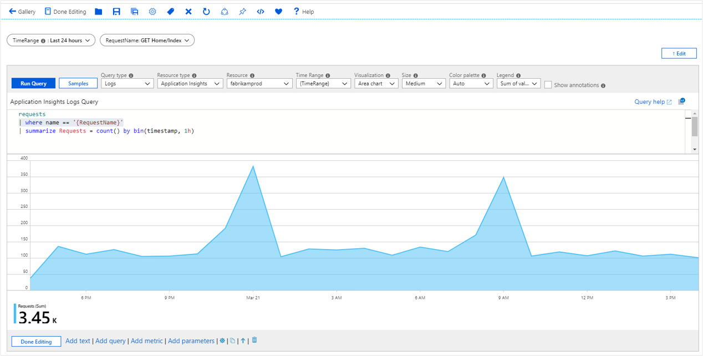

# Workbook drop down parameters

Drop downs allow user to collect one or more input values from a known set (for example, select one of your app’s requests). Drop downs provide a user-friendly way to collect arbitrary inputs from users. Drop downs are especially useful in enabling filtering in your interactive reports. 

The easiest way to specify a drop-down is by providing a static list in the parameter setting. A more interesting way is to get the list dynamically via a KQL query. Parameter settings also allow you to specify whether it is single or multi-select, and if it is multi-select, how the result set should be formatted (delimiter, quotation, etc.).

## Creating a static drop-down parameter

1. Start with an empty workbook in edit mode.
2. Choose _Add parameters_ from the links within the workbook.
3. Click on the blue _Add Parameter_ button.
4. In the new parameter pane that pops up enter:
    1. Parameter name: `Environment`
    2. Parameter type: `Drop down`
    3. Required: `checked`
    4. Allow `multiple selection`: `unchecked`
    5. Get data from: `JSON`
5. In the JSON Input text block, insert this json snippet:
    ```json
    [
        { "value":"dev", "label":"Development" },
        { "value":"ppe", "label":"Pre-production" },
        { "value":"prod", "label":"Production", "selected":true }
    ]
    ```
6. Hit the blue `Update` button.
7. Choose 'Save' from the toolbar to create the parameter.
8. The Environment parameter will be a drop-down with the three values.

    

## Creating a static dropdown with groups of items
If your query result/json contains a "group" field, the dropdown will display groups of values. Follow the above sample, but use the following json instead:
```json
[
    { "value":"dev", "label":"Development", "group":"Development" },
    { "value":"dev-cloud", "label":"Development (Cloud)", "group":"Development" },
    { "value":"ppe", "label":"Pre-production", "group":"Test" },
    { "value":"ppe-test", "label":"Pre-production (Test)", "group":"Test" },
    { "value":"prod1", "label":"Prod 1", "selected":true, "group":"Production" },
    { "value":"prod2", "label":"Prod 2", "group":"Production" }
]
```
    


## Creating a dynamic drop-down parameter
1. Start with an empty workbook in edit mode.
2. Choose _Add parameters_ from the links within the workbook.
3. Click on the blue _Add Parameter_ button.
4. In the new parameter pane that pops up enter:
    1. Parameter name: `RequestName`
    2. Parameter type: `Drop down`
    3. Required: `checked`
    4. Allow `multiple selection`: `unchecked`
    5. Get data from: `Query`
5. In the JSON Input text block, insert this json snippet:

    ```kusto
        requests
        | summarize by name
        | order by name asc
    ```
1. Hit the blue `Run Query` button.
2. Choose 'Save' from the toolbar to create the parameter.
3. The RequestName parameter will be a drop-down the names of all requests in the app.

    

## Referencing drop down parameter
### In KQL
1. Add a query control to the workbook and select an Application Insights resource.
2. In the KQL editor, enter this snippet

    ```kusto
        requests
        | where name == '{RequestName}'
        | summarize Requests = count() by bin(timestamp, 1h)

    ```
3. This expands on query evaluation time to:

    ```kusto
        requests
        | where name == 'GET Home/Index'
        | summarize Requests = count() by bin(timestamp, 1h)
    ```

4. Run query to see the results. Optionally, render it as a chart.

    


## Parameter value, label, selection and group
The query used in the dynamic drop-down parameter above just returns a list of values that are rendered faithfully in the drop-down. But what if you wanted a different display name, or one of these to be selected? Drop down parameters allow this via the value, label, selection and group columns.

The sample below shows how to get a list of Application Insights dependencies whose display names are styled with an emoji, has the first one selected, and is grouped by  operation names.

```kusto
dependencies
| summarize by operation_Name, name
| where name !contains ('.')
| order by name asc
| serialize Rank = row_number()
| project value = name, label = strcat('🌐 ', name), selected = iff(Rank == 1, true, false), group = operation_Name
```
    


## Drop down parameter options
| Parameter | Explanation | Example |
| ------------- |:-------------|:-------------|
| `{DependencyName}` | The selected value | GET fabrikamaccount |
| `{DependencyName:label}` | The selected label | 🌐 GET fabrikamaccount |
| `{DependencyName:value}` | The selected value | GET fabrikamaccount |

## Multiple selection
The examples so far explicitly set the parameter to select only one value in the drop-down. Drop down parameters also support `multiple selection` - enabling this is as simple as checking the `Allow multiple selection` option. 

The user also has the option of specifying the format of the result set via the `delimiter` and `quote with` settings. The default just returns the values as a collection in this form: 'a', 'b', 'c'. They also have the option to limit the number of selections.

The KQL referencing the parameter will need to change to work with the format of the result. The most common way to enable it is via the `in` operator.

```kusto
dependencies
| where name in ({DependencyName})
| summarize Requests = count() by bin(timestamp, 1h), name
```

Here is an example for multi-select drop-down at work:


## Next steps

* [Get started](workbooks-visualizations.md) learning more about workbooks many rich visualizations options.
* [Control](workbooks-access-control.md) and share access to your workbook resources.
