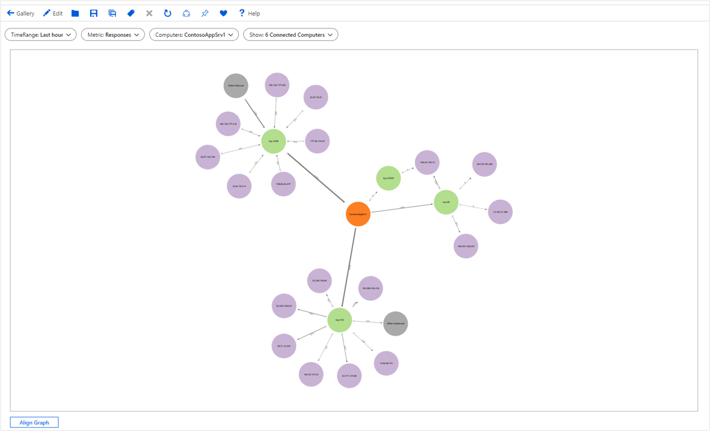

# Graph visualizations

Workbooks support visualizing arbitrary graphs based on data from logs to show the relationships between monitoring entities.

The graph below show data flowing in/out of a computer via various ports to/from external computers. It is colored by type (computer vs. port vs. external IP) and the edge sizes correspond to the amount of data flowing in-between. The underlying data comes from KQL query targeting VM connections.

[](./media/workbooks-graph-visualizations/graph.png#lightbox)

## Adding a graph
1. Switch the workbook to edit mode by clicking on the _Edit_ toolbar item.
2. Use the **Add query** link to add a log query control to the workbook.
3. Select the query type as **Log**, resource type (for example, Application Insights) and the resources to target.
4. Use the Query editor to enter the KQL for your analysis.

    ```kusto
    let data = dependencies
    | summarize Calls = count() by App = appName, Request = operation_Name, Dependency = name
    | extend RequestId = strcat(App, '::', Request);
    let links = data
    | summarize Calls = sum(Calls) by App, RequestId
    | project SourceId = App, TargetId = RequestId, Calls, Kind = 'App -> Request'
    | union (data
        | project SourceId = RequestId, TargetId = Dependency, Calls, Kind = 'Request -> Dependency');
    let nodes = data
    | summarize Calls = sum(Calls) by App
    | project Id = App, Name = App, Calls, Kind = 'App'
    | union (data
        | summarize Calls = sum(Calls) by RequestId, Request
        | project Id = RequestId, Name = Request, Calls, Kind = 'Request')
    | union (data
        | summarize Calls = sum(Calls) by Dependency
        | project Id = Dependency, Name = Dependency, Calls, Kind = 'Dependency');
    nodes
    | union (links)
    ```

5. Set the visualization to **Graph**
6. Select the **Graph Settings** button to open the settings pane
7. In _Layout Fields_ at the bottom, set:
    * Node Id: `Id`
    * Source Id: `SourceId`
    * Target Id: `TargetId`
    * Edge Label: `None`
    * Edge Size: `Calls`
    * Node Size: `None`
    * Coloring Type: `Categorical`
    * Node Color Field: `Kind`
    * Color palette: `Pastel`
8. In _Node Format Settings_ at the top, set:
    * _Top Content_- Use Column: `Name`, Column Renderer: `Text`
    * _Center Content_- Use Column: `Calls`, Column Renderer: `Big Number`, Color Palette: `None`
    * _Bottom Content_- Use Column: `Kind`, Column Renderer: `Text`
9. Select the _Save and Close_ button at the bottom of the pane.

[](./media/workbooks-graph-visualizations/graph-settings.png#lightbox)

## Graph settings

| Setting         | Explanation                                                                                                        |
|:----------------|:-------------------------------------------------------------------------------------------------------------------|
| `Node Id`       | Selects a column that provides the unique ID of nodes on the graph. Value of the column can be string or a number. |
| `Source Id`     | Selects a column that provides the IDs of source nodes for edges on the graph. Values must map to a value in the _Node Id_ column. |
| `Target Id`     | Selects a column that provides the IDs of target nodes for edges on the graph. Values must map to a value in the _Node Id_ column. |
| `Edge Label`    | Selects a column that provides edge labels on the graph.                                                            |
| `Edge Size`     | Selects a column that provides the metric on which the edge widths will be based on.                                |
| `Node Size`     | Selects a column that provides the metric on which the node areas will be based on.                                 |
| `Coloring Type` | Used to choose the node coloring scheme.                                                                            |

## Node coloring types

| Coloring Type | Explanation |
|:------------- |:------------|
| `None`        | All nodes have the same color. |
| `Categorical` | Nodes are assigned colors based on the value or category from a column in the result set. In the example above, the coloring is based on the column _Kind_ of the result set. Supported palettes are `Default`, `Pastel`, and `Cool tone`.  |
| `Field Based` | In this type, a column provides specific RGB values to use for the node. Provides the most flexibility but usually requires more work to enable.  |

## Node format settings

Graphs authors can specify what content goes to the different parts of a node: top, left, center, right, and bottom. Graphs can use any of renderers workbooks supports (text, big number, spark lines, icon, etc.).

## Field based node coloring

1. Switch the workbook to edit mode by clicking on the _Edit_ toolbar item.
2. Use the **Add query** link to add a log query control to the workbook.
3. Select the query type as **Log**, resource type (for example, Application Insights), and the resources to target.
4. Use the Query editor to enter the KQL for your analysis.

     ```kusto
    let data = dependencies
    | summarize Calls = count() by App = appName, Request = operation_Name, Dependency = name
    | extend RequestId = strcat(App, '::', Request);
    let links = data
    | summarize Calls = sum(Calls) by App, RequestId
    | project SourceId = App, TargetId = RequestId, Calls, Kind = 'App -> Request'
    | union (data
        | project SourceId = RequestId, TargetId = Dependency, Calls, Kind = 'Request -> Dependency');
    let nodes = data
    | summarize Calls = sum(Calls) by App
    | project Id = App, Name = App, Calls, Color = 'FD7F23'
    | union (data
        | summarize Calls = sum(Calls) by RequestId, Request
        | project Id = RequestId, Name = Request, Calls, Color = 'B3DE8E')
    | union (data
        | summarize Calls = sum(Calls) by Dependency
        | project Id = Dependency, Name = Dependency, Calls, Color = 'C9B3D5');
    nodes
    | union (links)
    ```
5. Set the visualization to *Graph*
6. Select the **Graph Settings**  button to open the settings pane.
7. In *Layout Fields* at the bottom, set:
    * Node Id:`Id`
    * Source Id: `SourceId`
    * Target Id: `TargetId`
    * Edge Label: `None`
    * Edge Size: `Calls`
    * Node Size: `Node`
    * Coloring Type: `Field Based`
    * Node Color Field: `Color`
8. In *Node Format Settings* at the top, enter the following.
    * In *Top Content*, set:
        * Use Column: `Name`.
        * Column renderer: `Text`.
    * In *Center Content*, set:
        * Use column: `Calls`
        * Column Renderer: `Big Number`
        * Color palette: `None`
    * In *Bottom Content*, set:
        * Use column: `Kind`
        * Column renderer: `Text`.
9. Select the **Save and Close button** at the bottom of the pane.

[](./media/workbooks-graph-visualizations/graph-field-based.png#lightbox)

## Next steps

* Graphs also support Composite bar renderer. To learn more visit the [Composite Bar documentation](workbooks-composite-bar.md).
* Learn more about the [data sources](workbooks-data-sources.md) you can use in workbooks.
