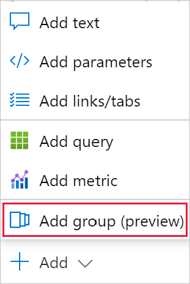
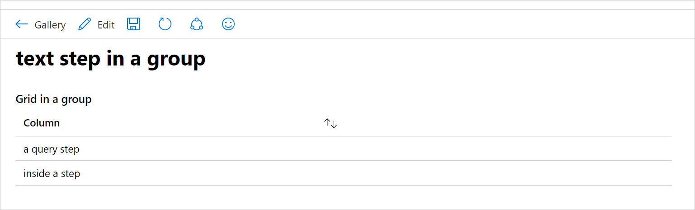
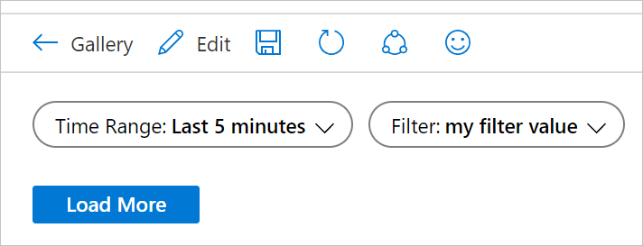
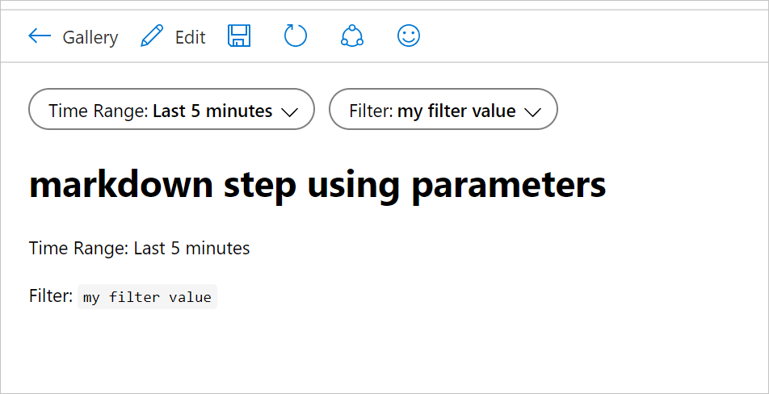
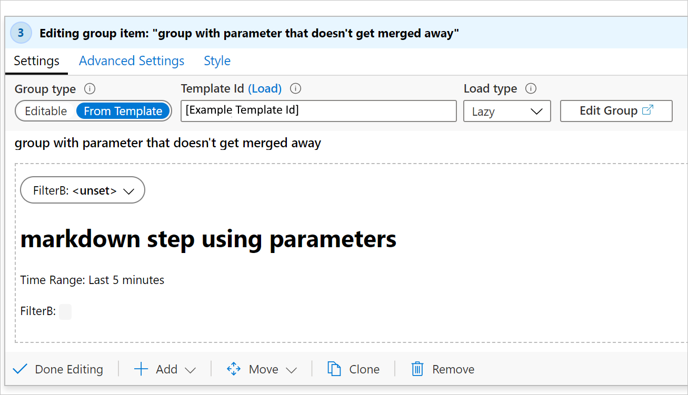

# How to use groups in workbooks

A group item in a workbook allows you to logically group a set of steps in a workbook.

Groups in workbooks are useful for several things:

- Layout
  - In scenarios where you want items to be organized vertically, you can create a group of items that will all stack up and set the styling of the group to be a percentage width instead of setting percentage width on all the individual items.
- Visibility
  - In scenarios where you want many items to hide/show together, you can set the visibility of the entire group of items, instead of setting visibility settings on each individual item. This can be useful in templates that use tabs, as you can use a group as the content of the tab, and the entire group can be hidden/shown based on a parameter set by the selected tab.
- Performance
  - In cases where you have a very large template with many sections or tabs, you can convert each section into its own sub-template and use groups to load all the sub-templates within the top-level template. The content of the sub-templates won't load or run until a user makes those groups visible. Learn more about [how to split a large template into many templates](#how-to-split-a-large-template-into-many-templates).

## Using groups

To add a group to your workbook, select *Add* then *Add group*.

Below is a screenshot of a group in read mode with two items inside: a text item and a query item.  

When editing the workbook, you can see those two items are actually inside a group item:

In the screenshot above, the group is in edit mode, showing it contains two items (inside the dashed area). Each step can be in edit or read mode, independent of each other. For example, the text step is in edit mode while the query step is in read mode.

## Scoping

Currently, a group is treated as a new scope in the workbook. Any parameters created in the group are only visible inside the group. This is also true for merge, you can only see data inside their group or at the parent level.

## Group types

The workbook group item allows you to add a group of items to a workbook. As the author of a workbook, you specify which type of group it will be. There are two types of groups:

- Editable
  - The group in the workbook allows you to add, remove, or edit the contents of the items in the group. This is most commonly used for layout and visibility purposes.
- From template
  - The group in the workbook loads from the contents of another template by its ID. The content of that template is loaded and merged into the workbook at runtime. In edit mode, you cannot modify any of the contents of the group, as they will just load again from the template next time the item loads.  

## Load types

There are a few different ways that the content of a group may be loaded. As the author of a workbook, you get to specify when and how the contents of a group will load.

### Lazy (the default)

The group will only load when the item is visible. This allows a group to be used by tab items. If the tab is never selected, the group never becomes visible therefore the content isn't loaded.

For groups created from a template, the content of the template is not retrieved and the items in the group are not created until the group becomes visible. The user will see progress spinners for the whole group while the content is retrieved.

### Explicit

In this mode a button is displayed where the group would be, and no content is retrieved or created until the user explicitly clicks the button to load the content. This is useful in scenarios where the content might be expensive to compute or rarely used. The author can specify the text to appear on the button.

Below is a screenshot of explicit load settings showing a configured "Load more" button.

The group before being loaded in the workbook:

The group after being loaded in the workbook:

### Always

In this mode, the content of the group is always loaded and created as soon as the workbook loads. This is most frequently used when using a group only for layout purposes, where the content will always be visible.

## Using templates inside a group

When a group is configured to load from a template, that content will be loaded lazy by default, it will only load when the group is visible.

When a template is loaded into a group, the workbook attempts to merge any parameters declared in the template being loaded with parameters already existing in the group. Any parameters that already exist in the workbook with identical names will be merged out of the template being loaded. If all parameters in a parameter step are merged out, the entire parameters step will disappear.

### Example 1: all parameters have identical names

Consider a template that has two parameters at the top.

- `TimeRange` - a time range parameter.
- `Filter` - a text parameter.

Then a group item loads a second template that has its own two parameters and a text step, where the parameters are named the same:

When the second template is loaded into the group, the duplicate parameters will be merged out. Since all the of the parameters are merged away, the inner parameters step is also merged out, resulting in the group containing only the text step.

### Example 2: one parameter has an identical name

Consider a group's template that has two parameters at the top.

- `TimeRange` - a time range parameter.
- `FilterB` - a text parameter, note it is not `Filter` like the top template had.

When the group's item's template is loaded, the `TimeRange` parameter will be merged out of the group. Then the workbook will have the initial parameters step with `TimeRange` and `Filter`, and the group's parameter step will only include `FilterB`

If the loaded template had contained `TimeRange` and `Filter` (instead of `FilterB`), then the resulting workbook would have a parameters step and a group with only the text step remaining.

## How to split a large template into many templates

To improve performance, it is beneficial to break up a large template into multiple smaller templates that loads some content lazy or on demand by the user. This makes the initial load faster as the top-level template can be much smaller.

When splitting  a template into parts, you will effectively need to split the template into many templates (sub-templates) that all work individually. So if the top-level template has a `TimeRange` parameter that other steps use, the sub-template will need to also have a parameters step that defines a parameter with the exact name. This lets the sub-templates work independently and lets them load inside larger templates in groups.

To turn a larger template into multiple sub-templates:

1.  Create a new empty group near the top of the workbook, after the shared parameters. This new group will eventually become a sub-template.
2. Create a copy of the shared parameters step, and then use *move into group* to move the copy into the group created in step 1. This parameters step will allow the sub-template to work independently of the outer template, and will get merged out when loaded inside the outer template.
    > [!NOTE]
    > Sub-template don't technically need to have these parameters that get merged out if you never intend on the sub-templates being visible by themselves. However, it will make them very hard to edit or debug if you need to do so later.

3. Move each item in the workbook you want to be in the sub-template into the group created in step 1.
4. If the individual steps moved in step 3 had conditional visibilities, that will become the visibility of the outer group (like used in tabs). Remove them from the items inside the group and add that visibility setting to the group itself. Save here to avoid losing changes and/or export and save a copy of the json content.
5. If you want that group to be loaded from a template, you can use the *Edit* toolbar button in the group. This will open just the content of that group as a workbook in a new window. You can then save it as appropriate and close this workbook view (don't close the browser, just that view to go back to the previous workbook you were editing).
6. You can then change the group step to load from template and set the template ID field to the workbook/template you created in step 5. To work with workbooks IDs, the source needs to be a shared workbook resource ID. Press *Load* and the content of that group will now be loaded from that sub-template instead of saved inside this outer workbook.

## Next steps
- [Workbooks Overview](workbooks-overview.md)
- [Using JSONPath with Workbooks](workbooks-jsonpath.md)