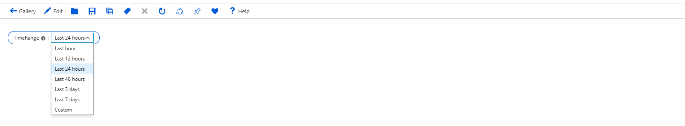
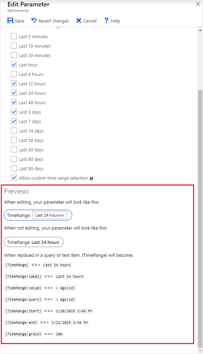

# Workbook parameters

Parameters allow workbook authors to collect input from the consumers and reference it in other parts of the workbook – usually to scope the result set or setting the right visual. It is a key capability that allows authors to build interactive reports and experiences. 

Workbooks allow you to control how your parameter controls are presented to consumers – text box vs. drop down, single- vs. multi-select, values from text, JSON, KQL, or Azure Resource Graph, etc.  

Supported parameter types include:
* [Time](workbooks-time.md) - allows a user to select from prepopulated time ranges or select a custom range
* [Drop down](workbooks-dropdowns.md) - allows a user to select from a value or set of values
* [Text](workbooks-text.md) - allows a user to enter arbitrary text
* [Resource](workbooks-resources.md) - allows a user to select one or more Azure resources
* [Subscription](workbooks-resources.md) - allows a user to select one or more Azure subscription resources
* Resource Type - allows a user to select one or more Azure resource type values
* Location - allows a user to select one or more Azure location values

These parameter values can be referenced in other parts of workbooks either via bindings or value expansions.

## Creating a parameter
1. Start with an empty workbook in edit mode.
2. Choose _Add parameters_ from the links within the workbook.
3. Click on the blue _Add Parameter_ button.
4. In the new parameter pane that pops up enter:
    1. Parameter name: `TimeRange` *(note that parameter __names__ **cannot** include spaces or special characters)*
    2. Display name: `Time Range`  *(however, __display names__ can include spaces, special characters, emoji, etc.)*
    2. Parameter type: `Time range picker`
    3. Required: `checked`
    4. Available time ranges: Last hour, Last 12 hours, Last 24 hours, Last 48 hours, Last 3 days, Last 7 days and Allow custom time range selection
5. Choose 'Save' from the toolbar to create the parameter.

   

This is how the workbook will look like in read-mode, in the "Pills" style.

   

## Referencing a parameter
### Via Bindings
1. Add a query control to the workbook and select an Application Insights resource.
2. Open the _Time Range_ drop down and select the `Time Range` option from the Parameters section at the bottom.
3. This binds the time range parameter to the time range of the chart. The time scope of the sample query is now Last 24 hours.
4. Run query to see the results

    

### In KQL
1. Add a query control to the workbook and select an Application Insights resource.
2. In the KQL, enter a time scope filter using the parameter: `| where timestamp {TimeRange}`
3. This expands on query evaluation time to `| where timestamp > ago(1d)`, which is the time range value of the parameter.
4. Run query to see the results

    

### In Text 
1. Add a text control to the workbook.
2. In the markdown, enter `The chosen time range is {TimeRange:label}`
3. Choose _Done Editing_
4. The text control will show text: _The chosen time range is Last 24 hours_

## Parameter options
The _In Text_ section used the `label` of the parameter instead of its value. Parameters expose various such options depending on its type - e.g. time range pickers allow value, label, query, start, end, and grain.

Use the `Previews` section of the _Edit Parameter_ pane to see the expansion options for your parameter:

## Next steps

* [Get started](workbooks-visualizations.md) learning more about workbooks many rich visualizations options.
* [Control](workbooks-access-control.md) and share access to your workbook resources.
