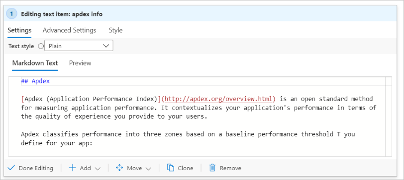
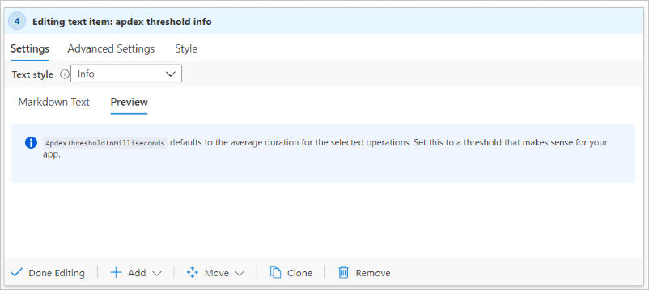

# Text visualizations

Workbooks allow authors to include text blocks in their workbooks. The text can be human analysis of telemetry, information to help users interpret your data, section headings, etc.

Text is added through a Markdown control, which provides full formatting control. These include different heading and font styles, hyperlinks, tables, etc.

Edit Mode:

Preview Mode:

## Add a text control

1. Switch the workbook to edit mode by clicking on the **Edit** toolbar item.
2. Use the **Add text** link to add a text control to the workbook.
3. Add Markdown in the editor field.
4. Use the *Text Style* option to switch between plain markdown and markdown wrapped with the Azure portal's standard info/warning/success/error styling.
5. Use the **Preview** tab to see how your content will look. While editing, the preview will show the content inside a scrollbar area to limit its size; however, at runtime the markdown content will expand to fill whatever space it needs, with no scrollbars.
6. Select the **Done Editing** button to complete editing the step.

> [!TIP]
> Use this [Markdown cheat sheet](https://github.com/adam-p/markdown-here/wiki/Markdown-Cheatsheet) to learn about different formatting options.

## Text styles

The following text styles are available for text step:

| Style     | Explanation                                                                               |
|-----------|-------------------------------------------------------------------------------------------|
| `plain`   | No additional formatting is applied.                                                      |
| `info`    | The portal's "info" style, with a  `ℹ` or similar icon and generally blue background.      |
| `error`   | The portal's "error" style, with a `❌` or similar icon and generally red background.     |
| `success` | The portal's "success" style, with a `✔` or similar icon and generally green background.  |
| `upsell`  | The portal's "upsell" style, with a `🚀` or similar icon and generally purple background. |
| `warning` | The portal's "warning" style, with a `⚠` or similar icon and generally blue background.   |

Instead of picking a specific style, you may also choose a text parameter as the source of the style. The parameter value must be one of the above text values. The absence of a value or any unrecognized value will be treated as `plain` style.

Info style example:

Warning style example:

## Next steps

* Learn how to create a [chart in workbooks](workbooks-chart-visualizations.md).
* Learn how to create a [grid in workbooks](workbooks-grid-visualizations.md).
