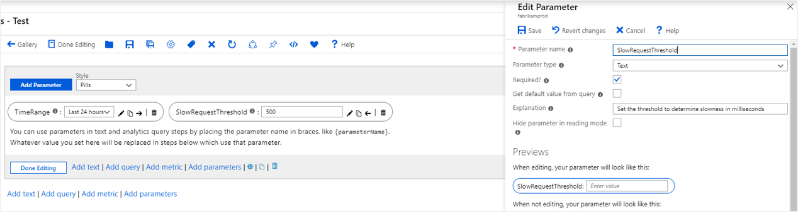
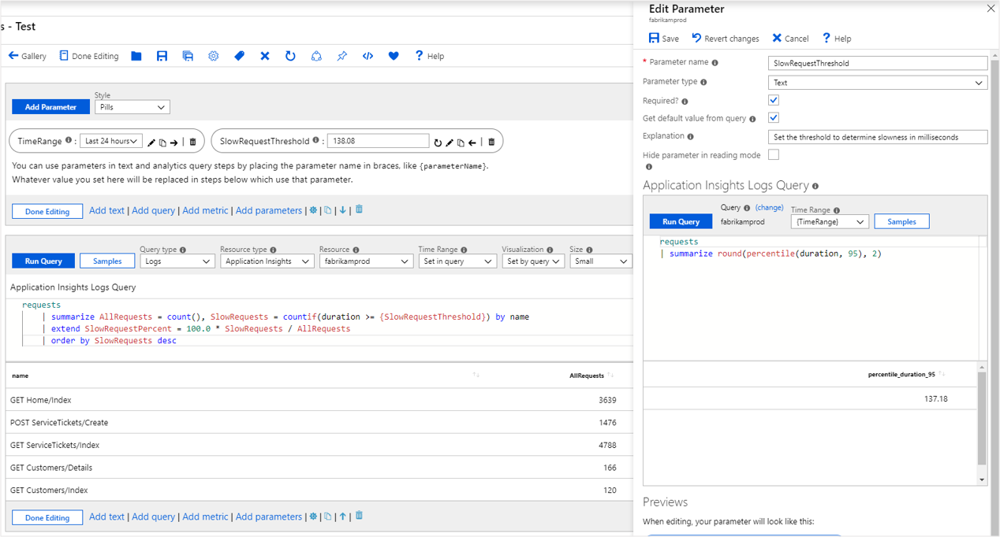

# Workbook text parameters

Textbox parameters provide a simple way to collect text input from workbook users. They are used when it is not practical to use a drop-down to collect the input (for example, an arbitrary threshold or generic filters). Workbooks allow authors to get the default value of the textbox from a query. This allows interesting scenarios like setting the default threshold based on the p95 of the metric.

A common use of textboxes is as internal variables used by other workbook controls. This is done by leveraging a query for default values, and making the input control invisible in read-mode. For example, a user may want a threshold to come from a formula (not a user) and then use the threshold in subsequent queries.

## Creating a text parameter
1. Start with an empty workbook in edit mode.
2. Choose _Add parameters_ from the links within the workbook.
3. Click on the blue _Add Parameter_ button.
4. In the new parameter pane that pops up enter:
    1. Parameter name: `SlowRequestThreshold`
    2. Parameter type: `Text`
    3. Required: `checked`
    4. Get default value from query: `unchecked`
5. Choose 'Save' from the toolbar to create the parameter.

    

This is how the workbook will look like in read-mode.


## Referencing a text parameter
1. Add a query control to the workbook by selecting the blue `Add query` link and select an Application Insights resource.
2. In the KQL box, add this snippet:
    ```kusto
    requests
    | summarize AllRequests = count(), SlowRequests = countif(duration >= {SlowRequestThreshold}) by name
    | extend SlowRequestPercent = 100.0 * SlowRequests / AllRequests
    | order by SlowRequests desc
    ```
3. By using the text parameter with a value of 500 coupled with the query control you effectively running the query below:
    ```kusto
    requests
    | summarize AllRequests = count(), SlowRequests = countif(duration >= 500) by name
    | extend SlowRequestPercent = 100.0 * SlowRequests / AllRequests
    | order by SlowRequests desc
    ```
4. Run query to see the results

    

> [!NOTE]
> In the example above, `{SlowRequestThreshold}` represents an integer value. If you were querying for a string like `{ComputerName}` you would need to modify your Kusto query to add quotes `"{ComputerName}"` in order for the parameter field to an accept input without quotes.

## Setting default values
1. Start with an empty workbook in edit mode.
2. Choose _Add parameters_ from the links within the workbook.
3. Click on the blue _Add Parameter_ button.
4. In the new parameter pane that pops up enter:
    1. Parameter name: `SlowRequestThreshold`
    2. Parameter type: `Text`
    3. Required: `checked`
    4. Get default value from query: `checked`
5. In the KQL box, add this snippet:
    ```kusto
    requests
    | summarize round(percentile(duration, 95), 2)
    ```
    This query sets the default value of the text box to the 95th percentile duration for all requests in the app.
6. Run query to see the result
7. Choose 'Save' from the toolbar to create the parameter.

    

> [!NOTE]
> While this example queries Application Insights data, the approach can be used for any log based data source - Log Analytics, Azure Resource Graph, etc.

## Next steps

* [Get started](workbooks-visualizations.md) learning more about workbooks many rich visualizations options.
* [Control](workbooks-access-control.md) and share access to your workbook resources.
