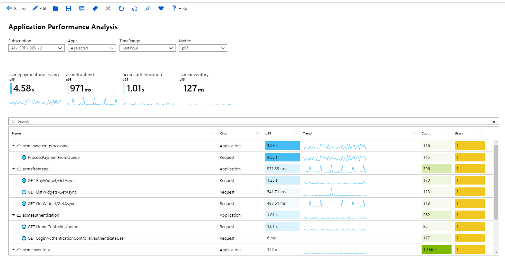
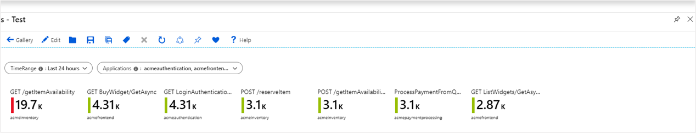
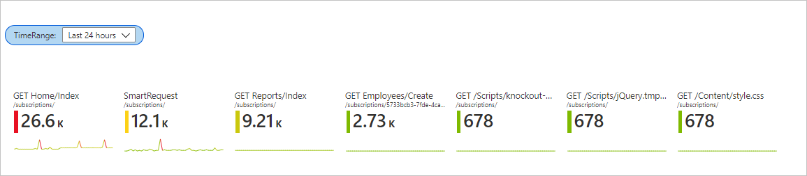

# Tile visualizations

Tiles are a useful way to present summary data in workbooks. The image below shows a common use case of tiles with app level summary on top of a detailed grid.

[](./media/workbooks-tile-visualizations/tiles-summary.png#lightbox)

Workbook tiles support showing a title, subtitle, large text, icons, metric based gradients, spark line/bars, footer, etc.

## Adding a tile

1. Switch the workbook to edit mode by clicking on the _Edit_ toolbar item.
2. Select **Add** then *Add query* to add a log query control to the workbook.
3. Select the query type as **Log**, resource type (for example, Application Insights) and the resources to target.
4. Use the Query editor to enter the KQL for your analysis.

    ```kusto
    requests
    | summarize Requests = count() by appName, name
    | top 7 by Requests desc
    ```

5. Set Size to **Full**.
6. Set the visualization to **Tiles**.
7. Select the **Tile Settings** button to open the settings pane.
    1. In *Title*, set:
        * Use column: `name`.
    2. In *Left*, set:
        * Use column: `Requests`.
        * Column renderer: `Big Number`.
        * Color palette: `Green to Red`
        * Minimum value: `0`.
    3. In *Bottom*, set:
        * Use column: `appName`.
8. Select the **Save and Close** button at the bottom of the pane.

[](./media/workbooks-tile-visualizations/tile-settings.png#lightbox)

The tiles in read mode:

[](./media/workbooks-tile-visualizations/tiles-read-mode.png#lightbox)

## Spark lines in tiles

1. Switch the workbook to edit mode by clicking on the _Edit_ toolbar item.
2. Add a time range parameter called `TimeRange`.
    1. Select **Add** and then *Add parameters*.
    2. In the parameter control, select **Add Parameter**.
    3. Enter `TimeRange` in the *Parameter name* field and choose `Time range picker` for *Parameter type*.
    4. Select **Save** at the top of the pane and then select **Done Editing** in the parameter control.
3. Select **Add** then *Add query* to add a log query control below the parameter control.
4. Select the query type as **Log**, resource type (for example, Application Insights) and the resources to target.
5. Use the Query editor to enter the KQL for your analysis.

    ```kusto
    let topRequests = requests
    | summarize Requests = count() by appName, name
    | top 7 by Requests desc;
    let topRequestNames = topRequests | project name;
    requests
    | where name in (topRequestNames)
    | make-series Trend = count() default = 0 on timestamp from {TimeRange:start} to {TimeRange:end} step {TimeRange:grain} by name
    | join (topRequests) on name
    | project-away name1, timestamp
    ```

6. Select **Run Query**. (Make sure to set `TimeRange` to a value of your choosing before running the query.)
7. Set the *Visualization* to "Tiles".
8. Set the *Size* to "Full".
9. Select **Tile Settings**.
    1. In *Tile*, set:
        * Use column: `name`.
    2. In *Subtile*, set:
        *  Use column: `appNAme`.
    3. In *Left*, set:
        *  Use column:`Requests`.
        * Column renderer: `Big Number`.
        * Color palette: `Green to Red`.
        * Minimum value: `0`.
    4. In *Bottom*, set:
        * Use column:`Trend`.
        * Column renderer: `Spark line`.
        * Color palette: `Green to Red`.
        * Minimum value: `0`.
10. Select **Save and Close** at the bottom of the pane.



## Tile sizes

The author has an option to set the tile width in the tile settings.

* `fixed` (default)

    The default behavior of tiles is to be the same fixed width, approx. 160 pixels wide, plus the space around the tiles.

    
* `auto`

    Each title will shrink or grow to fit their contents however, the tiles are limited to the width of the tiles' view (no horizontal scrolling).

    
* `full size`

    Each title will always be the full width of the tiles' view, one title per line.

     

## Next steps

* Tiles also support Composite bar renderer. To learn more visit [Composite Bar documentation](workbooks-composite-bar.md).
* To learn more about time parameters like `TimeRange` visit [workbook time parameters documentation](workbooks-time.md).