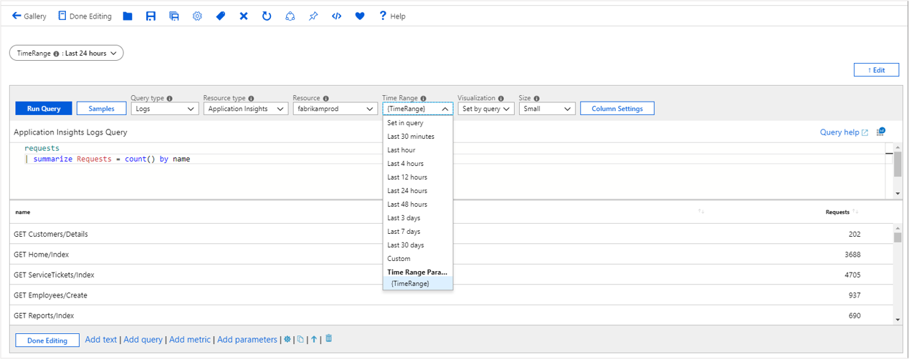

# Workbook time parameters

Time parameters allow users to set the time context of analysis and is used by almost all reports. It is relatively simple to setup and use - allowing authors to specify the time ranges to show in the drop-down, including the option for custom time ranges. 

## Creating a time parameter
1. Start with an empty workbook in edit mode.
2. Choose _Add parameters_ from the links within the workbook.
3. Click on the blue _Add Parameter_ button.
4. In the new parameter pane that pops up enter:
    1. Parameter name: `TimeRange`
    2. Parameter type: `Time range picker`
    3. Required: `checked`
    4. Available time ranges: Last hour, Last 12 hours, Last 24 hours, Last 48 hours, Last 3 days, Last 7 days and Allow custom time range selection
5. Choose 'Save' from the toolbar to create the parameter.

    

This is how the workbook will look like in read-mode.


## Referencing a time parameter
### Via Bindings
1. Add a query control to the workbook and select an Application Insights resource.
2. Most workbook controls support a _Time Range_ scope picker. Open the _Time Range_ drop-down and select the `{TimeRange}` in the time rang parameters group at the bottom.
3. This binds the time range parameter to the time range of the chart. The time scope of the sample query is now Last 24 hours.
4. Run query to see the results

    

### In KQL
1. Add a query control to the workbook and select an Application Insights resource.
2. In the KQL, enter a time scope filter using the parameter: `| where timestamp {TimeRange}`
3. This expands on query evaluation time to `| where timestamp > ago(1d)`, which is the time range value of the parameter.
4. Run query to see the results

    

### In Text 
1. Add a text control to the workbook.
2. In the markdown, enter `The chosen time range is {TimeRange:label}`
3. Choose _Done Editing_
4. The text control will show text: _The chosen time range is Last 24 hours_

## Time parameter options
| Parameter | Explanation | Example |
| ------------- |:-------------|:-------------|
| `{TimeRange}` | Time range label | Last 24 hours |
| `{TimeRange:label}` | Time range label | Last 24 hours |
| `{TimeRange:value}` | Time range value | > ago(1d) |
| `{TimeRange:query}` | Time range query | > ago(1d) |
| `{TimeRange:start}` | Time range start time | 3/20/2019 4:18 PM |
| `{TimeRange:end}` | Time range end time | 3/21/2019 4:18 PM |
| `{TimeRange:grain}` | Time range grain | 30 m |


### Using parameter options in a query
```kusto
requests
| make-series Requests = count() default = 0 on timestamp from {TimeRange:start} to {TimeRange:end} step {TimeRange:grain}
```

## Next steps

* [Get started](workbooks-visualizations.md) learning more about workbooks many rich visualizations options.
* [Control](workbooks-access-control.md) and share access to your workbook resources.
