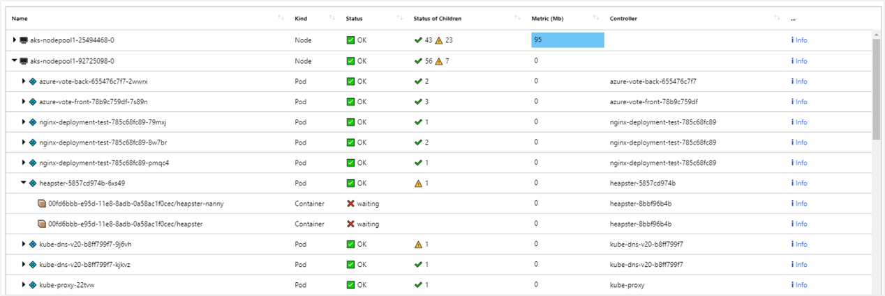

# Tree visualizations

Workbooks support hierarchical views via tree-grids. Trees allow some rows to be expandable into the next level for a drill-down experience.

The example below shows container health metrics (working set size) visualized as a tree grid. The top-level nodes here are Azure Kubernetes Service (AKS) nodes, the next level are pods, and the final level are containers. Notice that you can still format your columns like in a grid (heatmap, icons, link). The underlying data source in this case is a Log Analytics workspace with AKS logs.

[](./media/workbooks-tree-visualizations/trees.png#lightbox)

## Adding a tree grid
1. Switch the workbook to edit mode by clicking on the _Edit_ toolbar item.
2. Select **Add** then *Add query* to add a log query control to the workbook.
3. Select the query type as **Log**, resource type (for example, Application Insights), and the resources to target.
4. Use the Query editor to enter the KQL for your analysis
    ```kusto
    requests
    | summarize Requests = count() by ParentId = appName, Id = name
    | extend Kind = 'Request', Name = strcat('🌐 ', Id)
    | union (requests
    | summarize Requests = count() by Id = appName
    | extend Kind = 'Request', ParentId = '', Name = strcat('📱 ', Id))
    | project Name, Kind, Requests, Id, ParentId
    | order by Requests desc
    ```
5. Set the visualization to **Grid**
6. Select the **Column Settings** button to open the settings pane
7. In the **Tree/Group By Settings** section at the bottom, set:
    * Tree Type: `Parent/Child`
    * Id Field: `Id`
    * Parent Id Field: `ParentId`
    * Show the expander on: `Name`
    * Select *Expand the top level of the tree* check box.
8. In _Columns_ section at the top, set:
    * _Id_ - Column Renderer: `Hidden`
    * _Parent Id_ - Column Renderer: `Hidden`
    * _Requests_ - Column Renderer: `Bar`, Color: `Blue`, Minimum Value: `0`
9. Select the **Save and Close** button at the bottom of the pane.

[](./media/workbooks-tree-visualizations/tree-settings.png#lightbox)

## Tree settings

| Setting | Explanation |
|:------------- |:-------------|
| `Id Field` | The unique ID of every row in the grid. |
| `Parent Id Field` | The ID of the parent of the current row. |
| `Show the expander on` | The column on which to show the tree expander. It is common for tree grids to hide their ID and parent ID field because they are not very readable. Instead, the expander appears on a field with a more readable value like the name of the entity. |
| `Expand the top level of the tree` | If checked, the tree grid will be expanded at the top level. Useful if you want to show more information by default. |

## Grouping in a grid

Grouping allows you to build hierarchical views similar to the ones above with significantly simpler queries. You do lose aggregation at the inner nodes of the tree, but that will be acceptable for some scenarios. Use *Group By* to build tree views when the underlying result set cannot be transformed into a proper free form, for example: alert, health, and metric data.

## Adding a tree using grouping

1. Switch the workbook to edit mode by clicking on the _Edit_ toolbar item.
2. Select **Add** then *Add query* to add a log query control to the workbook.
3. Select the query type as **Log**, resource type (for example, Application Insights) and the resources to target.
4. Use the Query editor to enter the KQL for your analysis
    ```kusto
    requests
    | summarize Requests = count() by App = appName, RequestName = name
    | order by Requests desc
    ```
1. Set the visualization to *Grid*.
2. Select the **Column Settings button** to open the settings pane.
3. In the *Tree/Group By Settings* section at the bottom, set:
    * Tree Type: `Group By`
    * Group By: `App`
    * Then By: `None`
    * Select *Expand the top level of the tree* check box.
4. In *Columns* section at the top, set:
    * *App* - Column Renderer: `Hidden`
    * *Requests* - Column Renderer: `Bar`, Color: `Blue`, Minimum Value: `0`
5. Select the **Save and Close** button at the bottom of the pane.

[](./media/workbooks-tree-visualizations/tree-group-create.png#lightbox)

## Next steps

* Learn how to create a [graph in workbooks](workbooks-graph-visualizations.md).
* Learn how to create a [tile in workbooks](workbooks-tile-visualizations.md).
