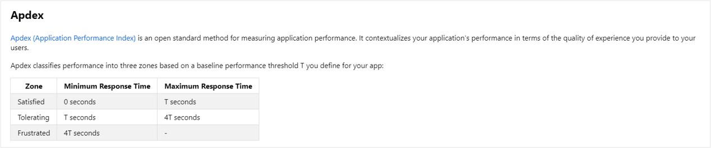
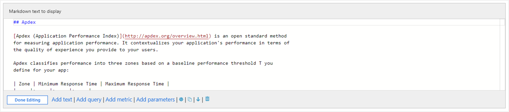
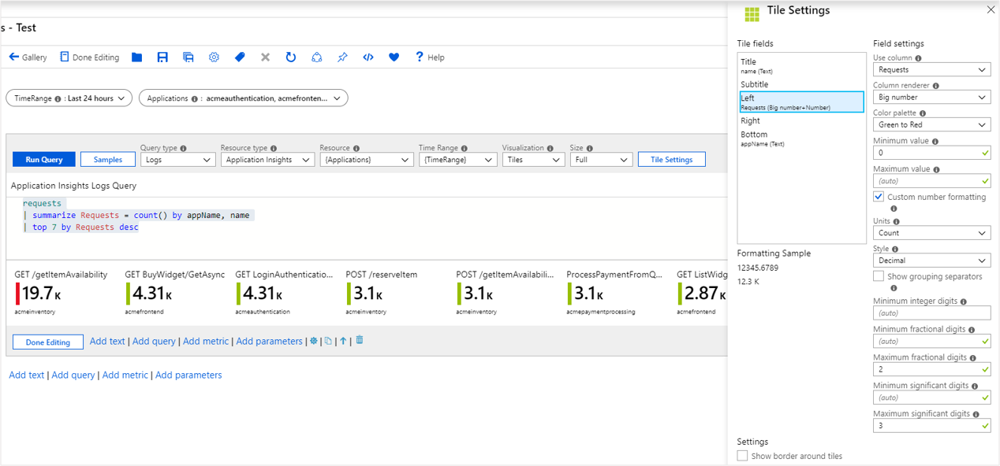

# Azure Monitor workbook visualizations

Azure Monitor workbooks support a number of different styles of visualizations to accommodate your reporting needs. This article provides examples of each type of visualization.

## Text

Workbooks allow authors to include text blocks in their workbooks. The text can be human analysis of telemetry, information to help users interpret your data, section headings, etc.



Text is added through a Markdown control which provides for full formatting control.



### Add a text control

1. Switch the workbook to edit mode by clicking on the **Edit** toolbar item.
2. Use the **Add text** link to add a text control to the workbook.
3. Add Markdown to the control.
4. Click the **Done Editing** button to see the formatted text.

> [!TIP]
> Use this [Markdown cheat sheet](https://github.com/adam-p/markdown-here/wiki/Markdown-Cheatsheet) to learn about different formatting options.

## Charts

Workbooks allow monitoring data to be presented as charts. Supported chart types include line, bar, bar categorical, area, scatter plots, pie and time. Authors can choose to customize the height, width, color palette, legend, titles, no-data message, etc. of the chart.

Workbooks support charts for both logs and metric data sources. 

### Adding a log chart

1. Switch the workbook to edit mode by clicking on the **Edit** toolbar item.
2. Use the **Add query** link to add a log query control to the workbook.
3. Select the query type as **Log**, resource type (for example, Application Insights) and the resources to target.
4. Use the Query editor to enter the [KQL](https://docs.microsoft.com/azure/kusto/query/) for your analysis (for example, trend of requests).
5. Set the visualization to one of: **Area**, **Bar**, **Bar (categorical)**, **Line**, **Pie**, **Scatter**, or **Time**.
6. Set other parameters if needed - like time range, visualization, size, color palette and legend.


#### Log chart parameters

| Parameter | Explanation | Example |
| ------------- |:-------------|:-------------|
| `Query Type` | The type of query to use | Log, Azure Resource Graph, etc. |
| `Resource Type` | The resource type to target | Application Insights, Log Analytics, or Azure-first |
| `Resources` | A set of resources to get the metrics value from | MyApp1 |
| `Time Range` | The time window to view the log chart | Last hour, Last 24 hours, etc. |
| `Visualization` | The visualization to use | Area, Bar, Line, Pie, Scatter, Time, bar categorical |
| `Size` | The vertical size of the control | Small, medium, large or full |
| `Color palette` | The color palette to use in the chart. Ignored in multi-metric or segmented mode. | Blue, green, red, etc. |
| `Legend` | The aggregation function to use for the legend | Sum or Average of values or Max, Min, First, Last value |
| `Query` | Any KQL query that returns data in the format expected by the chart visualization | _requests \| make-series Requests = count() default = 0 on timestamp from ago(1d) to now() step 1h_ |

### Adding a metric chart

1. Switch the workbook to edit mode by clicking on the **Edit** toolbar item.
2. Use the **Add metric** link to add a metric control to the workbook.
3. Select a resource type (for example, Storage Account), the resources to target, the metric namespace and name, and the aggregation to use.
4. Set other parameters if needed - like time range, split-by, visualization, size, and color palette.


#### Metric chart parameters

| Parameter | Explanation | Example |
| ------------- |:-------------|:-------------|
| `Resource Type` | The resource type to target | Storage or Virtual Machine. |
| `Resources` | A set of resources to get the metrics value from | MyStorage1 |
| `Namespace` | The namespace with the metric | Storage > Blob |
| `Metric` | The metric to visualize | Storage > Blob > Transactions |
| `Aggregation` | The aggregation function to apply to the metric | Sum, Count, Average, etc. |
| `Time Range` | The time window to view the metric in | Last hour, Last 24 hours, etc. |
| `Visualization` | The visualization to use | Area, Bar, Line, Scatter, Grid |
| `Split By` | Optionally split the metric on a dimension | Transactions by Geo type |
| `Size` | The vertical size of the control | Small, medium, or large |
| `Color palette` | The color palette to use in the chart. Ignored if the `Split by` parameter is used | Blue, green, red, etc. |

## Grids

Grids or tables are a common way to present data to users. Workbooks allow users to individually style the columns of the grid to provide a rich UI for their reports.

The example below shows a grid that combines icons, heatmaps, and spark-bars to present complex information. The workbook also provides sorting, a search box and a go-to-analytics button.


### Adding a log-based grid

1. Switch the workbook to edit mode by clicking on the **Edit** toolbar item.
2. Use the **Add query** link to add a log query control to the workbook.
3. Select the query type as **Log**, resource type (for example, Application Insights) and the resources to target.
4. Use the Query editor to enter the KQL for your analysis (for example, VMs with memory below a threshold)
5. Set the visualization to **Grid**
6. Set other parameters if needed - like time range, size, color palette and legend.


## Tiles

Tiles are a very useful way to present summary data in workbooks. The image below shows a common use case of tiles - app level summary on top of a detailed grid.


Workbook tiles support showing a title, subtitle, large text, icons, metric based gradients, spark line/bars, footer, etc.

### Adding a Tile

1. Switch the workbook to edit mode by clicking on the _Edit_ toolbar item.
2. Use the **Add query** link to add a log query control to the workbook. 
3. Select the query type as **Log**, resource type (for example, Application Insights) and the resources to target.
4. Use the Query editor to enter the KQL for your analysis
    ```kusto
    requests
    | summarize Requests = count() by appName, name
    | top 7 by Requests desc
    ```
5. Set Size to **Full**
6. Set the visualization to **Tiles**
7. Click the **Tile Settings** button to open the settings pane
8. In **Tile Fields**, set:
    * Title: `name`
    * Left: `Requests`, Renderer: `Big Number`, Color Palette: `Green to Red`, Min Value: `0`
    * Bottom: `appName`
9. Click the **Save and Close** button at the bottom of the pane.



This is how the tiles will look in read mode:


## Trees

Workbooks support hierarchical views via tree-grids. Trees allow some rows to be expandable into the next level for a drill-down experience.

The example below shows container health metrics (working set size) visualized as a tree grid. The top-level nodes here are Azure Kubernetes Service (AKS) nodes, the next level are pods and the final level are containers. Notice that you can still format your columns like in a grid (heatmap, icons, link). The underlying data source in this case is an Log Analytics workspace with AKS logs.


### Adding a Tree Grid
1. Switch the workbook to edit mode by clicking on the _Edit_ toolbar item.
2. Use the **Add query** link to add a log query control to the workbook. 
3. Select the query type as **Log**, resource type (for example, Application Insights) and the resources to target.
4. Use the Query editor to enter the KQL for your analysis
    ```kusto
    requests
    | summarize Requests = count() by ParentId = appName, Id = name
    | extend Kind = 'Request', Name = strcat('🌐 ', Id)
    | union (requests
    | summarize Requests = count() by Id = appName
    | extend Kind = 'Request', ParentId = '', Name = strcat('📱 ', Id))
    | project Name, Kind, Requests, Id, ParentId
    | order by Requests desc
    ```
5. Set the visualization to **Grid**
6. Click the **Column Settings** button to open the settings pane
7. In the **Tree/Group By Settings** section at the bottom, set:
    * Tree Type: `Parent/Child`
    * Id Field: `Id`
    * Parent Id Field: `ParentId`
    * Show the expander on: `Name`
    * Expand the top level of the tree: `checked`
8. In _Columns_ section at the top, set:
    * _Id_ - Column Renderer: `Hidden`
    * _Parent Id_ - Column Renderer: `Hidden`
    * _Requests_ - Column Renderer: `Bar`, Color: `Blue`, Minimum Value: `0`
9. Click the _Save and Close_ button at the bottom of the pane.    


### Tree Settings

| Setting | Explanation |
|:------------- |:-------------|
| `Id Field` | The unique Id of every row in the grid |
| `Parent Id Field` | The id of the parent of the current row |
| `Show the expander on` | The column on which to show the tree expander. It is common for tree grids to hide their id and parent id field because they are not very readable. Instead, the expander appears on a field with a more readable value - like the name of the entity |
| `Expand the top level of the tree` | If checked, the tree grid will be expanded at the top level. Useful if you want to show more information by default |

## Graphs

Workbooks support visualizing arbitrary graphs based on data from logs to show the relationships between monitoring entities.

The graph below show data flowing in/out of a computer via various port to/from external computers. It is colored by type (computer vs. port vs. external IP) and the edge sizes correspond to the amount of data flowing in-between. The underlying data comes from KQL query targeting VM connections.


### Adding a Graph
1. Switch the workbook to edit mode by clicking on the _Edit_ toolbar item.
2. Use the **Add query** link to add a log query control to the workbook. 
3. Select the query type as **Log**, resource type (for example, Application Insights) and the resources to target.
4. Use the Query editor to enter the KQL for your analysis
    ```kusto
    let data = dependencies
    | summarize Calls = count() by App = appName, Request = operation_Name, Dependency = name
    | extend RequestId = strcat(App, '::', Request);
    let links = data
    | summarize Calls = sum(Calls) by App, RequestId
    | project SourceId = App, TargetId = RequestId, Calls, Kind = 'App -> Request'
    | union (data
        | project SourceId = RequestId, TargetId = Dependency, Calls, Kind = 'Request -> Dependency');
    let nodes = data
    | summarize Calls = sum(Calls) by App
    | project Id = App, Name = App, Calls, Kind = 'App'
    | union (data
        | summarize Calls = sum(Calls) by RequestId, Request
        | project Id = RequestId, Name = Request, Calls, Kind = 'Request')
    | union (data
        | summarize Calls = sum(Calls) by Dependency
        | project Id = Dependency, Name = Dependency, Calls, Kind = 'Dependency');
    nodes
    | union (links)
    ```
7. Set the visualization to **Graph**
8. Click the **Graph Settings** button to open the settings pane
9. In _Layout Fields_ at the bottom, set:
    * `Node Id`: `Id`
    * `Source Id`: `SourceId`
    * `Target Id`: `TargetId`
    * `Edge Label`: `None`
    * `Edge Size`: `Calls`
    * `Node Size`: `None`
    * `Coloring Type`: `Categorical`
    * `Node Color Field`: `Kind`
    * `Color palette`: `Pastel`
10. In _Node Format Settings_ at the top, set:
    * _Top Content_- Use Column: `Name`, Column Renderer: `Text`
    * _Center Content_- Use Column: `Calls`, Column Renderer: `Big Number`, Color Palette: `None`
    * _Bottom Content_- Use Column: `Kind`, Column Renderer: `Text`
10. Click the _Save and Close_ button at the bottom of the pane.


## Next steps

* [Deploy](workbooks-automate.md) workbooks with Azure Resource Manager.
* [Control](workbooks-access-control.md) and share access to your workbook resources.
